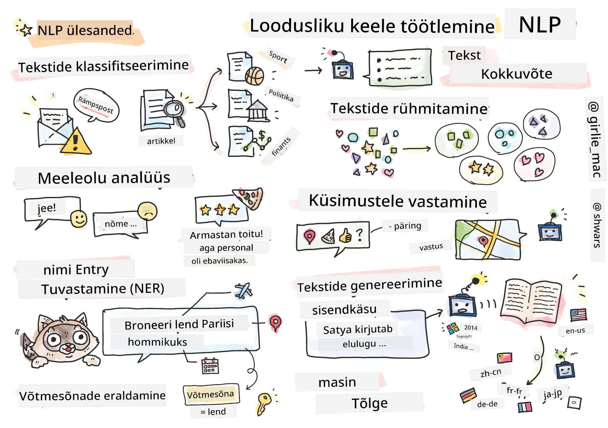

# Loomuliku Keele Töötlemine



Selles peatükis keskendume närvivõrkude kasutamisele loomuliku keele töötlemisega seotud ülesannete lahendamisel. On palju NLP probleeme, mida tahame, et arvutid oskaksid lahendada:

* **Teksti klassifitseerimine** on tüüpiline tekstijadade klassifitseerimise probleem. Näiteks e-kirjade klassifitseerimine rämpspostiks või mitte-rämpspostiks, või artiklite kategooriateks jaotamine nagu sport, äri, poliitika jne. Samuti, chatbotide arendamisel tuleb sageli mõista, mida kasutaja tahtis öelda — sel juhul tegeleme **intentsiooni klassifitseerimisega**. Sageli tuleb intentsiooni klassifitseerimisel tegeleda paljude kategooriatega.
* **Sentimendi analüüs** on tüüpiline regressioonülesanne, kus tuleb määrata arvuline väärtus (sentiment), mis vastab lause positiivsusele või negatiivsusele. Täiustatud sentimentide analüüsi versioon on **aspektipõhine sentimentide analüüs** (ABSA), kus sentiment määratakse mitte kogu lausele, vaid selle erinevatele osadele (aspektidele), nt *Selles restoranis meeldis mulle köök, aga õhkkond oli kohutav*.
* **Nimetatud üksuste tuvastamine** (NER) tähendab teatud üksuste eraldamist tekstist. Näiteks tuleb mõista, et fraasis *Ma pean homme Pariisi lendama* viitab sõna *homme* KUUPÄEVALE ja *Pariis* on ASUKOHT.  
* **Märksõnade eraldamine** on sarnane NER-ile, kuid tuleb automaatselt eraldada lause tähenduse jaoks olulisi sõnu, ilma konkreetsete üksuste tüüpide eelneva treenimiseta.
* **Tekstiklusterdamine** võib olla kasulik, kui soovime grupeerida sarnaseid lauseid, näiteks sarnaseid päringuid tehnilise toe vestlustes.
* **Küsimustele vastamine** tähendab mudeli võimet vastata konkreetsele küsimusele. Mudel saab sisendiks tekstilõigu ja küsimuse ning peab leidma tekstist koha, kus on vastus (või mõnikord genereerima vastusteksti).
* **Teksti genereerimine** tähendab mudeli võimet luua uut teksti. Seda võib pidada klassifitseerimisülesandeks, mis ennustab järgmise tähe/sõna mingi *teksti vihje* põhjal. Täiustatud teksti genereerimise mudelid, nagu GPT-3, suudavad lahendada ka muid NLP ülesandeid, näiteks klassifitseerimist kasutades tehnikaid, mida nimetatakse [vihjete programmeerimiseks](https://towardsdatascience.com/software-3-0-how-prompting-will-change-the-rules-of-the-game-a982fbfe1e0) või [vihjete inseneriks](https://medium.com/swlh/openai-gpt-3-and-prompt-engineering-dcdc2c5fcd29).
* **Teksti kokkuvõtlemine** on tehnika, kus tahame, et arvuti "loeks" pika teksti ja täidaks selle mõne lausega.
* **Masintõlge** võib käsitleda kui ühe keele teksti mõistmist ja teise keele teksti genereerimist.

Esialgu lahendati enamik NLP ülesandeid traditsiooniliste meetoditega, nagu grammatikaanalüüs. Näiteks masintõlkes kasutati parserit, mis teisendas alglaused süntaksipuu kujule, seejärel ekstraheeriti kõrgema taseme semantilisi struktuure, mis esindasid lause tähendust ning selle tähenduse ja sihtkeele grammatikapõhjal genereeriti tulemus. Tänapäeval lahendatakse paljusid NLP ülesandeid efektiivsemalt närvivõrkude abil.

> Paljude klassikaliste NLP meetodite teostuseks on saadaval Python teek [Natural Language Processing Toolkit (NLTK)](https://www.nltk.org). Veebis on saadaval suurepärane [NLTK raamat](https://www.nltk.org/book/), mis katab seda, kuidas erinevaid NLP ülesandeid NLTK abil lahendada.

Meie kursusel keskendume peamiselt närvivõrkudele NLP jaoks ning kasutame vajadusel NLTK-d.

Oleme juba õppinud närvivõrkude kasutamist tabelandmete ja piltidega töötamiseks. Peamine erinevus nende andmetüüpide ja teksti vahel on selles, et tekst on muutuva pikkusega järjestus, samas kui piltide sisendi suurus on eelnevalt teada. Kuigi konvolutsioonivõrgud suudavad tuvastada mustreid sisendandmetes, on teksti mustrid palju keerulisemad. Näiteks võib eitav sõna olla subjekti suhtes eraldatud suvalise arvu sõnadega (nt *Ma ei meeldi apelsinid* vs. *Ma ei meeldi neile suurtele värvikatele maitsvatele apelsinidele*), kuid see tuleks tõlgendada kui üks muster. Seetõttu vajame keelt käsitledes uusi närvivõrkude tüüpe, nagu *rekurrentvõrgud* ja *transformerid*.

## Teekide installimine

Kui kasutate kohaliku Pythoni installatsiooni selle kursuse käivitamiseks, võib vajalik olla kõigi NLP-ga seotud teekide paigaldamine järgmiste käskude abil:

**PyTorch jaoks**
```bash
pip install -r requirements-pytorch.txt
```
**TensorFlow jaoks**
```bash
pip install -r requirements-tf.txt
```

> Võite proovida NLP TensorFlowga aadressil [Microsoft Learn](https://docs.microsoft.com/learn/modules/intro-natural-language-processing-tensorflow/?WT.mc_id=academic-77998-cacaste)

## GPU hoiatus

Selles peatükis treenime mõnes näites päris suuri mudeleid.
* **Kasuta GPU-ga arvutit**: Soovitatav on kasutada GPU-ga arvutit, et vähendada ootamisaegu suurte mudelitega töötades.
* **GPU mälu piirangud**: GPU-ga töötamine võib kaasa tuua olukorra, kus GPU mälu ei jätku, eriti suurte mudelite treenimisel.
* **GPU mälu tarbimine**: Treeningu ajal kasutatava GPU mälu maht sõltub mitmetest teguritest, sealhulgas minibatchi suurusest.
* **Minibatchi suurust vähendada**: Kui tekivad GPU mäluprobleemid, kaaluge minibatchi suuruse vähendamist koodis.
* **TensorFlow GPU mälu vabastamine**: Vanemad TensorFlow versioonid ei pruugi GPU mälu õigesti vabastada, kui treenitakse mitut mudelit ühe Pythoni tuumas. GPU mälu efektiivseks kasutamiseks saate seadistada TensorFlow nii, et GPU mälu eraldatakse ainult vajadusel.
* **Koodi lisamine**: Selleks, et TensorFlow eraldaks GPU mälu kasvavalt ainult siis, kui on vaja, lisage oma märkmetesse järgmine kood:

```python
physical_devices = tf.config.list_physical_devices('GPU') 
if len(physical_devices)>0:
    tf.config.experimental.set_memory_growth(physical_devices[0], True) 
```

Kui soovite õppida NLP-d klassikalisest masinõppe vaatenurgast, vaadake [seda õppetükkide komplekti](https://github.com/microsoft/ML-For-Beginners/tree/main/6-NLP)

## Selles peatükis
Selles peatükis õpime:

* [Teksti esitamine tensoritena](13-TextRep/README.md)
* [Sõnade embedid](14-Embeddings/README.md)
* [Keelemudelid](15-LanguageModeling/README.md)
* [Rekursiivsed närvivõrgud](16-RNN/README.md)
* [Generatiivvõrgud](17-GenerativeNetworks/README.md)
* [Transformerid](18-Transformers/README.md)

---

<!-- CO-OP TRANSLATOR DISCLAIMER START -->
**Lahtiütlus**:
See dokument on tõlgitud kasutades AI tõlketeenust [Co-op Translator](https://github.com/Azure/co-op-translator). Kuigi me püüdleme täpsuse poole, palun pange tähele, et automatiseeritud tõlgetes võib esineda vigu või ebatäpsusi. Originaaldokument selle emakeeles tuleks pidada autoriteetseks allikaks. Olulise teabe puhul soovitatakse kasutada professionaalset inimtõlget. Me ei vastuta selle tõlkega seotud eksimustest või valesti mõistmistest.
<!-- CO-OP TRANSLATOR DISCLAIMER END -->