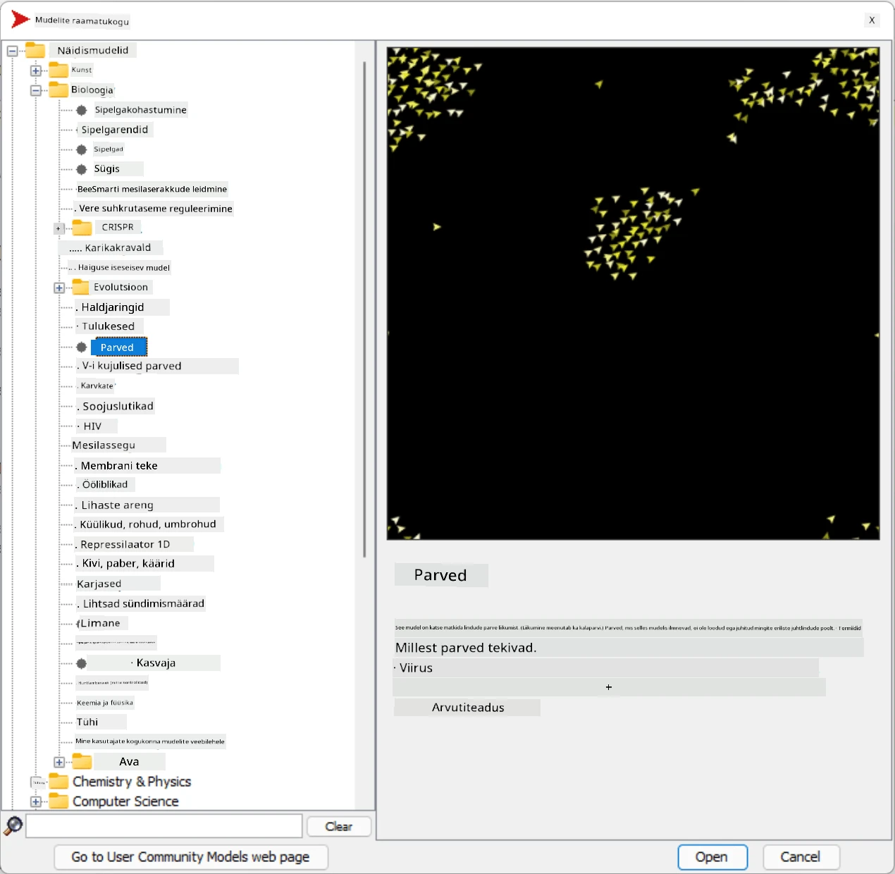
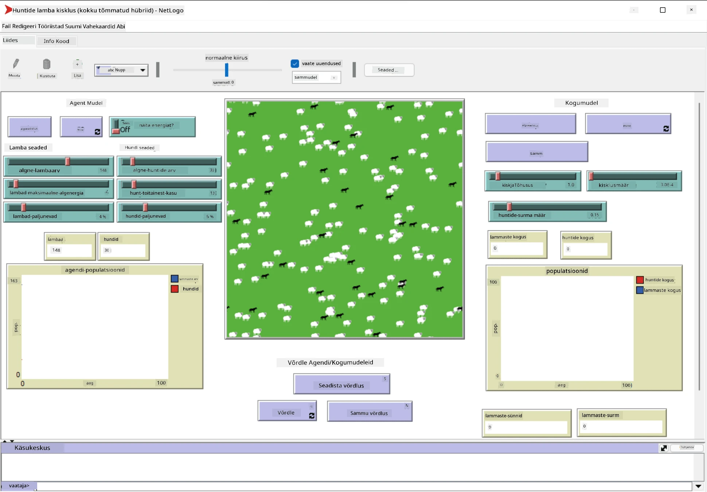

# Multiagent süsteemid

Üks võimalik viis intelligentsuse saavutamiseks on nn **emergentne** (või **sünergeetiline**) lähenemine, mis põhineb faktil, et paljude suhteliselt lihtsate agentide kombineeritud käitumine võib viia süsteemi kui terviku keerukama (või intelligentsema) käitumiseni. Teoreetiliselt põhineb see [kollektiivse intelligentsuse](https://en.wikipedia.org/wiki/Collective_intelligence), [emergentismi](https://en.wikipedia.org/wiki/Global_brain) ja [evolutsioonilise küberneetika](https://en.wikipedia.org/wiki/Global_brain) põhimõtetel, mis väidavad, et kõrgema taseme süsteemid saavutavad teatud lisaväärtuse, kui need on õigesti kombineeritud madalama taseme süsteemidest (nn *metasüsteemi ülemineku põhimõte*).

## [Eelloengu viktoriin](https://ff-quizzes.netlify.app/en/ai/quiz/45)

**Multiagent süsteemide** suund tekkis tehisintellektis 1990ndatel vastusena interneti ja hajutatud süsteemide kasvule. Üks klassikalistest tehisintellekti õpikutest, [Artificial Intelligence: A Modern Approach](https://en.wikipedia.org/wiki/Artificial_Intelligence:_A_Modern_Approach), keskendub klassikalise tehisintellekti vaatele multiagent süsteemide kontekstis.

Multiagent lähenemise keskmes on **agent** – üksus, mis eksisteerib mingis **keskkonnas**, mida ta suudab tajuda ja mõjutada. See on väga lai definitsioon, ja agente saab klassifitseerida mitmel erineval viisil:

* Võime järgi mõelda:
   - **Reaktiivsed** agendid käituvad tavaliselt lihtsa päring-vastus tüüpi loogika järgi
   - **Deliberatiivsed** agendid kasutavad mingit loogilist mõtlemist ja/või planeerimisvõimekust
* Koha järgi, kus agent oma koodi täidab:
   - **Staatilised** agendid töötavad pühendatud võrgu sõlmes
   - **Mobiilsed** agendid suudavad oma koodi võrgu sõlmede vahel liigutada
* Käitumise järgi:
   - **Passiivsed agendid** ei oma konkreetseid eesmärke. Sellised agendid võivad reageerida välistele stiimulitele, kuid ei algata ise tegevusi.
   - **Aktiivsed agendid** omavad eesmärke, mida nad püüavad saavutada
   - **Kognitiivsed agendid** kaasavad keerukat planeerimist ja mõtlemist

Multiagent süsteeme kasutatakse tänapäeval mitmesugustes rakendustes:

* Mängudes kasutavad paljud mitte-mängija tegelased mingit tehisintellekti ja neid võib pidada intelligentseteks agentideks
* Videoproduktsioonis kasutatakse keerukate 3D stseenide renderdamiseks, mis hõlmavad rahvahulki, tavaliselt multiagent simulatsiooni
* Süsteemide modelleerimisel kasutatakse multiagent lähenemist keeruka mudeli käitumise simuleerimiseks. Näiteks on multiagent lähenemist edukalt kasutatud COVID-19 haiguse leviku ennustamiseks üle maailma. Sarnast lähenemist saab kasutada linna liikluse modelleerimiseks ja näha, kuidas see reageerib liiklusreeglite muutustele.
* Keerukates automaatikasüsteemides võib iga seade tegutseda iseseisva agendina, mis muudab kogu süsteemi vähem monoliitseks ja vastupidavamaks.

Me ei kuluta palju aega multiagent süsteemide sügavaks uurimiseks, kuid vaatame ühte näidet **multiagent modelleerimisest**.

## NetLogo

[NetLogo](https://ccl.northwestern.edu/netlogo/) on multiagent modelleerimise keskkond, mis põhineb muudetud versioonil [Logo](https://en.wikipedia.org/wiki/Logo_(programming_language)) programmeerimiskeelest. See keel loodi programmeerimiskontseptsioonide õpetamiseks lastele ja võimaldab kontrollida agenti nimega **kilpkonn**, kes saab liikuda ja jätta enda järel jälje. See võimaldab luua keerukaid geomeetrilisi kujundeid, mis on väga visuaalne viis agendi käitumise mõistmiseks.

NetLogos saame luua palju kilpkonni, kasutades käsku `create-turtles`. Seejärel saame käskida kõigil kilpkonnadel teha teatud tegevusi (näiteks liikuda 10 punkti edasi):

```
create-turtles 10
ask turtles [
  forward 10
]
```

Muidugi pole huvitav, kui kõik kilpkonnad teevad sama asja, seega saame `ask` abil suunata tegevusi kilpkonnade gruppidele, näiteks neile, kes asuvad teatud punkti läheduses. Samuti saame luua erinevate *tõugudega* kilpkonni, kasutades käsku `breed [cats cat]`. Siin on `cat` tõu nimi ja me peame määratlema nii ainsuse kui mitmuse vormi, kuna erinevad käsud kasutavad selguse huvides erinevaid vorme.

> ✅ Me ei hakka NetLogo keelt ise õppima – kui olete huvitatud rohkem teada saama, külastage suurepärast ressurssi [Beginner's Interactive NetLogo Dictionary](https://ccl.northwestern.edu/netlogo/bind/).

NetLogo saate [alla laadida](https://ccl.northwestern.edu/netlogo/download.shtml) ja installida, et seda proovida.

### Mudelite raamatukogu

NetLogo suurepärane omadus on see, et see sisaldab töötavate mudelite raamatukogu, mida saate proovida. Minge **File &rightarrow; Models Library**, ja teil on palju mudelikategooriaid, mille vahel valida.



> Mudelite raamatukogu ekraanipilt Dmitry Soshnikovilt

Saate avada ühe mudeli, näiteks **Biology &rightarrow; Flocking**.

### Põhiprintsiibid

Pärast mudeli avamist jõuate NetLogo põhiekraanile. Siin on näidis, mis kirjeldab huntide ja lammaste populatsiooni piiratud ressursside (rohu) tingimustes.



> Ekraanipilt Dmitry Soshnikovilt

Sellel ekraanil näete:

* **Liidese** sektsiooni, mis sisaldab:
  - Peavälja, kus kõik agendid elavad
  - Erinevaid juhtnuppe: nuppe, liugureid jne
  - Graafikuid, mida saate kasutada simulatsiooni parameetrite kuvamiseks
* **Koodi** vahekaarti, mis sisaldab redaktorit, kuhu saate kirjutada NetLogo programmi

Enamasti on liideses **Setup** nupp, mis algatab simulatsiooni oleku, ja **Go** nupp, mis käivitab täitmise. Neid käsitletakse vastavate käitlejate abil koodis, mis näeb välja selline:

```
to go [
...
]
```

NetLogo maailm koosneb järgmistest objektidest:

* **Agendid** (kilpkonnad), kes saavad liikuda üle välja ja midagi teha. Agente juhitakse, kasutades süntaksit `ask turtles [...]`, ja sulgudes olev kood täidetakse kõigi agentide poolt *kilpkonna režiimis*.
* **Plaastrid** on väljakul ruudukujulised alad, kus agendid elavad. Saate viidata kõigile agentidele samal plaastril või muuta plaastri värve ja muid omadusi. Samuti saate `ask patches` abil midagi teha.
* **Jälgija** on ainulaadne agent, kes kontrollib maailma. Kõik nupukäsitlejad täidetakse *jälgija režiimis*.

> ✅ Multiagent keskkonna ilu seisneb selles, et kood, mis töötab kilpkonna režiimis või plaastri režiimis, täidetakse samal ajal kõigi agentide poolt paralleelselt. Seega, kirjutades natuke koodi ja programmeerides individuaalse agendi käitumist, saate luua simulatsioonisüsteemi keeruka käitumise tervikuna.

### Flocking

Multiagent käitumise näitena vaatame **[Flocking](https://en.wikipedia.org/wiki/Flocking_(behavior))**. Flocking on keerukas muster, mis sarnaneb väga sellele, kuidas linnuparved lendavad. Nende lendu vaadates võib tunduda, et nad järgivad mingit kollektiivset algoritmi või et neil on mingi *kollektiivne intelligentsus*. Kuid see keerukas käitumine tekib siis, kui iga individuaalne agent (antud juhul *lind*) jälgib ainult teisi agente lühikese vahemaa kaugusel ja järgib kolme lihtsat reeglit:

* **Joondumine** – liigub naaberagentide keskmise suuna poole
* **Kooshoidmine** – liigub naabrite keskmise positsiooni poole (*pika vahemaa tõmme*)
* **Eraldus** – kui teised linnud on liiga lähedal, liigub eemale (*lühikese vahemaa tõrjumine*)

Saate käivitada flocking-näite ja jälgida käitumist. Samuti saate kohandada parameetreid, nagu *eraldumise aste* või *vaateulatus*, mis määrab, kui kaugele iga lind näeb. Pange tähele, et kui vähendate vaateulatust nullini, muutuvad kõik linnud pimedaks ja flocking peatub. Kui vähendate eraldumist nullini, kogunevad kõik linnud sirgjooneks.

> ✅ Lülituge **Koodi** vahekaardile ja vaadake, kus kolm flocking reeglit (joondumine, kooshoidmine ja eraldus) on koodis rakendatud. Pange tähele, kuidas viidatakse ainult neile agentidele, kes on nähtaval.

### Teised mudelid, mida vaadata

On veel mõned huvitavad mudelid, millega saate katsetada:

* **Art &rightarrow; Fireworks** näitab, kuidas ilutulestikku saab pidada individuaalsete tulejoonte kollektiivseks käitumiseks
* **Social Science &rightarrow; Traffic Basic** ja **Social Science &rightarrow; Traffic Grid** näitavad linna liikluse mudelit 1D ja 2D ruudustikus koos või ilma valgusfoorideta. Iga auto simulatsioonis järgib järgmisi reegleid:
   - Kui ees olev ruum on tühi – kiirenda (kuni teatud maksimaalse kiiruseni)
   - Kui näeb ees takistust – pidurda (ja saate kohandada, kui kaugele juht näeb)
* **Social Science &rightarrow; Party** näitab, kuidas inimesed grupivad kokku kokteilipidudel. Saate leida parameetrite kombinatsiooni, mis viib grupi õnnelikkuse kiireima kasvuni.

Nagu näete nendest näidetest, võivad multiagent simulatsioonid olla üsna kasulik viis mõista keeruka süsteemi käitumist, mis koosneb indiviididest, kes järgivad sama või sarnast loogikat. Seda saab kasutada ka virtuaalsete agentide, näiteks [NPC-de](https://en.wikipedia.org/wiki/NPC) juhtimiseks arvutimängudes või agentide juhtimiseks 3D animeeritud maailmades.

## Deliberatiivsed agendid

Ülal kirjeldatud agendid on väga lihtsad, reageerides keskkonna muutustele mingi algoritmi abil. Seetõttu on nad **reaktiivsed agendid**. Kuid mõnikord suudavad agendid mõelda ja planeerida oma tegevusi, sel juhul nimetatakse neid **deliberatiivseteks**.

Tüüpiline näide oleks isiklik agent, kes saab inimeselt juhise broneerida puhkusereisi. Oletame, et internetis elab palju agente, kes saavad teda aidata. Ta peaks siis kontakteeruma teiste agentidega, et näha, millised lennud on saadaval, millised on hotellihinnad erinevatel kuupäevadel, ja püüda läbirääkimiste teel saada parimat hinda. Kui puhkuseplaan on valmis ja omanik selle kinnitab, saab ta broneerimisega edasi minna.

Selleks peavad agendid **suhtlema**. Edukaks suhtlemiseks vajavad nad:

* Mõningaid **standardkeeli teadmiste vahetamiseks**, nagu [Knowledge Interchange Format](https://en.wikipedia.org/wiki/Knowledge_Interchange_Format) (KIF) ja [Knowledge Query and Manipulation Language](https://en.wikipedia.org/wiki/Knowledge_Query_and_Manipulation_Language) (KQML). Need keeled on loodud [kõneaktiteooria](https://en.wikipedia.org/wiki/Speech_act) põhjal.
* Need keeled peaksid sisaldama ka **läbirääkimisprotokolle**, mis põhinevad erinevatel **oksjonitüüpidel**.
* **Ühist ontoloogiat**, et viidata samadele mõistetele, teades nende semantikat
* Viisi, kuidas **avastada**, mida erinevad agendid suudavad teha, samuti ontoloogia põhjal

Deliberatiivsed agendid on palju keerukamad kui reaktiivsed, sest nad ei reageeri ainult keskkonna muutustele, vaid peaksid suutma ka *algatada* tegevusi. Üks pakutud arhitektuuridest deliberatiivsete agentide jaoks on nn Belief-Desire-Intention (BDI) agent:

* **Uskumused** moodustavad teadmiste kogumi agendi keskkonna kohta. See võib olla struktureeritud kui teadmistebaas või reeglite kogum, mida agent saab rakendada konkreetsele olukorrale keskkonnas.
* **Soovid** määratlevad, mida agent tahab teha, st tema eesmärgid. Näiteks ülaltoodud isikliku assistendi agendi eesmärk on broneerida reis, ja hotelli agendi eesmärk on maksimeerida kasumit.
* **Kavatsused** on konkreetsed tegevused, mida agent plaanib oma eesmärkide saavutamiseks. Tegevused muudavad tavaliselt keskkonda ja põhjustavad suhtlust teiste agentidega.

On olemas mõned platvormid multiagent süsteemide loomiseks, näiteks [JADE](https://jade.tilab.com/). [See artikkel](https://arxiv.org/ftp/arxiv/papers/2007/2007.08961.pdf) sisaldab ülevaadet multiagent platvormidest koos lühikese ajalooga multiagent süsteemidest ja nende erinevatest kasutusstsenaariumitest.

## Kokkuvõte

Multiagent süsteemid võivad võtta väga erinevaid vorme ja neid saab kasutada paljudes erinevates rakendustes. 
Kõik nad keskenduvad individuaalse agendi lihtsamale käitumisele ja saavutavad kogu süsteemi keerukama käitumise tänu **sünergeetilisele efektile**.

## 🚀 Väljakutse

Rakenda seda õppetundi pärismaailmas ja püüa kavandada multiagent süsteem, mis suudab lahendada probleemi. Mida näiteks peaks multiagent süsteem tegema, et optimeerida koolibussi marsruuti? Kuidas see võiks töötada pagaritöökojas?

## [Järelloengu viktoriin](https://ff-quizzes.netlify.app/en/ai/quiz/46)

## Ülevaade ja iseseisev õppimine

Uuri selle tüüpi süsteemi kasutamist tööstuses. Vali valdkond, näiteks tootmine või videomängude tööstus, ja avasta, kuidas multiagent süsteeme saab kasutada unikaalsete probleemide lahendamiseks.

## [NetLogo ülesanne](assignment.md)

---

**Lahtiütlus**:  
See dokument on tõlgitud AI tõlketeenuse [Co-op Translator](https://github.com/Azure/co-op-translator) abil. Kuigi püüame tagada täpsust, palume arvestada, et automaatsed tõlked võivad sisaldada vigu või ebatäpsusi. Algne dokument selle algses keeles tuleks pidada autoriteetseks allikaks. Olulise teabe puhul soovitame kasutada professionaalset inimtõlget. Me ei vastuta selle tõlke kasutamisest tulenevate arusaamatuste või valesti tõlgenduste eest.