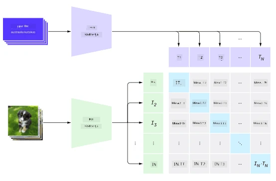
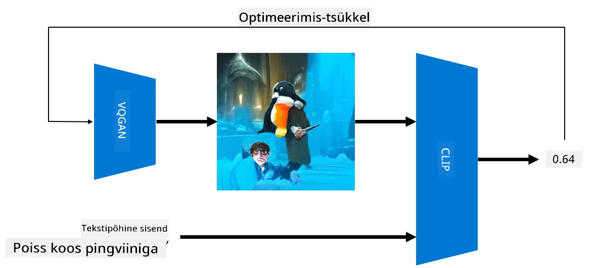

# Multi-modalvõrgud

Pärast transformer-mudelite edu NLP-ülesannete lahendamisel on sama või sarnaseid arhitektuure rakendatud ka arvutinägemise ülesannetes. Kasvab huvi luua mudeleid, mis *ühendaksid* nägemise ja loomuliku keele võimekused. Üks sellistest katsetest tehti OpenAI poolt ja seda nimetatakse CLIP ja DALL.E.

## Kontrastiivne pildieelõpe (CLIP)

CLIP-i peamine idee on võrrelda tekstilisi juhiseid pildiga ja määrata, kui hästi pilt vastab juhisele.

> *Pilt [sellest blogipostitusest](https://openai.com/blog/clip/)*

Mudelit treenitakse internetist saadud piltide ja nende pealkirjade põhjal. Iga partii jaoks võtame N paari (pilt, tekst) ja teisendame need vektorrepresentatsioonideks I1,..., IN / T1, ..., TN. Need representatsioonid sobitatakse seejärel omavahel. Kaotusefunktsioon on määratletud nii, et maksimeeritakse kosinussarnasus ühe paari vektorite vahel (nt Ii ja Ti) ning minimeeritakse kosinussarnasus kõigi teiste paaride vahel. Seetõttu nimetatakse seda lähenemist **kontrastiivseks**.

CLIP mudel/teek on saadaval [OpenAI GitHubis](https://github.com/openai/CLIP). Lähenemist kirjeldatakse [selles blogipostituses](https://openai.com/blog/clip/) ja detailsemalt [selles artiklis](https://arxiv.org/pdf/2103.00020.pdf).

Kui mudel on eelnevalt treenitud, saame anda sellele pildipartii ja tekstiliste juhiste partii, ning see tagastab tensoriga tõenäosused. CLIP-i saab kasutada mitmel ülesandel:

**Pildiklassifikatsioon**

Oletame, et peame klassifitseerima pilte näiteks kasside, koerte ja inimeste vahel. Sel juhul saame mudelile anda pildi ja rea tekstilisi juhiseid: "*kassi pilt*", "*koera pilt*", "*inimese pilt*". Kolme tõenäosuse vektoris peame lihtsalt valima indeksi, mille väärtus on kõige suurem.

> *Pilt [sellest blogipostitusest](https://openai.com/blog/clip/)*

**Tekstipõhine pildiotsing**

Saame teha ka vastupidist. Kui meil on piltide kogu, saame selle mudelile edastada koos tekstilise juhisega – see annab meile pildi, mis vastab juhisele kõige paremini.

## ✍️ Näide: [CLIP-i kasutamine pildiklassifikatsiooniks ja pildiotsinguks](Clip.ipynb)

Avage [Clip.ipynb](Clip.ipynb) märkmik, et näha CLIP-i tegevuses.

## Pildigeneratsioon VQGAN+CLIP abil

CLIP-i saab kasutada ka **pildigeneratsiooniks** tekstilise juhise põhjal. Selleks on vaja **generaatorimudelit**, mis suudab genereerida pilte mingi vektorsisendi põhjal. Üks sellistest mudelitest on [VQGAN](https://compvis.github.io/taming-transformers/) (Vector-Quantized GAN).

VQGAN-i peamised ideed, mis eristavad seda tavalisest [GAN-ist](../../4-ComputerVision/10-GANs/README.md), on järgmised:
* Autoregressiivse transformeri arhitektuuri kasutamine, et genereerida konteksti-rikkaid visuaalseid osi, mis moodustavad pildi. Need visuaalsed osad õpitakse omakorda [CNN-i](../../4-ComputerVision/07-ConvNets/README.md) abil.
* Alampildi diskriminaatori kasutamine, mis tuvastab, kas pildi osad on "päris" või "võlts" (erinevalt traditsioonilise GAN-i "kõik-või-mitte-midagi" lähenemisest).

Lisateavet VQGAN-i kohta leiate [Taming Transformers](https://compvis.github.io/taming-transformers/) veebisaidilt.

Üks oluline erinevus VQGAN-i ja traditsioonilise GAN-i vahel on see, et viimane suudab genereerida korraliku pildi mis tahes sisendvektorist, samas kui VQGAN-i puhul on tõenäoline, et pilt ei ole koherentne. Seetõttu peame pildiloome protsessi täiendavalt suunama, mida saab teha CLIP-i abil.

Tekstijuhisele vastava pildi genereerimiseks alustame juhusliku kodeerimisvektoriga, mis edastatakse VQGAN-ile, et luua pilt. Seejärel kasutatakse CLIP-i kaotusefunktsiooni loomiseks, mis näitab, kui hästi pilt vastab tekstilisele juhisele. Eesmärk on seejärel minimeerida kaotus, kasutades tagasipropageerimist sisendvektori parameetrite kohandamiseks.

Suurepärane teek, mis rakendab VQGAN+CLIP-i, on [Pixray](http://github.com/pixray/pixray).

 |   | 
----|----|----
Pilt genereeritud juhisest *noore meesõpetaja lähivaade, akvarellportree, kirjanduse õpetaja, raamatuga* | Pilt genereeritud juhisest *noore naisõpetaja lähivaade, õliportree, arvutiteaduse õpetaja, arvutiga* | Pilt genereeritud juhisest *vana meesõpetaja lähivaade, õliportree, matemaatika õpetaja, tahvli ees*

> Pildid **Artificial Teachers** kollektsioonist, autor [Dmitry Soshnikov](http://soshnikov.com)

## DALL-E
### [DALL-E 1](https://openai.com/research/dall-e)
DALL-E on GPT-3 versioon, mis on treenitud genereerima pilte juhiste põhjal. Seda on treenitud 12 miljardi parameetriga.

Erinevalt CLIP-ist võtab DALL-E vastu nii teksti kui pilti ühe tokenite voona. Seega saab mitme juhise põhjal genereerida pilte vastavalt tekstile.

### [DALL-E 2](https://openai.com/dall-e-2)
Peamine erinevus DALL.E 1 ja 2 vahel on see, et viimane genereerib realistlikumaid pilte ja kunsti.

Näited DALL-E abil genereeritud piltidest:
 |   | 
----|----|----
Pilt genereeritud juhisest *noore meesõpetaja lähivaade, akvarellportree, kirjanduse õpetaja, raamatuga* | Pilt genereeritud juhisest *noore naisõpetaja lähivaade, õliportree, arvutiteaduse õpetaja, arvutiga* | Pilt genereeritud juhisest *vana meesõpetaja lähivaade, õliportree, matemaatika õpetaja, tahvli ees*

## Viited

* VQGAN artikkel: [Taming Transformers for High-Resolution Image Synthesis](https://compvis.github.io/taming-transformers/paper/paper.pdf)
* CLIP artikkel: [Learning Transferable Visual Models From Natural Language Supervision](https://arxiv.org/pdf/2103.00020.pdf)

---

**Lahtiütlus**:  
See dokument on tõlgitud AI tõlketeenuse [Co-op Translator](https://github.com/Azure/co-op-translator) abil. Kuigi püüame tagada täpsust, palume arvestada, et automaatsed tõlked võivad sisaldada vigu või ebatäpsusi. Algne dokument selle algses keeles tuleks pidada autoriteetseks allikaks. Olulise teabe puhul soovitame kasutada professionaalset inimtõlget. Me ei vastuta selle tõlke kasutamisest tulenevate arusaamatuste või valesti tõlgenduste eest.