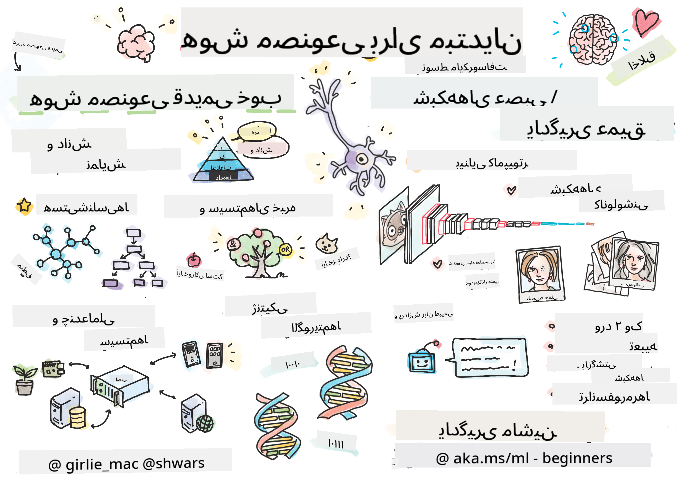

<!--
CO_OP_TRANSLATOR_METADATA:
{
  "original_hash": "14816e97d79b296c87811724f7785923",
  "translation_date": "2026-01-01T10:15:36+00:00",
  "source_file": "README.md",
  "language_code": "fa"
}
-->

# Artificial Intelligence for Beginners - A Curriculum

||
|:---:|
| هوش مصنوعی برای مبتدیان - _اسکچ‌نوت توسط [@girlie_mac](https://twitter.com/girlie_mac)_ |

جهان را کاوش کنید در مورد **هوش مصنوعی** (AI) با برنامهٔ درسی 12 هفته‌ای ما که شامل 24 درس است! این برنامه شامل درس‌های کاربردی، آزمایش‌ها و لابراتوارها می‌باشد. برنامه برای مبتدیان مناسب است و ابزارهایی مانند TensorFlow و PyTorch را پوشش می‌دهد، و همچنین مباحث اخلاق در هوش مصنوعی را شامل می‌شود.

### 🌐 پشتیبانی چندزبانه

#### پشتیبانی شده از طریق GitHub Action (خودکار و همیشه به‌روز)

<!-- CO-OP TRANSLATOR LANGUAGES TABLE START -->
[عربی](../ar/README.md) | [بنگالی](../bn/README.md) | [بلغاری](../bg/README.md) | [بورمی (میانمار)](../my/README.md) | [چینی (ساده‌شده)](../zh/README.md) | [چینی (سنتی، هنگ‌کنگ)](../hk/README.md) | [چینی (سنتی، ماکائو)](../mo/README.md) | [چینی (سنتی، تایوان)](../tw/README.md) | [کروات](../hr/README.md) | [چکی](../cs/README.md) | [دانمارکی](../da/README.md) | [هلندی](../nl/README.md) | [استونیایی](../et/README.md) | [فنلاندی](../fi/README.md) | [فرانسوی](../fr/README.md) | [آلمانی](../de/README.md) | [یونانی](../el/README.md) | [عبری](../he/README.md) | [هندی](../hi/README.md) | [مجارستانی](../hu/README.md) | [اندونزیایی](../id/README.md) | [ایتالیایی](../it/README.md) | [ژاپنی](../ja/README.md) | [Kannada](../kn/README.md) | [کره‌ای](../ko/README.md) | [لیتوانیایی](../lt/README.md) | [مالایی](../ms/README.md) | [مالایالام](../ml/README.md) | [مراتی](../mr/README.md) | [نپالی](../ne/README.md) | [Nigerian Pidgin](../pcm/README.md) | [نروژی](../no/README.md) | [فارسی](./README.md) | [لهستانی](../pl/README.md) | [پرتغالی (برزیل)](../br/README.md) | [پرتغالی (پرتغال)](../pt/README.md) | [Punjabi (Gurmukhi)](../pa/README.md) | [رومانیایی](../ro/README.md) | [روسی](../ru/README.md) | [صربی (سیریلیک)](../sr/README.md) | [اسلواکی](../sk/README.md) | [اسلوونیایی](../sl/README.md) | [اسپانیایی](../es/README.md) | [سواحیلی](../sw/README.md) | [سوئدی](../sv/README.md) | [تگالوگ (فیلیپینی)](../tl/README.md) | [تامیلی](../ta/README.md) | [تلوگو](../te/README.md) | [تایلندی](../th/README.md) | [ترکی](../tr/README.md) | [اوکراینی](../uk/README.md) | [اردو](../ur/README.md) | [ویتنامی](../vi/README.md)
<!-- CO-OP TRANSLATOR LANGUAGES TABLE END -->

**اگر مایل به افزودن زبان‌های ترجمهٔ بیشتری هستید، فهرست زبان‌های پشتیبانی شده را می‌توانید [اینجا](https://github.com/Azure/co-op-translator/blob/main/getting_started/supported-languages.md) ببینید**

## به جامعه بپیوندید

## چه چیزی یاد خواهید گرفت

**[نقشهٔ ذهنی دوره](http://soshnikov.com/courses/ai-for-beginners/mindmap.html)**

در این برنامهٔ درسی، شما یاد خواهید گرفت:

* رویکردهای مختلف به هوش مصنوعی، از جمله رویکرد نمادی قدیمی و کلاسیک با **نمایش دانش** و استدلال ([GOFAI](https://en.wikipedia.org/wiki/Symbolic_artificial_intelligence)).
* **شبکه‌های عصبی** و **یادگیری عمیق** که در هستهٔ هوش مصنوعی مدرن قرار دارند. ما مفاهیم پشت این موضوعات مهم را با استفاده از کد در دو تا از محبوب‌ترین فریم‌ورک‌ها نشان خواهیم داد - [TensorFlow](http://Tensorflow.org) و [PyTorch](http://pytorch.org).
* **معماری‌های عصبی** برای کار با تصاویر و متن. ما مدل‌های اخیر را پوشش خواهیم داد اما ممکن است تا حدی از برترین‌های روز عقب باشیم.
* رویکردهای کمتر متداول در هوش مصنوعی، مانند **الگوریتم‌های ژنتیکی** و **سیستم‌های چندعامله**.

مواردی که در این برنامهٔ درسی پوشش داده نمی‌شوند:

> [تمام منابع اضافی این دوره را در مجموعهٔ Microsoft Learn ما بیابید](https://learn.microsoft.com/en-us/collections/7w28iy2xrqzdj0?WT.mc_id=academic-77998-bethanycheum)

* موارد کسب‌وکاری استفاده از **هوش مصنوعی در کسب‌وکار**. توصیه می‌شود مسیر یادگیری [Introduction to AI for business users](https://docs.microsoft.com/learn/paths/introduction-ai-for-business-users/?WT.mc_id=academic-77998-bethanycheum) در Microsoft Learn را دنبال کنید، یا [AI Business School](https://www.microsoft.com/ai/ai-business-school/?WT.mc_id=academic-77998-bethanycheum) که با همکاری [INSEAD](https://www.insead.edu/) توسعه یافته است.
* **یادگیری ماشین کلاسیک**، که در برنامهٔ درسی [Machine Learning for Beginners Curriculum](http://github.com/Microsoft/ML-for-Beginners) ما به‌خوبی توضیح داده شده است.
* برنامه‌های کاربردی عملی هوش مصنوعی که با استفاده از **[Cognitive Services](https://azure.microsoft.com/services/cognitive-services/?WT.mc_id=academic-77998-bethanycheum)** ساخته شده‌اند. برای این منظور، توصیه می‌کنیم با ماژول‌های Microsoft Learn برای [vision](https://docs.microsoft.com/learn/paths/create-computer-vision-solutions-azure-cognitive-services/?WT.mc_id=academic-77998-bethanycheum)، [natural language processing](https://docs.microsoft.com/learn/paths/explore-natural-language-processing/?WT.mc_id=academic-77998-bethanycheum)، **[Generative AI with Azure OpenAI Service](https://learn.microsoft.com/en-us/training/paths/develop-ai-solutions-azure-openai/?WT.mc_id=academic-77998-bethanycheum)** و دیگر موارد شروع کنید.
* چارچوب‌های خاص ابری برای ML، مانند [Azure Machine Learning](https://azure.microsoft.com/services/machine-learning/?WT.mc_id=academic-77998-bethanycheum)، [Microsoft Fabric](https://learn.microsoft.com/en-us/training/paths/get-started-fabric/?WT.mc_id=academic-77998-bethanycheum)، یا [Azure Databricks](https://docs.microsoft.com/learn/paths/data-engineer-azure-databricks?WT.mc_id=academic-77998-bethanycheum). می‌توانید از مسیرهای یادگیری [Build and operate machine learning solutions with Azure Machine Learning](https://docs.microsoft.com/learn/paths/build-ai-solutions-with-azure-ml-service/?WT.mc_id=academic-77998-bethanycheum) و [Build and Operate Machine Learning Solutions with Azure Databricks](https://docs.microsoft.com/learn/paths/build-operate-machine-learning-solutions-azure-databricks/?WT.mc_id=academic-77998-bethanycheum) استفاده کنید.
* **هوش مصنوعی محاوره‌ای** و **چت‌بات‌ها**. یک مسیر یادگیری جداگانه وجود دارد: [Create conversational AI solutions](https://docs.microsoft.com/learn/paths/create-conversational-ai-solutions/?WT.mc_id=academic-77998-bethanycheum)، و شما همچنین می‌توانید برای جزئیات بیشتر به [این پست وبلاگ](https://soshnikov.com/azure/hello-bot-conversational-ai-on-microsoft-platform/) مراجعه کنید.
* **ریاضیات عمیق** پشت یادگیری عمیق. برای این منظور، ما کتاب [Deep Learning](https://www.amazon.com/Deep-Learning-Adaptive-Computation-Machine/dp/0262035618) نوشتهٔ Ian Goodfellow, Yoshua Bengio و Aaron Courville را توصیه می‌کنیم، که همچنین به‌صورت آنلاین در [https://www.deeplearningbook.org/](https://www.deeplearningbook.org/) در دسترس است.

برای یک معرفی ملایم به موضوعات _هوش مصنوعی در فضای ابری_ ممکن است مسیر یادگیری [Get started with artificial intelligence on Azure](https://docs.microsoft.com/learn/paths/get-started-with-artificial-intelligence-on-azure/?WT.mc_id=academic-77998-bethanycheum) را دنبال کنید.

# Content

|     |                                                                 لینک درس                                                                  |                                           PyTorch/Keras/TensorFlow                                          | لاب                                                            |
| :-: | :------------------------------------------------------------------------------------------------------------------------------------------: | :---------------------------------------------------------------------------------------------: | ------------------------------------------------------------------------------ |
| 0  |                                 [Course Setup](./lessons/0-course-setup/setup.md)                                 |                      [Setup Your Development Environment](./lessons/0-course-setup/how-to-run.md)                       |   |
| I  |               [**Introduction to AI**](./lessons/1-Intro/README.md)      | | |
| 01  |       [Introduction and History of AI](./lessons/1-Intro/README.md)       |           -                            | -  |
| II |              **Symbolic AI**              |
| 02  |       [Knowledge Representation and Expert Systems](./lessons/2-Symbolic/README.md)       |            [Expert Systems](./lessons/2-Symbolic/Animals.ipynb) /  [Ontology](./lessons/2-Symbolic/FamilyOntology.ipynb) /[Concept Graph](./lessons/2-Symbolic/MSConceptGraph.ipynb)                             |  |
| III |                        [**Introduction to Neural Networks**](./lessons/3-NeuralNetworks/README.md) |||
| 03  |                [پرسپترون](./lessons/3-NeuralNetworks/03-Perceptron/README.md)                 |                       [نوت‌بوک](./lessons/3-NeuralNetworks/03-Perceptron/Perceptron.ipynb)                      | [آزمایش](./lessons/3-NeuralNetworks/03-Perceptron/lab/README.md) |
| 04  |                   [پرسپترون چندلایه و ساخت فریم‌ورک خودمان](./lessons/3-NeuralNetworks/04-OwnFramework/README.md)                   |        [نوت‌بوک](./lessons/3-NeuralNetworks/04-OwnFramework/OwnFramework.ipynb)        | [آزمایش](./lessons/3-NeuralNetworks/04-OwnFramework/lab/README.md) |
| 05  |            [مقدمه‌ای بر فریم‌ورک‌ها (PyTorch/TensorFlow) و بیش‌برازش](./lessons/3-NeuralNetworks/05-Frameworks/README.md)             |           [PyTorch](./lessons/3-NeuralNetworks/05-Frameworks/IntroPyTorch.ipynb) / [Keras](./lessons/3-NeuralNetworks/05-Frameworks/IntroKeras.ipynb) / [TensorFlow](./lessons/3-NeuralNetworks/05-Frameworks/IntroKerasTF.ipynb)             | [آزمایش](./lessons/3-NeuralNetworks/05-Frameworks/lab/README.md) |
| IV  |            [**بینایی ماشین**](./lessons/4-ComputerVision/README.md)             | [PyTorch](https://docs.microsoft.com/learn/modules/intro-computer-vision-pytorch/?WT.mc_id=academic-77998-cacaste) / [TensorFlow](https://docs.microsoft.com/learn/modules/intro-computer-vision-TensorFlow/?WT.mc_id=academic-77998-cacaste)| [کاوش بینایی ماشین در Microsoft Azure](https://learn.microsoft.com/en-us/collections/7w28iy2xrqzdj0?WT.mc_id=academic-77998-bethanycheum) |
| 06  |            [مقدمه‌ای بر بینایی ماشین. OpenCV](./lessons/4-ComputerVision/06-IntroCV/README.md)             |           [نوت‌بوک](./lessons/4-ComputerVision/06-IntroCV/OpenCV.ipynb)         | [آزمایش](./lessons/4-ComputerVision/06-IntroCV/lab/README.md) |
| 07  |            [شبکه‌های عصبی کانولوشنی](./lessons/4-ComputerVision/07-ConvNets/README.md) &  [معماری‌های CNN](./lessons/4-ComputerVision/07-ConvNets/CNN_Architectures.md)             |           [PyTorch](./lessons/4-ComputerVision/07-ConvNets/ConvNetsPyTorch.ipynb) /[TensorFlow](./lessons/4-ComputerVision/07-ConvNets/ConvNetsTF.ipynb)             | [آزمایش](./lessons/4-ComputerVision/07-ConvNets/lab/README.md) |
| 08  |            [شبکه‌های از پیش‌آموزش‌دیده و یادگیری انتقالی](./lessons/4-ComputerVision/08-TransferLearning/README.md) و [ترفندهای آموزش](./lessons/4-ComputerVision/08-TransferLearning/TrainingTricks.md)             |           [PyTorch](./lessons/4-ComputerVision/08-TransferLearning/TransferLearningPyTorch.ipynb) / [TensorFlow](./lessons/3-NeuralNetworks/05-Frameworks/IntroKerasTF.ipynb)             | [آزمایش](./lessons/4-ComputerVision/08-TransferLearning/lab/README.md) |
| 09  |            [اتو‌انکودرها و VAEها](./lessons/4-ComputerVision/09-Autoencoders/README.md)             |           [PyTorch](./lessons/4-ComputerVision/09-Autoencoders/AutoEncodersPyTorch.ipynb) / [TensorFlow](./lessons/4-ComputerVision/09-Autoencoders/AutoencodersTF.ipynb)             |  |
| 10  |            [شبکه‌های مولد تقابلی و انتقال سبک هنری](./lessons/4-ComputerVision/10-GANs/README.md)             |           [PyTorch](./lessons/4-ComputerVision/10-GANs/GANPyTorch.ipynb) / [TensorFlow](./lessons/4-ComputerVision/10-GANs/GANTF.ipynb)             |  |
| 11  |            [تشخیص اشیاء](./lessons/4-ComputerVision/11-ObjectDetection/README.md)             |         [TensorFlow](./lessons/4-ComputerVision/11-ObjectDetection/ObjectDetection.ipynb)             | [آزمایش](./lessons/4-ComputerVision/11-ObjectDetection/lab/README.md) |
| 12  |            [بخش‌بندی معنایی. U-Net](./lessons/4-ComputerVision/12-Segmentation/README.md)             |           [PyTorch](./lessons/4-ComputerVision/12-Segmentation/SemanticSegmentationPytorch.ipynb) / [TensorFlow](./lessons/4-ComputerVision/12-Segmentation/SemanticSegmentationTF.ipynb)             |  |
| V  |            [**پردازش زبان طبیعی**](./lessons/5-NLP/README.md)             | [PyTorch](https://docs.microsoft.com/learn/modules/intro-natural-language-processing-pytorch/?WT.mc_id=academic-77998-cacaste) /[TensorFlow](https://docs.microsoft.com/learn/modules/intro-natural-language-processing-TensorFlow/?WT.mc_id=academic-77998-cacaste) | [کاوش پردازش زبان طبیعی در Microsoft Azure](https://learn.microsoft.com/en-us/collections/7w28iy2xrqzdj0?WT.mc_id=academic-77998-bethanycheum)|
| 13  |            [نمایش متن. Bow/TF-IDF](./lessons/5-NLP/13-TextRep/README.md)             |           [PyTorch](https://github.com/microsoft/AI-For-Beginners/blob/main/lessons/5-NLP/13-TextRep/TextRepresentationPyTorch.ipynb) / [TensorFlow](https://github.com/microsoft/AI-For-Beginners/blob/main/lessons/5-NLP/13-TextRep/TextRepresentationTF.ipynb)             | |
| 14  |            [درج‌نمایی‌های معنایی کلمات. Word2Vec و GloVe](./lessons/5-NLP/14-Embeddings/README.md)             |           [PyTorch](https://github.com/microsoft/AI-For-Beginners/blob/main/lessons/5-NLP/14-Embeddings/EmbeddingsPyTorch.ipynb) / [TensorFlow](https://github.com/microsoft/AI-For-Beginners/blob/main/lessons/5-NLP/14-Embeddings/EmbeddingsTF.ipynb)             |  |
| 15  |            [مدلسازی زبان. آموزش درج‌نمایی‌های خودتان](./lessons/5-NLP/15-LanguageModeling/README.md)             |           [PyTorch](https://github.com/microsoft/AI-For-Beginners/blob/main/lessons/5-NLP/15-LanguageModeling/CBoW-PyTorch.ipynb) / [TensorFlow](https://github.com/microsoft/AI-For-Beginners/blob/main/lessons/5-NLP/15-LanguageModeling/CBoW-TF.ipynb)             | [آزمایش](./lessons/5-NLP/15-LanguageModeling/lab/README.md) |
| 16  |            [شبکه‌های عصبی بازگشتی](./lessons/5-NLP/16-RNN/README.md)             |           [PyTorch](https://github.com/microsoft/AI-For-Beginners/blob/main/lessons/5-NLP/16-RNN/RNNPyTorch.ipynb) / [TensorFlow](https://github.com/microsoft/AI-For-Beginners/blob/main/lessons/5-NLP/16-RNN/RNNTF.ipynb)             |  |
| 17  |            [شبکه‌های بازگشتی مولد](./lessons/5-NLP/17-GenerativeNetworks/README.md)             |           [PyTorch](https://github.com/microsoft/AI-For-Beginners/blob/main/lessons/5-NLP/17-GenerativeNetworks/GenerativePyTorch.ipynb) / [TensorFlow](https://github.com/microsoft/AI-For-Beginners/blob/main/lessons/5-NLP/17-GenerativeNetworks/GenerativeTF.ipynb)             | [آزمایش](./lessons/5-NLP/17-GenerativeNetworks/lab/README.md) |
| 18  |            [ترنسفورمرها. BERT.](./lessons/5-NLP/18-Transformers/README.md)             |           [PyTorch](https://github.com/microsoft/AI-For-Beginners/blob/main/lessons/5-NLP/18-Transformers/TransformersPyTorch.ipynb) /[TensorFlow](https://github.com/microsoft/AI-For-Beginners/blob/main/lessons/5-NLP/18-Transformers/TransformersTF.ipynb)             |  |
| 19  |            [تشخیص موجودیت‌های نام‌دار](./lessons/5-NLP/19-NER/README.md)             |           [TensorFlow](https://microsoft.github.io/AI-For-Beginners/lessons/5-NLP/19-NER/NER-TF.ipynb)             | [آزمایش](./lessons/5-NLP/19-NER/lab/README.md) |
| 20  |            [مدل‌های زبان بزرگ، برنامه‌نویسی پرامپت و وظایف چندنمونه‌ای](./lessons/5-NLP/20-LangModels/README.md)             |           [PyTorch](https://microsoft.github.io/AI-For-Beginners/lessons/5-NLP/20-LangModels/GPT-PyTorch.ipynb) | |
| VI |            **سایر تکنیک‌های هوش مصنوعی** || |
| 21  |            [الگوریتم‌های ژنتیک](./lessons/6-Other/21-GeneticAlgorithms/README.md)             |           [نوت‌بوک](./lessons/6-Other/21-GeneticAlgorithms/Genetic.ipynb) | |
| 22  |            [یادگیری تقویتی عمیق](./lessons/6-Other/22-DeepRL/README.md)             |           [PyTorch](./lessons/6-Other/22-DeepRL/CartPole-RL-PyTorch.ipynb) /[TensorFlow](./lessons/6-Other/22-DeepRL/CartPole-RL-TF.ipynb)             | [آزمایش](./lessons/6-Other/22-DeepRL/lab/README.md) |
| 23  |            [سیستم‌های چندعامله](./lessons/6-Other/23-MultiagentSystems/README.md)             |  | |
| VII |            **اخلاق هوش مصنوعی** | | |
| 24  |            [اخلاق هوش مصنوعی و هوش مصنوعی مسئول](./lessons/7-Ethics/README.md)             |           [Microsoft Learn: اصول هوش مصنوعی مسئول](https://docs.microsoft.com/learn/paths/responsible-ai-business-principles/?WT.mc_id=academic-77998-cacaste) | |
| IX  |            **موارد اضافی** | | |
| 25  |            [شبکه‌های چندمودالی، CLIP و VQGAN](./lessons/X-Extras/X1-MultiModal/README.md)             |           [نوت‌بوک](./lessons/X-Extras/X1-MultiModal/Clip.ipynb)    | |

## هر درس شامل

* مطالب پیش‌مطالعه
* نوت‌بوک‌های اجرایی Jupyter که اغلب به یک فریم‌ورک مشخص مربوط هستند (**PyTorch** یا **TensorFlow**). نوت‌بوک اجرایی همچنین شامل حجم زیادی از مطالب نظری است، بنابراین برای درک موضوع باید حداقل یک نسخه از نوت‌بوک را مرور کنید (یا PyTorch یا TensorFlow).
* **آزمایش‌ها** برای برخی موضوعات در دسترس هستند، که به شما فرصتی می‌دهند تا مطالب آموخته‌شده را در یک مسئلهٔ خاص به‌کار ببرید.
* برخی بخش‌ها شامل لینک به ماژول‌های [**Microsoft Learn**](https://learn.microsoft.com/en-us/collections/7w28iy2xrqzdj0?WT.mc_id=academic-77998-bethanycheum) هستند که موضوعات مرتبط را پوشش می‌دهند.

## شروع

### 🎯 تازه‌وارد به هوش مصنوعی؟ از اینجا شروع کنید!

اگر کاملاً تازه‌کار در هوش مصنوعی هستید و مثال‌های سریع و عملی می‌خواهید، به [**مثال‌های مناسب برای مبتدیان**](./examples/README.md) نگاه کنید! این‌ها شامل:

- 🌟 **سلام دنیای هوش مصنوعی** - اولین برنامهٔ هوش مصنوعی شما (شناسایی الگو)
- 🧠 **شبکه عصبی ساده** - ساخت یک شبکه عصبی از پایه  
- 🖼️ **طبقه‌بند تصاویر** - طبقه‌بندی تصاویر با توضیحات دقیق
- 💬 **احساس متن** - تحلیل متن مثبت/منفی

این مثال‌ها طراحی شده‌اند تا به شما کمک کنند مفاهیم هوش مصنوعی را قبل از ورود به برنامه درسی کامل درک کنید.

### 📚 راه‌اندازی کامل دوره

- ما یک [درس راه‌اندازی](./lessons/0-course-setup/setup.md) ایجاد کرده‌ایم تا به شما در تنظیم محیط توسعه کمک کند. - برای مدرسین، ما همچنین یک [درس راه‌اندازی برنامه درسی](./lessons/0-course-setup/for-teachers.md) برای شما ایجاد کرده‌ایم!
- نحوه [اجرای کد در VSCode یا Codepace](./lessons/0-course-setup/how-to-run.md)

این مراحل را دنبال کنید:

Fork the Repository: روی دکمهٔ "Fork" در گوشهٔ بالا-راست این صفحه کلیک کنید.

Clone the Repository: `git clone https://github.com/microsoft/AI-For-Beginners.git`

فراموش نکنید به این مخزن ستاره (🌟) بدهید تا بعداً پیدا کردنش آسان‌تر شود.

## آشنایی با سایر یادگیرندگان

برای ملاقات و شبکه‌سازی با سایر یادگیرندگانی که این دوره را می‌گذرانند و دریافت پشتیبانی، به [سرور رسمی دیسکورد AI ما](https://aka.ms/genai-discord?WT.mc_id=academic-105485-bethanycheum) بپیوندید.

اگر بازخورد محصول یا سوالی هنگام ساخت داشتید، به [انجمن توسعه‌دهندگان Azure AI Foundry](https://aka.ms/foundry/forum) مراجعه کنید

## آزمون‌ها 

> **یک یادداشت دربارهٔ آزمون‌ها**: تمام آزمون‌ها در پوشهٔ Quiz-app در etc\quiz-app، یا [آنلاین اینجا](https://ff-quizzes.netlify.app/) قرار دارند. آن‌ها از داخل درس‌ها پیوند داده شده‌اند؛ برنامهٔ آزمون می‌تواند به‌صورت محلی اجرا شود یا به Azure مستقر شود؛ دستورالعمل‌ها را در پوشهٔ `quiz-app` دنبال کنید. آن‌ها به‌تدریج بومی‌سازی می‌شوند.

## درخواست کمک

آیا پیشنهاداتی دارید یا خطاهای املایی یا کدنویسی پیدا کرده‌اید؟ یک issue باز کنید یا یک pull request ایجاد کنید.

## تشکر ویژه

* **✍️ نویسندهٔ اصلی:** [Dmitry Soshnikov](http://soshnikov.com), PhD
* **🔥 ویراستار:** [Jen Looper](https://twitter.com/jenlooper), PhD
* **🎨 طراح اسکچ‌نوت:** [Tomomi Imura](https://twitter.com/girlie_mac)
* **✅ سازندهٔ آزمون:** [Lateefah Bello](https://github.com/CinnamonXI), [MLSA](https://studentambassadors.microsoft.com/)
* **🙏 مشارکت‌کنندگان اصلی:** [Evgenii Pishchik](https://github.com/Pe4enIks)

## برنامه‌های درسی دیگر

تیم ما برنامه‌های درسی دیگری نیز تولید می‌کند! بررسی کنید:

<!-- CO-OP TRANSLATOR OTHER COURSES START -->
### LangChain

---

### Azure / Edge / MCP / Agents

---
 
### Generative AI Series

[-9333EA?style=for-the-badge&labelColor=E5E7EB&color=9333EA)](https://github.com/microsoft/Generative-AI-for-beginners-dotnet?WT.mc_id=academic-105485-koreyst)
[-C084FC?style=for-the-badge&labelColor=E5E7EB&color=C084FC)](https://github.com/microsoft/generative-ai-for-beginners-java?WT.mc_id=academic-105485-koreyst)
[-E879F9?style=for-the-badge&labelColor=E5E7EB&color=E879F9)](https://github.com/microsoft/generative-ai-with-javascript?WT.mc_id=academic-105485-koreyst)

---
 
### یادگیری پایه

---
 
### Copilot Series

<!-- CO-OP TRANSLATOR OTHER COURSES END -->

## دریافت کمک

اگر گیر کردید یا در مورد ساخت برنامه‌های هوش مصنوعی سوالی داشتید، به بحث‌ها با سایر یادگیرندگان و توسعه‌دهندگان باتجربه در مورد MCP بپیوندید. این یک جامعهٔ حمایتگر است که سوالات در آن خوش‌آمد گفته می‌شود و دانش آزادانه به اشتراک گذاشته می‌شود.

اگر هنگام ساخت بازخورد محصول یا خطاهایی داشتید مراجعه کنید:

---

<!-- CO-OP TRANSLATOR DISCLAIMER START -->
سلب مسئولیت:
این سند با استفاده از سرویس ترجمهٔ خودکار مبتنی بر هوش مصنوعی [Co-op Translator](https://github.com/Azure/co-op-translator) ترجمه شده است. اگرچه ما در تلاش برای دقت هستیم، لطفاً توجه داشته باشید که ترجمه‌های خودکار ممکن است شامل خطاها یا نادرستی‌هایی باشند. سند اصلی به زبان اصلی آن باید به عنوان منبع معتبر در نظر گرفته شود. برای اطلاعات حیاتی، توصیه می‌شود از ترجمهٔ حرفه‌ای انسانی استفاده شود. ما در قبال هرگونه سو‌تفاهم یا تفسیر نادرست ناشی از استفاده از این ترجمه مسئولیتی نداریم.
<!-- CO-OP TRANSLATOR DISCLAIMER END -->