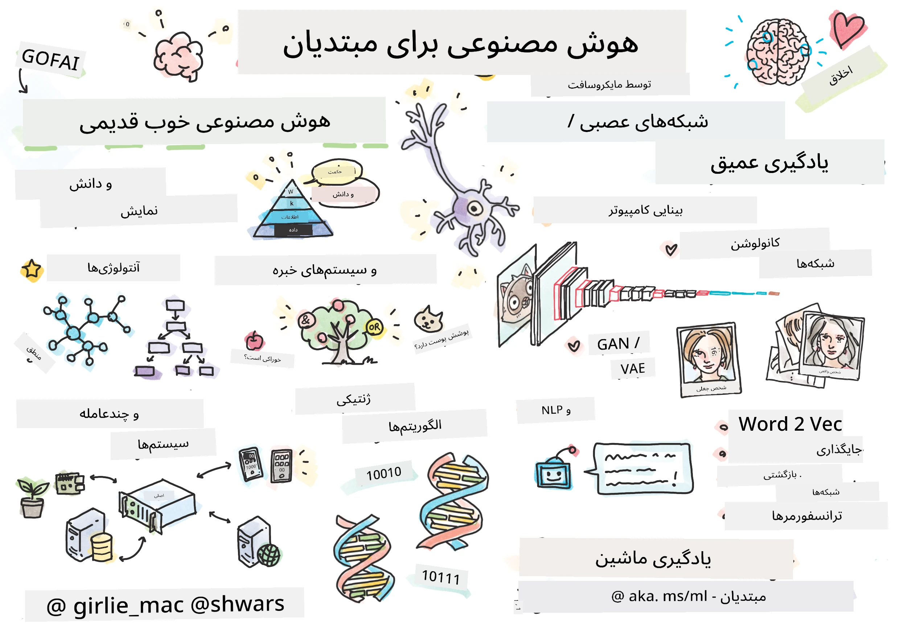

[](https://github.com/microsoft/AI-For-Beginners/blob/main/LICENSE)
[](https://GitHub.com/microsoft/AI-For-Beginners/graphs/contributors/)
[](https://GitHub.com/microsoft/AI-For-Beginners/issues/)
[](https://GitHub.com/microsoft/AI-For-Beginners/pulls/)
[](http://makeapullrequest.com)

[](https://GitHub.com/microsoft/AI-For-Beginners/watchers/)
[](https://GitHub.com/microsoft/AI-For-Beginners/network/)
[](https://GitHub.com/microsoft/AI-For-Beginners/stargazers/)
[](https://mybinder.org/v2/gh/microsoft/ai-for-beginners/HEAD)
[](https://gitter.im/Microsoft/ai-for-beginners?utm_source=badge&utm_medium=badge&utm_campaign=pr-badge)

[](https://discord.gg/nTYy5BXMWG)

# هوش مصنوعی برای مبتدیان - یک برنامه درسی

||
|:---:|
| هوش مصنوعی برای مبتدیان - _اسکچ‌نوت توسط [@girlie_mac](https://twitter.com/girlie_mac)_ |

جهان **هوش مصنوعی** (AI) را با برنامه درسی ۱۲ هفته‌ای و ۲۴ درس ما کاوش کنید! این برنامه شامل درس‌های عملی، آزمون‌ها و آزمایشگاه‌ها است. برنامه درسی برای مبتدیان مناسب است و ابزارهایی مانند TensorFlow و PyTorch و همچنین اخلاق در هوش مصنوعی را پوشش می‌دهد.


### 🌐 پشتیبانی چندزبانه

#### از طریق GitHub Action پشتیبانی می‌شود (خودکار و همیشه به‌روز)

<!-- CO-OP TRANSLATOR LANGUAGES TABLE START -->
[Arabic](../ar/README.md) | [Bengali](../bn/README.md) | [Bulgarian](../bg/README.md) | [Burmese (Myanmar)](../my/README.md) | [چینی (ساده شده)](../zh-CN/README.md) | [چینی (سنتی، هنگ کنگ)](../zh-HK/README.md) | [چینی (سنتی، ماکائو)](../zh-MO/README.md) | [چینی (سنتی، تایوان)](../zh-TW/README.md) | [Croatian](../hr/README.md) | [Czech](../cs/README.md) | [Danish](../da/README.md) | [Dutch](../nl/README.md) | [Estonian](../et/README.md) | [Finnish](../fi/README.md) | [French](../fr/README.md) | [German](../de/README.md) | [Greek](../el/README.md) | [Hebrew](../he/README.md) | [Hindi](../hi/README.md) | [Hungarian](../hu/README.md) | [Indonesian](../id/README.md) | [Italian](../it/README.md) | [Japanese](../ja/README.md) | [Kannada](../kn/README.md) | [Korean](../ko/README.md) | [Lithuanian](../lt/README.md) | [Malay](../ms/README.md) | [Malayalam](../ml/README.md) | [Marathi](../mr/README.md) | [Nepali](../ne/README.md) | [Nigerian Pidgin](../pcm/README.md) | [نروژی](../no/README.md) | [فارسی (Farsi)](./README.md) | [Polish](../pl/README.md) | [Portuguese (Brazil)](../pt-BR/README.md) | [Portuguese (Portugal)](../pt-PT/README.md) | [Punjabi (Gurmukhi)](../pa/README.md) | [Romanian](../ro/README.md) | [Russian](../ru/README.md) | [Serbian (Cyrillic)](../sr/README.md) | [Slovak](../sk/README.md) | [Slovenian](../sl/README.md) | [Spanish](../es/README.md) | [Swahili](../sw/README.md) | [Swedish](../sv/README.md) | [Tagalog (Filipino)](../tl/README.md) | [Tamil](../ta/README.md) | [Telugu](../te/README.md) | [Thai](../th/README.md) | [Turkish](../tr/README.md) | [Ukrainian](../uk/README.md) | [Urdu](../ur/README.md) | [Vietnamese](../vi/README.md)

> **ترجیح می‌دهید به‌صورت محلی کلون کنید؟**

> این مخزن شامل بیش از ۵۰ ترجمه زبان است که به طور قابل توجهی حجم دانلود را افزایش می‌دهد. برای کلون کردن بدون ترجمه‌ها، از sparse checkout استفاده کنید:
> ```bash
> git clone --filter=blob:none --sparse https://github.com/microsoft/AI-For-Beginners.git
> cd AI-For-Beginners
> git sparse-checkout set --no-cone '/*' '!translations' '!translated_images'
> ```
> این به شما همه چیز لازم برای تکمیل دوره را با دانلود بسیار سریع‌تر می‌دهد.
<!-- CO-OP TRANSLATOR LANGUAGES TABLE END -->

**اگر می‌خواهید زبان‌های ترجمه اضافی پشتیبانی شوند، فهرست آن‌ها در اینجا آمده است [here](https://github.com/Azure/co-op-translator/blob/main/getting_started/supported-languages.md)**

## به جامعه ملحق شوید
[](https://discord.gg/nTYy5BXMWG)

## آنچه یاد خواهید گرفت

**[نقشه ذهنی دوره](http://soshnikov.com/courses/ai-for-beginners/mindmap.html)**

در این برنامه درسی، شما یاد می‌گیرید:

* رویکردهای مختلف به هوش مصنوعی، از جمله رویکرد «کهنه‌کار» نمادین با **نمایش دانش** و استدلال ([GOFAI](https://en.wikipedia.org/wiki/Symbolic_artificial_intelligence)).
* **شبکه‌های عصبی** و **یادگیری عمیق**، که در هسته هوش مصنوعی مدرن قرار دارند. ما مفاهیم پشت این موضوعات مهم را با استفاده از کد در دو چارچوب محبوب - [TensorFlow](http://Tensorflow.org) و [PyTorch](http://pytorch.org) نشان می‌دهیم.
* **معماری‌های عصبی** برای کار با تصاویر و متن. مدل‌های اخیر را پوشش خواهیم داد اما ممکن است کمی از وضعیت هنر روز عقب‌تر باشد.
* رویکردهای کمتر محبوب هوش مصنوعی، مانند **الگوریتم‌های ژنتیکی** و **سیستم‌های چندعامل‌گی**.

مواردی که در این برنامه درسی پوشش نمی‌دهیم:

> [تمام منابع اضافی این دوره را در مجموعه Microsoft Learn ما پیدا کنید](https://learn.microsoft.com/en-us/collections/7w28iy2xrqzdj0?WT.mc_id=academic-77998-bethanycheum)

* کیس‌های کسب‌وکار استفاده از **هوش مصنوعی در کسب‌وکار**. مسیر یادگیری [مقدمه‌ای بر هوش مصنوعی برای کاربران کسب‌وکار](https://docs.microsoft.com/learn/paths/introduction-ai-for-business-users/?WT.mc_id=academic-77998-bethanycheum) در Microsoft Learn، یا [AI Business School](https://www.microsoft.com/ai/ai-business-school/?WT.mc_id=academic-77998-bethanycheum) که با همکاری [INSEAD](https://www.insead.edu/) توسعه یافته است را در نظر بگیرید.
* **یادگیری ماشین کلاسیک**، که به خوبی در برنامه درسی [یادگیری ماشین برای مبتدیان](http://github.com/Microsoft/ML-for-Beginners) ما شرح داده شده است.
* برنامه‌های عملی هوش مصنوعی ساخته شده با استفاده از **[خدمات شناختی](https://azure.microsoft.com/services/cognitive-services/?WT.mc_id=academic-77998-bethanycheum)**. برای این منظور، توصیه می‌کنیم با ماژول‌های Microsoft Learn برای [بینایی](https://docs.microsoft.com/learn/paths/create-computer-vision-solutions-azure-cognitive-services/?WT.mc_id=academic-77998-bethanycheum)، [پردازش زبان طبیعی](https://docs.microsoft.com/learn/paths/explore-natural-language-processing/?WT.mc_id=academic-77998-bethanycheum)، **[هوش مصنوعی مولد با سرویس Azure OpenAI](https://learn.microsoft.com/en-us/training/paths/develop-ai-solutions-azure-openai/?WT.mc_id=academic-77998-bethanycheum)** و دیگر موارد شروع کنید.
* چارچوب‌های خاص یادگیری ماشین **ابر**، مانند [Azure Machine Learning](https://azure.microsoft.com/services/machine-learning/?WT.mc_id=academic-77998-bethanycheum)، [Microsoft Fabric](https://learn.microsoft.com/en-us/training/paths/get-started-fabric/?WT.mc_id=academic-77998-bethanycheum) یا [Azure Databricks](https://docs.microsoft.com/learn/paths/data-engineer-azure-databricks?WT.mc_id=academic-77998-bethanycheum). به مسیرهای یادگیری [ساخت و اجرای راه‌حل‌های یادگیری ماشین با Azure Machine Learning](https://docs.microsoft.com/learn/paths/build-ai-solutions-with-azure-ml-service/?WT.mc_id=academic-77998-bethanycheum) و [ساخت و اجرای راه‌حل‌های یادگیری ماشین با Azure Databricks](https://docs.microsoft.com/learn/paths/build-operate-machine-learning-solutions-azure-databricks/?WT.mc_id=academic-77998-bethanycheum) توجه کنید.
* **هوش مصنوعی مکالمه‌ای** و **ربات‌های چت**. مسیر یادگیری جداگانه‌ای به نام [ساخت راه‌حل‌های هوش مصنوعی مکالمه‌ای](https://docs.microsoft.com/learn/paths/create-conversational-ai-solutions/?WT.mc_id=academic-77998-bethanycheum) وجود دارد و می‌توانید برای جزئیات بیشتر به [این پست وبلاگی](https://soshnikov.com/azure/hello-bot-conversational-ai-on-microsoft-platform/) نیز مراجعه کنید.
* **ریاضیات عمیق** پشت یادگیری عمیق. برای این منظور، کتاب [Deep Learning](https://www.amazon.com/Deep-Learning-Adaptive-Computation-Machine/dp/0262035618) اثر ایان گودفلو، یوشوا بنگیو و آرون کورویل را توصیه می‌کنیم که به صورت آنلاین نیز در [https://www.deeplearningbook.org/](https://www.deeplearningbook.org/) موجود است.

برای معرفی ملایم به موضوعات _هوش مصنوعی در ابر_، می‌توانید مسیر یادگیری [شروع کار با هوش مصنوعی در Azure](https://docs.microsoft.com/learn/paths/get-started-with-artificial-intelligence-on-azure/?WT.mc_id=academic-77998-bethanycheum) را دنبال کنید.

# محتوا

|     |                                                                 لینک درس                                                                  |                                           PyTorch/Keras/TensorFlow                                          | آزمایشگاه                                                            |
| :-: | :------------------------------------------------------------------------------------------------------------------------------------------: | :---------------------------------------------------------------------------------------------: | ------------------------------------------------------------------------------ |
| 0  |                                 [راه‌اندازی دوره](./lessons/0-course-setup/setup.md)                                 |                      [راه‌اندازی محیط توسعه خود](./lessons/0-course-setup/how-to-run.md)                       |   |
| I  |               [**مقدمه‌ای بر هوش مصنوعی**](./lessons/1-Intro/README.md)      | | |
| 01  |       [مقدمه و تاریخچه هوش مصنوعی](./lessons/1-Intro/README.md)       |           -                            | -  |
| II |              **هوش مصنوعی نمادین**              |
| 02  |       [نمایش دانش و سیستم‌های خبره](./lessons/2-Symbolic/README.md)       |            [سیستم‌های خبره](./lessons/2-Symbolic/Animals.ipynb) /  [آنتولوژی](./lessons/2-Symbolic/FamilyOntology.ipynb) /[گراف مفهوم](./lessons/2-Symbolic/MSConceptGraph.ipynb)                             |  |
| III |                        [**مقدمه‌ای بر شبکه‌های عصبی**](./lessons/3-NeuralNetworks/README.md) |||
| 03  |                [پرسیپترون](./lessons/3-NeuralNetworks/03-Perceptron/README.md)                 |                       [دفترچه یادداشت](./lessons/3-NeuralNetworks/03-Perceptron/Perceptron.ipynb)                      | [آزمایشگاه](./lessons/3-NeuralNetworks/03-Perceptron/lab/README.md) |
| 04  |                   [پرسیپترون چندلایه و ایجاد فریمورک خودمان](./lessons/3-NeuralNetworks/04-OwnFramework/README.md)                   |        [دفترچه یادداشت](./lessons/3-NeuralNetworks/04-OwnFramework/OwnFramework.ipynb)        | [آزمایشگاه](./lessons/3-NeuralNetworks/04-OwnFramework/lab/README.md) |
| 05  |            [معرفی فریمورک‌ها (پایتورچ/تنسرفلو) و بیش‌برازش](./lessons/3-NeuralNetworks/05-Frameworks/README.md)             |           [پایتورچ](./lessons/3-NeuralNetworks/05-Frameworks/IntroPyTorch.ipynb) / [کراس](./lessons/3-NeuralNetworks/05-Frameworks/IntroKeras.ipynb) / [تنسرفلو](./lessons/3-NeuralNetworks/05-Frameworks/IntroKerasTF.ipynb)             | [آزمایشگاه](./lessons/3-NeuralNetworks/05-Frameworks/lab/README.md) |
| IV  |            [**بینایی کامپیوتری**](./lessons/4-ComputerVision/README.md)             | [پایتورچ](https://docs.microsoft.com/learn/modules/intro-computer-vision-pytorch/?WT.mc_id=academic-77998-cacaste) / [تنسرفلو](https://docs.microsoft.com/learn/modules/intro-computer-vision-TensorFlow/?WT.mc_id=academic-77998-cacaste)| [کاوش بینایی کامپیوتری در مایکروسافت آزور](https://learn.microsoft.com/en-us/collections/7w28iy2xrqzdj0?WT.mc_id=academic-77998-bethanycheum) |
| 06  |            [مقدمه‌ای بر بینایی کامپیوتری. OpenCV](./lessons/4-ComputerVision/06-IntroCV/README.md)             |           [دفترچه یادداشت](./lessons/4-ComputerVision/06-IntroCV/OpenCV.ipynb)         | [آزمایشگاه](./lessons/4-ComputerVision/06-IntroCV/lab/README.md) |
| 07  |            [شبکه‌های عصبی پیچشی](./lessons/4-ComputerVision/07-ConvNets/README.md) &  [معماری‌های CNN](./lessons/4-ComputerVision/07-ConvNets/CNN_Architectures.md)             |           [پایتورچ](./lessons/4-ComputerVision/07-ConvNets/ConvNetsPyTorch.ipynb) /[تنسرفلو](./lessons/4-ComputerVision/07-ConvNets/ConvNetsTF.ipynb)             | [آزمایشگاه](./lessons/4-ComputerVision/07-ConvNets/lab/README.md) |
| 08  |            [شبکه‌های از پیش آموزش دیده و یادگیری انتقالی](./lessons/4-ComputerVision/08-TransferLearning/README.md) و [ترفندهای آموزش](./lessons/4-ComputerVision/08-TransferLearning/TrainingTricks.md)             |           [پایتورچ](./lessons/4-ComputerVision/08-TransferLearning/TransferLearningPyTorch.ipynb) / [تنسرفلو](./lessons/3-NeuralNetworks/05-Frameworks/IntroKerasTF.ipynb)             | [آزمایشگاه](./lessons/4-ComputerVision/08-TransferLearning/lab/README.md) |
| 09  |            [اتو انکودرها و VAEها](./lessons/4-ComputerVision/09-Autoencoders/README.md)             |           [پایتورچ](./lessons/4-ComputerVision/09-Autoencoders/AutoEncodersPyTorch.ipynb) / [تنسرفلو](./lessons/4-ComputerVision/09-Autoencoders/AutoencodersTF.ipynb)             |  |
| 10  |            [شبکه‌های مولد تخاصمی و انتقال سبک هنری](./lessons/4-ComputerVision/10-GANs/README.md)             |           [پایتورچ](./lessons/4-ComputerVision/10-GANs/GANPyTorch.ipynb) / [تنسرفلو](./lessons/4-ComputerVision/10-GANs/GANTF.ipynb)             |  |
| 11  |            [تشخیص شیء](./lessons/4-ComputerVision/11-ObjectDetection/README.md)             |         [تنسرفلو](./lessons/4-ComputerVision/11-ObjectDetection/ObjectDetection.ipynb)             | [آزمایشگاه](./lessons/4-ComputerVision/11-ObjectDetection/lab/README.md) |
| 12  |            [تقسیم‌بندی معنایی. U-Net](./lessons/4-ComputerVision/12-Segmentation/README.md)             |           [پایتورچ](./lessons/4-ComputerVision/12-Segmentation/SemanticSegmentationPytorch.ipynb) / [تنسرفلو](./lessons/4-ComputerVision/12-Segmentation/SemanticSegmentationTF.ipynb)             |  |
| V  |            [**پردازش زبان طبیعی**](./lessons/5-NLP/README.md)             | [پایتورچ](https://docs.microsoft.com/learn/modules/intro-natural-language-processing-pytorch/?WT.mc_id=academic-77998-cacaste) /[تنسرفلو](https://docs.microsoft.com/learn/modules/intro-natural-language-processing-TensorFlow/?WT.mc_id=academic-77998-cacaste) | [کاوش پردازش زبان طبیعی در مایکروسافت آزور](https://learn.microsoft.com/en-us/collections/7w28iy2xrqzdj0?WT.mc_id=academic-77998-bethanycheum)|
| 13  |            [نمایش متن. Bow/TF-IDF](./lessons/5-NLP/13-TextRep/README.md)             |           [پایتورچ](https://github.com/microsoft/AI-For-Beginners/blob/main/lessons/5-NLP/13-TextRep/TextRepresentationPyTorch.ipynb) / [تنسرفلو](https://github.com/microsoft/AI-For-Beginners/blob/main/lessons/5-NLP/13-TextRep/TextRepresentationTF.ipynb)             | |
| 14  |            [بردارهای معنایی کلمات. Word2Vec و GloVe](./lessons/5-NLP/14-Embeddings/README.md)             |           [پایتورچ](https://github.com/microsoft/AI-For-Beginners/blob/main/lessons/5-NLP/14-Embeddings/EmbeddingsPyTorch.ipynb) / [تنسرفلو](https://github.com/microsoft/AI-For-Beginners/blob/main/lessons/5-NLP/14-Embeddings/EmbeddingsTF.ipynb)             |  |
| 15  |            [مدل‌سازی زبان. آموزش بردارهای خود](./lessons/5-NLP/15-LanguageModeling/README.md)             |           [پایتورچ](https://github.com/microsoft/AI-For-Beginners/blob/main/lessons/5-NLP/15-LanguageModeling/CBoW-PyTorch.ipynb) / [تنسرفلو](https://github.com/microsoft/AI-For-Beginners/blob/main/lessons/5-NLP/15-LanguageModeling/CBoW-TF.ipynb)             | [آزمایشگاه](./lessons/5-NLP/15-LanguageModeling/lab/README.md) |
| 16  |            [شبکه‌های عصبی بازگشتی](./lessons/5-NLP/16-RNN/README.md)             |           [پایتورچ](https://github.com/microsoft/AI-For-Beginners/blob/main/lessons/5-NLP/16-RNN/RNNPyTorch.ipynb) / [تنسرفلو](https://github.com/microsoft/AI-For-Beginners/blob/main/lessons/5-NLP/16-RNN/RNNTF.ipynb)             |  |
| 17  |            [شبکه‌های بازگشتی مولد](./lessons/5-NLP/17-GenerativeNetworks/README.md)             |           [پایتورچ](https://github.com/microsoft/AI-For-Beginners/blob/main/lessons/5-NLP/17-GenerativeNetworks/GenerativePyTorch.ipynb) / [تنسرفلو](https://github.com/microsoft/AI-For-Beginners/blob/main/lessons/5-NLP/17-GenerativeNetworks/GenerativeTF.ipynb)             | [آزمایشگاه](./lessons/5-NLP/17-GenerativeNetworks/lab/README.md) |
| 18  |            [ترنسفورمرها. BERT](./lessons/5-NLP/18-Transformers/README.md)             |           [پایتورچ](https://github.com/microsoft/AI-For-Beginners/blob/main/lessons/5-NLP/18-Transformers/TransformersPyTorch.ipynb) /[تنسرفلو](https://github.com/microsoft/AI-For-Beginners/blob/main/lessons/5-NLP/18-Transformers/TransformersTF.ipynb)             |  |
| 19  |            [شناخت موجودیت‌های نام‌گذاری شده](./lessons/5-NLP/19-NER/README.md)             |           [تنسرفلو](https://microsoft.github.io/AI-For-Beginners/lessons/5-NLP/19-NER/NER-TF.ipynb)             | [آزمایشگاه](./lessons/5-NLP/19-NER/lab/README.md) |
| 20  |            [مدل‌های زبان بزرگ، برنامه‌نویسی دستور و وظایف کم‌شات](./lessons/5-NLP/20-LangModels/README.md)             |           [پایتورچ](https://microsoft.github.io/AI-For-Beginners/lessons/5-NLP/20-LangModels/GPT-PyTorch.ipynb) | |
| VI |            **سایر تکنیک‌های هوش مصنوعی** || |
| 21  |            [الگوریتم‌های ژنتیک](./lessons/6-Other/21-GeneticAlgorithms/README.md)             |           [دفترچه یادداشت](./lessons/6-Other/21-GeneticAlgorithms/Genetic.ipynb) | |
| 22  |            [یادگیری تقویتی عمیق](./lessons/6-Other/22-DeepRL/README.md)             |           [پایتورچ](./lessons/6-Other/22-DeepRL/CartPole-RL-PyTorch.ipynb) /[تنسرفلو](./lessons/6-Other/22-DeepRL/CartPole-RL-TF.ipynb)             | [آزمایشگاه](./lessons/6-Other/22-DeepRL/lab/README.md) |
| 23  |            [سیستم‌های چندعامله](./lessons/6-Other/23-MultiagentSystems/README.md)             |  | |
| VII |            **اخلاق هوش مصنوعی** | | |
| 24  |            [اخلاق هوش مصنوعی و هوش مصنوعی مسئولانه](./lessons/7-Ethics/README.md)             |           [مایکروسافت لرن: اصول هوش مصنوعی مسئولانه](https://docs.microsoft.com/learn/paths/responsible-ai-business-principles/?WT.mc_id=academic-77998-cacaste) | |
| IX  |            **موارد اضافی** | | |
| 25  |            [شبکه‌های چندمودال، CLIP و VQGAN](./lessons/X-Extras/X1-MultiModal/README.md)             |           [دفترچه یادداشت](./lessons/X-Extras/X1-MultiModal/Clip.ipynb)    | |

## هر درس شامل

* مطالب پیش‌مطالعه
* دفترچه‌های اجرایی Jupyter که معمولاً خاص فریمورک هستند (**پایتورچ** یا **تنسرفلو**). دفترچه‌های اجرایی شامل مقدار زیادی مطالب نظری نیز هستند، بنابراین برای درک موضوع باید حداقل یک نسخه از دفترچه (پایتورچ یا تنسرفلو) را مرور کنید.
* **آزمایشگاه‌ها** برای برخی موضوعات، که فرصت می‌دهند مطالب یادگرفته شده را روی مسئله‌ای خاص تمرین کنید.
* برخی بخش‌ها لینک به ماژول‌های [**MS Learn**](https://learn.microsoft.com/en-us/collections/7w28iy2xrqzdj0?WT.mc_id=academic-77998-bethanycheum) دارند که موضوعات مرتبط را پوشش می‌دهند.

## شروع

### 🎯 تازه‌وارد به هوش مصنوعی؟ از اینجا شروع کن!

اگر کاملاً تازه‌وارد هوش مصنوعی هستید و می‌خواهید نمونه‌های سریع و عملی ببینید، مثال‌های [**مناسب برای مبتدیان**](./examples/README.md) ما را ببینید! این‌ها شامل:

- 🌟 **سلام دنیای هوش مصنوعی** - اولین برنامه هوش مصنوعی شما (شناسایی الگو)
- 🧠 **شبکه عصبی ساده** - ساخت شبکه عصبی از صفر  

- 🖼️ **رده‌بند تصویر** - رده‌بندی تصاویر با توضیحات دقیق  
- 💬 **احساس متن** - تحلیل متون مثبت/منفی

این نمونه‌ها برای درک مفاهیم هوش مصنوعی قبل از ورود به دوره کامل طراحی شده‌اند.

### 📚 راه‌اندازی دوره کامل

- ما یک [درس راه‌اندازی](./lessons/0-course-setup/setup.md) برای کمک به تنظیم محیط توسعه شما ایجاد کرده‌ایم. - برای معلمان، یک [درس راه‌اندازی برنامه درسی](./lessons/0-course-setup/for-teachers.md) نیز تهیه شده است!  
- نحوه [اجرای کد در VSCode یا Codespace](./lessons/0-course-setup/how-to-run.md)

این مراحل را دنبال کنید:

کپی مخزن: روی دکمه "Fork" در بالای سمت راست این صفحه کلیک کنید.

کلون مخزن: `git clone https://github.com/microsoft/AI-For-Beginners.git`

فراموش نکنید که این مخزن را ستاره‌دار کنید (🌟) تا بعدها راحت‌تر پیدایش کنید.

## آشنایی با سایر یادگیرندگان

برای ملاقات و شبکه‌سازی با سایر یادگیرندگانی که این دوره را می‌گذرانند و دریافت پشتیبانی، به [سرور رسمی دیسکورد AI ما](https://aka.ms/genai-discord?WT.mc_id=academic-105485-bethanycheum) بپیوندید.

اگر بازخورد محصول دارید یا در حین ساخت سوالی دارید به [جایگاه توسعه‌دهندگان Azure AI Foundry](https://aka.ms/foundry/forum) مراجعه کنید.

## آزمون‌ها

> **یک نکته درباره آزمون‌ها**: همه آزمون‌ها در پوشه Quiz-app در مسیر etc\quiz-app قرار دارند، یا [به صورت آنلاین اینجا](https://ff-quizzes.netlify.app/) موجود هستند. آنها از داخل درس‌ها لینک شده‌اند و برنامه آزمون می‌تواند به صورت محلی اجرا یا در Azure مستقر شود؛ دستورالعمل‌ها را در پوشه `quiz-app` دنبال کنید. به تدریج بومی‌سازی می‌شوند.

## درخواست کمک

اگر پیشنهادی دارید یا اشکال تایپی یا کدی یافتید، یک Issue باز کنید یا Pull request ایجاد کنید.

## تشکر ویژه

* **✍️ نویسنده اصلی:** [دیمیتری سوشنیکوف](http://soshnikov.com)، دکترای تخصصی  
* **🔥 ویراستار:** [جن لوپر](https://twitter.com/jenlooper)، دکترای تخصصی  
* **🎨 تصویرگر اسکتچ‌نوت:** [تومومی ایمورا](https://twitter.com/girlie_mac)  
* **✅ سازنده آزمون:** [لتیفا بلو](https://github.com/CinnamonXI)، [MLSA](https://studentambassadors.microsoft.com/)  
* **🙏 همکاران اصلی:** [اوگنی پیچیک](https://github.com/Pe4enIks)  

## برنامه‌های درسی دیگر

تیم ما برنامه‌های درسی دیگری تولید می‌کند! این‌ها را بررسی کنید:

<!-- CO-OP TRANSLATOR OTHER COURSES START -->
### LangChain  
[](https://aka.ms/langchain4j-for-beginners)  
[](https://aka.ms/langchainjs-for-beginners?WT.mc_id=m365-94501-dwahlin)  
[](https://github.com/microsoft/langchain-for-beginners?WT.mc_id=m365-94501-dwahlin)  
---

### Azure / Edge / MCP / Agents  
[](https://github.com/microsoft/AZD-for-beginners?WT.mc_id=academic-105485-koreyst)  
[](https://github.com/microsoft/edgeai-for-beginners?WT.mc_id=academic-105485-koreyst)  
[](https://github.com/microsoft/mcp-for-beginners?WT.mc_id=academic-105485-koreyst)  
[](https://github.com/microsoft/ai-agents-for-beginners?WT.mc_id=academic-105485-koreyst)  

---

### سری هوش مصنوعی مولد  
[](https://github.com/microsoft/generative-ai-for-beginners?WT.mc_id=academic-105485-koreyst)  
[-9333EA?style=for-the-badge&labelColor=E5E7EB&color=9333EA)](https://github.com/microsoft/Generative-AI-for-beginners-dotnet?WT.mc_id=academic-105485-koreyst)  
[-C084FC?style=for-the-badge&labelColor=E5E7EB&color=C084FC)](https://github.com/microsoft/generative-ai-for-beginners-java?WT.mc_id=academic-105485-koreyst)  
[-E879F9?style=for-the-badge&labelColor=E5E7EB&color=E879F9)](https://github.com/microsoft/generative-ai-with-javascript?WT.mc_id=academic-105485-koreyst)  

---

### آموزش‌های پایه  
[](https://aka.ms/ml-beginners?WT.mc_id=academic-105485-koreyst)  
[](https://aka.ms/datascience-beginners?WT.mc_id=academic-105485-koreyst)  
[](https://aka.ms/ai-beginners?WT.mc_id=academic-105485-koreyst)  
[](https://github.com/microsoft/Security-101?WT.mc_id=academic-96948-sayoung)  
[](https://aka.ms/webdev-beginners?WT.mc_id=academic-105485-koreyst)  
[](https://aka.ms/iot-beginners?WT.mc_id=academic-105485-koreyst)  
[](https://github.com/microsoft/xr-development-for-beginners?WT.mc_id=academic-105485-koreyst)  

---

### سری همیار برنامه‌نویس  
[](https://aka.ms/GitHubCopilotAI?WT.mc_id=academic-105485-koreyst)  
[](https://github.com/microsoft/mastering-github-copilot-for-dotnet-csharp-developers?WT.mc_id=academic-105485-koreyst)  
[](https://github.com/microsoft/CopilotAdventures?WT.mc_id=academic-105485-koreyst)  
<!-- CO-OP TRANSLATOR OTHER COURSES END -->

## دریافت کمک

اگر گیر کردید یا سوالی درباره ساخت برنامه‌های هوش مصنوعی داشتید، به جمع یادگیرندگان و توسعه‌دهندگان باتجربه در بحث‌های MCP بپیوندید. این یک جامعه حمایتی است که در آن سوالات پذیرفته می‌شود و دانش به رایگان به اشتراک گذاشته می‌شود.

[](https://discord.gg/nTYy5BXMWG)

اگر بازخورد محصول دارید یا هنگام ساخت اروری دیدید به:

[](https://aka.ms/foundry/forum) مراجعه نمایید.

---

<!-- CO-OP TRANSLATOR DISCLAIMER START -->
**سلب مسئولیت**:
این سند با استفاده از سرویس ترجمه هوش مصنوعی [Co-op Translator](https://github.com/Azure/co-op-translator) ترجمه شده است. در حالی که ما به دقت تلاش می‌کنیم، لطفاً توجه داشته باشید که ترجمه‌های خودکار ممکن است حاوی خطاها یا نادرستی‌هایی باشند. سند اصلی به زبان بومی خود به عنوان منبع معتبر در نظر گرفته شود. برای اطلاعات حیاتی، استفاده از ترجمه حرفه‌ای انسانی توصیه می‌شود. ما مسئول هیچ‌گونه سوء تفاهم یا تفسیر نادرستی که از استفاده از این ترجمه ناشی شود، نمی‌باشیم.
<!-- CO-OP TRANSLATOR DISCLAIMER END -->