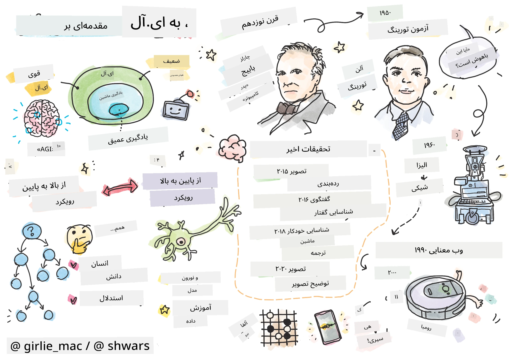
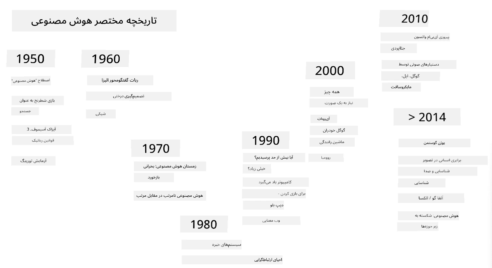
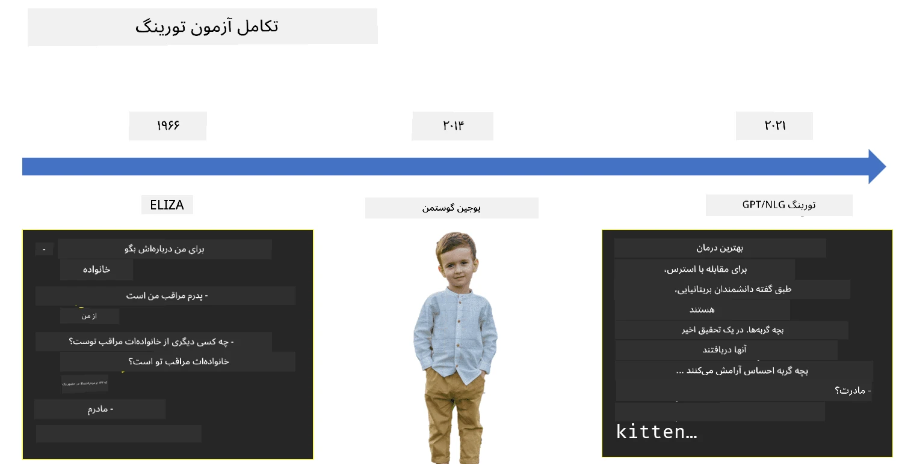

# مقدمه‌ای بر هوش مصنوعی

> طرح توسط [Tomomi Imura](https://twitter.com/girlie_mac)

## [آزمون پیش از درس](https://ff-quizzes.netlify.app/en/ai/quiz/1)

**هوش مصنوعی** یک رشته علمی هیجان‌انگیز است که بررسی می‌کند چگونه می‌توان کامپیوترها را به رفتار هوشمندانه واداشت، مثلاً انجام کارهایی که انسان‌ها در آن‌ها مهارت دارند.

در ابتدا، کامپیوترها توسط [چارلز ببیج](https://en.wikipedia.org/wiki/Charles_Babbage) برای کار با اعداد و اجرای یک فرآیند مشخص - یک الگوریتم - اختراع شدند. کامپیوترهای مدرن، با وجود پیشرفت‌های چشمگیر نسبت به مدل اولیه‌ای که در قرن نوزدهم پیشنهاد شد، همچنان بر اساس همان ایده محاسبات کنترل‌شده عمل می‌کنند. بنابراین، امکان برنامه‌ریزی کامپیوتر برای انجام کاری وجود دارد، اگر دقیقاً بدانیم که چه مراحل متوالی برای رسیدن به هدف لازم است.

> عکس توسط [Vickie Soshnikova](http://twitter.com/vickievalerie)

> ✅ تعیین سن یک فرد از روی عکس او کاری است که نمی‌توان آن را به‌طور صریح برنامه‌ریزی کرد، زیرا نمی‌دانیم چگونه عددی که در ذهنمان ظاهر می‌شود را به دست می‌آوریم.

---

با این حال، برخی وظایف وجود دارند که نمی‌دانیم چگونه به‌طور صریح آن‌ها را حل کنیم. به عنوان مثال، تعیین سن یک فرد از روی عکس او. ما به نوعی یاد می‌گیریم این کار را انجام دهیم، زیرا نمونه‌های زیادی از افراد در سنین مختلف دیده‌ایم، اما نمی‌توانیم به‌طور دقیق توضیح دهیم چگونه این کار را انجام می‌دهیم و نمی‌توانیم کامپیوتر را برای انجام آن برنامه‌ریزی کنیم. این دقیقاً نوع وظایفی است که برای **هوش مصنوعی** (AI) جالب است.

✅ به برخی وظایفی فکر کنید که می‌توانید به کامپیوتر واگذار کنید و از هوش مصنوعی بهره‌مند شوید. به حوزه‌های مالی، پزشکی و هنر فکر کنید - این حوزه‌ها چگونه امروز از هوش مصنوعی بهره می‌برند؟

## هوش مصنوعی ضعیف در مقابل هوش مصنوعی قوی

هوش مصنوعی ضعیف | هوش مصنوعی قوی
---------------------------------------|-------------------------------------
هوش مصنوعی ضعیف به سیستم‌های هوش مصنوعی اشاره دارد که برای یک وظیفه خاص یا مجموعه محدودی از وظایف طراحی و آموزش داده شده‌اند.|هوش مصنوعی قوی، یا هوش مصنوعی عمومی (AGI)، به سیستم‌های هوش مصنوعی با سطح هوش و درک انسانی اشاره دارد.
این سیستم‌های هوش مصنوعی به‌طور کلی هوشمند نیستند؛ آن‌ها در انجام یک وظیفه از پیش تعریف‌شده عالی عمل می‌کنند اما فاقد درک واقعی یا آگاهی هستند.|این سیستم‌های هوش مصنوعی توانایی انجام هر وظیفه فکری که انسان قادر به انجام آن است را دارند، می‌توانند به حوزه‌های مختلف سازگار شوند و دارای نوعی آگاهی یا خودآگاهی هستند.
نمونه‌هایی از هوش مصنوعی ضعیف شامل دستیارهای مجازی مانند Siri یا Alexa، الگوریتم‌های توصیه‌گر مورد استفاده در سرویس‌های پخش و چت‌بات‌هایی است که برای وظایف خاص خدمات مشتری طراحی شده‌اند.|دستیابی به هوش مصنوعی قوی هدف بلندمدت تحقیقات هوش مصنوعی است و نیازمند توسعه سیستم‌های هوش مصنوعی است که بتوانند استدلال کنند، یاد بگیرند، درک کنند و در طیف گسترده‌ای از وظایف و زمینه‌ها سازگار شوند.
هوش مصنوعی ضعیف بسیار تخصصی است و توانایی‌های شناختی شبیه انسان یا قابلیت‌های حل مسئله عمومی فراتر از حوزه محدود خود را ندارد.|هوش مصنوعی قوی در حال حاضر یک مفهوم نظری است و هیچ سیستم هوش مصنوعی به این سطح از هوش عمومی نرسیده است.

برای اطلاعات بیشتر به **[هوش مصنوعی عمومی](https://en.wikipedia.org/wiki/Artificial_general_intelligence)** (AGI) مراجعه کنید.

## تعریف هوش و آزمون تورینگ

یکی از مشکلات هنگام برخورد با اصطلاح **[هوش](https://en.wikipedia.org/wiki/Intelligence)** این است که تعریف واضحی از این اصطلاح وجود ندارد. می‌توان گفت که هوش به **تفکر انتزاعی** یا **خودآگاهی** مرتبط است، اما نمی‌توانیم آن را به‌طور دقیق تعریف کنیم.

> [عکس](https://unsplash.com/photos/75715CVEJhI) توسط [Amber Kipp](https://unsplash.com/@sadmax) از Unsplash

برای دیدن ابهام اصطلاح *هوش*، سعی کنید به این سوال پاسخ دهید: "آیا یک گربه هوشمند است؟". افراد مختلف تمایل دارند پاسخ‌های متفاوتی به این سوال بدهند، زیرا هیچ آزمون جهانی پذیرفته‌شده‌ای برای اثبات صحت این ادعا وجود ندارد. و اگر فکر می‌کنید وجود دارد - سعی کنید گربه خود را از طریق یک آزمون IQ عبور دهید...

✅ یک دقیقه فکر کنید که چگونه هوش را تعریف می‌کنید. آیا یک کلاغ که می‌تواند یک هزارتو را حل کند و به غذا برسد هوشمند است؟ آیا یک کودک هوشمند است؟

---

هنگام صحبت درباره AGI، باید راهی داشته باشیم تا بگوییم آیا یک سیستم واقعاً هوشمند ایجاد کرده‌ایم یا نه. [آلن تورینگ](https://en.wikipedia.org/wiki/Alan_Turing) روشی به نام **[آزمون تورینگ](https://en.wikipedia.org/wiki/Turing_test)** پیشنهاد کرد که همچنین به‌عنوان تعریفی از هوش عمل می‌کند. این آزمون یک سیستم را با چیزی ذاتاً هوشمند - یک انسان واقعی - مقایسه می‌کند، و چون هر مقایسه خودکار می‌تواند توسط یک برنامه کامپیوتری دور زده شود، از یک بازپرس انسانی استفاده می‌کنیم. بنابراین، اگر یک انسان نتواند بین یک شخص واقعی و یک سیستم کامپیوتری در گفتگوی متنی تفاوت قائل شود - سیستم هوشمند در نظر گرفته می‌شود.

> یک چت‌بات به نام [Eugene Goostman](https://en.wikipedia.org/wiki/Eugene_Goostman)، که در سن‌پترزبورگ توسعه داده شد، در سال ۲۰۱۴ با استفاده از یک ترفند شخصیتی هوشمندانه نزدیک به گذراندن آزمون تورینگ بود. این چت‌بات از ابتدا اعلام کرد که یک پسر ۱۳ ساله اوکراینی است، که کمبود دانش و برخی تناقضات در متن را توضیح می‌داد. این بات توانست ۳۰٪ از داوران را پس از یک گفتگوی ۵ دقیقه‌ای متقاعد کند که انسان است، معیاری که تورینگ معتقد بود یک ماشین تا سال ۲۰۰۰ قادر به گذراندن آن خواهد بود. با این حال، باید درک کرد که این نشان نمی‌دهد که ما یک سیستم هوشمند ایجاد کرده‌ایم، یا اینکه یک سیستم کامپیوتری بازپرس انسانی را فریب داده است - سیستم انسان‌ها را فریب نداد، بلکه سازندگان بات این کار را کردند!

✅ آیا تا به حال توسط یک چت‌بات فریب خورده‌اید که فکر کنید با یک انسان صحبت می‌کنید؟ چگونه شما را متقاعد کرد؟

## رویکردهای مختلف به هوش مصنوعی

اگر بخواهیم کامپیوتر مانند انسان رفتار کند، باید به نوعی روش تفکر خود را در داخل کامپیوتر مدل‌سازی کنیم. در نتیجه، باید سعی کنیم بفهمیم چه چیزی انسان را هوشمند می‌کند.

> برای اینکه بتوانیم هوش را در یک ماشین برنامه‌ریزی کنیم، باید بفهمیم فرآیندهای تصمیم‌گیری خودمان چگونه کار می‌کنند. اگر کمی خوداندیشی کنید، متوجه خواهید شد که برخی فرآیندها به‌طور ناخودآگاه اتفاق می‌افتند - مثلاً می‌توانیم بدون فکر کردن یک گربه را از یک سگ تشخیص دهیم - در حالی که برخی دیگر شامل استدلال هستند.

دو رویکرد ممکن برای این مشکل وجود دارد:

رویکرد بالا به پایین (استدلال نمادین) | رویکرد پایین به بالا (شبکه‌های عصبی)
---------------------------------------|-------------------------------------
رویکرد بالا به پایین روش استدلال یک فرد برای حل یک مشکل را مدل‌سازی می‌کند. این شامل استخراج **دانش** از یک انسان و نمایش آن به شکلی قابل خواندن توسط کامپیوتر است. همچنین باید راهی برای مدل‌سازی **استدلال** در داخل کامپیوتر توسعه دهیم. | رویکرد پایین به بالا ساختار مغز انسان را مدل‌سازی می‌کند، که شامل تعداد زیادی واحد ساده به نام **نورون** است. هر نورون مانند میانگین وزنی ورودی‌های خود عمل می‌کند، و می‌توانیم یک شبکه نورونی را برای حل مشکلات مفید با ارائه **داده‌های آموزشی** آموزش دهیم.

همچنین برخی رویکردهای دیگر به هوش وجود دارند:

* یک **رویکرد نوظهور**، **هم‌افزایی** یا **چندعاملی** بر اساس این واقعیت است که رفتار هوشمند پیچیده می‌تواند از تعامل تعداد زیادی عامل ساده به دست آید. طبق [سایبرنتیک تکاملی](https://en.wikipedia.org/wiki/Global_brain#Evolutionary_cybernetics)، هوش می‌تواند از رفتار واکنشی ساده‌تر در فرآیند **انتقال فراسیستم** *پدیدار شود*.

* یک **رویکرد تکاملی**، یا **الگوریتم ژنتیک** یک فرآیند بهینه‌سازی بر اساس اصول تکامل است.

ما این رویکردها را در ادامه دوره بررسی خواهیم کرد، اما در حال حاضر بر دو جهت اصلی تمرکز می‌کنیم: بالا به پایین و پایین به بالا.

### رویکرد بالا به پایین

در یک **رویکرد بالا به پایین**، ما سعی می‌کنیم استدلال خود را مدل‌سازی کنیم. چون می‌توانیم افکار خود را هنگام استدلال دنبال کنیم، می‌توانیم سعی کنیم این فرآیند را رسمی کنیم و آن را در داخل کامپیوتر برنامه‌ریزی کنیم. این به **استدلال نمادین** معروف است.

افراد تمایل دارند برخی قوانین در ذهن خود داشته باشند که فرآیندهای تصمیم‌گیری آن‌ها را هدایت می‌کند. به عنوان مثال، وقتی یک پزشک بیمار را تشخیص می‌دهد، ممکن است متوجه شود که فرد تب دارد، و بنابراین ممکن است التهاب در بدن وجود داشته باشد. با اعمال مجموعه بزرگی از قوانین به یک مشکل خاص، پزشک ممکن است بتواند به تشخیص نهایی برسد.

این رویکرد به شدت به **نمایش دانش** و **استدلال** متکی است. استخراج دانش از یک متخصص انسانی ممکن است دشوارترین بخش باشد، زیرا یک پزشک در بسیاری موارد دقیقاً نمی‌داند چرا به یک تشخیص خاص می‌رسد. گاهی اوقات راه‌حل فقط بدون تفکر صریح در ذهن او ظاهر می‌شود. برخی وظایف، مانند تعیین سن یک فرد از روی عکس، اصلاً نمی‌توانند به دستکاری دانش کاهش یابند.

### رویکرد پایین به بالا

به‌طور متناوب، می‌توانیم سعی کنیم ساده‌ترین عناصر داخل مغز خود - یک نورون - را مدل‌سازی کنیم. می‌توانیم یک **شبکه عصبی مصنوعی** در داخل کامپیوتر بسازیم، و سپس سعی کنیم آن را با دادن مثال‌ها برای حل مشکلات آموزش دهیم. این فرآیند مشابه نحوه یادگیری یک کودک تازه متولد شده درباره محیط اطراف خود با مشاهده است.

✅ کمی تحقیق کنید که نوزادان چگونه یاد می‌گیرند. عناصر پایه‌ای مغز یک نوزاد چیست؟

> | درباره یادگیری ماشین؟         |      |
> |--------------|-----------|
> | بخشی از هوش مصنوعی که بر اساس یادگیری کامپیوتر برای حل یک مشکل بر اساس برخی داده‌ها است، **یادگیری ماشین** نامیده می‌شود. ما یادگیری ماشین کلاسیک را در این دوره بررسی نمی‌کنیم - شما را به برنامه درسی جداگانه [یادگیری ماشین برای مبتدیان](http://aka.ms/ml-beginners) ارجاع می‌دهیم. |       |

## تاریخچه مختصر هوش مصنوعی

هوش مصنوعی به‌عنوان یک رشته در اواسط قرن بیستم آغاز شد. در ابتدا، استدلال نمادین یک رویکرد غالب بود و منجر به موفقیت‌های مهمی مانند سیستم‌های خبره - برنامه‌های کامپیوتری که قادر به عمل به‌عنوان یک متخصص در برخی حوزه‌های مشکل محدود بودند - شد. با این حال، به زودی مشخص شد که چنین رویکردی به خوبی مقیاس‌پذیر نیست. استخراج دانش از یک متخصص، نمایش آن در کامپیوتر، و حفظ پایگاه دانش دقیق، به یک وظیفه بسیار پیچیده و در بسیاری موارد بسیار پرهزینه تبدیل شد. این منجر به اصطلاح [زمستان هوش مصنوعی](https://en.wikipedia.org/wiki/AI_winter) در دهه ۱۹۷۰ شد.

> تصویر توسط [Dmitry Soshnikov](http://soshnikov.com)

با گذشت زمان، منابع محاسباتی ارزان‌تر شدند و داده‌های بیشتری در دسترس قرار گرفت، بنابراین رویکردهای شبکه عصبی شروع به نشان دادن عملکرد عالی در رقابت با انسان‌ها در بسیاری از زمینه‌ها، مانند بینایی کامپیوتر یا درک گفتار کردند. در دهه گذشته، اصطلاح هوش مصنوعی عمدتاً به‌عنوان مترادف شبکه‌های عصبی استفاده شده است، زیرا بیشتر موفقیت‌های هوش مصنوعی که درباره آن‌ها می‌شنویم بر اساس آن‌ها است.

می‌توانیم مشاهده کنیم که چگونه رویکردها تغییر کرده‌اند، به عنوان مثال، در ایجاد یک برنامه کامپیوتری بازی شطرنج:

* برنامه‌های اولیه شطرنج بر اساس جستجو بودند - یک برنامه به‌طور صریح سعی می‌کرد حرکات ممکن حریف را برای تعداد مشخصی از حرکات بعدی تخمین بزند و بر اساس موقعیت بهینه‌ای که می‌توان در چند حرکت به دست آورد، یک حرکت بهینه را انتخاب کند. این منجر به توسعه الگوریتم جستجوی [هرس آلفا-بتا](https://en.wikipedia.org/wiki/Alpha%E2%80%93beta_pruning) شد.
* استراتژی‌های جستجو در انتهای بازی که فضای جستجو محدود به تعداد کمی از حرکات ممکن است، خوب عمل می‌کنند. با این حال، در ابتدای بازی، فضای جستجو بسیار بزرگ است و الگوریتم می‌تواند با یادگیری از مسابقات موجود بین بازیکنان انسانی بهبود یابد. آزمایش‌های بعدی از چیزی به نام [استدلال مبتنی بر مورد](https://en.wikipedia.org/wiki/Case-based_reasoning) استفاده کردند، جایی که برنامه به دنبال مواردی در پایگاه دانش بسیار مشابه با موقعیت فعلی در بازی بود.
* برنامه‌های مدرن که بر بازیکنان انسانی غلبه می‌کنند، بر اساس شبکه‌های عصبی و [یادگیری تقویتی](https://en.wikipedia.org/wiki/Reinforcement_learning) هستند، جایی که برنامه‌ها تنها با بازی طولانی مدت علیه خودشان و یادگیری از اشتباهات خود یاد می‌گیرند - بسیار شبیه انسان‌ها هنگام یادگیری بازی شطرنج. با این حال، یک برنامه کامپیوتری می‌تواند بازی‌های بیشتری را در زمان بسیار کمتری انجام دهد و بنابراین می‌تواند بسیار سریع‌تر یاد بگیرد.

✅ کمی تحقیق کنید درباره بازی‌های دیگری که توسط هوش مصنوعی انجام شده‌اند.

به‌طور مشابه، می‌توانیم ببینیم که چگونه رویکرد به ایجاد "برنامه‌های گفت‌وگو" (که ممکن است آزمون تورینگ را بگذرانند) تغییر کرده است:

* برنامه‌های اولیه از این نوع مانند [Eliza](https://en.wikipedia.org/wiki/ELIZA)، بر اساس قوانین گرامری بسیار ساده و بازفرمول‌بندی جمله ورودی به یک سوال بودند.
* دستیارهای مدرن، مانند Cortana، Siri یا Google Assistant، همگی سیستم‌های ترکیبی هستند که از شبکه‌های عصبی برای تبدیل گفتار به متن و تشخیص قصد ما استفاده می‌کنند، و سپس از برخی استدلال‌ها یا الگوریتم‌های صریح برای انجام اقدامات مورد نیاز استفاده می‌کنند.
* در آینده، ممکن است انتظار داشته باشیم یک مدل کاملاً مبتنی بر شبکه عصبی بتواند به‌طور مستقل گفت‌وگو را مدیریت کند. خانواده اخیر GPT و [Turing-NLG](https://www.microsoft.com/research/blog/turing-nlg-a-17-billion-parameter-language-model-by-microsoft) از شبکه‌های عصبی موفقیت‌های بزرگی در این زمینه نشان داده‌اند.

> تصویر از Dmitry Soshnikov، [عکس](https://unsplash.com/photos/r8LmVbUKgns) توسط [Marina Abrosimova](https://unsplash.com/@abrosimova_marina_foto)، Unsplash

## تحقیقات اخیر در زمینه هوش مصنوعی

رشد چشمگیر تحقیقات شبکه‌های عصبی از حدود سال ۲۰۱۰ آغاز شد، زمانی که مجموعه‌های داده عمومی بزرگ در دسترس قرار گرفتند. مجموعه عظیمی از تصاویر به نام [ImageNet](https://en.wikipedia.org/wiki/ImageNet)، که شامل حدود ۱۴ میلیون تصویر حاشیه‌نویسی شده است، باعث ایجاد [چالش شناسایی بصری در مقیاس بزرگ ImageNet](https://image-net.org/challenges/LSVRC/) شد.

> تصویر از [Dmitry Soshnikov](http://soshnikov.com)

در سال ۲۰۱۲، [شبکه‌های عصبی کانولوشن](../4-ComputerVision/07-ConvNets/README.md) برای اولین بار در طبقه‌بندی تصاویر استفاده شدند، که منجر به کاهش قابل توجه خطاهای طبقه‌بندی شد (از تقریباً ۳۰٪ به ۱۶.۴٪). در سال ۲۰۱۵، معماری ResNet از Microsoft Research [به دقت در سطح انسانی دست یافت](https://doi.org/10.1109/ICCV.2015.123).

از آن زمان، شبکه‌های عصبی رفتار بسیار موفقی در بسیاری از وظایف نشان داده‌اند:

---

سال | دستیابی به برابری انسانی
-----|--------
۲۰۱۵ | [طبقه‌بندی تصاویر](https://doi.org/10.1109/ICCV.2015.123)
۲۰۱۶ | [تشخیص گفتار مکالمه‌ای](https://arxiv.org/abs/1610.05256)
۲۰۱۸ | [ترجمه ماشینی خودکار](https://arxiv.org/abs/1803.05567) (چینی به انگلیسی)
۲۰۲۰ | [توصیف تصاویر](https://arxiv.org/abs/2009.13682)

در چند سال گذشته شاهد موفقیت‌های چشمگیری با مدل‌های زبانی بزرگ مانند BERT و GPT-3 بوده‌ایم. این امر عمدتاً به دلیل وجود حجم زیادی از داده‌های متنی عمومی است که به ما امکان می‌دهد مدل‌ها را برای درک ساختار و معنای متن‌ها آموزش دهیم، آن‌ها را بر روی مجموعه‌های عمومی متن پیش‌آموزش دهیم و سپس این مدل‌ها را برای وظایف خاص‌تر تخصصی کنیم. در ادامه این دوره، درباره [پردازش زبان طبیعی](../5-NLP/README.md) بیشتر یاد خواهیم گرفت.

## 🚀 چالش

یک گشت و گذار در اینترنت انجام دهید تا مشخص کنید به نظر شما هوش مصنوعی در کجا به طور مؤثرتر استفاده می‌شود. آیا در یک اپلیکیشن نقشه‌برداری، یا یک سرویس تبدیل گفتار به متن، یا یک بازی ویدیویی؟ تحقیق کنید که این سیستم چگونه ساخته شده است.

## [آزمون پس از درس](https://ff-quizzes.netlify.app/en/ai/quiz/2)

## مرور و مطالعه شخصی

تاریخچه هوش مصنوعی و یادگیری ماشین را با مطالعه [این درس](https://github.com/microsoft/ML-For-Beginners/tree/main/1-Introduction/2-history-of-ML) مرور کنید. یکی از عناصر موجود در یادداشت تصویری در ابتدای آن درس یا این درس را انتخاب کنید و آن را به طور عمیق‌تر بررسی کنید تا زمینه فرهنگی که بر تکامل آن تأثیر گذاشته است را درک کنید.

**تکلیف**: [Game Jam](assignment.md)

---

<!-- CO-OP TRANSLATOR DISCLAIMER START -->
**سلب مسئولیت**:  
این سند با استفاده از سرویس ترجمه هوش مصنوعی [Co-op Translator](https://github.com/Azure/co-op-translator) ترجمه شده است. در حالی که ما تلاش می‌کنیم دقت را حفظ کنیم، لطفاً توجه داشته باشید که ترجمه‌های خودکار ممکن است شامل خطاها یا نادرستی‌ها باشند. سند اصلی به زبان اصلی آن باید به عنوان منبع معتبر در نظر گرفته شود. برای اطلاعات حیاتی، ترجمه حرفه‌ای انسانی توصیه می‌شود. ما مسئولیتی در قبال سوء تفاهم‌ها یا تفسیرهای نادرست ناشی از استفاده از این ترجمه نداریم.
<!-- CO-OP TRANSLATOR DISCLAIMER END -->