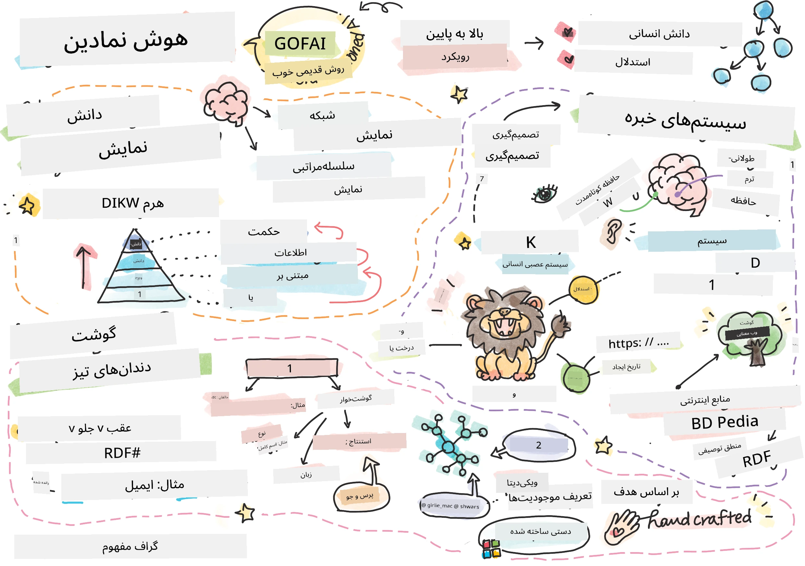
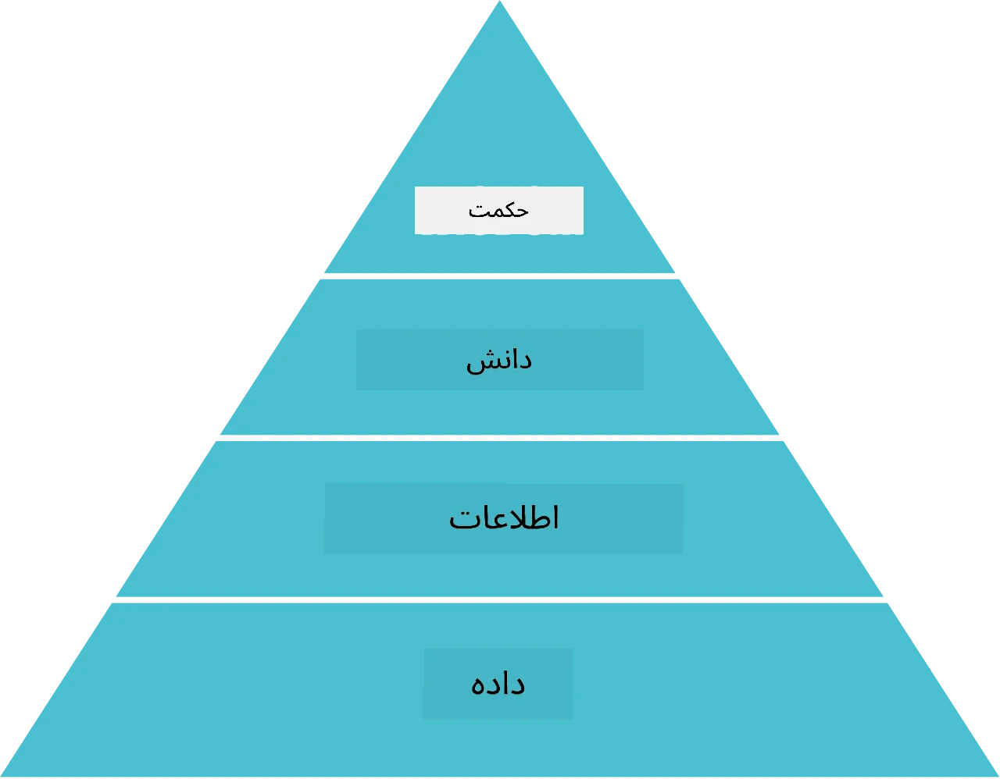
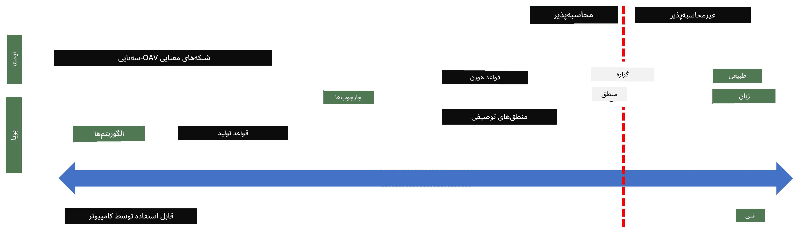
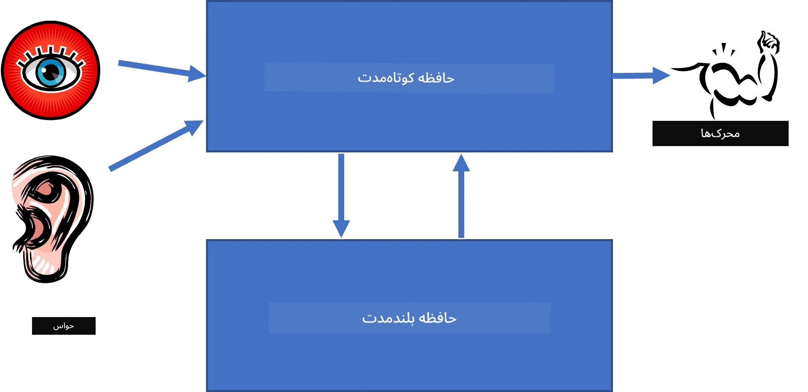
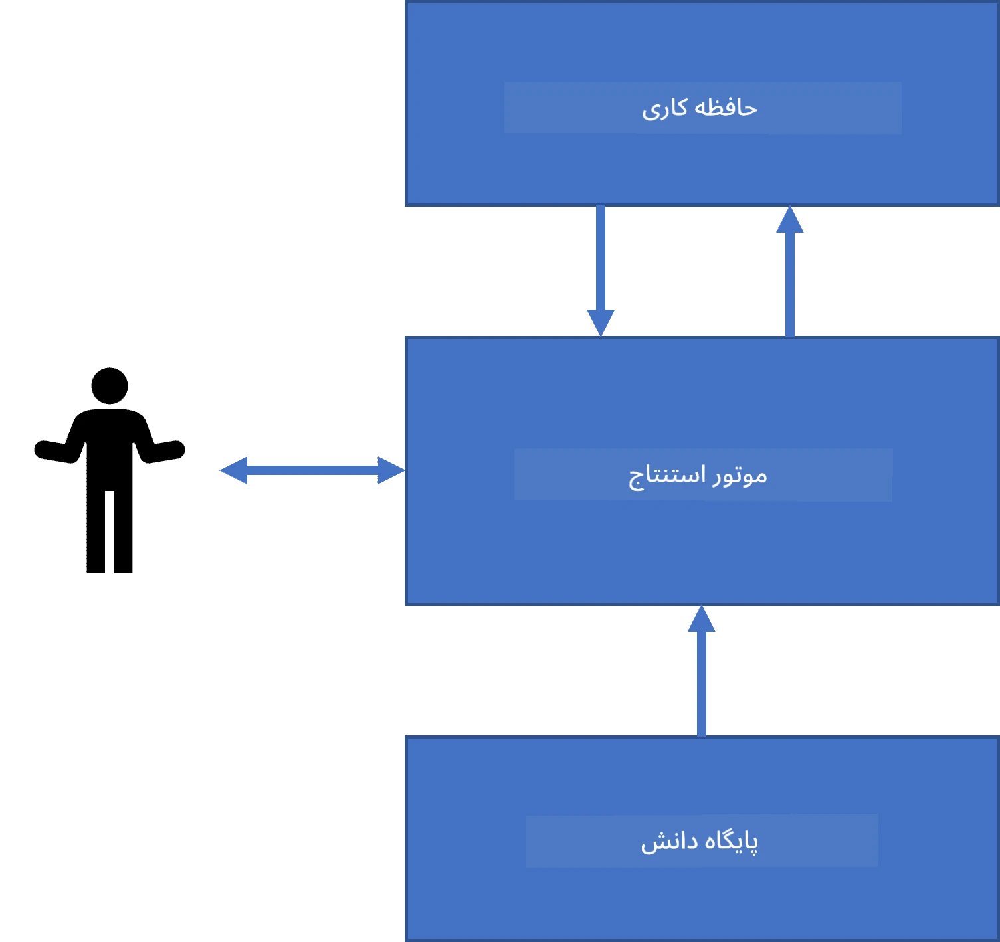
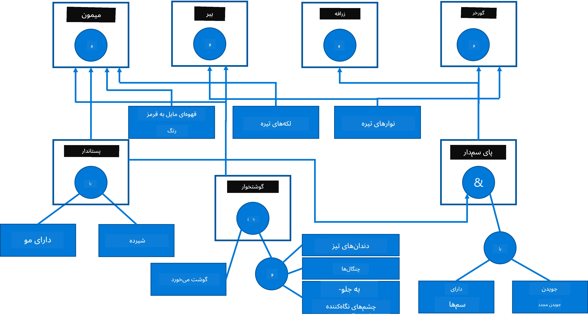
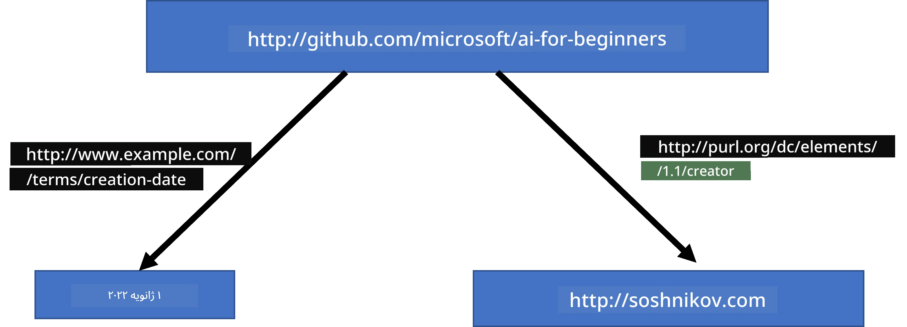
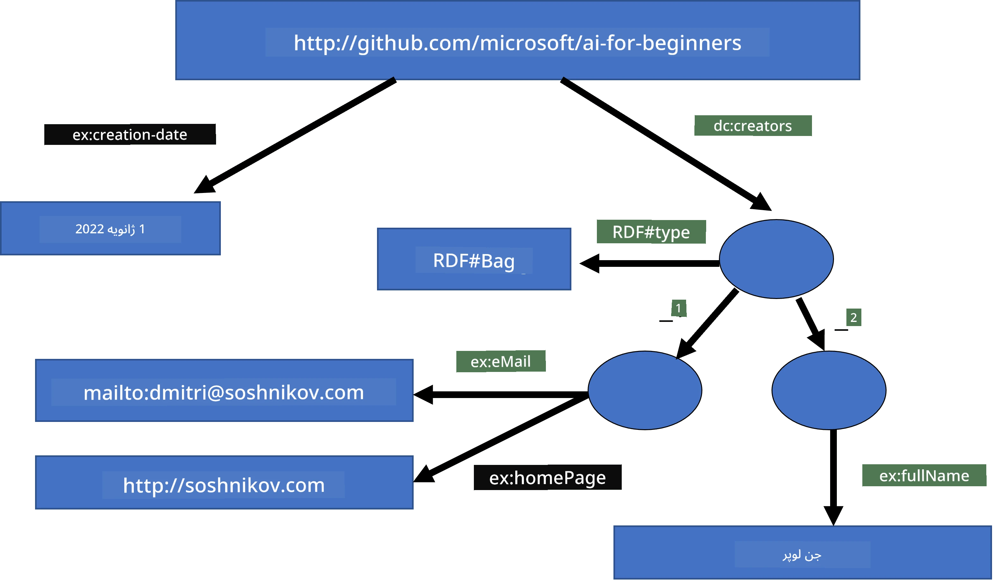
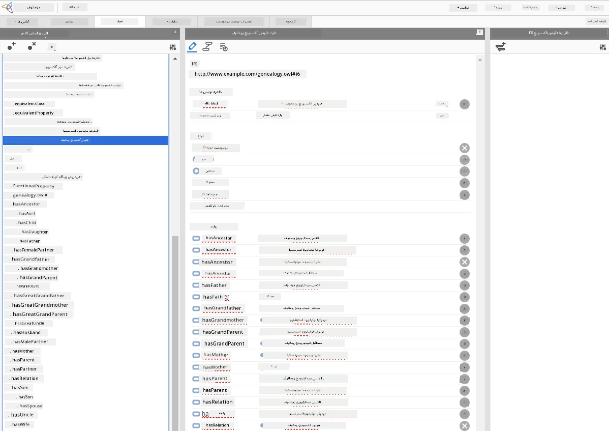

# نمایش دانش و سیستم‌های خبره



> اسکچ‌نوت توسط [Tomomi Imura](https://twitter.com/girlie_mac)

جستجو برای هوش مصنوعی بر اساس جستجوی دانش است، برای درک جهان مشابه به نحوی که انسان‌ها انجام می‌دهند. اما چگونه می‌توان این کار را انجام داد؟

## [آزمون پیش‌درس](https://ff-quizzes.netlify.app/en/ai/quiz/3)

در روزهای اولیه هوش مصنوعی، رویکرد از بالا به پایین برای ایجاد سیستم‌های هوشمند (که در درس قبلی بررسی شد) محبوب بود. ایده این بود که دانش را از افراد استخراج کرده و به فرم قابل خواندن توسط ماشین تبدیل کنیم و سپس به صورت خودکار برای حل مسائل استفاده کنیم. این رویکرد بر دو ایده بزرگ بنا شده بود:

* نمایش دانش
* استدلال

## نمایش دانش

یکی از مفاهیم مهم در هوش مصنوعی نمادین، **دانش** است. مهم است که دانش را از *اطلاعات* یا *داده‌ها* متمایز کنیم. برای مثال، می‌توان گفت کتاب‌ها حاوی دانش هستند، زیرا می‌توان با مطالعه آنها متخصص شد. اما در واقع آنچه کتاب‌ها دارند را *داده* می‌نامند، و با خواندن کتاب‌ها و یکپارچه‌سازی این داده‌ها در مدل جهان خود، این داده‌ها تبدیل به دانش می‌شوند.

> ✅ **دانش** چیزی است که در ذهن ما قراردارد و نمایانگر درک ما از جهان است. این دانش از فرایند فعال **یادگیری** حاصل می‌شود که قطعات اطلاعاتی که دریافت می‌کنیم را در مدل فعال ما از جهان ادغام می‌کند.

معمولاً دانش به طور دقیق تعریف نمی‌شود، اما با مفاهیم مرتبط دیگر با استفاده از [هرم DIKW](https://en.wikipedia.org/wiki/DIKW_pyramid) هماهنگ می‌شود. این هرم شامل مفاهیم زیر است:

* **داده** چیزی است که در رسانه‌های فیزیکی مانند متن نوشته شده یا کلمات گفته شده نمایش داده می‌شود. داده مستقل از انسان‌ها وجود دارد و می‌تواند بین افراد منتقل شود.
* **اطلاعات** نحوه تفسیر داده‌ها در ذهن ما است. به عنوان مثال، هنگامی که کلمه *کامپیوتر* را می‌شنویم، برخی درک‌ها از آن داریم.
* **دانش** اطلاعاتی است که در مدل جهان ما ادغام شده است. برای مثال، وقتی یاد می‌گیریم کامپیوتر چیست، شروع به داشتن ایده‌هایی درباره نحوه کارکرد، هزینه آن و کاربردهای آن می‌کنیم. این شبکه‌ای از مفاهیم مرتبط، دانش ما را شکل می‌دهد.
* **حکمت** سطح بالاتری از درک ما از جهان است و نمایانگر *فرادانش* است، مثلا یک برداشت درباره چگونگی و زمان استفاده از دانش.



*تصویر [از ویکی‌پدیا](https://commons.wikimedia.org/w/index.php?curid=37705247)، اثر Longlivetheux - کار خود، مجوز CC BY-SA 4.0*

بنابراین، مسئله **نمایش دانش** یافتن روش موثری برای نمایش دانش درون رایانه به شکل داده است تا به صورت خودکار قابل استفاده باشد. این را می‌توان به صورت یک طیف دید:



> تصویر توسط [Dmitry Soshnikov](http://soshnikov.com)

* سمت چپ، انواع ساده‌ای از نمایش دانش وجود دارد که می‌توانند به شکل موثری توسط رایانه‌ها استفاده شوند. ساده‌ترین آن الگوریتمی است، زمانی که دانش توسط یک برنامه کامپیوتری نمایش داده می‌شود. اما این بهترین روش نمایش دانش نیست چون انعطاف‌پذیر نیست. دانش در ذهن انسان اغلب غیرالگوریتمی است.
* سمت راست، نمایه‌هایی مانند متن طبیعی وجود دارند. این قوی‌ترین شکل است اما نمی‌توان از آن برای استدلال خودکار استفاده کرد.

> ✅ به یک دقیقه فکر کنید که دانش را چگونه در ذهنتان نمایش می‌دهید و آن را به یادداشت تبدیل می‌کنید. آیا قالب خاصی برای کمک به حفظ آن برای شما خوب عمل می‌کند؟

## دسته‌بندی روش‌های نمایش دانش در کامپیوتر

می‌توانیم روش‌های مختلف نمایش دانش در کامپیوتر را در دسته‌های زیر طبقه‌بندی کنیم:

* **نمایش‌های شبکه‌ای** بر این واقعیت تکیه دارند که ما یک شبکه از مفاهیم مرتبط در ذهن داریم. می‌توانیم همان شبکه‌ها را به صورت گرافی در کامپیوتر بازتولید کنیم - شبکه معنایی یا همان **semantic network**.

1. **سه‌تایی‌های شی-ویژگی-مقدار** یا **جفت‌های ویژگی-مقدار**. چون یک گراف می‌تواند در کامپیوتر به صورت فهرستی از گره‌ها و یال‌ها نمایش داده شود، می‌توانیم شبکه معنایی را با لیستی از سه‌تایی‌ها نمایش دهیم که شامل اشیاء، ویژگی‌ها و مقادیر هستند. برای مثال، سه‌تایی‌هایی درباره زبان‌های برنامه‌نویسی ایجاد می‌کنیم:

شیء | ویژگی | مقدار
-------|-----------|------
Python | است | زبان بدون نوع
Python | اختراع شده توسط | گویدو وان روسوم
Python | نحو بلاک | تورفتگی
زبان بدون نوع | ندارد | تعریف نوع

> ✅ فکر کنید چگونه می‌توان از سه‌تایی‌ها برای نمایش سایر انواع دانش استفاده کرد.

2. **نمایش‌های سلسله‌مراتبی** بر این واقعیت تأکید دارند که اغلب در ذهن خود سلسله‌مراتبی از اشیاء ایجاد می‌کنیم. برای مثال، می‌دانیم که قناری یک پرنده است و همه پرندگان بال دارند. همچنین ایده‌ای درباره رنگ معمول یک قناری و سرعت پرواز آن داریم.

   - **نمایش قاب** بر اساس نمایش هر شیء یا کلاس از اشیاء به عنوان **قاب** است که شامل **شکاف‌ها** (slots) است. شکاف‌ها مقادیر پیش‌فرض ممکن، محدودیت‌های مقداری یا رویه‌های ذخیره‌شده دارند که می‌توان برای دریافت مقدار شکاف فراخوانی کرد. همه قاب‌ها سلسله‌مراتبی مانند سلسله‌مراتب اشیاء در برنامه‌نویسی شیءگرا تشکیل می‌دهند.
   - **سناریوها** نوع خاصی از قاب‌ها هستند که وضعیت‌های پیچیده‌ای را که می‌توانند در زمان رخ دهند، نمایش می‌دهند.

**Python**

شکاف | مقدار | مقدار پیش‌فرض | بازه |
-----|-------|---------------|----------|
نام | Python | | |
نوع | زبان بدون نوع | | |
حالت متغیر | | CamelCase | |
طول برنامه | | | ۵-۵۰۰۰ خط |
نحو بلاک | تورفتگی | | |

3. **نمایش‌های رویه‌ای** بر بازنمایی دانش به صورت فهرستی از اعمالی که می‌توانند هنگام وقوع شرایط خاص اجرا شوند، مبتنی‌اند.
   - قوانین تولید، جملات شرط-آنگاه هستند که به ما اجازه می‌دهند به نتیجه برسیم. برای مثال، یک پزشک ممکن است قانونی داشته باشد که بگوید **اگر** بیمار تب بالا **یا** سطح بالای پروتئین واکنشی C در آزمایش خون دارد **آنگاه** او التهاب دارد. وقتی یکی از شرایط رخ دهد، می‌توانیم نتیجه‌گیری کنیم و سپس آن را در استدلال‌های بعدی استفاده کنیم.
   - الگوریتم‌ها می‌توانند شکل دیگری از نمایش رویه‌ای باشند، گرچه تقریباً هرگز مستقیماً در سیستم‌های مبتنی بر دانش استفاده نمی‌شوند.

4. **منطق** در اصل توسط ارسطو پیشنهاد شد به عنوان روشی برای نمایش دانش جهانی انسان.
   - منطق گزاره‌ای به عنوان یک نظریه ریاضی بسیار غنی است و نمی‌تواند کاملاً محاسبه‌ای باشد، بنابراین زیرمجموعه‌ای از آن معمولاً استفاده می‌شود مانند قاعده‌های Horn که در Prolog استفاده می‌شوند.
   - منطق توصیفی خانواده‌ای از سیستم‌های منطقی است که برای نمایش و استدلال درباره سلسله‌مراتب اشیاء در نمایش‌های دانش توزیع شده مانند *وب معنایی* استفاده می‌شود.

## سیستم‌های خبره

یکی از موفقیت‌های اولیه هوش مصنوعی نمادین، سیستم‌های خبره نام داشتند - سیستم‌های کامپیوتری که برای عمل کردن به عنوان کارشناس در حوزه‌های محدود طراحی شده بودند. آنها بر پایه **پایگاه دانش** استخراج شده از یک یا چند متخصص انسانی ساخته شده بودند و دارای **موتور استنتاج** بودند که روی آن مقداری استدلال انجام می‌داد.

 | 
---------------------------------------------|------------------------------------------------
ساختار ساده‌شده سیستم عصبی انسان | معماری سیستم مبتنی بر دانش

سیستم‌های خبره مانند سیستم استدلال انسانی ساخته می‌شوند، که شامل **حافظه کوتاه‌مدت** و **حافظه بلندمدت** است. مشابه آن، در سیستم‌های مبتنی بر دانش اجزای زیر را تمایز می‌دهیم:

* **حافظه مسئله**: شامل دانش درباره مسئله‌ای است که در حال حاضر حل می‌شود، مانند دما یا فشار خون بیمار، آیا التهاب دارد یا خیر و غیره. این دانش همچنین به عنوان **دانش ایستا** خوانده می‌شود، زیرا نمایه‌ای از آنچه هم‌اکنون درباره مسئله می‌دانیم را در بر دارد - به اصطلاح *وضعیت مسئله*.
* **پایگاه دانش**: دانش بلندمدت درباره حوزه مسئله را نمایش می‌دهد. آن به صورت دستی از متخصصین انسانی استخراج شده و از مشاوره‌ای تا مشاوره‌ای تغییر نمی‌کند. چون به ما اجازه می‌دهد بین وضعیت‌های مسئله حرکت کنیم، به آن **دانش دینامیک** نیز گفته می‌شود.
* **موتور استنتاج**: کل فرایند جستجو در فضای وضعیت مسئله را هماهنگ می‌کند و در صورت لزوم از کاربر سوال می‌پرسد. همچنین مسئول یافتن قوانین درست برای اعمال روی هر وضعیت است.

به عنوان مثال، سیستم خبره زیر را در نظر بگیرید که حیوانی را بر اساس ویژگی‌های فیزیکی‌اش تعیین می‌کند:



> تصویر توسط [Dmitry Soshnikov](http://soshnikov.com)

این نمودار به نام **درخت AND-OR** شناخته می‌شود و نمایش گرافیکی مجموعه‌ای از قوانین تولید است. رسم درخت در ابتدای استخراج دانش از کارشناس مفید است. اما برای نمایش دانش در کامپیوتر، استفاده از قوانین راحت‌تر است:

```
IF the animal eats meat
OR (animal has sharp teeth
    AND animal has claws
    AND animal has forward-looking eyes
) 
THEN the animal is a carnivore
```

می‌توانید توجه کنید که هر شرط در سمت چپ قانون و عمل در اصل، سه‌تایی شی-ویژگی-مقدار (OAV) هستند. **حافظه کاری** شامل مجموعه سه‌تایی‌های OAV است که مربوط به مسئله‌ای که در حال حاضر حل می‌شود، می‌باشد. یک **موتور قوانین** به دنبال قوانینی می‌گردد که شرط آنها برقرار است و اعمالشان می‌کند و سه‌تایی جدیدی به حافظه کاری اضافه می‌کند.

> ✅ یک درخت AND-OR خودتان درباره موضوعی که دوست دارید رسم کنید!

### استنتاج پیشرو در مقابل استنتاج بازگشتی

فرایند توصیف‌شده در بالا، **استنتاج پیشرو** نامیده می‌شود. این فرایند با داده‌های اولیه موجود در حافظه کاری شروع می‌شود و سپس حلقه استدلال زیر را اجرا می‌کند:

1. اگر ویژگی هدف در حافظه کاری موجود باشد - متوقف شده و نتیجه را می‌دهد
2. به دنبال تمام قوانینی می‌گردد که شرط آنها در آن لحظه برقرار است - و **مجموعه تضاد** قوانین را به دست می‌آورد.
3. **حل تضاد** را انجام می‌دهد - قانونی را انتخاب می‌کند که در این مرحله اجرا شود. ممکن است استراتژی‌های مختلفی برای حل تضاد وجود داشته باشد:
   - انتخاب اولین قانونی که در پایگاه دانش قابل اجراست
   - انتخاب قانون به صورت تصادفی
   - انتخاب قانونی *خاص‌تر*، یعنی قانونی که بیشترین شروط را در سمت چپ (LHS) برآورده می‌کند
4. قانون انتخاب شده را اعمال کرده و قطعه دانش جدیدی به وضعیت مسئله اضافه می‌کند
5. از مرحله 1 تکرار می‌کند.

اما در برخی موارد ممکن است بخواهیم با دانش خالی درباره مسئله شروع کنیم و سوالاتی بپرسیم که ما را به نتیجه برسانند. برای مثال، در انجام تشخیص پزشکی، معمولاً تمام آزمایشات پزشکی را از قبل انجام نمی‌دهیم. بلکه وقتی تصمیمی باید گرفته شود، آزمایش انجام می‌دهیم.

این فرایند می‌تواند با استفاده از **استنتاج بازگشتی** مدل شود. این فرایند توسط **هدف** هدایت می‌شود - مقدار ویژگی که می‌خواهیم پیدا کنیم:

1. همه قوانینی که می‌توانند مقدار هدف را به ما بدهند (یعنی با هدف در سمت راست قانون (RHS)) انتخاب می‌شوند - یک مجموعه تضاد
1. اگر هیچ قانونی برای این ویژگی وجود نداشته باشد، یا قانونی بیان کند که باید از کاربر پرسیده شود - از کاربر پرسیده می‌شود، در غیر این صورت:
1. با استفاده از استراتژی حل تضاد، یک قانون انتخاب می‌شود که به عنوان *فرضیه* استفاده شود - تلاش می‌شود اثبات شود
1. این فرایند به صورت بازگشتی برای همه ویژگی‌های در سمت چپ قانون (LHS) تکرار می‌شود تا آنها را به عنوان اهداف اثبات کند
1. اگر در هر مرحله فرایند شکست خورد - قانون دیگری در مرحله 3 انتخاب می‌شود.

> ✅ در چه موقعیت‌هایی استنتاج پیشرو مناسب‌تر است؟ درباره استنتاج بازگشتی چطور؟

### پیاده‌سازی سیستم‌های خبره

سیستم‌های خبره می‌توانند با ابزارهای مختلفی پیاده‌سازی شوند:

* برنامه‌نویسی مستقیم آنها در زبان‌های برنامه‌نویسی سطح بالا. این بهترین ایده نیست، زیرا اصلی‌ترین مزیت سیستم‌های مبتنی بر دانش این است که دانش از استنتاج جداست و احتمالاً کارشناس حوزه مسئله می‌تواند بدون درک جزئیات فرایند استنتاج قوانین را بنویسد.
* استفاده از **پوسته سیستم خبره**، یعنی سیستمی که به طور خاص برای جمع‌آوری دانش با استفاده از یک زبان نمایش دانش طراحی شده است.

## ✍️ تمرین: استنتاج حیوان

مثال پیاده‌سازی سیستم خبره استنتاج پیشرو و بازگشتی را در [Animals.ipynb](https://github.com/microsoft/AI-For-Beginners/blob/main/lessons/2-Symbolic/Animals.ipynb) ببینید.

> **توجه**: این مثال نسبتاً ساده است و فقط ایده کلی سیستم خبره را نشان می‌دهد. وقتی شروع به ساخت چنین سیستمی کنید، تنها پس از رسیدن به تعداد مشخصی قوانین، حدود ۲۰۰+، رفتار *هوشمند* آن را متوجه خواهید شد. در نقطه‌ای، قوانین آنقدر پیچیده می‌شوند که حفظ همه آنها دشوار است و در آن زمان ممکن است بپرسید چرا سیستم تصمیمات خاصی می‌گیرد. با این حال، ویژگی مهم سیستم‌های مبتنی بر دانش این است که همیشه می‌توانید *توضیح دهید* دقیقاً چگونه هر یک از تصمیمات گرفته شده است.

## هستی‌شناسی‌ها و وب معنایی

در پایان قرن بیستم، ابتکاری برای استفاده از نمایش دانش برای حاشیه‌نویسی منابع اینترنتی مطرح شد، تا بتوان منابع مرتبط با پرسش‌های بسیار خاص را یافت. این حرکت به نام **وب معنایی** شناخته شد و بر چند مفهوم تکیه داشت:

- یک نمایش دانش خاص بر اساس **[منطق‌های توصیفی](https://en.wikipedia.org/wiki/Description_logic)** (DL). این نمایش مشابه نمایش قاب است، زیرا سلسله‌مراتبی از اشیاء با خواص می‌سازد، اما دارای معناشناسی منطقی رسمی و استنتاج است. خانواده‌ای از DL‌ها وجود دارد که تعادل بین بیان‌گری و پیچیدگی الگوریتمی استنتاج را برقرار می‌کنند.
- نمایش دانش توزیع شده، جایی که همه مفاهیم به وسیله شناسگر URI جهانی نمایش داده می‌شوند، که امکان ایجاد سلسله‌مراتب دانش در سراسر اینترنت را ممکن می‌سازد.
- خانواده‌ای از زبان‌های مبتنی بر XML برای توصیف دانش: RDF (چارچوب توصیف منابع)، RDFS (طرحواره RDF)، OWL (زبان معناشناسی وب).

یک مفهوم اساسی در وب معنایی، مفهوم **وجودشناسی** است. این اشاره به مشخصه صریح یک حوزه مسئله با استفاده از نمایشی رسمی از دانش دارد. ساده‌ترین وجودشناسی می‌تواند فقط یک سلسله‌مراتب از اشیاء در حوزه مسئله باشد، اما وجودشناسی‌های پیچیده‌تر شامل قوانینی هستند که می‌توان از آنها برای استنتاج استفاده کرد.

در وب معنایی، همه نمایش‌ها بر اساس سه‌تایی‌ها هستند. هر شیء و هر رابطه به طور یکتا توسط URI شناخته می‌شوند. به عنوان مثال، اگر بخواهیم بیان کنیم که این برنامه درسی هوش مصنوعی توسط دیمیتری سوشنیکوف در ۱ ژانویه ۲۰۲۲ توسعه یافته است - سه‌تایی‌های زیر را می‌توانیم استفاده کنیم:



```
http://github.com/microsoft/ai-for-beginners http://www.example.com/terms/creation-date “Jan 1, 2022”
http://github.com/microsoft/ai-for-beginners http://purl.org/dc/elements/1.1/creator http://soshnikov.com
```

> ✅ در اینجا `http://www.example.com/terms/creation-date` و `http://purl.org/dc/elements/1.1/creator` برخی از URIهای شناخته شده و پذیرفته شده جهانی برای بیان مفاهیم *خالق* و *تاریخ ساخت* هستند.

در مورد پیچیده‌تر، اگر بخواهیم لیستی از خالقان را تعریف کنیم، می‌توانیم از برخی ساختارهای داده‌ای تعریف شده در RDF استفاده کنیم.



> نمودارهای بالا توسط [دیمیتری سوشنیکوف](http://soshnikov.com)

پیشرفت ساخت وب معنایی تا حدودی توسط موفقیت موتورهای جستجو و تکنیک‌های پردازش زبان طبیعی که اجازه استخراج داده‌های ساخت‌یافته از متن را می‌دهند، کند شده است. با این حال، در برخی حوزه‌ها هنوز تلاش‌های قابل توجهی برای نگهداری وجودشناسی‌ها و پایگاه‌های دانش انجام می‌شود. چند پروژه قابل اشاره:

* [WikiData](https://wikidata.org/) مجموعه‌ای از پایگاه‌های دانش قابل خواندن توسط ماشین متصل به ویکی‌پدیا است. بیشتر داده‌ها از *اطلاعات ساختیافته* داخل صفحات ویکی‌پدیا استخراج شده است. می‌توانید با زبان خاص پرسشگری وب معنایی به نام SPARQL [از ویکی‌دیتا پرسش کنید](https://query.wikidata.org/). در اینجا یک نمونه پرسش که رایج‌ترین رنگ‌های چشم انسان‌ها را نمایش می‌دهد:

```sparql
#defaultView:BubbleChart
SELECT ?eyeColorLabel (COUNT(?human) AS ?count)
WHERE
{
  ?human wdt:P31 wd:Q5.       # human instance-of homo sapiens
  ?human wdt:P1340 ?eyeColor. # human eye-color ?eyeColor
  SERVICE wikibase:label { bd:serviceParam wikibase:language "en". }
}
GROUP BY ?eyeColorLabel
```

* [DBpedia](https://www.dbpedia.org/) تلاشی مشابه ویکی‌دیتا است.

> ✅ اگر می‌خواهید در ساخت وجودشناسی‌های خود آزمایش کنید یا وجودشناسی‌های موجود را باز کنید، یک ویرایشگر وجودشناسی بصری عالی به نام [Protégé](https://protege.stanford.edu/) وجود دارد. آن را دانلود کنید یا به صورت آنلاین استفاده کنید.



*ویرایشگر وب Protégé با وجودشناسی خانواده رومانوف باز شده است. عکس از دیمیتری سوشنیکوف*

## ✍️ تمرین: وجودشناسی خانواده

نمونه‌ای از استفاده از تکنیک‌های وب معنایی برای استدلال درباره روابط خانوادگی را در [FamilyOntology.ipynb](https://github.com/Ezana135/AI-For-Beginners/blob/main/lessons/2-Symbolic/FamilyOntology.ipynb) ببینید. ما یک شجره‌نامه خانوادگی که در فرمت متداول GEDCOM نمایش داده شده و یک وجودشناسی از روابط خانوادگی را گرفته و گرافی از همه روابط خانوادگی برای مجموعه‌ای از افراد را می‌سازیم.

## Microsoft Concept Graph

در بیشتر موارد، وجودشناسی‌ها به صورت دقیق و دستی ایجاد می‌شوند. با این حال، امکان **استخراج** وجودشناسی‌ها از داده‌های بدون ساختار، مثلاً متون زبان طبیعی، نیز وجود دارد.

یکی از این تلاش‌ها توسط تحقیقات مایکروسافت انجام شد که منجر به [Microsoft Concept Graph](https://blogs.microsoft.com/ai/microsoft-researchers-release-graph-that-helps-machines-conceptualize/?WT.mc_id=academic-77998-cacaste) گردید.

این یک مجموعه بزرگ از موجودیت‌ها است که با استفاده از رابطه وراثت `is-a` گروه‌بندی شده‌اند. این امکان را می‌دهد که به سوالاتی مانند «مایکروسافت چیست؟» جواب دهید - پاسخ چیزی مانند «یک شرکت با احتمال ۰.۸۷ و یک برند با احتمال ۰.۷۵» است.

این گراف یا به صورت REST API در دسترس است و یا به صورت یک فایل متنی بزرگ قابل دانلود که شامل تمام جفت‌های موجودیت است.

## ✍️ تمرین: گراف مفهومی

دفترچه [MSConceptGraph.ipynb](https://github.com/microsoft/AI-For-Beginners/blob/main/lessons/2-Symbolic/MSConceptGraph.ipynb) را امتحان کنید تا ببینید چگونه می‌توان از Microsoft Concept Graph برای گروه‌بندی مقالات خبری در چند دسته استفاده کرد.

## نتیجه‌گیری

امروزه، هوش مصنوعی اغلب مترادف با *یادگیری ماشین* یا *شبکه‌های عصبی* در نظر گرفته می‌شود. با این حال، انسان همچنین استدلال صریح را نشان می‌دهد، که چیزی است که در حال حاضر شبکه‌های عصبی به آن نمی‌پردازند. در پروژه‌های دنیای واقعی، استدلال صریح هنوز برای انجام کارهایی که نیاز به توضیح دارند یا توانایی اصلاح رفتار سیستم به صورت کنترل شده، استفاده می‌شود.

## 🚀 چالش

در دفترچه وجودشناسی خانواده که همراه این درس است، فرصت تجربی با روابط دیگر خانوادگی وجود دارد. سعی کنید ارتباطات جدیدی بین افراد در شجره خانواده کشف کنید.

## [آزمون پس از درس](https://ff-quizzes.netlify.app/en/ai/quiz/4)

## مرور و خودآموزی

کمی در اینترنت تحقیق کنید تا حوزه‌هایی را کشف کنید که انسان‌ها سعی کرده‌اند دانش را کمّی و کدگذاری کنند. نگاهی به طبقه‌بندی بلوم بیندازید، و به تاریخچه بازگردید تا ببینید چگونه انسان‌ها سعی کرده‌اند جهان خود را معنا کنند. آثار لینئوس برای ایجاد طبقه‌بندی موجودات را بررسی کنید، و مشاهده کنید چگونه دیمیتری مندلیف روشی برای توصیف و گروه‌بندی عناصر شیمیایی ایجاد کرد. چه نمونه‌های جالب دیگری می‌توانید بیابید؟

**تکلیف**: [ساخت یک وجودشناسی](assignment.md)

---

<!-- CO-OP TRANSLATOR DISCLAIMER START -->
**سلب مسئولیت**:  
این سند با استفاده از سرویس ترجمه هوش مصنوعی [Co-op Translator](https://github.com/Azure/co-op-translator) ترجمه شده است. در حالی که ما در تلاش برای دقت هستیم، لطفاً به این نکته توجه داشته باشید که ترجمه‌های خودکار ممکن است حاوی خطا یا نادرستی باشند. سند اصلی به زبان بومی خود باید به عنوان منبع معتبر در نظر گرفته شود. برای اطلاعات حیاتی، ترجمه حرفه‌ای انسانی توصیه می‌شود. ما مسئول هیچ گونه سوءتفاهم یا تعبیر نادرست ناشی از استفاده از این ترجمه نیستیم.
<!-- CO-OP TRANSLATOR DISCLAIMER END -->