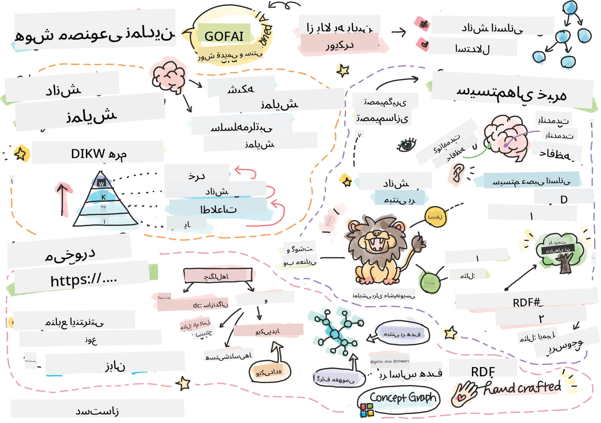
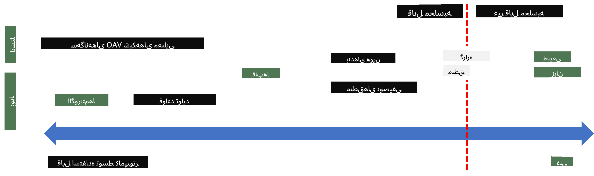

<!--
CO_OP_TRANSLATOR_METADATA:
{
  "original_hash": "7d097f7fda9166ead615e4c34552381b",
  "translation_date": "2025-09-23T12:30:26+00:00",
  "source_file": "lessons/2-Symbolic/README.md",
  "language_code": "fa"
}
-->
# نمایش دانش و سیستم‌های خبره



> یادداشت تصویری توسط [Tomomi Imura](https://twitter.com/girlie_mac)

جستجوی هوش مصنوعی بر اساس یافتن دانش است، به منظور درک جهان به شیوه‌ای مشابه انسان‌ها. اما چگونه می‌توان این کار را انجام داد؟

## [آزمون پیش از درس](https://ff-quizzes.netlify.app/en/ai/quiz/3)

در روزهای اولیه هوش مصنوعی، رویکرد بالا به پایین برای ایجاد سیستم‌های هوشمند (که در درس قبلی مورد بحث قرار گرفت) محبوب بود. ایده این بود که دانش را از افراد استخراج کرده و به شکلی قابل خواندن توسط ماشین تبدیل کنیم و سپس از آن برای حل خودکار مسائل استفاده کنیم. این رویکرد بر اساس دو ایده بزرگ بود:

* نمایش دانش  
* استدلال  

## نمایش دانش

یکی از مفاهیم مهم در هوش مصنوعی نمادین، **دانش** است. مهم است که دانش را از *اطلاعات* یا *داده‌ها* متمایز کنیم. به عنوان مثال، می‌توان گفت که کتاب‌ها حاوی دانش هستند، زیرا می‌توان با مطالعه کتاب‌ها به یک متخصص تبدیل شد. با این حال، آنچه کتاب‌ها در واقع حاوی آن هستند *داده* نامیده می‌شود، و با خواندن کتاب‌ها و ادغام این داده‌ها در مدل جهانی خود، این داده‌ها را به دانش تبدیل می‌کنیم.

> ✅ **دانش** چیزی است که در ذهن ما وجود دارد و نمایانگر درک ما از جهان است. این دانش از طریق یک فرآیند فعال **یادگیری** به دست می‌آید که قطعات اطلاعاتی که دریافت می‌کنیم را در مدل فعال جهانی ما ادغام می‌کند.

اغلب، ما دانش را به طور دقیق تعریف نمی‌کنیم، بلکه آن را با مفاهیم مرتبط دیگر با استفاده از [هرم DIKW](https://en.wikipedia.org/wiki/DIKW_pyramid) هماهنگ می‌کنیم. این هرم شامل مفاهیم زیر است:

* **داده** چیزی است که در رسانه‌های فیزیکی مانند متن نوشته شده یا کلمات گفته شده نمایش داده می‌شود. داده مستقل از انسان‌ها وجود دارد و می‌تواند بین افراد منتقل شود.
* **اطلاعات** نحوه تفسیر داده‌ها در ذهن ما است. به عنوان مثال، وقتی کلمه *کامپیوتر* را می‌شنویم، درک خاصی از آن داریم.
* **دانش** اطلاعاتی است که در مدل جهانی ما ادغام شده است. به عنوان مثال، وقتی یاد می‌گیریم کامپیوتر چیست، شروع به داشتن ایده‌هایی درباره نحوه کارکرد آن، هزینه آن و کاربردهای آن می‌کنیم. این شبکه از مفاهیم مرتبط، دانش ما را تشکیل می‌دهد.
* **حکمت** یک سطح بالاتر از درک ما از جهان است و نمایانگر *فرا-دانش* است، مانند مفهومی درباره نحوه و زمان استفاده از دانش.


*تصویر [از ویکی‌پدیا](https://commons.wikimedia.org/w/index.php?curid=37705247)، توسط Longlivetheux - اثر خود، CC BY-SA 4.0*

بنابراین، مسئله **نمایش دانش** یافتن راهی مؤثر برای نمایش دانش در داخل یک کامپیوتر به شکل داده است، به طوری که بتوان از آن به صورت خودکار استفاده کرد. این مسئله را می‌توان به صورت یک طیف مشاهده کرد:



> تصویر توسط [Dmitry Soshnikov](http://soshnikov.com)

* در سمت چپ، انواع بسیار ساده‌ای از نمایش دانش وجود دارد که می‌توان به طور مؤثر توسط کامپیوترها استفاده کرد. ساده‌ترین نوع آن الگوریتمی است، زمانی که دانش توسط یک برنامه کامپیوتری نمایش داده می‌شود. با این حال، این بهترین روش برای نمایش دانش نیست، زیرا انعطاف‌پذیر نیست. دانش در ذهن ما اغلب غیر الگوریتمی است.
* در سمت راست، نمایش‌هایی مانند متن طبیعی وجود دارد. این نوع نمایش قدرتمندترین است، اما نمی‌توان از آن برای استدلال خودکار استفاده کرد.

> ✅ یک دقیقه فکر کنید که چگونه دانش را در ذهن خود نمایش می‌دهید و آن را به یادداشت تبدیل می‌کنید. آیا قالب خاصی وجود دارد که برای شما در حفظ اطلاعات بهتر عمل کند؟

## دسته‌بندی نمایش‌های دانش کامپیوتری

ما می‌توانیم روش‌های مختلف نمایش دانش کامپیوتری را در دسته‌های زیر طبقه‌بندی کنیم:

* **نمایش‌های شبکه‌ای** بر اساس این واقعیت هستند که ما یک شبکه از مفاهیم مرتبط در ذهن خود داریم. می‌توانیم تلاش کنیم همین شبکه‌ها را به صورت یک گراف در داخل کامپیوتر بازتولید کنیم - یک **شبکه معنایی**.

1. **سه‌گانه‌های شیء-ویژگی-مقدار** یا **جفت‌های ویژگی-مقدار**. از آنجا که یک گراف می‌تواند در داخل کامپیوتر به صورت لیستی از گره‌ها و لبه‌ها نمایش داده شود، می‌توانیم یک شبکه معنایی را با لیستی از سه‌گانه‌ها نمایش دهیم که شامل اشیاء، ویژگی‌ها و مقادیر است. به عنوان مثال، سه‌گانه‌های زیر را درباره زبان‌های برنامه‌نویسی می‌سازیم:

شیء | ویژگی | مقدار  
----|--------|------  
پایتون | است | زبان بدون نوع  
پایتون | اختراع شده توسط | Guido van Rossum  
پایتون | نحو بلوک | تورفتگی  
زبان بدون نوع | ندارد | تعریف نوع  

> ✅ فکر کنید که چگونه می‌توان از سه‌گانه‌ها برای نمایش انواع دیگر دانش استفاده کرد.

2. **نمایش‌های سلسله‌مراتبی** بر این واقعیت تأکید دارند که ما اغلب یک سلسله‌مراتب از اشیاء در ذهن خود ایجاد می‌کنیم. به عنوان مثال، می‌دانیم که قناری یک پرنده است و همه پرندگان بال دارند. همچنین ایده‌ای درباره رنگ معمولی قناری و سرعت پرواز آن داریم.

   - **نمایش قاب** بر اساس نمایش هر شیء یا کلاس اشیاء به صورت یک **قاب** است که شامل **شکاف‌ها** می‌شود. شکاف‌ها ممکن است مقادیر پیش‌فرض، محدودیت‌های مقدار یا رویه‌های ذخیره شده داشته باشند که می‌توانند برای به دست آوردن مقدار یک شکاف فراخوانی شوند. همه قاب‌ها یک سلسله‌مراتب مشابه سلسله‌مراتب اشیاء در زبان‌های برنامه‌نویسی شیء‌گرا تشکیل می‌دهند.
   - **سناریوها** نوع خاصی از قاب‌ها هستند که موقعیت‌های پیچیده‌ای را که ممکن است در طول زمان رخ دهند نمایش می‌دهند.

**پایتون**

شکاف | مقدار | مقدار پیش‌فرض | بازه  
-----|-------|---------------|------  
نام | پایتون | |  
است | زبان بدون نوع | |  
حالت متغیر | | CamelCase |  
طول برنامه | | | ۵-۵۰۰۰ خط  
نحو بلوک | تورفتگی | |  

3. **نمایش‌های رویه‌ای** بر اساس نمایش دانش به صورت لیستی از اقدامات هستند که می‌توانند زمانی که یک شرط خاص رخ می‌دهد اجرا شوند.
   - قوانین تولیدی، عبارات اگر-آنگاه هستند که به ما اجازه می‌دهند نتیجه‌گیری کنیم. به عنوان مثال، یک پزشک ممکن است قانونی داشته باشد که می‌گوید **اگر** بیمار تب بالا **یا** سطح بالای پروتئین C-reactive در آزمایش خون داشته باشد **آنگاه** او التهاب دارد. هنگامی که یکی از شرایط رخ دهد، می‌توانیم نتیجه‌گیری کنیم و سپس از آن در استدلال‌های بعدی استفاده کنیم.
   - الگوریتم‌ها می‌توانند به عنوان نوع دیگری از نمایش رویه‌ای در نظر گرفته شوند، اگرچه تقریباً هرگز به طور مستقیم در سیستم‌های مبتنی بر دانش استفاده نمی‌شوند.

4. **منطق** در ابتدا توسط ارسطو به عنوان روشی برای نمایش دانش جهانی انسان پیشنهاد شد.
   - منطق گزاره‌ای به عنوان یک نظریه ریاضی بسیار غنی است و قابل محاسبه نیست، بنابراین معمولاً از یک زیرمجموعه آن استفاده می‌شود، مانند بندهای Horn که در Prolog استفاده می‌شوند.
   - منطق توصیفی خانواده‌ای از سیستم‌های منطقی است که برای نمایش و استدلال درباره سلسله‌مراتب اشیاء و نمایش‌های دانش توزیع شده مانند *وب معنایی* استفاده می‌شود.

## سیستم‌های خبره

یکی از موفقیت‌های اولیه هوش مصنوعی نمادین، **سیستم‌های خبره** بود - سیستم‌های کامپیوتری که طراحی شده بودند تا به عنوان یک متخصص در یک حوزه محدود عمل کنند. این سیستم‌ها بر اساس یک **پایگاه دانش** استخراج شده از یک یا چند متخصص انسانی بودند و شامل یک **موتور استنتاج** بودند که بر اساس آن استدلال انجام می‌داد.

 |   
---------------------------------------------|------------------------------------------------  
ساختار ساده‌شده سیستم عصبی انسان | معماری یک سیستم مبتنی بر دانش  

سیستم‌های خبره مشابه سیستم استدلال انسانی ساخته شده‌اند که شامل **حافظه کوتاه‌مدت** و **حافظه بلندمدت** است. به طور مشابه، در سیستم‌های مبتنی بر دانش، اجزای زیر را متمایز می‌کنیم:

* **حافظه مسئله**: شامل دانش درباره مسئله‌ای است که در حال حاضر حل می‌شود، مانند دما یا فشار خون بیمار، اینکه آیا او التهاب دارد یا نه، و غیره. این دانش همچنین **دانش ایستا** نامیده می‌شود، زیرا شامل یک عکس فوری از آنچه در حال حاضر درباره مسئله می‌دانیم است - به اصطلاح *وضعیت مسئله*.
* **پایگاه دانش**: نمایانگر دانش بلندمدت درباره یک حوزه مسئله است. این دانش به صورت دستی از متخصصان انسانی استخراج می‌شود و از مشاوره‌ای به مشاوره دیگر تغییر نمی‌کند. از آنجا که به ما اجازه می‌دهد از یک وضعیت مسئله به وضعیت دیگر حرکت کنیم، همچنین **دانش پویا** نامیده می‌شود.
* **موتور استنتاج**: فرآیند جستجو در فضای وضعیت مسئله را هماهنگ می‌کند و در صورت لزوم از کاربر سوال می‌پرسد. همچنین مسئول یافتن قوانین مناسب برای اعمال در هر وضعیت است.

به عنوان مثال، بیایید سیستم خبره‌ای را در نظر بگیریم که بر اساس ویژگی‌های فیزیکی یک حیوان را تعیین می‌کند:


> تصویر توسط [Dmitry Soshnikov](http://soshnikov.com)

این نمودار **درخت AND-OR** نامیده می‌شود و یک نمایش گرافیکی از مجموعه‌ای از قوانین تولیدی است. رسم یک درخت در ابتدای استخراج دانش از متخصص مفید است. برای نمایش دانش در داخل کامپیوتر، استفاده از قوانین راحت‌تر است:

```
IF the animal eats meat
OR (animal has sharp teeth
    AND animal has claws
    AND animal has forward-looking eyes
) 
THEN the animal is a carnivore
```
  
می‌توانید متوجه شوید که هر شرط در سمت چپ قانون و عمل اساساً سه‌گانه‌های شیء-ویژگی-مقدار (OAV) هستند. **حافظه کاری** شامل مجموعه‌ای از سه‌گانه‌های OAV است که با مسئله‌ای که در حال حاضر حل می‌شود مطابقت دارند. **موتور قوانین** به دنبال قوانینی می‌گردد که شرط آن‌ها برآورده شده باشد و آن‌ها را اعمال می‌کند، و یک سه‌گانه جدید به حافظه کاری اضافه می‌کند.

> ✅ درخت AND-OR خود را درباره موضوعی که دوست دارید رسم کنید!

### استنتاج پیشرو در مقابل استنتاج پسرو

فرآیند توصیف شده در بالا **استنتاج پیشرو** نامیده می‌شود. این فرآیند با برخی داده‌های اولیه درباره مسئله موجود در حافظه کاری شروع می‌شود و سپس حلقه استدلال زیر را اجرا می‌کند:

1. اگر ویژگی هدف در حافظه کاری موجود باشد - متوقف شوید و نتیجه را بدهید  
2. به دنبال تمام قوانینی بگردید که شرط آن‌ها در حال حاضر برآورده شده است - مجموعه تضاد قوانین را به دست آورید  
3. **حل تضاد** را انجام دهید - یک قانون را انتخاب کنید که در این مرحله اجرا شود. ممکن است استراتژی‌های مختلفی برای حل تضاد وجود داشته باشد:  
   - انتخاب اولین قانون قابل اجرا در پایگاه دانش  
   - انتخاب یک قانون تصادفی  
   - انتخاب یک قانون *خاص‌تر*، یعنی قانونی که بیشترین شرایط را در سمت چپ (LHS) برآورده کند  
4. قانون انتخاب شده را اعمال کنید و یک قطعه جدید از دانش را به وضعیت مسئله اضافه کنید  
5. از مرحله 1 تکرار کنید  

با این حال، در برخی موارد ممکن است بخواهیم با دانش خالی درباره مسئله شروع کنیم و سوالاتی بپرسیم که به ما کمک کند به نتیجه برسیم. به عنوان مثال، هنگام انجام تشخیص پزشکی، معمولاً همه آزمایش‌های پزشکی را از قبل انجام نمی‌دهیم قبل از شروع تشخیص بیمار. بلکه می‌خواهیم آزمایش‌ها را زمانی انجام دهیم که نیاز به تصمیم‌گیری باشد.

این فرآیند را می‌توان با استفاده از **استنتاج پسرو** مدل‌سازی کرد. این فرآیند توسط **هدف** هدایت می‌شود - مقدار ویژگی که به دنبال یافتن آن هستیم:

1. تمام قوانینی را انتخاب کنید که می‌توانند مقدار یک هدف را به ما بدهند (یعنی با هدف در سمت راست (RHS)) - مجموعه تضاد  
1. اگر هیچ قانونی برای این ویژگی وجود نداشته باشد، یا قانونی وجود داشته باشد که می‌گوید باید مقدار را از کاربر بپرسیم - از کاربر بپرسید، در غیر این صورت:  
1. از استراتژی حل تضاد برای انتخاب یک قانون که به عنوان *فرضیه* استفاده خواهد شد استفاده کنید - سعی می‌کنیم آن را اثبات کنیم  
1. فرآیند را به صورت بازگشتی برای همه ویژگی‌های موجود در سمت چپ قانون تکرار کنید، سعی کنید آن‌ها را به عنوان اهداف اثبات کنید  
1. اگر در هر نقطه فرآیند شکست خورد - از قانون دیگری در مرحله 3 استفاده کنید  

> ✅ در چه شرایطی استنتاج پیشرو مناسب‌تر است؟ استنتاج پسرو چطور؟

### پیاده‌سازی سیستم‌های خبره

سیستم‌های خبره را می‌توان با استفاده از ابزارهای مختلف پیاده‌سازی کرد:

* برنامه‌نویسی مستقیم آن‌ها در یک زبان برنامه‌نویسی سطح بالا. این بهترین ایده نیست، زیرا مزیت اصلی یک سیستم مبتنی بر دانش این است که دانش از استنتاج جدا شده است و به طور بالقوه یک متخصص حوزه مسئله باید بتواند قوانین را بدون درک جزئیات فرآیند استنتاج بنویسد.  
* استفاده از **پوسته سیستم‌های خبره**، یعنی سیستمی که به طور خاص طراحی شده است تا با استفاده از یک زبان نمایش دانش پر شود.

## ✍️ تمرین: استنتاج حیوانات

به [Animals.ipynb](https://github.com/microsoft/AI-For-Beginners/blob/main/lessons/2-Symbolic/Animals.ipynb) مراجعه کنید برای نمونه‌ای از پیاده‌سازی سیستم خبره استنتاج پیشرو و پسرو.

> **توجه**: این مثال نسبتاً ساده است و فقط ایده‌ای از شکل یک سیستم خبره ارائه می‌دهد. هنگامی که شروع به ایجاد چنین سیستمی می‌کنید، تنها زمانی ممکن است برخی رفتارهای *هوشمندانه* از آن مشاهده کنید که به تعداد مشخصی از قوانین، حدود ۲۰۰+ برسید. در یک نقطه، قوانین بسیار پیچیده می‌شوند تا بتوان همه آن‌ها را در ذهن نگه داشت، و در این نقطه ممکن است شروع به تعجب کنید که چرا سیستم تصمیمات خاصی می‌گیرد. با این حال، ویژگی مهم سیستم‌های مبتنی بر دانش این است که شما همیشه می‌توانید *توضیح دهید* که چگونه هر یک از تصمیمات گرفته شده است.

## هستی‌شناسی‌ها و وب معنایی

در پایان قرن بیستم، یک ابتکار برای استفاده از نمایش دانش برای توضیح منابع اینترنتی وجود داشت، به طوری که امکان یافتن منابعی که با پرسش‌های بسیار خاص مطابقت دارند فراهم شود. این حرکت **وب معنایی** نامیده شد و بر چند مفهوم متکی بود:

- یک نمایش دانش خاص بر اساس **[منطق توصیفی](https://en.wikipedia.org/wiki/Description_logic)** (DL). این نمایش مشابه نمایش دانش قاب است، زیرا یک سلسله‌مراتب از اشیاء با ویژگی‌ها ایجاد می‌کند، اما دارای معناشناسی منطقی رسمی و استنتاج است. یک خانواده کامل از DL‌ها وجود دارد که بین بیان‌پذیری و پیچیدگی الگوریتمی استنتاج تعادل برقرار می‌کنند.  
- نمایش دانش توزیع شده، جایی که همه مفاهیم توسط یک شناسه URI جهانی نمایش داده می‌شوند، که امکان ایجاد سلسله‌مراتب دانش را که اینترنت را پوشش می‌دهد فراهم می‌کند.  
- خانواده‌ای از زبان‌های مبتنی بر XML برای توصیف دانش: RDF (چارچوب توصیف منابع)، RDFS (طرح‌واره RDF)، OWL (زبان وب هستی‌شناسی).

یکی از مفاهیم اصلی در وب معنایی، مفهوم **هستی‌شناسی** است. هستی‌شناسی به مشخصات صریح یک حوزه مسئله با استفاده از نوعی نمایش دانش رسمی اشاره دارد. ساده‌ترین هستی‌شناسی می‌تواند فقط یک سلسله‌مراتب از اشیاء در یک حوزه مسئله باشد، اما هستی‌شناسی‌های پیچیده‌تر شامل قوانینی خواهند بود که می‌توانند برای استنتاج استفاده شوند.

در وب معنایی، تمام نمایش‌ها بر اساس سه‌گانه‌ها هستند. هر شیء و هر رابطه به‌طور منحصربه‌فرد توسط URI شناسایی می‌شود. به‌عنوان مثال، اگر بخواهیم بیان کنیم که این برنامه درسی هوش مصنوعی توسط Dmitry Soshnikov در تاریخ ۱ ژانویه ۲۰۲۲ توسعه داده شده است، اینجا سه‌گانه‌هایی است که می‌توانیم استفاده کنیم:


```
http://github.com/microsoft/ai-for-beginners http://www.example.com/terms/creation-date “Jan 13, 2007”
http://github.com/microsoft/ai-for-beginners http://purl.org/dc/elements/1.1/creator http://soshnikov.com
```

> ✅ در اینجا `http://www.example.com/terms/creation-date` و `http://purl.org/dc/elements/1.1/creator` برخی URI‌های شناخته‌شده و جهانی هستند که برای بیان مفاهیم *سازنده* و *تاریخ ایجاد* استفاده می‌شوند.

در یک مورد پیچیده‌تر، اگر بخواهیم لیستی از سازندگان تعریف کنیم، می‌توانیم از برخی ساختارهای داده تعریف‌شده در RDF استفاده کنیم.


> نمودارهای بالا توسط [Dmitry Soshnikov](http://soshnikov.com)

پیشرفت در ساخت وب معنایی تا حدی به دلیل موفقیت موتورهای جستجو و تکنیک‌های پردازش زبان طبیعی که امکان استخراج داده‌های ساختاریافته از متن را فراهم می‌کنند، کند شد. با این حال، در برخی حوزه‌ها هنوز تلاش‌های قابل‌توجهی برای حفظ هستی‌شناسی‌ها و پایگاه‌های دانش وجود دارد. چند پروژه قابل توجه:

* [WikiData](https://wikidata.org/) مجموعه‌ای از پایگاه‌های دانش قابل خواندن توسط ماشین است که با ویکی‌پدیا مرتبط هستند. بیشتر داده‌ها از *InfoBoxes* ویکی‌پدیا استخراج می‌شوند، بخش‌هایی از محتوای ساختاریافته در صفحات ویکی‌پدیا. شما می‌توانید [WikiData را در SPARQL](https://query.wikidata.org/)، یک زبان پرس‌وجوی ویژه برای وب معنایی، جستجو کنید. اینجا یک نمونه پرس‌وجو است که محبوب‌ترین رنگ‌های چشم در میان انسان‌ها را نمایش می‌دهد:

```sparql
#defaultView:BubbleChart
SELECT ?eyeColorLabel (COUNT(?human) AS ?count)
WHERE
{
  ?human wdt:P31 wd:Q5.       # human instance-of homo sapiens
  ?human wdt:P1340 ?eyeColor. # human eye-color ?eyeColor
  SERVICE wikibase:label { bd:serviceParam wikibase:language "en". }
}
GROUP BY ?eyeColorLabel
```

* [DBpedia](https://www.dbpedia.org/) تلاش دیگری مشابه WikiData است.

> ✅ اگر می‌خواهید با ساخت هستی‌شناسی‌های خودتان یا باز کردن هستی‌شناسی‌های موجود آزمایش کنید، یک ویرایشگر بصری عالی هستی‌شناسی به نام [Protégé](https://protege.stanford.edu/) وجود دارد. آن را دانلود کنید یا به‌صورت آنلاین استفاده کنید.


*ویرایشگر وب Protégé باز شده با هستی‌شناسی خانواده رومانوف. تصویر توسط Dmitry Soshnikov*

## ✍️ تمرین: هستی‌شناسی خانواده

به [FamilyOntology.ipynb](https://github.com/Ezana135/AI-For-Beginners/blob/main/lessons/2-Symbolic/FamilyOntology.ipynb) مراجعه کنید تا نمونه‌ای از استفاده از تکنیک‌های وب معنایی برای استنتاج روابط خانوادگی را ببینید. ما یک شجره‌نامه خانوادگی که در قالب رایج GEDCOM نمایش داده شده است و یک هستی‌شناسی از روابط خانوادگی را می‌گیریم و یک گراف از تمام روابط خانوادگی برای مجموعه‌ای از افراد مشخص می‌سازیم.

## گراف مفهومی مایکروسافت

در بیشتر موارد، هستی‌شناسی‌ها با دقت توسط انسان ایجاد می‌شوند. با این حال، همچنین امکان **استخراج** هستی‌شناسی‌ها از داده‌های غیرساختاریافته، به‌عنوان مثال، از متون زبان طبیعی وجود دارد.

یکی از این تلاش‌ها توسط Microsoft Research انجام شد و منجر به [Microsoft Concept Graph](https://blogs.microsoft.com/ai/microsoft-researchers-release-graph-that-helps-machines-conceptualize/?WT.mc_id=academic-77998-cacaste) شد.

این گراف مجموعه بزرگی از موجودیت‌ها است که با استفاده از رابطه ارث‌بری `is-a` گروه‌بندی شده‌اند. این گراف امکان پاسخ به سوالاتی مانند "مایکروسافت چیست؟" را فراهم می‌کند - پاسخی مانند "یک شرکت با احتمال ۰.۸۷ و یک برند با احتمال ۰.۷۵".

این گراف یا به‌صورت REST API در دسترس است یا به‌صورت یک فایل متنی بزرگ قابل دانلود که تمام جفت‌های موجودیت را فهرست می‌کند.

## ✍️ تمرین: یک گراف مفهومی

دفترچه [MSConceptGraph.ipynb](https://github.com/microsoft/AI-For-Beginners/blob/main/lessons/2-Symbolic/MSConceptGraph.ipynb) را امتحان کنید تا ببینید چگونه می‌توانیم از گراف مفهومی مایکروسافت برای گروه‌بندی مقالات خبری در چند دسته استفاده کنیم.

## نتیجه‌گیری

امروزه، هوش مصنوعی اغلب به‌عنوان مترادف *یادگیری ماشین* یا *شبکه‌های عصبی* در نظر گرفته می‌شود. با این حال، انسان‌ها همچنین استدلال صریح را نشان می‌دهند، چیزی که در حال حاضر توسط شبکه‌های عصبی مدیریت نمی‌شود. در پروژه‌های دنیای واقعی، استدلال صریح هنوز برای انجام وظایفی که نیاز به توضیحات دارند یا توانایی تغییر رفتار سیستم به‌صورت کنترل‌شده دارند، استفاده می‌شود.

## 🚀 چالش

در دفترچه هستی‌شناسی خانواده مرتبط با این درس، فرصتی برای آزمایش با روابط دیگر خانوادگی وجود دارد. سعی کنید ارتباطات جدیدی بین افراد در شجره‌نامه خانوادگی کشف کنید.

## [آزمون پس از درس](https://ff-quizzes.netlify.app/en/ai/quiz/4)

## مرور و مطالعه خودآموز

تحقیقی در اینترنت انجام دهید تا حوزه‌هایی را کشف کنید که انسان‌ها تلاش کرده‌اند دانش را کمی‌سازی و کدگذاری کنند. به طبقه‌بندی بلوم نگاهی بیندازید و به تاریخ برگردید تا ببینید چگونه انسان‌ها تلاش کرده‌اند دنیای خود را درک کنند. کار Linnaeus را برای ایجاد یک طبقه‌بندی از موجودات بررسی کنید و نحوه‌ای که Dmitri Mendeleev راهی برای توصیف و گروه‌بندی عناصر شیمیایی ایجاد کرد را مشاهده کنید. چه مثال‌های جالب دیگری می‌توانید پیدا کنید؟

**تکلیف**: [ساخت یک هستی‌شناسی](assignment.md)

---

