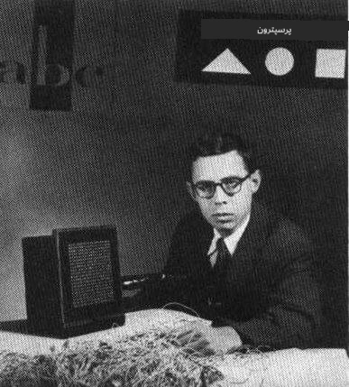
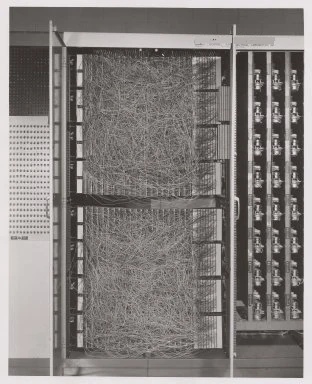

# مقدمه‌ای بر شبکه‌های عصبی: پرسپترون

## [پیش‌آزمون](https://ff-quizzes.netlify.app/en/ai/quiz/5)

یکی از اولین تلاش‌ها برای پیاده‌سازی چیزی مشابه شبکه‌های عصبی مدرن توسط فرانک روزنبلات از آزمایشگاه هوانوردی کورنل در سال ۱۹۵۷ انجام شد. این یک پیاده‌سازی سخت‌افزاری به نام "Mark-1" بود که برای شناسایی اشکال هندسی ابتدایی مانند مثلث‌ها، مربع‌ها و دایره‌ها طراحی شده بود.

|      |      |
|--------------|-----------|
| | |

> تصاویر [از ویکی‌پدیا](https://en.wikipedia.org/wiki/Perceptron)

یک تصویر ورودی توسط آرایه‌ای از ۲۰x۲۰ سلول‌های نوری نمایش داده می‌شد، بنابراین شبکه عصبی دارای ۴۰۰ ورودی و یک خروجی دودویی بود. یک شبکه ساده شامل یک نورون بود که به آن **واحد منطقی آستانه‌ای** نیز گفته می‌شود. وزن‌های شبکه عصبی مانند پتانسیومتر عمل می‌کردند که در مرحله آموزش نیاز به تنظیم دستی داشتند.

> ✅ پتانسیومتر دستگاهی است که به کاربر اجازه می‌دهد مقاومت یک مدار را تنظیم کند.

> نیویورک تایمز در آن زمان درباره پرسپترون نوشت: *جنین یک کامپیوتر الکترونیکی که [نیروی دریایی] انتظار دارد بتواند راه برود، صحبت کند، ببیند، بنویسد، خود را تکثیر کند و از وجود خود آگاه باشد.*

## مدل پرسپترون

فرض کنید در مدل ما N ویژگی وجود دارد، که در این صورت بردار ورودی یک بردار به اندازه N خواهد بود. پرسپترون یک مدل **دسته‌بندی دودویی** است، یعنی می‌تواند بین دو کلاس داده ورودی تمایز قائل شود. فرض می‌کنیم که برای هر بردار ورودی x خروجی پرسپترون ما یا +۱ یا -۱ باشد، بسته به کلاس داده. خروجی با استفاده از فرمول زیر محاسبه می‌شود:

y(x) = f(w<sup>T</sup>x)

که در آن f یک تابع فعال‌سازی پله‌ای است.

<!-- img src="http://www.sciweavers.org/tex2img.php?eq=f%28x%29%20%3D%20%5Cbegin%7Bcases%7D%0A%20%20%20%20%20%20%20%20%20%2B1%20%26%20x%20%5Cgeq%200%20%5C%5C%0A%20%20%20%20%20%20%20%20%20-1%20%26%20x%20%3C%200%0A%20%20%20%20%20%20%20%5Cend%7Bcases%7D%20%5C%5C%0A&bc=White&fc=Black&im=jpg&fs=12&ff=arev&edit=0" align="center" border="0" alt="f(x) = \begin{cases} +1 & x \geq 0 \\ -1 & x < 0 \end{cases} \\" width="154" height="50" / -->


## آموزش پرسپترون

برای آموزش یک پرسپترون، باید بردار وزن w را پیدا کنیم که اکثر مقادیر را به درستی دسته‌بندی کند، یعنی منجر به کمترین **خطا** شود. این خطا E با استفاده از **معیار پرسپترون** به صورت زیر تعریف می‌شود:

E(w) = -&sum;w<sup>T</sup>x<sub>i</sub>t<sub>i</sub>

که در آن:

* جمع بر روی نقاط داده آموزشی i که منجر به دسته‌بندی اشتباه می‌شوند، انجام می‌شود.
* x<sub>i</sub> داده ورودی است و t<sub>i</sub> برای مثال‌های منفی و مثبت به ترتیب -۱ یا +۱ است.

این معیار به عنوان تابعی از وزن‌ها w در نظر گرفته می‌شود و ما باید آن را کمینه کنیم. اغلب از روشی به نام **گرادیان نزولی** استفاده می‌شود، که در آن با وزن‌های اولیه w<sup>(0)</sup> شروع می‌کنیم و سپس در هر مرحله وزن‌ها را طبق فرمول زیر به‌روزرسانی می‌کنیم:

w<sup>(t+1)</sup> = w<sup>(t)</sup> - &eta;&nabla;E(w)

در اینجا &eta; نرخ یادگیری نامیده می‌شود و &nabla;E(w) گرادیان E را نشان می‌دهد. پس از محاسبه گرادیان، به فرمول زیر می‌رسیم:

w<sup>(t+1)</sup> = w<sup>(t)</sup> + &sum;&eta;x<sub>i</sub>t<sub>i</sub>

الگوریتم در زبان پایتون به این صورت است:

```python
def train(positive_examples, negative_examples, num_iterations = 100, eta = 1):

    weights = [0,0,0] # Initialize weights (almost randomly :)
        
    for i in range(num_iterations):
        pos = random.choice(positive_examples)
        neg = random.choice(negative_examples)

        z = np.dot(pos, weights) # compute perceptron output
        if z < 0: # positive example classified as negative
            weights = weights + eta*weights.shape

        z  = np.dot(neg, weights)
        if z >= 0: # negative example classified as positive
            weights = weights - eta*weights.shape

    return weights
```


## نتیجه‌گیری

در این درس، شما درباره پرسپترون که یک مدل دسته‌بندی دودویی است، و نحوه آموزش آن با استفاده از بردار وزن‌ها یاد گرفتید.

## 🚀 چالش

اگر دوست دارید پرسپترون خود را بسازید، این [آزمایشگاه در Microsoft Learn](https://docs.microsoft.com/en-us/azure/machine-learning/component-reference/two-class-averaged-perceptron?WT.mc_id=academic-77998-cacaste) را امتحان کنید که از [طراح Azure ML](https://docs.microsoft.com/en-us/azure/machine-learning/concept-designer?WT.mc_id=academic-77998-cacaste) استفاده می‌کند.

## [پس‌آزمون](https://ff-quizzes.netlify.app/en/ai/quiz/6)

## مرور و مطالعه شخصی

برای مشاهده اینکه چگونه می‌توانیم از پرسپترون برای حل یک مسئله ساده و همچنین مسائل واقعی استفاده کنیم و برای ادامه یادگیری، به دفترچه [Perceptron](Perceptron.ipynb) مراجعه کنید.

همچنین یک [مقاله جالب درباره پرسپترون‌ها](https://towardsdatascience.com/what-is-a-perceptron-basics-of-neural-networks-c4cfea20c590) وجود دارد.

## [تکلیف](lab/README.md)

در این درس، ما یک پرسپترون را برای وظیفه دسته‌بندی دودویی پیاده‌سازی کردیم و از آن برای دسته‌بندی بین دو رقم دست‌نویس استفاده کردیم. در این آزمایشگاه، از شما خواسته می‌شود که مسئله دسته‌بندی ارقام را به طور کامل حل کنید، یعنی تعیین کنید کدام رقم به احتمال زیاد با یک تصویر داده شده مطابقت دارد.

* [دستورالعمل‌ها](lab/README.md)
* [دفترچه](lab/PerceptronMultiClass.ipynb)

---

