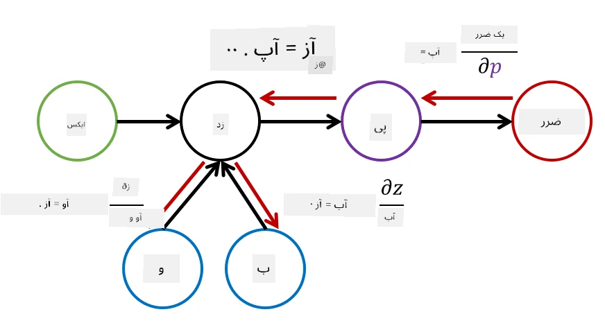

# مقدمه‌ای بر شبکه‌های عصبی. پرسپترون چندلایه

در بخش قبلی، شما با ساده‌ترین مدل شبکه عصبی - پرسپترون تک‌لایه، که یک مدل طبقه‌بندی خطی دوکلاسه است، آشنا شدید.

در این بخش، این مدل را به یک چارچوب انعطاف‌پذیرتر گسترش خواهیم داد که به ما امکان می‌دهد:

* علاوه بر طبقه‌بندی دوکلاسه، **طبقه‌بندی چندکلاسه** انجام دهیم  
* علاوه بر طبقه‌بندی، **مسائل رگرسیون** را حل کنیم  
* کلاس‌هایی را که به صورت خطی قابل تفکیک نیستند جدا کنیم  

همچنین چارچوبی ماژولار در پایتون توسعه خواهیم داد که به ما امکان ساخت معماری‌های مختلف شبکه عصبی را می‌دهد.

## [آزمون پیش از درس](https://ff-quizzes.netlify.app/en/ai/quiz/7)

## فرمال‌سازی یادگیری ماشین

بیایید با فرمال‌سازی مسئله یادگیری ماشین شروع کنیم. فرض کنید یک مجموعه داده آموزشی **X** با برچسب‌های **Y** داریم و باید مدلی *f* بسازیم که دقیق‌ترین پیش‌بینی‌ها را انجام دهد. کیفیت پیش‌بینی‌ها با **تابع خطا** &lagran; اندازه‌گیری می‌شود. توابع خطای زیر معمولاً استفاده می‌شوند:

* برای مسئله رگرسیون، زمانی که باید یک عدد پیش‌بینی کنیم، می‌توانیم از **خطای مطلق** &sum;i|f(x(i))-y(i)| یا **خطای مربعی** &sum;i(f(x(i))-y(i))2 استفاده کنیم.  
* برای طبقه‌بندی، از **خطای 0-1** (که اساساً همان **دقت** مدل است) یا **خطای لجستیک** استفاده می‌کنیم.  

برای پرسپترون تک‌لایه، تابع *f* به صورت یک تابع خطی تعریف شده بود: *f(x)=wx+b* (در اینجا *w* ماتریس وزن، *x* بردار ویژگی‌های ورودی و *b* بردار بایاس است). برای معماری‌های مختلف شبکه عصبی، این تابع می‌تواند شکل پیچیده‌تری به خود بگیرد.

> در مورد طبقه‌بندی، اغلب مطلوب است که خروجی شبکه به صورت احتمال کلاس‌های مربوطه باشد. برای تبدیل اعداد دلخواه به احتمال‌ها (مثلاً برای نرمال‌سازی خروجی)، اغلب از تابع **softmax** &sigma; استفاده می‌کنیم و تابع *f* به صورت *f(x)=&sigma;(wx+b)* در می‌آید.

در تعریف *f* بالا، *w* و *b* به عنوان **پارامترها** &theta;=⟨*w,b*⟩ شناخته می‌شوند. با داشتن مجموعه داده ⟨**X**,**Y**⟩، می‌توانیم خطای کلی روی کل مجموعه داده را به عنوان تابعی از پارامترها &theta; محاسبه کنیم.

> ✅ **هدف از آموزش شبکه عصبی، کاهش خطا با تغییر پارامترهای &theta; است**

## بهینه‌سازی با نزول گرادیان

یک روش شناخته‌شده برای بهینه‌سازی توابع، **نزول گرادیان** است. ایده این است که می‌توان مشتق (در حالت چندبعدی به نام **گرادیان**) تابع خطا را نسبت به پارامترها محاسبه کرد و پارامترها را به گونه‌ای تغییر داد که خطا کاهش یابد. این روش به صورت زیر فرمال‌سازی می‌شود:

* پارامترها را با مقادیر تصادفی اولیه w(0), b(0) مقداردهی کنید  
* مرحله زیر را چندین بار تکرار کنید:
    - w(i+1) = w(i)-&eta;&part;&lagran;/&part;w  
    - b(i+1) = b(i)-&eta;&part;&lagran;/&part;b  

در طول آموزش، مراحل بهینه‌سازی باید با در نظر گرفتن کل مجموعه داده محاسبه شوند (به یاد داشته باشید که خطا به صورت مجموعی از تمام نمونه‌های آموزشی محاسبه می‌شود). اما در عمل، ما بخش‌های کوچکی از مجموعه داده به نام **minibatches** را می‌گیریم و گرادیان‌ها را بر اساس زیرمجموعه‌ای از داده‌ها محاسبه می‌کنیم. چون هر بار زیرمجموعه به صورت تصادفی انتخاب می‌شود، این روش **نزول گرادیان تصادفی** (SGD) نامیده می‌شود.

## پرسپترون‌های چندلایه و پس‌انتشار

شبکه تک‌لایه، همان‌طور که در بالا دیدیم، قادر به طبقه‌بندی کلاس‌های قابل تفکیک خطی است. برای ساخت یک مدل غنی‌تر، می‌توانیم چندین لایه از شبکه را ترکیب کنیم. به صورت ریاضی، این به معنای آن است که تابع *f* شکل پیچیده‌تری خواهد داشت و در چند مرحله محاسبه می‌شود:
* z1=w1x+b1  
* z2=w2&alpha;(z1)+b2  
* f = &sigma;(z2)  

در اینجا، &alpha; یک **تابع فعال‌سازی غیرخطی** است، &sigma; یک تابع softmax است، و پارامترها &theta;=<*w1,b1,w2,b2*> هستند.

الگوریتم نزول گرادیان همان‌طور باقی می‌ماند، اما محاسبه گرادیان‌ها دشوارتر خواهد بود. با توجه به قانون مشتق‌گیری زنجیره‌ای، می‌توان مشتق‌ها را به صورت زیر محاسبه کرد:

* &part;&lagran;/&part;w2 = (&part;&lagran;/&part;&sigma;)(&part;&sigma;/&part;z2)(&part;z2/&part;w2)  
* &part;&lagran;/&part;w1 = (&part;&lagran;/&part;&sigma;)(&part;&sigma;/&part;z2)(&part;z2/&part;&alpha;)(&part;&alpha;/&part;z1)(&part;z1/&part;w1)  

> ✅ قانون مشتق‌گیری زنجیره‌ای برای محاسبه مشتق‌های تابع خطا نسبت به پارامترها استفاده می‌شود.

توجه داشته باشید که بخش سمت چپ همه این عبارات یکسان است و بنابراین می‌توان مشتق‌ها را به طور مؤثر از تابع خطا شروع کرده و "به عقب" از طریق گراف محاسباتی محاسبه کرد. بنابراین روش آموزش پرسپترون چندلایه **پس‌انتشار** یا 'backprop' نامیده می‌شود.

> TODO: ذکر منبع تصویر

> ✅ ما پس‌انتشار را با جزئیات بیشتر در مثال دفترچه یادداشت خود پوشش خواهیم داد.

## نتیجه‌گیری

در این درس، کتابخانه شبکه عصبی خود را ساختیم و از آن برای یک وظیفه طبقه‌بندی ساده دو‌بعدی استفاده کردیم.

## 🚀 چالش

در دفترچه یادداشت همراه، شما چارچوب خود را برای ساخت و آموزش پرسپترون‌های چندلایه پیاده‌سازی خواهید کرد. شما قادر خواهید بود جزئیات عملکرد شبکه‌های عصبی مدرن را مشاهده کنید.

به دفترچه یادداشت [OwnFramework](OwnFramework.ipynb) بروید و آن را بررسی کنید.

## [آزمون پس از درس](https://ff-quizzes.netlify.app/en/ai/quiz/8)

## مرور و مطالعه خودآموز

پس‌انتشار یک الگوریتم رایج در هوش مصنوعی و یادگیری ماشین است که ارزش مطالعه [بیشتر](https://wikipedia.org/wiki/Backpropagation) را دارد.

## [تکلیف](lab/README.md)

در این آزمایشگاه، از شما خواسته می‌شود از چارچوبی که در این درس ساختید برای حل مسئله طبقه‌بندی ارقام دست‌نویس MNIST استفاده کنید.

* [دستورالعمل‌ها](lab/README.md)  
* [دفترچه یادداشت](lab/MyFW_MNIST.ipynb)  

---

