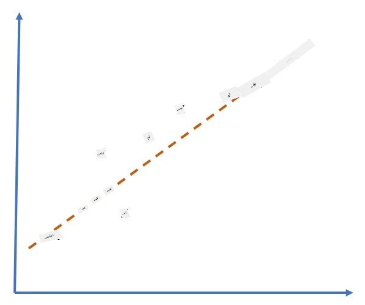
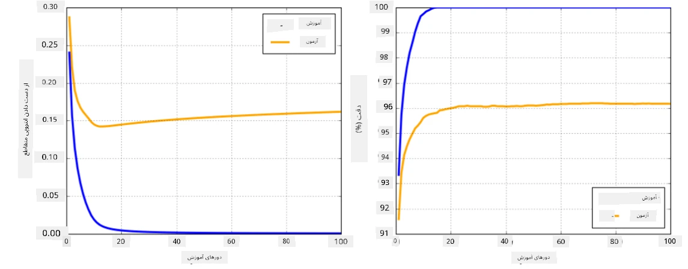

# چارچوب‌های شبکه عصبی

همانطور که قبلاً یاد گرفتیم، برای اینکه بتوانیم شبکه‌های عصبی را به طور مؤثر آموزش دهیم، باید دو کار انجام دهیم:

* کار با تنسورها، مانند ضرب، جمع و محاسبه برخی توابع مانند سیگموید یا سافت‌مکس  
* محاسبه گرادیان‌های تمام عبارات، برای انجام بهینه‌سازی نزول گرادیان  

## [پیش‌آزمون](https://ff-quizzes.netlify.app/en/ai/quiz/9)

در حالی که کتابخانه `numpy` می‌تواند بخش اول را انجام دهد، ما به مکانیزمی برای محاسبه گرادیان‌ها نیاز داریم. در [چارچوب خودمان](../04-OwnFramework/OwnFramework.ipynb) که در بخش قبلی توسعه دادیم، مجبور بودیم تمام توابع مشتق را به صورت دستی درون متد `backward` که پس‌انتشار را انجام می‌دهد، برنامه‌ریزی کنیم. ایده‌آل این است که یک چارچوب به ما امکان دهد گرادیان‌های *هر عبارتی* که تعریف می‌کنیم را محاسبه کنیم.

یکی دیگر از موارد مهم این است که بتوانیم محاسبات را روی GPU یا هر واحد محاسباتی تخصصی دیگر، مانند [TPU](https://en.wikipedia.org/wiki/Tensor_Processing_Unit)، انجام دهیم. آموزش شبکه‌های عصبی عمیق نیازمند *محاسبات بسیار زیاد* است و توانایی موازی‌سازی این محاسبات روی GPU‌ها بسیار مهم است.

> ✅ اصطلاح 'موازی‌سازی' به معنای توزیع محاسبات روی چندین دستگاه است.

در حال حاضر، دو چارچوب محبوب شبکه عصبی عبارتند از: [TensorFlow](http://TensorFlow.org) و [PyTorch](https://pytorch.org/). هر دو API سطح پایین برای کار با تنسورها روی CPU و GPU ارائه می‌دهند. علاوه بر API سطح پایین، API سطح بالاتری نیز وجود دارد که به ترتیب [Keras](https://keras.io/) و [PyTorch Lightning](https://pytorchlightning.ai/) نامیده می‌شود.

API سطح پایین | [TensorFlow](http://TensorFlow.org) | [PyTorch](https://pytorch.org/)  
--------------|-------------------------------------|--------------------------------  
API سطح بالا | [Keras](https://keras.io/) | [PyTorch Lightning](https://pytorchlightning.ai/)  

**API‌های سطح پایین** در هر دو چارچوب به شما امکان می‌دهند تا **گراف‌های محاسباتی** بسازید. این گراف مشخص می‌کند که چگونه خروجی (معمولاً تابع خطا) با پارامترهای ورودی داده شده محاسبه شود و می‌تواند برای محاسبه روی GPU، در صورت موجود بودن، ارسال شود. توابعی برای مشتق‌گیری از این گراف محاسباتی و محاسبه گرادیان‌ها وجود دارد که سپس می‌توانند برای بهینه‌سازی پارامترهای مدل استفاده شوند.

**API‌های سطح بالا** شبکه‌های عصبی را به عنوان **توالی‌ای از لایه‌ها** در نظر می‌گیرند و ساخت اکثر شبکه‌های عصبی را بسیار آسان‌تر می‌کنند. آموزش مدل معمولاً نیازمند آماده‌سازی داده‌ها و سپس فراخوانی یک تابع `fit` برای انجام کار است.

API سطح بالا به شما امکان می‌دهد شبکه‌های عصبی معمولی را بسیار سریع بسازید بدون اینکه نگران جزئیات زیادی باشید. در عین حال، API سطح پایین کنترل بیشتری بر فرآیند آموزش ارائه می‌دهد و بنابراین در تحقیقات، زمانی که با معماری‌های جدید شبکه عصبی سروکار دارید، بسیار استفاده می‌شود.

همچنین مهم است که بدانید می‌توانید هر دو API را با هم استفاده کنید، به عنوان مثال، می‌توانید معماری لایه شبکه خود را با استفاده از API سطح پایین توسعه دهید و سپس آن را درون شبکه بزرگتری که با API سطح بالا ساخته و آموزش داده شده است، استفاده کنید. یا می‌توانید شبکه‌ای را با استفاده از API سطح بالا به عنوان توالی‌ای از لایه‌ها تعریف کنید و سپس حلقه آموزش سطح پایین خود را برای انجام بهینه‌سازی استفاده کنید. هر دو API از مفاهیم پایه‌ای مشابه استفاده می‌کنند و برای کار با یکدیگر طراحی شده‌اند.

## یادگیری

در این دوره، بیشتر محتوا را هم برای PyTorch و هم برای TensorFlow ارائه می‌دهیم. شما می‌توانید چارچوب مورد علاقه خود را انتخاب کنید و فقط از نوت‌بوک‌های مربوطه استفاده کنید. اگر مطمئن نیستید کدام چارچوب را انتخاب کنید، برخی بحث‌ها در اینترنت در مورد **PyTorch در مقابل TensorFlow** را بخوانید. همچنین می‌توانید به هر دو چارچوب نگاهی بیندازید تا درک بهتری پیدا کنید.

در صورت امکان، از API‌های سطح بالا برای سادگی استفاده خواهیم کرد. با این حال، معتقدیم که درک نحوه عملکرد شبکه‌های عصبی از پایه بسیار مهم است، بنابراین در ابتدا با API سطح پایین و تنسورها کار می‌کنیم. با این حال، اگر می‌خواهید سریع شروع کنید و نمی‌خواهید زمان زیادی را صرف یادگیری این جزئیات کنید، می‌توانید آن‌ها را رد کنید و مستقیماً به نوت‌بوک‌های API سطح بالا بروید.

## ✍️ تمرین‌ها: چارچوب‌ها

یادگیری خود را در نوت‌بوک‌های زیر ادامه دهید:

API سطح پایین | [نوت‌بوک TensorFlow+Keras](IntroKerasTF.ipynb) | [PyTorch](IntroPyTorch.ipynb)  
--------------|-------------------------------------|--------------------------------  
API سطح بالا | [Keras](IntroKeras.ipynb) | *PyTorch Lightning*  

پس از تسلط بر چارچوب‌ها، بیایید مفهوم بیش‌برازش را مرور کنیم.

# بیش‌برازش

بیش‌برازش یک مفهوم بسیار مهم در یادگیری ماشین است و بسیار مهم است که آن را درست درک کنیم!

به مشکل زیر در تقریب ۵ نقطه (نمایش داده شده با `x` در نمودارهای زیر) توجه کنید:

 |   
-------------------------|--------------------------  
**مدل خطی، ۲ پارامتر** | **مدل غیرخطی، ۷ پارامتر**  
خطای آموزش = ۵.۳ | خطای آموزش = ۰  
خطای اعتبارسنجی = ۵.۱ | خطای اعتبارسنجی = ۲۰  

* در سمت چپ، یک تقریب خطی خوب را می‌بینیم. چون تعداد پارامترها مناسب است، مدل الگوی توزیع نقاط را به درستی درک می‌کند.  
* در سمت راست، مدل بیش از حد قدرتمند است. چون فقط ۵ نقطه داریم و مدل ۷ پارامتر دارد، می‌تواند به گونه‌ای تنظیم شود که از تمام نقاط عبور کند و خطای آموزش را به ۰ برساند. با این حال، این مانع از درک الگوی صحیح داده‌ها توسط مدل می‌شود و در نتیجه خطای اعتبارسنجی بسیار بالا است.  

بسیار مهم است که تعادل صحیحی بین غنای مدل (تعداد پارامترها) و تعداد نمونه‌های آموزشی برقرار کنیم.

## چرا بیش‌برازش رخ می‌دهد

  * داده آموزشی کافی وجود ندارد  
  * مدل بیش از حد قدرتمند است  
  * نویز زیاد در داده‌های ورودی  

## چگونه بیش‌برازش را تشخیص دهیم

همانطور که از نمودار بالا می‌بینید، بیش‌برازش را می‌توان با خطای آموزشی بسیار کم و خطای اعتبارسنجی بالا تشخیص داد. معمولاً در طول آموزش، هر دو خطای آموزشی و اعتبارسنجی شروع به کاهش می‌کنند و سپس در یک نقطه خطای اعتبارسنجی ممکن است کاهش را متوقف کند و شروع به افزایش کند. این نشانه‌ای از بیش‌برازش خواهد بود و نشان‌دهنده این است که احتمالاً باید در این نقطه آموزش را متوقف کنیم (یا حداقل یک نسخه از مدل را ذخیره کنیم).

## چگونه از بیش‌برازش جلوگیری کنیم

اگر مشاهده کردید که بیش‌برازش رخ می‌دهد، می‌توانید یکی از کارهای زیر را انجام دهید:

 * مقدار داده آموزشی را افزایش دهید  
 * پیچیدگی مدل را کاهش دهید  
 * از برخی [تکنیک‌های منظم‌سازی](../../4-ComputerVision/08-TransferLearning/TrainingTricks.md) مانند [Dropout](../../4-ComputerVision/08-TransferLearning/TrainingTricks.md#Dropout) استفاده کنید که بعداً بررسی خواهیم کرد.  

## بیش‌برازش و تعادل بایاس-واریانس

بیش‌برازش در واقع یک مورد از یک مشکل عمومی‌تر در آمار به نام [تعادل بایاس-واریانس](https://en.wikipedia.org/wiki/Bias%E2%80%93variance_tradeoff) است. اگر منابع احتمالی خطا در مدل خود را در نظر بگیریم، می‌توانیم دو نوع خطا را مشاهده کنیم:

* **خطاهای بایاس** که ناشی از عدم توانایی الگوریتم ما در درک رابطه بین داده‌های آموزشی به درستی است. این می‌تواند ناشی از این باشد که مدل ما به اندازه کافی قدرتمند نیست (**کم‌برازش**).  
* **خطاهای واریانس** که ناشی از این است که مدل به جای رابطه‌های معنادار، نویز موجود در داده‌های ورودی را تقریب می‌زند (**بیش‌برازش**).  

در طول آموزش، خطای بایاس کاهش می‌یابد (زیرا مدل ما یاد می‌گیرد داده‌ها را تقریب بزند) و خطای واریانس افزایش می‌یابد. مهم است که آموزش را متوقف کنیم - یا به صورت دستی (زمانی که بیش‌برازش را تشخیص می‌دهیم) یا به صورت خودکار (با معرفی منظم‌سازی) - تا از بیش‌برازش جلوگیری کنیم.

## نتیجه‌گیری

در این درس، شما درباره تفاوت‌های بین API‌های مختلف برای دو چارچوب محبوب هوش مصنوعی، TensorFlow و PyTorch، یاد گرفتید. علاوه بر این، شما درباره یک موضوع بسیار مهم، بیش‌برازش، یاد گرفتید.

## 🚀 چالش

در نوت‌بوک‌های همراه، در انتهای آن‌ها 'وظایف' وجود دارد؛ نوت‌بوک‌ها را مرور کنید و وظایف را کامل کنید.

## [پس‌آزمون](https://ff-quizzes.netlify.app/en/ai/quiz/10)

## مرور و مطالعه خودآموز

در مورد موضوعات زیر تحقیق کنید:

- TensorFlow  
- PyTorch  
- بیش‌برازش  

از خود بپرسید:

- تفاوت بین TensorFlow و PyTorch چیست؟  
- تفاوت بین بیش‌برازش و کم‌برازش چیست؟  

## [تکلیف](lab/README.md)

در این آزمایشگاه، از شما خواسته می‌شود دو مسئله طبقه‌بندی را با استفاده از شبکه‌های کاملاً متصل تک‌لایه و چندلایه با استفاده از PyTorch یا TensorFlow حل کنید.

* [دستورالعمل‌ها](lab/README.md)  
* [نوت‌بوک](lab/LabFrameworks.ipynb)  

---

