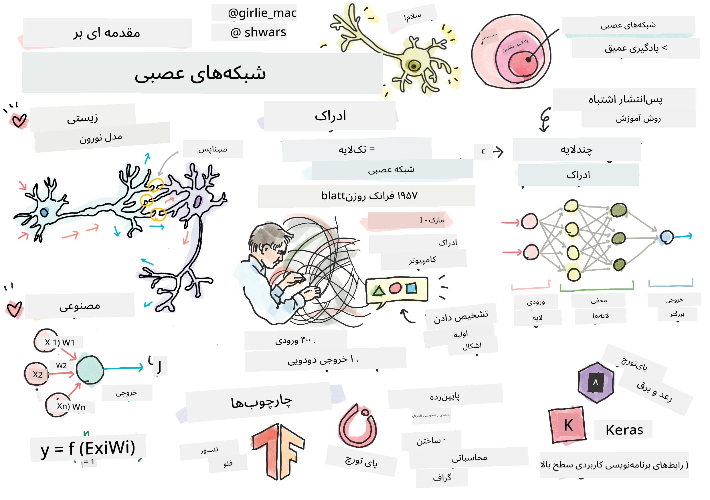
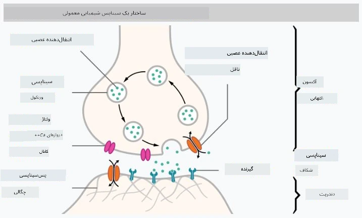
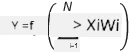

# مقدمه‌ای بر شبکه‌های عصبی

همان‌طور که در مقدمه بحث کردیم، یکی از راه‌های دستیابی به هوش، آموزش یک **مدل کامپیوتری** یا یک **مغز مصنوعی** است. از اواسط قرن بیستم، پژوهشگران مدل‌های ریاضی مختلفی را امتحان کردند تا اینکه در سال‌های اخیر این مسیر به موفقیت چشمگیری دست یافت. این مدل‌های ریاضی مغز را **شبکه‌های عصبی** می‌نامند.

> گاهی شبکه‌های عصبی را *شبکه‌های عصبی مصنوعی* یا ANNs می‌نامند تا مشخص شود که درباره مدل‌ها صحبت می‌کنیم، نه شبکه‌های واقعی نورون‌ها.

## یادگیری ماشین

شبکه‌های عصبی بخشی از یک حوزه بزرگ‌تر به نام **یادگیری ماشین** هستند که هدف آن استفاده از داده‌ها برای آموزش مدل‌های کامپیوتری است که قادر به حل مسائل باشند. یادگیری ماشین بخش بزرگی از هوش مصنوعی را تشکیل می‌دهد، اما در این دوره آموزشی به یادگیری ماشین کلاسیک نمی‌پردازیم.

> برای یادگیری بیشتر درباره یادگیری ماشین کلاسیک، به دوره آموزشی جداگانه **[یادگیری ماشین برای مبتدیان](http://github.com/microsoft/ml-for-beginners)** مراجعه کنید.

در یادگیری ماشین، فرض می‌کنیم که یک مجموعه داده از نمونه‌ها **X** و مقادیر خروجی متناظر **Y** داریم. نمونه‌ها اغلب بردارهای N-بعدی هستند که شامل **ویژگی‌ها** می‌شوند و خروجی‌ها **برچسب‌ها** نامیده می‌شوند.

ما به دو مسئله رایج یادگیری ماشین می‌پردازیم:

* **طبقه‌بندی**، که در آن باید یک شیء ورودی را به دو یا چند کلاس دسته‌بندی کنیم.
* **رگرسیون**، که در آن باید یک عدد عددی را برای هر یک از نمونه‌های ورودی پیش‌بینی کنیم.

> هنگامی که ورودی‌ها و خروجی‌ها به صورت تنسورها نمایش داده می‌شوند، مجموعه داده ورودی یک ماتریس با اندازه M&times;N است، که M تعداد نمونه‌ها و N تعداد ویژگی‌ها است. برچسب‌های خروجی Y یک بردار با اندازه M است.

در این دوره آموزشی، فقط بر مدل‌های شبکه عصبی تمرکز خواهیم کرد.

## مدل یک نورون

از زیست‌شناسی می‌دانیم که مغز ما از سلول‌های عصبی (نورون‌ها) تشکیل شده است، که هر کدام دارای چندین "ورودی" (دندریت‌ها) و یک "خروجی" (آکسون) هستند. هم دندریت‌ها و هم آکسون‌ها می‌توانند سیگنال‌های الکتریکی را منتقل کنند، و اتصالات بین آن‌ها — که به عنوان سیناپس شناخته می‌شوند — می‌توانند درجات مختلفی از رسانایی را نشان دهند که توسط انتقال‌دهنده‌های عصبی تنظیم می‌شوند.

 | 
----|----
نورون واقعی *([تصویر](https://en.wikipedia.org/wiki/Synapse#/media/File:SynapseSchematic_lines.svg) از ویکی‌پدیا)* | نورون مصنوعی *(تصویر توسط نویسنده)*

بنابراین، ساده‌ترین مدل ریاضی یک نورون شامل چندین ورودی X1, ..., XN و یک خروجی Y، و مجموعه‌ای از وزن‌ها W1, ..., WN است. خروجی به صورت زیر محاسبه می‌شود:

که در آن f یک **تابع فعال‌سازی** غیرخطی است.

> مدل‌های اولیه نورون در مقاله کلاسیک [A logical calculus of the ideas immanent in nervous activity](https://www.cs.cmu.edu/~./epxing/Class/10715/reading/McCulloch.and.Pitts.pdf) توسط وارن مک‌کالاک و والتر پیتس در سال 1943 توصیف شدند. دونالد هب در کتاب خود "[The Organization of Behavior: A Neuropsychological Theory](https://books.google.com/books?id=VNetYrB8EBoC)" روش آموزش این شبکه‌ها را پیشنهاد کرد.

## در این بخش

در این بخش درباره موارد زیر یاد خواهیم گرفت:
* [پرسیپترون](03-Perceptron/README.md)، یکی از اولین مدل‌های شبکه عصبی برای طبقه‌بندی دوکلاسه
* [شبکه‌های چندلایه](04-OwnFramework/README.md) همراه با دفترچه [چگونه چارچوب خودمان را بسازیم](04-OwnFramework/OwnFramework.ipynb)
* [چارچوب‌های شبکه عصبی](05-Frameworks/README.md)، همراه با این دفترچه‌ها: [PyTorch](05-Frameworks/IntroPyTorch.ipynb) و [Keras/Tensorflow](05-Frameworks/IntroKerasTF.ipynb)
* [بیش‌برازش](../../../../lessons/3-NeuralNetworks/05-Frameworks)

---

**سلب مسئولیت**:  
این سند با استفاده از سرویس ترجمه هوش مصنوعی [Co-op Translator](https://github.com/Azure/co-op-translator) ترجمه شده است. در حالی که ما تلاش می‌کنیم دقت را حفظ کنیم، لطفاً توجه داشته باشید که ترجمه‌های خودکار ممکن است شامل خطاها یا نادرستی‌ها باشند. سند اصلی به زبان اصلی آن باید به عنوان منبع معتبر در نظر گرفته شود. برای اطلاعات حساس، توصیه می‌شود از ترجمه انسانی حرفه‌ای استفاده کنید. ما مسئولیتی در قبال سوء تفاهم‌ها یا تفسیرهای نادرست ناشی از استفاده از این ترجمه نداریم.