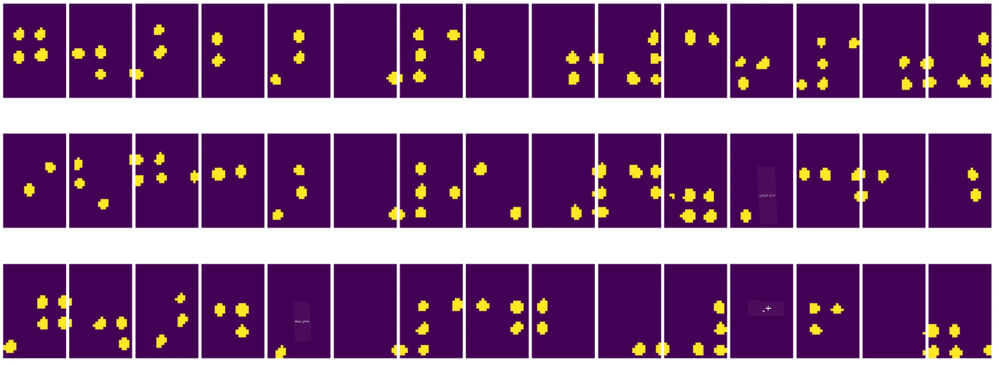
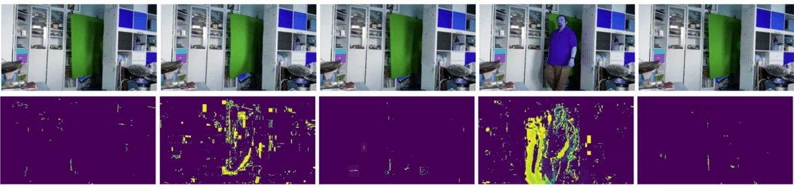

# مقدمه‌ای بر بینایی کامپیوتر

[بینایی کامپیوتر](https://wikipedia.org/wiki/Computer_vision) شاخه‌ای از علوم است که هدف آن این است که کامپیوترها بتوانند درک سطح بالایی از تصاویر دیجیتال داشته باشند. این تعریف بسیار گسترده است، زیرا *درک* می‌تواند معانی مختلفی داشته باشد، از جمله پیدا کردن یک شیء در تصویر (**تشخیص شیء**)، فهمیدن اینکه چه اتفاقی در حال رخ دادن است (**تشخیص رویداد**)، توصیف یک تصویر به صورت متنی، یا بازسازی یک صحنه به صورت سه‌بعدی. همچنین وظایف خاصی مرتبط با تصاویر انسانی وجود دارد: تخمین سن و احساسات، تشخیص و شناسایی چهره، و تخمین وضعیت سه‌بعدی، تنها چند نمونه از این وظایف هستند.

## [پیش‌ آزمون](https://ff-quizzes.netlify.app/en/ai/quiz/11)

یکی از ساده‌ترین وظایف بینایی کامپیوتر **طبقه‌بندی تصویر** است.

بینایی کامپیوتر اغلب به عنوان شاخه‌ای از هوش مصنوعی در نظر گرفته می‌شود. امروزه، بیشتر وظایف بینایی کامپیوتر با استفاده از شبکه‌های عصبی حل می‌شوند. در این بخش، بیشتر با نوع خاصی از شبکه‌های عصبی که برای بینایی کامپیوتر استفاده می‌شوند، یعنی [شبکه‌های عصبی کانولوشنی](../07-ConvNets/README.md)، آشنا خواهیم شد.

با این حال، پیش از اینکه تصویر را به یک شبکه عصبی بدهید، در بسیاری از موارد منطقی است که از تکنیک‌های الگوریتمی برای بهبود تصویر استفاده کنید.

چندین کتابخانه پایتون برای پردازش تصویر وجود دارد:

* **[imageio](https://imageio.readthedocs.io/en/stable/)** برای خواندن/نوشتن فرمت‌های مختلف تصویر استفاده می‌شود. همچنین از ffmpeg پشتیبانی می‌کند، که ابزاری مفید برای تبدیل فریم‌های ویدئو به تصاویر است.
* **[Pillow](https://pillow.readthedocs.io/en/stable/index.html)** (که به عنوان PIL نیز شناخته می‌شود) قدرتمندتر است و از برخی تغییرات تصویر مانند تغییر شکل، تنظیم پالت و موارد دیگر پشتیبانی می‌کند.
* **[OpenCV](https://opencv.org/)** یک کتابخانه قدرتمند پردازش تصویر است که به زبان C++ نوشته شده و به استاندارد *de facto* برای پردازش تصویر تبدیل شده است. این کتابخانه دارای یک رابط کاربری راحت برای پایتون است.
* **[dlib](http://dlib.net/)** یک کتابخانه C++ است که بسیاری از الگوریتم‌های یادگیری ماشین، از جمله برخی از الگوریتم‌های بینایی کامپیوتر را پیاده‌سازی می‌کند. این کتابخانه نیز دارای یک رابط پایتون است و می‌تواند برای وظایف چالش‌برانگیزی مانند تشخیص چهره و نقاط کلیدی چهره استفاده شود.

## OpenCV

[OpenCV](https://opencv.org/) به عنوان استاندارد *de facto* برای پردازش تصویر در نظر گرفته می‌شود. این کتابخانه شامل بسیاری از الگوریتم‌های مفید است که به زبان C++ پیاده‌سازی شده‌اند. شما می‌توانید از OpenCV در پایتون نیز استفاده کنید.

یک منبع خوب برای یادگیری OpenCV [این دوره آموزشی](https://learnopencv.com/getting-started-with-opencv/) است. در این دوره، هدف ما یادگیری کامل OpenCV نیست، بلکه نشان دادن چند مثال از کاربردهای آن و نحوه استفاده از آن است.

### بارگذاری تصاویر

تصاویر در پایتون به راحتی می‌توانند با استفاده از آرایه‌های NumPy نمایش داده شوند. برای مثال، تصاویر سیاه و سفید با اندازه 320x200 پیکسل به صورت یک آرایه 200x320 ذخیره می‌شوند، و تصاویر رنگی با همان ابعاد به صورت آرایه‌ای با شکل 200x320x3 (برای سه کانال رنگی) ذخیره می‌شوند. برای بارگذاری یک تصویر، می‌توانید از کد زیر استفاده کنید:

```python
import cv2
import matplotlib.pyplot as plt

im = cv2.imread('image.jpeg')
plt.imshow(im)
```


به طور سنتی، OpenCV از کدگذاری BGR (آبی-سبز-قرمز) برای تصاویر رنگی استفاده می‌کند، در حالی که سایر ابزارهای پایتون از کدگذاری سنتی‌تر RGB (قرمز-سبز-آبی) استفاده می‌کنند. برای اینکه تصویر به درستی نمایش داده شود، باید آن را به فضای رنگی RGB تبدیل کنید، یا با جابجایی ابعاد در آرایه NumPy، یا با استفاده از یک تابع OpenCV:

```python
im = cv2.cvtColor(im,cv2.COLOR_BGR2RGB)
```


همین تابع `cvtColor` می‌تواند برای انجام تبدیل‌های دیگر فضای رنگی مانند تبدیل تصویر به سیاه و سفید یا فضای رنگی HSV (رنگ-اشباع-مقدار) استفاده شود.

شما همچنین می‌توانید از OpenCV برای بارگذاری فریم‌های ویدئو به صورت فریم به فریم استفاده کنید - یک مثال در تمرین [دفترچه OpenCV](OpenCV.ipynb) آورده شده است.

### پردازش تصویر

پیش از اینکه یک تصویر را به شبکه عصبی بدهید، ممکن است بخواهید چندین مرحله پیش‌پردازش را اعمال کنید. OpenCV می‌تواند کارهای زیادی انجام دهد، از جمله:

* **تغییر اندازه** تصویر با استفاده از `im = cv2.resize(im, (320,200),interpolation=cv2.INTER_LANCZOS)`
* **تار کردن** تصویر با استفاده از `im = cv2.medianBlur(im,3)` یا `im = cv2.GaussianBlur(im, (3,3), 0)`
* تغییر **روشنایی و کنتراست** تصویر که می‌تواند با دستکاری آرایه‌های NumPy انجام شود، همانطور که در [این یادداشت Stackoverflow](https://stackoverflow.com/questions/39308030/how-do-i-increase-the-contrast-of-an-image-in-python-opencv) توضیح داده شده است.
* استفاده از [آستانه‌گذاری](https://docs.opencv.org/4.x/d7/d4d/tutorial_py_thresholding.html) با فراخوانی توابع `cv2.threshold`/`cv2.adaptiveThreshold`، که اغلب به تنظیم روشنایی یا کنتراست ترجیح داده می‌شود.
* اعمال [تبدیلات مختلف](https://docs.opencv.org/4.5.5/da/d6e/tutorial_py_geometric_transformations.html) به تصویر:
    - **[تبدیلات آفین](https://docs.opencv.org/4.5.5/d4/d61/tutorial_warp_affine.html)** می‌توانند مفید باشند اگر نیاز به ترکیب چرخش، تغییر اندازه و کج کردن تصویر داشته باشید و مکان سه نقطه در تصویر را بدانید. تبدیلات آفین خطوط موازی را موازی نگه می‌دارند.
    - **[تبدیلات پرسپکتیو](https://medium.com/analytics-vidhya/opencv-perspective-transformation-9edffefb2143)** می‌توانند مفید باشند زمانی که مکان چهار نقطه در تصویر را بدانید. برای مثال، اگر از یک سند مستطیلی با دوربین گوشی هوشمند از زاویه‌ای عکس بگیرید و بخواهید تصویری مستطیلی از خود سند ایجاد کنید.
* درک حرکت درون تصویر با استفاده از **[جریان نوری](https://docs.opencv.org/4.5.5/d4/dee/tutorial_optical_flow.html)**.

## مثال‌هایی از استفاده از بینایی کامپیوتر

در [دفترچه OpenCV](OpenCV.ipynb)، چند مثال از کاربردهای بینایی کامپیوتر برای انجام وظایف خاص آورده شده است:

* **پیش‌پردازش عکس یک کتاب بریل**. ما بر روی استفاده از آستانه‌گذاری، تشخیص ویژگی، تبدیل پرسپکتیو و دستکاری‌های NumPy تمرکز می‌کنیم تا نمادهای بریل جداگانه را برای طبقه‌بندی بیشتر توسط یک شبکه عصبی جدا کنیم.

 |  | 
----|-----|-----

> تصویر از [OpenCV.ipynb](OpenCV.ipynb)

* **تشخیص حرکت در ویدئو با استفاده از تفاوت فریم‌ها**. اگر دوربین ثابت باشد، فریم‌های ویدئو باید بسیار مشابه یکدیگر باشند. از آنجا که فریم‌ها به صورت آرایه نمایش داده می‌شوند، با کم کردن آرایه‌های دو فریم متوالی می‌توان تفاوت پیکسلی را به دست آورد، که برای فریم‌های ثابت کم است و با وجود حرکت در تصویر افزایش می‌یابد.



> تصویر از [OpenCV.ipynb](OpenCV.ipynb)

* **تشخیص حرکت با استفاده از جریان نوری**. [جریان نوری](https://docs.opencv.org/3.4/d4/dee/tutorial_optical_flow.html) به ما اجازه می‌دهد بفهمیم که پیکسل‌های جداگانه در فریم‌های ویدئو چگونه حرکت می‌کنند. دو نوع جریان نوری وجود دارد:

   - **جریان نوری متراکم** میدان برداری را محاسبه می‌کند که نشان می‌دهد هر پیکسل به کجا حرکت می‌کند.
   - **جریان نوری پراکنده** بر اساس گرفتن برخی ویژگی‌های متمایز در تصویر (مانند لبه‌ها) و ساختن مسیر آن‌ها از فریم به فریم است.


> تصویر از [OpenCV.ipynb](OpenCV.ipynb)

## ✍️ دفترچه‌های مثال: OpenCV [OpenCV را در عمل امتحان کنید](OpenCV.ipynb)

بیایید با بررسی [دفترچه OpenCV](OpenCV.ipynb) چند آزمایش با OpenCV انجام دهیم.

## نتیجه‌گیری

گاهی اوقات، وظایف نسبتاً پیچیده‌ای مانند تشخیص حرکت یا تشخیص نوک انگشتان می‌توانند صرفاً با استفاده از بینایی کامپیوتر حل شوند. بنابراین، آشنایی با تکنیک‌های پایه‌ای بینایی کامپیوتر و قابلیت‌های کتابخانه‌هایی مانند OpenCV بسیار مفید است.

## 🚀 چالش

[این ویدئو](https://docs.microsoft.com/shows/ai-show/ai-show--2021-opencv-ai-competition--grand-prize-winners--cortic-tigers--episode-32?WT.mc_id=academic-77998-cacaste) از برنامه AI Show را تماشا کنید تا درباره پروژه Cortic Tigers و نحوه ساخت یک راه‌حل مبتنی بر بلوک برای دموکراتیزه کردن وظایف بینایی کامپیوتر از طریق یک ربات بیشتر بدانید. درباره پروژه‌های مشابه تحقیق کنید که به تازه‌واردان کمک می‌کنند وارد این حوزه شوند.

## [پس‌آزمون](https://ff-quizzes.netlify.app/en/ai/quiz/12)

## مرور و مطالعه شخصی

بیشتر درباره جریان نوری در [این آموزش عالی](https://learnopencv.com/optical-flow-in-opencv/) بخوانید.

## [تکلیف](lab/README.md)

در این آزمایشگاه، شما یک ویدئو با حرکات ساده ضبط خواهید کرد و هدف شما استخراج حرکات بالا/پایین/چپ/راست با استفاده از جریان نوری است.


---

