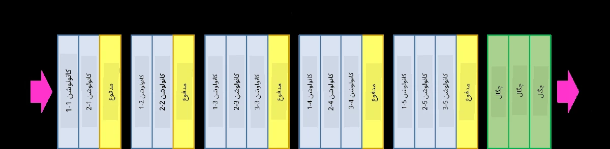
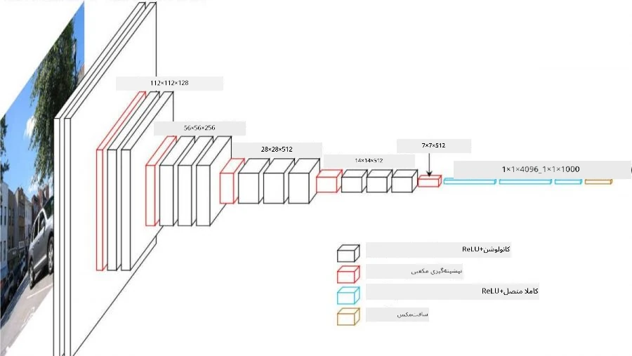
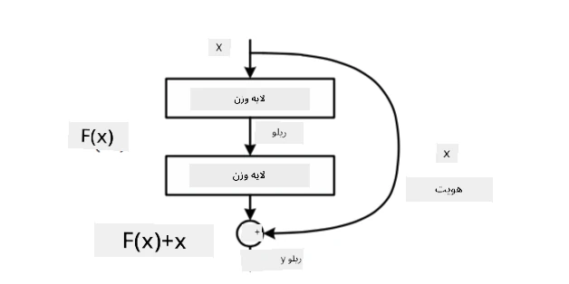
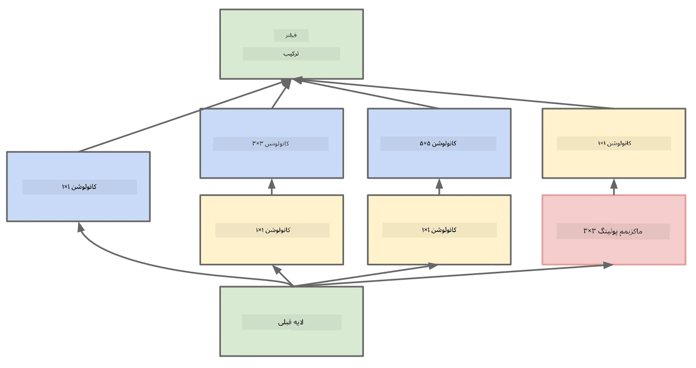

# معماری‌های معروف شبکه‌های عصبی کانولوشنی (CNN)

### VGG-16

VGG-16 یک شبکه است که در سال ۲۰۱۴ به دقت ۹۲.۷٪ در طبقه‌بندی ImageNet در پنج کلاس برتر دست یافت. ساختار لایه‌های آن به شکل زیر است:

همان‌طور که می‌بینید، VGG از یک معماری هرمی سنتی پیروی می‌کند که شامل توالی لایه‌های کانولوشن و پولینگ است.

> تصویر از [Researchgate](https://www.researchgate.net/figure/Vgg16-model-structure-To-get-the-VGG-NIN-model-we-replace-the-2-nd-4-th-6-th-7-th_fig2_335194493)

### ResNet

ResNet خانواده‌ای از مدل‌ها است که توسط Microsoft Research در سال ۲۰۱۵ پیشنهاد شد. ایده اصلی ResNet استفاده از **بلوک‌های باقیمانده (residual blocks)** است:

> تصویر از [این مقاله](https://arxiv.org/pdf/1512.03385.pdf)

دلیل استفاده از مسیر عبور هویتی این است که لایه ما **تفاوت** بین نتیجه لایه قبلی و خروجی بلوک باقیمانده را پیش‌بینی کند - به همین دلیل به آن *باقیمانده* گفته می‌شود. این بلوک‌ها بسیار آسان‌تر برای آموزش هستند و می‌توان شبکه‌هایی با صدها بلوک از این نوع ساخت (رایج‌ترین نسخه‌ها ResNet-52، ResNet-101 و ResNet-152 هستند).

همچنین می‌توانید این شبکه را به‌گونه‌ای تصور کنید که پیچیدگی خود را با داده‌ها تنظیم می‌کند. در ابتدا، زمانی که آموزش شبکه را شروع می‌کنید، مقادیر وزن‌ها کوچک هستند و بیشتر سیگنال از طریق لایه‌های هویتی عبور می‌کند. با پیشرفت آموزش و بزرگ‌تر شدن وزن‌ها، اهمیت پارامترهای شبکه افزایش می‌یابد و شبکه خود را برای تطبیق با قدرت بیان مورد نیاز برای طبقه‌بندی صحیح تصاویر آموزشی تنظیم می‌کند.

### Google Inception

معماری Google Inception این ایده را یک قدم جلوتر می‌برد و هر لایه شبکه را به‌عنوان ترکیبی از چندین مسیر مختلف می‌سازد:

> تصویر از [Researchgate](https://www.researchgate.net/figure/Inception-module-with-dimension-reductions-left-and-schema-for-Inception-ResNet-v1_fig2_355547454)

در اینجا باید بر نقش کانولوشن‌های ۱x1 تأکید کنیم، زیرا در ابتدا ممکن است بی‌معنی به نظر برسند. چرا باید از یک فیلتر ۱x1 برای تصویر استفاده کنیم؟ با این حال، باید به یاد داشته باشید که فیلترهای کانولوشن با چندین کانال عمقی کار می‌کنند (در ابتدا - رنگ‌های RGB، و در لایه‌های بعدی - کانال‌هایی برای فیلترهای مختلف)، و کانولوشن ۱x1 برای ترکیب این کانال‌های ورودی با استفاده از وزن‌های قابل آموزش مختلف استفاده می‌شود. همچنین می‌توان آن را به‌عنوان نمونه‌برداری مجدد (پولینگ) در بعد کانال در نظر گرفت.

[این پست وبلاگ خوب](https://medium.com/analytics-vidhya/talented-mr-1x1-comprehensive-look-at-1x1-convolution-in-deep-learning-f6b355825578) و [مقاله اصلی](https://arxiv.org/pdf/1312.4400.pdf) منابع خوبی برای مطالعه بیشتر هستند.

### MobileNet

MobileNet خانواده‌ای از مدل‌ها با اندازه کوچک‌تر است که برای دستگاه‌های موبایل مناسب هستند. اگر منابع محدودی دارید و می‌توانید کمی از دقت صرف‌نظر کنید، از این مدل‌ها استفاده کنید. ایده اصلی پشت این مدل‌ها **کانولوشن تفکیک‌پذیر عمقی (depthwise separable convolution)** است که امکان نمایش فیلترهای کانولوشن را به‌صورت ترکیبی از کانولوشن‌های فضایی و کانولوشن ۱x1 بر روی کانال‌های عمقی فراهم می‌کند. این کار به‌طور قابل توجهی تعداد پارامترها را کاهش می‌دهد، اندازه شبکه را کوچک‌تر می‌کند و همچنین آموزش آن را با داده‌های کمتر آسان‌تر می‌کند.

[این پست وبلاگ خوب درباره MobileNet](https://medium.com/analytics-vidhya/image-classification-with-mobilenet-cc6fbb2cd470) را مطالعه کنید.

## نتیجه‌گیری

در این بخش، شما با مفهوم اصلی شبکه‌های عصبی کانولوشنی در بینایی کامپیوتر آشنا شدید. معماری‌های واقعی که قدرت طبقه‌بندی تصویر، تشخیص اشیا و حتی شبکه‌های تولید تصویر را فراهم می‌کنند، همگی بر اساس CNN‌ها ساخته شده‌اند، فقط با لایه‌های بیشتر و برخی ترفندهای اضافی در آموزش.

## 🚀 چالش

در نوت‌بوک‌های همراه این درس، یادداشت‌هایی در انتها درباره چگونگی دستیابی به دقت بیشتر وجود دارد. آزمایش‌هایی انجام دهید تا ببینید آیا می‌توانید دقت بالاتری به دست آورید.

## [آزمون پس از درس](https://ff-quizzes.netlify.app/en/ai/quiz/14)

## مرور و مطالعه شخصی

در حالی که CNN‌ها بیشتر برای وظایف بینایی کامپیوتر استفاده می‌شوند، به‌طور کلی برای استخراج الگوهای با اندازه ثابت مناسب هستند. به‌عنوان مثال، اگر با صداها کار می‌کنیم، ممکن است بخواهیم از CNN‌ها برای جستجوی الگوهای خاص در سیگنال صوتی استفاده کنیم - که در این صورت فیلترها یک‌بعدی خواهند بود (و این CNN به‌عنوان 1D-CNN شناخته می‌شود). همچنین گاهی از 3D-CNN برای استخراج ویژگی‌ها در فضای چندبعدی استفاده می‌شود، مانند رویدادهای خاصی که در ویدیو رخ می‌دهند - CNN می‌تواند الگوهای خاصی از تغییر ویژگی‌ها در طول زمان را ثبت کند. درباره وظایف دیگری که می‌توان با CNN‌ها انجام داد، مرور و مطالعه شخصی انجام دهید.

## [تکلیف](lab/README.md)

در این آزمایشگاه، وظیفه شما طبقه‌بندی نژادهای مختلف گربه و سگ است. این تصاویر پیچیده‌تر از مجموعه داده MNIST هستند، ابعاد بالاتری دارند و بیش از ۱۰ کلاس وجود دارد.

---

