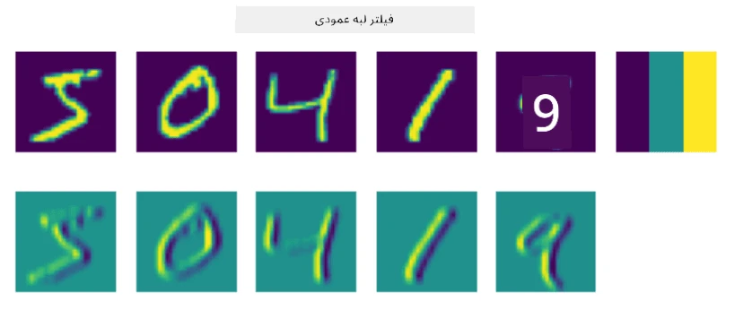
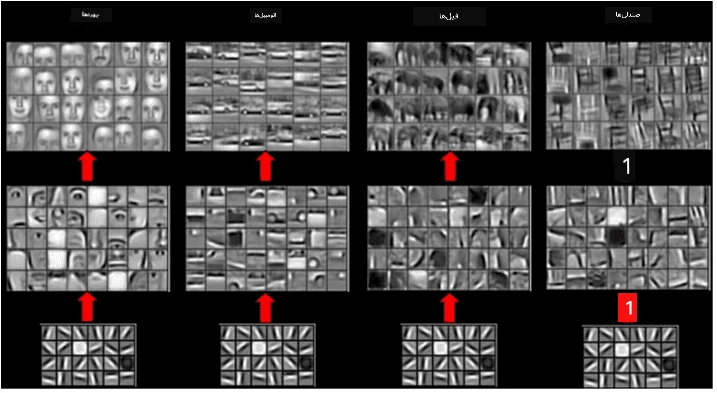

# شبکه‌های عصبی کانولوشنی

قبلاً دیده‌ایم که شبکه‌های عصبی در پردازش تصاویر بسیار خوب عمل می‌کنند، حتی یک پرسپترون تک‌لایه قادر است با دقت قابل قبولی ارقام دست‌نویس مجموعه داده MNIST را تشخیص دهد. با این حال، مجموعه داده MNIST بسیار خاص است و تمام ارقام در مرکز تصویر قرار دارند، که این کار را ساده‌تر می‌کند.

## [پرسش‌نامه پیش از درس](https://ff-quizzes.netlify.app/en/ai/quiz/13)

در زندگی واقعی، ما می‌خواهیم بتوانیم اشیاء را در یک تصویر بدون توجه به مکان دقیق آن‌ها در تصویر تشخیص دهیم. بینایی کامپیوتری با طبقه‌بندی عمومی متفاوت است، زیرا وقتی سعی می‌کنیم یک شیء خاص را در تصویر پیدا کنیم، تصویر را اسکن می‌کنیم و به دنبال برخی **الگوها** و ترکیب‌های آن‌ها می‌گردیم. به عنوان مثال، وقتی به دنبال یک گربه هستیم، ممکن است ابتدا به دنبال خطوط افقی بگردیم که می‌توانند سبیل‌ها را تشکیل دهند، و سپس ترکیب خاصی از سبیل‌ها می‌تواند به ما بگوید که این واقعاً تصویر یک گربه است. موقعیت نسبی و حضور برخی الگوها مهم است، نه موقعیت دقیق آن‌ها در تصویر.

برای استخراج الگوها، از مفهوم **فیلترهای کانولوشنی** استفاده خواهیم کرد. همان‌طور که می‌دانید، یک تصویر به صورت یک ماتریس دو‌بعدی یا یک تنسور سه‌بعدی با عمق رنگ نمایش داده می‌شود. اعمال یک فیلتر به این معناست که یک ماتریس کوچک **هسته فیلتر** را می‌گیریم و برای هر پیکسل در تصویر اصلی میانگین وزنی را با نقاط همسایه محاسبه می‌کنیم. می‌توانیم این فرآیند را به صورت یک پنجره کوچک که روی کل تصویر حرکت می‌کند و تمام پیکسل‌ها را بر اساس وزن‌های موجود در ماتریس هسته فیلتر میانگین‌گیری می‌کند، تصور کنیم.

 | 
----|----

> تصویر از دیمیتری سوشنیکوف

به عنوان مثال، اگر فیلترهای لبه عمودی و افقی ۳x۳ را به ارقام MNIST اعمال کنیم، می‌توانیم نقاط برجسته (مانند مقادیر بالا) را در جایی که لبه‌های عمودی و افقی در تصویر اصلی وجود دارند، دریافت کنیم. بنابراین این دو فیلتر می‌توانند برای "جستجوی" لبه‌ها استفاده شوند. به همین ترتیب، می‌توانیم فیلترهای مختلفی طراحی کنیم تا به دنبال سایر الگوهای سطح پایین بگردیم:

> تصویر از [بانک فیلتر لئونگ-مالیک](https://www.robots.ox.ac.uk/~vgg/research/texclass/filters.html)

با این حال، در حالی که می‌توانیم فیلترها را به صورت دستی برای استخراج برخی الگوها طراحی کنیم، می‌توانیم شبکه را به گونه‌ای طراحی کنیم که الگوها را به صورت خودکار یاد بگیرد. این یکی از ایده‌های اصلی پشت شبکه‌های عصبی کانولوشنی است.

## ایده‌های اصلی پشت شبکه‌های عصبی کانولوشنی

عملکرد شبکه‌های عصبی کانولوشنی بر اساس ایده‌های مهم زیر است:

* فیلترهای کانولوشنی می‌توانند الگوها را استخراج کنند.
* می‌توانیم شبکه را به گونه‌ای طراحی کنیم که فیلترها به صورت خودکار آموزش ببینند.
* می‌توانیم از همین روش برای یافتن الگوها در ویژگی‌های سطح بالا، نه فقط در تصویر اصلی، استفاده کنیم. بنابراین استخراج ویژگی‌های CNN بر اساس سلسله مراتبی از ویژگی‌ها عمل می‌کند، از ترکیب‌های پیکسل سطح پایین تا ترکیب‌های سطح بالای بخش‌های تصویر.

> تصویر از [مقاله‌ای توسط هیسلوپ-لینچ](https://www.semanticscholar.org/paper/Computer-vision-based-pedestrian-trajectory-Hislop-Lynch/26e6f74853fc9bbb7487b06dc2cf095d36c9021d)، بر اساس [تحقیقات آن‌ها](https://dl.acm.org/doi/abs/10.1145/1553374.1553453)

## ✍️ تمرین‌ها: شبکه‌های عصبی کانولوشنی

بیایید به بررسی نحوه عملکرد شبکه‌های عصبی کانولوشنی و چگونگی دستیابی به فیلترهای قابل آموزش ادامه دهیم، با کار کردن روی نوت‌بوک‌های مربوطه:

* [شبکه‌های عصبی کانولوشنی - PyTorch](ConvNetsPyTorch.ipynb)
* [شبکه‌های عصبی کانولوشنی - TensorFlow](ConvNetsTF.ipynb)

## معماری هرمی

بیشتر شبکه‌های عصبی کانولوشنی که برای پردازش تصویر استفاده می‌شوند از معماری موسوم به هرمی پیروی می‌کنند. اولین لایه کانولوشنی که به تصاویر اصلی اعمال می‌شود معمولاً تعداد نسبتاً کمی فیلتر (۸-۱۶) دارد، که به ترکیب‌های مختلف پیکسل مانند خطوط افقی/عمودی یا ضربه‌ها مربوط می‌شود. در سطح بعدی، ابعاد فضایی شبکه را کاهش می‌دهیم و تعداد فیلترها را افزایش می‌دهیم، که به ترکیب‌های بیشتری از ویژگی‌های ساده مربوط می‌شود. با هر لایه، همان‌طور که به سمت طبقه‌بند نهایی حرکت می‌کنیم، ابعاد فضایی تصویر کاهش می‌یابد و تعداد فیلترها افزایش می‌یابد.

به عنوان مثال، بیایید به معماری VGG-16 نگاه کنیم، شبکه‌ای که در سال ۲۰۱۴ به دقت ۹۲.۷٪ در طبقه‌بندی پنج‌تایی ImageNet دست یافت:

> تصویر از [ریسرچ‌گیت](https://www.researchgate.net/figure/Vgg16-model-structure-To-get-the-VGG-NIN-model-we-replace-the-2-nd-4-th-6-th-7-th_fig2_335194493)

## معروف‌ترین معماری‌های CNN

[مطالعه خود درباره معروف‌ترین معماری‌های CNN را ادامه دهید](CNN_Architectures.md)

---

