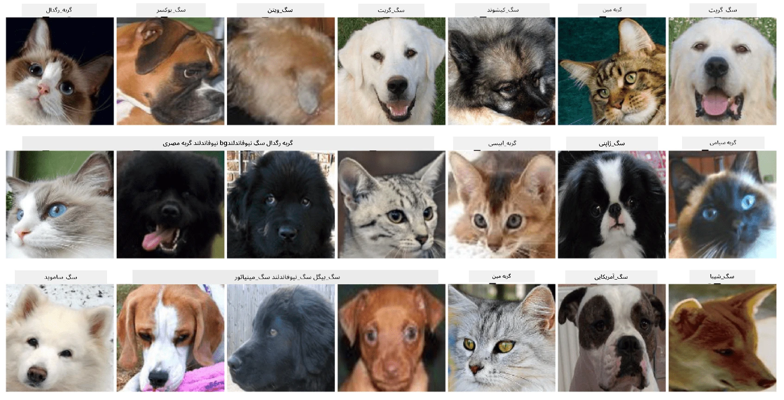

# طبقه‌بندی چهره حیوانات خانگی

تکلیف آزمایشگاهی از [برنامه درسی AI برای مبتدیان](https://github.com/microsoft/ai-for-beginners).

## وظیفه

تصور کنید که باید یک برنامه برای یک مرکز نگهداری حیوانات خانگی توسعه دهید تا همه حیوانات را دسته‌بندی کند. یکی از ویژگی‌های عالی چنین برنامه‌ای می‌تواند شناسایی خودکار نژاد از طریق یک عکس باشد. این کار به‌طور موفقیت‌آمیز با استفاده از شبکه‌های عصبی قابل انجام است.

شما باید یک شبکه عصبی کانولوشن را آموزش دهید تا نژادهای مختلف گربه‌ها و سگ‌ها را با استفاده از مجموعه داده **چهره حیوانات خانگی** طبقه‌بندی کند.

## مجموعه داده

ما از [مجموعه داده حیوانات خانگی آکسفورد-IIIT](https://www.robots.ox.ac.uk/~vgg/data/pets/) استفاده خواهیم کرد که شامل تصاویر 37 نژاد مختلف از سگ‌ها و گربه‌ها است.



برای دانلود مجموعه داده، از این قطعه کد استفاده کنید:

```python
!wget https://thor.robots.ox.ac.uk/~vgg/data/pets/images.tar.gz
!tar xfz images.tar.gz
!rm images.tar.gz
```

**توجه:** تصاویر مجموعه داده حیوانات خانگی آکسفورد-IIIT بر اساس نام فایل سازماندهی شده‌اند (مثلاً `Abyssinian_1.jpg`، `Bengal_2.jpg`). نوت‌بوک شامل کدی است که این تصاویر را به زیرشاخه‌های مربوط به نژادها سازماندهی می‌کند تا طبقه‌بندی آسان‌تر شود.

## شروع نوت‌بوک

آزمایشگاه را با باز کردن [PetFaces.ipynb](PetFaces.ipynb) شروع کنید.

## نتیجه‌گیری

شما یک مسئله نسبتاً پیچیده طبقه‌بندی تصویر را از ابتدا حل کردید! تعداد کلاس‌ها زیاد بود، و شما همچنان توانستید به دقت قابل قبولی دست پیدا کنید! همچنین منطقی است که دقت top-k را اندازه‌گیری کنید، زیرا برخی از کلاس‌ها که حتی برای انسان‌ها به‌وضوح متفاوت نیستند، به‌راحتی قابل اشتباه گرفتن هستند.

---

**سلب مسئولیت**:  
این سند با استفاده از سرویس ترجمه هوش مصنوعی [Co-op Translator](https://github.com/Azure/co-op-translator) ترجمه شده است. در حالی که ما تلاش می‌کنیم دقت را حفظ کنیم، لطفاً توجه داشته باشید که ترجمه‌های خودکار ممکن است شامل خطاها یا نادرستی‌ها باشند. سند اصلی به زبان اصلی آن باید به عنوان منبع معتبر در نظر گرفته شود. برای اطلاعات حساس، توصیه می‌شود از ترجمه حرفه‌ای انسانی استفاده کنید. ما مسئولیتی در قبال سوء تفاهم‌ها یا تفسیرهای نادرست ناشی از استفاده از این ترجمه نداریم.