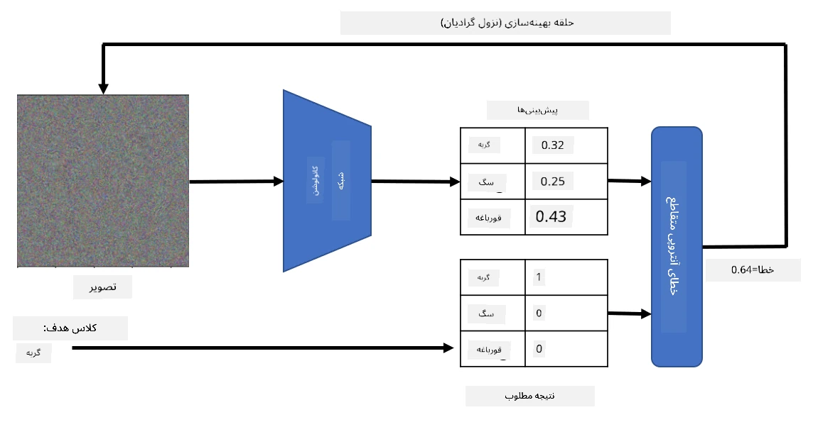

# شبکه‌های از پیش آموزش‌دیده و یادگیری انتقالی

آموزش شبکه‌های عصبی کانولوشنی (CNN) می‌تواند زمان زیادی ببرد و به داده‌های زیادی نیاز دارد. با این حال، بخش زیادی از زمان صرف یادگیری بهترین فیلترهای سطح پایین می‌شود که یک شبکه می‌تواند برای استخراج الگوها از تصاویر استفاده کند. یک سؤال طبیعی این است که آیا می‌توانیم از یک شبکه عصبی که روی یک مجموعه داده آموزش دیده است استفاده کنیم و آن را برای طبقه‌بندی تصاویر متفاوت بدون نیاز به فرآیند کامل آموزش تطبیق دهیم؟

## [آزمون پیش از درس](https://ff-quizzes.netlify.app/en/ai/quiz/15)

این رویکرد **یادگیری انتقالی** نامیده می‌شود، زیرا ما برخی از دانش یک مدل شبکه عصبی را به مدل دیگری انتقال می‌دهیم. در یادگیری انتقالی، معمولاً با یک مدل از پیش آموزش‌دیده شروع می‌کنیم که روی یک مجموعه داده تصویری بزرگ مانند **ImageNet** آموزش دیده است. این مدل‌ها می‌توانند به خوبی ویژگی‌های مختلف را از تصاویر عمومی استخراج کنند و در بسیاری از موارد، تنها ساختن یک طبقه‌بند بر روی این ویژگی‌های استخراج‌شده می‌تواند نتیجه خوبی بدهد.

> ✅ یادگیری انتقالی اصطلاحی است که در سایر حوزه‌های علمی مانند آموزش نیز یافت می‌شود. این اصطلاح به فرآیند انتقال دانش از یک حوزه و اعمال آن در حوزه دیگر اشاره دارد.

## مدل‌های از پیش آموزش‌دیده به عنوان استخراج‌کننده ویژگی‌ها

شبکه‌های کانولوشنی که در بخش قبلی درباره آن‌ها صحبت کردیم شامل تعدادی لایه بودند که هر کدام قرار بود ویژگی‌هایی را از تصویر استخراج کنند، از ترکیب‌های پیکسلی سطح پایین (مانند خطوط افقی/عمودی یا ضربه‌ها) تا ترکیب‌های سطح بالاتر از ویژگی‌ها که به چیزهایی مانند چشم یک شعله مربوط می‌شوند. اگر یک شبکه CNN را روی یک مجموعه داده بزرگ و متنوع از تصاویر عمومی آموزش دهیم، شبکه باید یاد بگیرد که این ویژگی‌های مشترک را استخراج کند.

هم Keras و هم PyTorch توابعی دارند که به راحتی وزن‌های شبکه عصبی از پیش آموزش‌دیده را برای برخی معماری‌های رایج بارگذاری می‌کنند، که بیشتر آن‌ها روی تصاویر ImageNet آموزش دیده‌اند. رایج‌ترین آن‌ها در صفحه [معماری‌های CNN](../07-ConvNets/CNN_Architectures.md) از درس قبلی توضیح داده شده‌اند. به طور خاص، ممکن است بخواهید از یکی از موارد زیر استفاده کنید:

* **VGG-16/VGG-19** که مدل‌های نسبتاً ساده‌ای هستند و همچنان دقت خوبی ارائه می‌دهند. اغلب استفاده از VGG به عنوان اولین تلاش برای بررسی عملکرد یادگیری انتقالی انتخاب خوبی است.
* **ResNet** خانواده‌ای از مدل‌ها است که توسط Microsoft Research در سال ۲۰۱۵ پیشنهاد شد. این مدل‌ها لایه‌های بیشتری دارند و بنابراین منابع بیشتری نیاز دارند.
* **MobileNet** خانواده‌ای از مدل‌ها با اندازه کاهش‌یافته است که برای دستگاه‌های موبایل مناسب هستند. اگر منابع کمی دارید و می‌توانید کمی دقت را قربانی کنید، از آن‌ها استفاده کنید.

در اینجا نمونه‌ای از ویژگی‌هایی که توسط شبکه VGG-16 از یک تصویر گربه استخراج شده است آورده شده است:

## مجموعه داده گربه‌ها و سگ‌ها

در این مثال، ما از یک مجموعه داده [گربه‌ها و سگ‌ها](https://www.microsoft.com/download/details.aspx?id=54765&WT.mc_id=academic-77998-cacaste) استفاده خواهیم کرد که بسیار نزدیک به یک سناریوی واقعی طبقه‌بندی تصویر است.

## ✍️ تمرین: یادگیری انتقالی

بیایید یادگیری انتقالی را در عمل در نوت‌بوک‌های مربوطه ببینیم:

* [یادگیری انتقالی - PyTorch](TransferLearningPyTorch.ipynb)
* [یادگیری انتقالی - TensorFlow](TransferLearningTF.ipynb)

## تجسم گربه تقلبی

شبکه عصبی از پیش آموزش‌دیده الگوهای مختلفی را در "مغز" خود دارد، از جمله مفاهیمی از **گربه ایده‌آل** (و همچنین سگ ایده‌آل، گورخر ایده‌آل و غیره). جالب خواهد بود که به نوعی **این تصویر را تجسم کنیم**. با این حال، این کار ساده نیست، زیرا الگوها در سراسر وزن‌های شبکه پراکنده شده‌اند و همچنین در یک ساختار سلسله‌مراتبی سازماندهی شده‌اند.

یک رویکردی که می‌توانیم اتخاذ کنیم این است که با یک تصویر تصادفی شروع کنیم و سپس از تکنیک **بهینه‌سازی نزول گرادیان** استفاده کنیم تا آن تصویر را به گونه‌ای تنظیم کنیم که شبکه شروع به فکر کردن کند که این یک گربه است.

با این حال، اگر این کار را انجام دهیم، چیزی بسیار شبیه به نویز تصادفی دریافت خواهیم کرد. این به این دلیل است که *راه‌های زیادی وجود دارد که شبکه فکر کند تصویر ورودی یک گربه است*، از جمله برخی که از نظر بصری منطقی نیستند. در حالی که این تصاویر شامل بسیاری از الگوهای معمول برای یک گربه هستند، هیچ چیزی آن‌ها را مجبور نمی‌کند که از نظر بصری متمایز باشند.

برای بهبود نتیجه، می‌توانیم یک عبارت دیگر به تابع زیان اضافه کنیم که **زیان تغییرات** نامیده می‌شود. این یک معیار است که نشان می‌دهد پیکسل‌های مجاور تصویر چقدر مشابه هستند. کمینه‌سازی زیان تغییرات تصویر را صاف‌تر می‌کند و نویز را از بین می‌برد - بنابراین الگوهای بصری جذاب‌تری را آشکار می‌کند. در اینجا نمونه‌ای از چنین تصاویر "ایده‌آلی" آورده شده است که با احتمال بالا به عنوان گربه و گورخر طبقه‌بندی شده‌اند:

 | 
-----|-----
*گربه ایده‌آل* | *گورخر ایده‌آل*

رویکرد مشابهی می‌تواند برای انجام **حملات تقلبی** روی یک شبکه عصبی استفاده شود. فرض کنید می‌خواهیم یک شبکه عصبی را فریب دهیم و یک سگ را شبیه به گربه کنیم. اگر تصویر سگی را بگیریم که توسط شبکه به عنوان سگ شناخته شده است، می‌توانیم آن را کمی با استفاده از بهینه‌سازی نزول گرادیان تغییر دهیم تا زمانی که شبکه شروع به طبقه‌بندی آن به عنوان گربه کند:

 | 
-----|-----
*تصویر اصلی سگ* | *تصویر سگی که به عنوان گربه طبقه‌بندی شده است*

کد بازتولید نتایج بالا را در نوت‌بوک زیر ببینید:

* [گربه ایده‌آل و تقلبی - TensorFlow](AdversarialCat_TF.ipynb)

## نتیجه‌گیری

با استفاده از یادگیری انتقالی، می‌توانید به سرعت یک طبقه‌بند برای یک وظیفه طبقه‌بندی شیء سفارشی ایجاد کنید و به دقت بالایی دست یابید. می‌توانید ببینید که وظایف پیچیده‌تری که اکنون در حال حل آن‌ها هستیم به قدرت محاسباتی بالاتری نیاز دارند و به راحتی نمی‌توان آن‌ها را روی CPU حل کرد. در واحد بعدی، سعی خواهیم کرد از یک پیاده‌سازی سبک‌تر برای آموزش همان مدل با استفاده از منابع محاسباتی کمتر استفاده کنیم که منجر به دقت کمی پایین‌تر می‌شود.

## 🚀 چالش

در نوت‌بوک‌های همراه، یادداشت‌هایی در انتهای آن‌ها وجود دارد که توضیح می‌دهد یادگیری انتقالی با داده‌های آموزشی نسبتاً مشابه بهتر عمل می‌کند (مثلاً یک نوع جدید از حیوان). با تصاویر کاملاً جدید آزمایش کنید تا ببینید مدل‌های یادگیری انتقالی شما چقدر خوب یا ضعیف عمل می‌کنند.

## [آزمون پس از درس](https://ff-quizzes.netlify.app/en/ai/quiz/16)

## مرور و مطالعه شخصی

[TrainingTricks.md](TrainingTricks.md) را بخوانید تا دانش خود را درباره روش‌های دیگر آموزش مدل‌ها عمیق‌تر کنید.

## [تکلیف](lab/README.md)

در این آزمایشگاه، از مجموعه داده واقعی [Oxford-IIIT](https://www.robots.ox.ac.uk/~vgg/data/pets/) شامل ۳۵ نژاد گربه و سگ استفاده خواهیم کرد و یک طبقه‌بند یادگیری انتقالی خواهیم ساخت.

---

