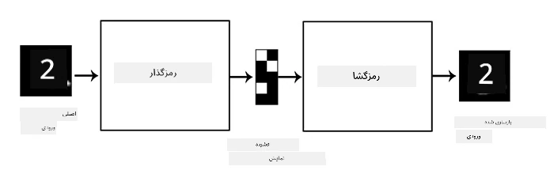
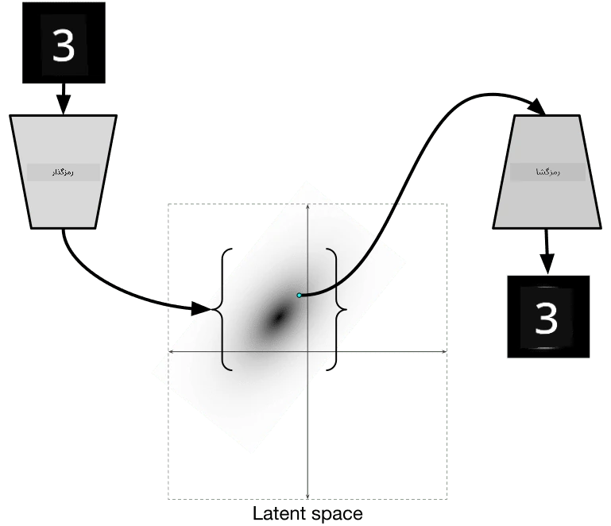

# اتوانکودرها

هنگام آموزش شبکه‌های عصبی کانولوشنی (CNN)، یکی از مشکلات این است که به داده‌های برچسب‌دار زیادی نیاز داریم. در مورد دسته‌بندی تصاویر، باید تصاویر را به کلاس‌های مختلف تقسیم کنیم که این کار به صورت دستی انجام می‌شود.

## [پیش‌آزمون](https://ff-quizzes.netlify.app/en/ai/quiz/17)

با این حال، ممکن است بخواهیم از داده‌های خام (بدون برچسب) برای آموزش استخراج‌کننده‌های ویژگی CNN استفاده کنیم، که به آن **یادگیری خودنظارتی** گفته می‌شود. به جای برچسب‌ها، از تصاویر آموزشی به عنوان ورودی و خروجی شبکه استفاده خواهیم کرد. ایده اصلی **اتوانکودر** این است که یک **شبکه رمزگذار** داشته باشیم که تصویر ورودی را به یک **فضای نهفته** تبدیل کند (معمولاً این فقط یک بردار با اندازه کوچکتر است)، سپس یک **شبکه رمزگشا** که هدف آن بازسازی تصویر اصلی باشد.

> ✅ یک [اتوانکودر](https://wikipedia.org/wiki/Autoencoder) "نوعی شبکه عصبی مصنوعی است که برای یادگیری کدگذاری‌های کارآمد داده‌های بدون برچسب استفاده می‌شود."

از آنجا که ما اتوانکودر را برای گرفتن بیشترین اطلاعات از تصویر اصلی برای بازسازی دقیق آموزش می‌دهیم، شبکه تلاش می‌کند بهترین **تعبیر** از تصاویر ورودی را پیدا کند تا معنا را ثبت کند.

> تصویر از [وبلاگ Keras](https://blog.keras.io/building-autoencoders-in-keras.html)

## سناریوهای استفاده از اتوانکودرها

در حالی که بازسازی تصاویر اصلی به خودی خود مفید به نظر نمی‌رسد، چند سناریو وجود دارد که اتوانکودرها به‌ویژه مفید هستند:

* **کاهش ابعاد تصاویر برای مصورسازی** یا **آموزش تعبیه‌های تصویری**. معمولاً اتوانکودرها نتایج بهتری نسبت به PCA ارائه می‌دهند، زیرا ماهیت فضایی تصاویر و ویژگی‌های سلسله‌مراتبی را در نظر می‌گیرند.
* **حذف نویز**، یعنی حذف نویز از تصویر. از آنجا که نویز اطلاعات بی‌فایده زیادی را حمل می‌کند، اتوانکودر نمی‌تواند همه آن را در فضای نهفته نسبتاً کوچک جا دهد و بنابراین فقط بخش مهم تصویر را ثبت می‌کند. هنگام آموزش حذف‌کننده‌های نویز، با تصاویر اصلی شروع می‌کنیم و از تصاویر با نویز مصنوعی اضافه‌شده به عنوان ورودی برای اتوانکودر استفاده می‌کنیم.
* **افزایش وضوح تصویر**، افزایش وضوح تصویر. با تصاویر با وضوح بالا شروع می‌کنیم و از تصویر با وضوح پایین‌تر به عنوان ورودی اتوانکودر استفاده می‌کنیم.
* **مدل‌های مولد**. پس از آموزش اتوانکودر، بخش رمزگشا می‌تواند برای ایجاد اشیاء جدید از بردارهای نهفته تصادفی استفاده شود.

## اتوانکودرهای واریاسیونی (VAE)

اتوانکودرهای سنتی به نوعی ابعاد داده‌های ورودی را کاهش می‌دهند و ویژگی‌های مهم تصاویر ورودی را شناسایی می‌کنند. با این حال، بردارهای نهفته اغلب معنای خاصی ندارند. به عبارت دیگر، با استفاده از مجموعه داده MNIST به عنوان مثال، شناسایی اینکه کدام ارقام به بردارهای نهفته مختلف مربوط می‌شوند کار آسانی نیست، زیرا بردارهای نهفته نزدیک لزوماً به همان ارقام مربوط نمی‌شوند.

از سوی دیگر، برای آموزش مدل‌های *مولد* بهتر است درک بیشتری از فضای نهفته داشته باشیم. این ایده ما را به **اتوانکودر واریاسیونی** (VAE) هدایت می‌کند.

VAE نوعی اتوانکودر است که یاد می‌گیرد *توزیع آماری* پارامترهای نهفته، یعنی **توزیع نهفته** را پیش‌بینی کند. به عنوان مثال، ممکن است بخواهیم بردارهای نهفته به طور نرمال با میانگین zmean و انحراف معیار zsigma توزیع شوند (هر دو میانگین و انحراف معیار بردارهایی با ابعاد d هستند). رمزگذار در VAE یاد می‌گیرد این پارامترها را پیش‌بینی کند و سپس رمزگشا یک بردار تصادفی از این توزیع را برای بازسازی شیء می‌گیرد.

به طور خلاصه:

* از بردار ورودی، `z_mean` و `z_log_sigma` را پیش‌بینی می‌کنیم (به جای پیش‌بینی انحراف معیار، لگاریتم آن را پیش‌بینی می‌کنیم)
* یک بردار `sample` از توزیع N(zmean,exp(zlog\_sigma)) نمونه‌برداری می‌کنیم
* رمزگشا تلاش می‌کند تصویر اصلی را با استفاده از `sample` به عنوان بردار ورودی رمزگشایی کند

> تصویر از [این پست وبلاگ](https://ijdykeman.github.io/ml/2016/12/21/cvae.html) توسط Isaak Dykeman

اتوانکودرهای واریاسیونی از یک تابع هزینه پیچیده استفاده می‌کنند که شامل دو بخش است:

* **هزینه بازسازی**، تابع هزینه‌ای که نشان می‌دهد تصویر بازسازی‌شده چقدر به هدف نزدیک است (می‌تواند خطای میانگین مربعات یا MSE باشد). این همان تابع هزینه‌ای است که در اتوانکودرهای معمولی استفاده می‌شود.
* **هزینه KL**، که تضمین می‌کند توزیع متغیرهای نهفته به توزیع نرمال نزدیک بماند. این بر اساس مفهوم [واگرایی کولبک-لیبلر](https://www.countbayesie.com/blog/2017/5/9/kullback-leibler-divergence-explained) است - معیاری برای تخمین شباهت دو توزیع آماری.

یکی از مزایای مهم VAE‌ها این است که به ما امکان می‌دهند تصاویر جدید را نسبتاً آسان تولید کنیم، زیرا می‌دانیم از کدام توزیع برای نمونه‌برداری بردارهای نهفته استفاده کنیم. به عنوان مثال، اگر VAE را با بردار نهفته دو‌بعدی روی MNIST آموزش دهیم، می‌توانیم اجزای بردار نهفته را تغییر دهیم تا ارقام مختلفی به دست آوریم:

> تصویر توسط [Dmitry Soshnikov](http://soshnikov.com)

مشاهده کنید که چگونه تصاویر به یکدیگر تبدیل می‌شوند، زیرا شروع به گرفتن بردارهای نهفته از بخش‌های مختلف فضای پارامتر نهفته می‌کنیم. همچنین می‌توانیم این فضا را در دو‌بعد مصورسازی کنیم:

 

> تصویر توسط [Dmitry Soshnikov](http://soshnikov.com)

## ✍️ تمرین‌ها: اتوانکودرها

اطلاعات بیشتری درباره اتوانکودرها در این نوت‌بوک‌ها بیاموزید:

* [اتوانکودرها در TensorFlow](AutoencodersTF.ipynb)
* [اتوانکودرها در PyTorch](AutoEncodersPyTorch.ipynb)

## ویژگی‌های اتوانکودرها

* **داده‌محور** - آن‌ها فقط با نوع تصاویری که روی آن‌ها آموزش داده شده‌اند خوب کار می‌کنند. به عنوان مثال، اگر یک شبکه افزایش وضوح تصویر را روی گل‌ها آموزش دهیم، روی پرتره‌ها خوب کار نخواهد کرد. این به این دلیل است که شبکه می‌تواند تصویر با وضوح بالاتر را با گرفتن جزئیات دقیق از ویژگی‌های یادگرفته‌شده از مجموعه داده آموزشی تولید کند.
* **دارای افت کیفیت** - تصویر بازسازی‌شده همان تصویر اصلی نیست. ماهیت افت کیفیت توسط *تابع هزینه* استفاده‌شده در طول آموزش تعریف می‌شود.
* کار با **داده‌های بدون برچسب**

## [پس‌آزمون](https://ff-quizzes.netlify.app/en/ai/quiz/18)

## نتیجه‌گیری

در این درس، شما درباره انواع مختلف اتوانکودرها که در دسترس دانشمند هوش مصنوعی هستند، یاد گرفتید. شما یاد گرفتید که چگونه آن‌ها را بسازید و چگونه از آن‌ها برای بازسازی تصاویر استفاده کنید. همچنین درباره VAE و نحوه استفاده از آن برای تولید تصاویر جدید یاد گرفتید.

## 🚀 چالش

در این درس، شما درباره استفاده از اتوانکودرها برای تصاویر یاد گرفتید. اما آن‌ها می‌توانند برای موسیقی نیز استفاده شوند! پروژه Magenta [MusicVAE](https://magenta.tensorflow.org/music-vae) از اتوانکودرها برای یادگیری بازسازی موسیقی استفاده می‌کند. با این کتابخانه [آزمایش کنید](https://colab.research.google.com/github/magenta/magenta-demos/blob/master/colab-notebooks/Multitrack_MusicVAE.ipynb) تا ببینید چه چیزی می‌توانید خلق کنید.

## [پس‌آزمون](https://ff-quizzes.netlify.app/en/ai/quiz/16)

## مرور و مطالعه خودآموز

برای مرجع، درباره اتوانکودرها در این منابع بیشتر بخوانید:

* [ساخت اتوانکودرها در Keras](https://blog.keras.io/building-autoencoders-in-keras.html)
* [پست وبلاگ در NeuroHive](https://neurohive.io/ru/osnovy-data-science/variacionnyj-avtojenkoder-vae/)
* [توضیح اتوانکودرهای واریاسیونی](https://kvfrans.com/variational-autoencoders-explained/)
* [اتوانکودرهای واریاسیونی شرطی](https://ijdykeman.github.io/ml/2016/12/21/cvae.html)

## تکلیف

در انتهای [این نوت‌بوک با استفاده از TensorFlow](AutoencodersTF.ipynb)، یک "وظیفه" پیدا خواهید کرد - از این به عنوان تکلیف خود استفاده کنید.

---

