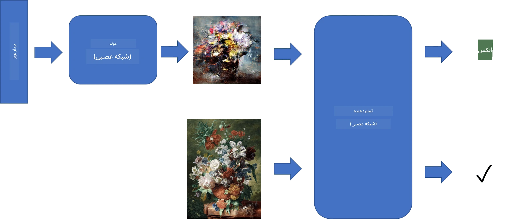
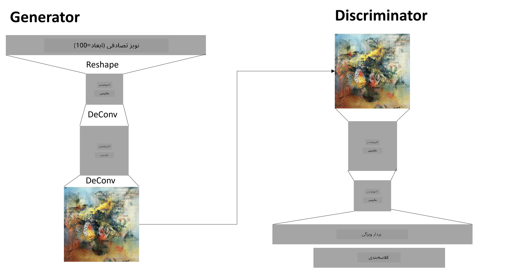

# شبکه‌های مولد تخاصمی

در بخش قبلی، درباره **مدل‌های مولد** یاد گرفتیم: مدل‌هایی که می‌توانند تصاویر جدیدی مشابه تصاویر موجود در مجموعه داده آموزشی تولید کنند. VAE نمونه خوبی از یک مدل مولد بود.

## [آزمون پیش از درس](https://ff-quizzes.netlify.app/en/ai/quiz/19)

با این حال، اگر بخواهیم چیزی واقعاً معنادار، مانند یک نقاشی با وضوح مناسب، با استفاده از VAE تولید کنیم، خواهیم دید که آموزش به خوبی همگرا نمی‌شود. برای این مورد استفاده، باید درباره معماری دیگری که به طور خاص برای مدل‌های مولد طراحی شده است، یاد بگیریم - **شبکه‌های مولد تخاصمی** یا GANs.

ایده اصلی GAN این است که دو شبکه عصبی داشته باشیم که در برابر یکدیگر آموزش داده شوند:

> تصویر از [دمیتری سوشنیکوف](http://soshnikov.com)

> ✅ کمی واژگان:
> * **مولد** شبکه‌ای است که یک بردار تصادفی را می‌گیرد و به عنوان نتیجه تصویر تولید می‌کند.
> * **تمییزدهنده** شبکه‌ای است که یک تصویر را می‌گیرد و باید تشخیص دهد که آیا تصویر واقعی است (از مجموعه داده آموزشی) یا توسط مولد تولید شده است. اساساً یک طبقه‌بند تصویر است.

### تمییزدهنده

معماری تمییزدهنده تفاوتی با یک شبکه طبقه‌بندی تصویر معمولی ندارد. در ساده‌ترین حالت، می‌تواند یک طبقه‌بند کاملاً متصل باشد، اما احتمالاً یک [شبکه کانولوشنی](../07-ConvNets/README.md) خواهد بود.

> ✅ یک GAN مبتنی بر شبکه‌های کانولوشنی به نام [DCGAN](https://arxiv.org/pdf/1511.06434.pdf) شناخته می‌شود.

یک تمییزدهنده CNN شامل لایه‌های زیر است: چندین کانولوشن+پولینگ (با کاهش اندازه فضایی) و یک یا چند لایه کاملاً متصل برای به دست آوردن "بردار ویژگی"، و در نهایت یک طبقه‌بند دودویی.

> ✅ "پولینگ" در این زمینه تکنیکی است که اندازه تصویر را کاهش می‌دهد. "لایه‌های پولینگ ابعاد داده را با ترکیب خروجی‌های خوشه‌های نورون در یک لایه به یک نورون در لایه بعدی کاهش می‌دهند." - [منبع](https://wikipedia.org/wiki/Convolutional_neural_network#Pooling_layers)

### مولد

مولد کمی پیچیده‌تر است. می‌توانید آن را به عنوان یک تمییزدهنده معکوس در نظر بگیرید. شروع از یک بردار نهفته (به جای بردار ویژگی)، یک لایه کاملاً متصل دارد تا آن را به اندازه/شکل مورد نیاز تبدیل کند، و سپس کانولوشن معکوس+بزرگ‌نمایی. این مشابه بخش *رمزگشا* در [خودرمزگذار](../09-Autoencoders/README.md) است.

> ✅ از آنجا که لایه کانولوشن به عنوان یک فیلتر خطی که تصویر را پیمایش می‌کند، پیاده‌سازی می‌شود، کانولوشن معکوس اساساً مشابه کانولوشن است و می‌تواند با استفاده از همان منطق لایه پیاده‌سازی شود.

> تصویر از [دمیتری سوشنیکوف](http://soshnikov.com)

### آموزش GAN

GAN‌ها **تخاصمی** نامیده می‌شوند زیرا یک رقابت دائمی بین مولد و تمییزدهنده وجود دارد. در طول این رقابت، هم مولد و هم تمییزدهنده بهبود می‌یابند، بنابراین شبکه یاد می‌گیرد تصاویر بهتر و بهتری تولید کند.

آموزش در دو مرحله انجام می‌شود:

* **آموزش تمییزدهنده**. این کار نسبتاً ساده است: یک دسته از تصاویر توسط مولد تولید می‌کنیم، آن‌ها را با برچسب 0 (تصویر جعلی) برچسب‌گذاری می‌کنیم، و یک دسته از تصاویر از مجموعه داده ورودی می‌گیریم (با برچسب 1، تصویر واقعی). سپس یک *زیان تمییزدهنده* به دست می‌آوریم و بازپراکنش انجام می‌دهیم.
* **آموزش مولد**. این کمی پیچیده‌تر است، زیرا خروجی مورد انتظار برای مولد را مستقیماً نمی‌دانیم. کل شبکه GAN شامل یک مولد و یک تمییزدهنده را می‌گیریم، آن را با بردارهای تصادفی تغذیه می‌کنیم و انتظار داریم نتیجه 1 باشد (مطابق با تصاویر واقعی). سپس پارامترهای تمییزدهنده را ثابت می‌کنیم (نمی‌خواهیم در این مرحله آموزش داده شود) و بازپراکنش انجام می‌دهیم.

در طول این فرآیند، زیان‌های مولد و تمییزدهنده به طور قابل توجهی کاهش نمی‌یابند. در حالت ایده‌آل، آن‌ها باید نوسان کنند، که نشان‌دهنده بهبود عملکرد هر دو شبکه است.

## ✍️ تمرین‌ها: GAN‌ها

* [دفترچه یادداشت GAN در TensorFlow/Keras](GANTF.ipynb)
* [دفترچه یادداشت GAN در PyTorch](GANPyTorch.ipynb)

### مشکلات آموزش GAN

GAN‌ها به طور خاص دشوار برای آموزش شناخته شده‌اند. در اینجا چند مشکل وجود دارد:

* **فروپاشی حالت**. این اصطلاح به این معناست که مولد یاد می‌گیرد یک تصویر موفق تولید کند که تمییزدهنده را فریب دهد، و نه مجموعه‌ای از تصاویر مختلف.
* **حساسیت به ابرپارامترها**. اغلب می‌بینید که یک GAN اصلاً همگرا نمی‌شود، و سپس به طور ناگهانی با کاهش نرخ یادگیری به همگرایی می‌رسد.
* حفظ **تعادل** بین مولد و تمییزدهنده. در بسیاری از موارد، زیان تمییزدهنده می‌تواند نسبتاً سریع به صفر برسد، که باعث می‌شود مولد نتواند بیشتر آموزش ببیند. برای غلبه بر این مشکل، می‌توانیم نرخ‌های یادگیری متفاوتی برای مولد و تمییزدهنده تنظیم کنیم، یا آموزش تمییزدهنده را متوقف کنیم اگر زیان آن قبلاً خیلی کم باشد.
* آموزش برای **وضوح بالا**. بازتاب همان مشکلی که با خودرمزگذارها وجود دارد، این مشکل به دلیل بازسازی تعداد زیادی لایه شبکه کانولوشنی منجر به مصنوعات می‌شود. این مشکل معمولاً با **رشد تدریجی** حل می‌شود، که ابتدا چند لایه روی تصاویر با وضوح پایین آموزش داده می‌شوند و سپس لایه‌ها "باز می‌شوند" یا اضافه می‌شوند. راه‌حل دیگر اضافه کردن اتصالات اضافی بین لایه‌ها و آموزش چند وضوح به طور همزمان است - برای جزئیات بیشتر به این [مقاله Multi-Scale Gradient GANs](https://arxiv.org/abs/1903.06048) مراجعه کنید.

## انتقال سبک

GAN‌ها راهی عالی برای تولید تصاویر هنری هستند. تکنیک جالب دیگری به نام **انتقال سبک** وجود دارد که یک **تصویر محتوا** را می‌گیرد و آن را در سبک متفاوتی بازطراحی می‌کند، با اعمال فیلترهایی از **تصویر سبک**.

نحوه کار به این صورت است:
* با یک تصویر نویز تصادفی شروع می‌کنیم (یا با یک تصویر محتوا، اما برای درک بهتر بهتر است از نویز تصادفی شروع کنیم)
* هدف ما ایجاد تصویری است که به هر دو تصویر محتوا و تصویر سبک نزدیک باشد. این با دو تابع زیان تعیین می‌شود:
   - **زیان محتوا** بر اساس ویژگی‌های استخراج‌شده توسط CNN در برخی لایه‌ها از تصویر فعلی و تصویر محتوا محاسبه می‌شود.
   - **زیان سبک** بین تصویر فعلی و تصویر سبک به روش هوشمندانه‌ای با استفاده از ماتریس‌های گرام محاسبه می‌شود (جزئیات بیشتر در [دفترچه یادداشت نمونه](StyleTransfer.ipynb)).
* برای صاف‌تر کردن تصویر و حذف نویز، همچنین **زیان تغییرات** معرفی می‌کنیم، که فاصله متوسط بین پیکسل‌های همسایه را محاسبه می‌کند.
* حلقه اصلی بهینه‌سازی تصویر فعلی را با استفاده از نزول گرادیان (یا برخی الگوریتم‌های بهینه‌سازی دیگر) تنظیم می‌کند تا زیان کل، که مجموع وزنی همه زیان‌ها است، به حداقل برسد.

## ✍️ مثال: [انتقال سبک](StyleTransfer.ipynb)

## [آزمون پس از درس](https://ff-quizzes.netlify.app/en/ai/quiz/20)

## نتیجه‌گیری

در این درس، درباره GAN‌ها و نحوه آموزش آن‌ها یاد گرفتید. همچنین درباره چالش‌های خاصی که این نوع شبکه عصبی ممکن است با آن مواجه شود و برخی استراتژی‌ها برای عبور از آن‌ها یاد گرفتید.

## 🚀 چالش

دفترچه یادداشت [انتقال سبک](StyleTransfer.ipynb) را با استفاده از تصاویر خودتان اجرا کنید.

## مرور و مطالعه خودآموز

برای مرجع، درباره GAN‌ها در این منابع بیشتر بخوانید:

* مارکو پاسینی، [10 درس که از آموزش GAN‌ها در یک سال یاد گرفتم](https://towardsdatascience.com/10-lessons-i-learned-training-generative-adversarial-networks-gans-for-a-year-c9071159628)
* [StyleGAN](https://en.wikipedia.org/wiki/StyleGAN)، یک معماری GAN که باید در نظر گرفته شود
* [ایجاد هنر مولد با استفاده از GAN‌ها در Azure ML](https://soshnikov.com/scienceart/creating-generative-art-using-gan-on-azureml/)

## تکلیف

یکی از دو دفترچه یادداشت مرتبط با این درس را مرور کنید و GAN را با تصاویر خودتان دوباره آموزش دهید. چه چیزی می‌توانید ایجاد کنید؟

---

