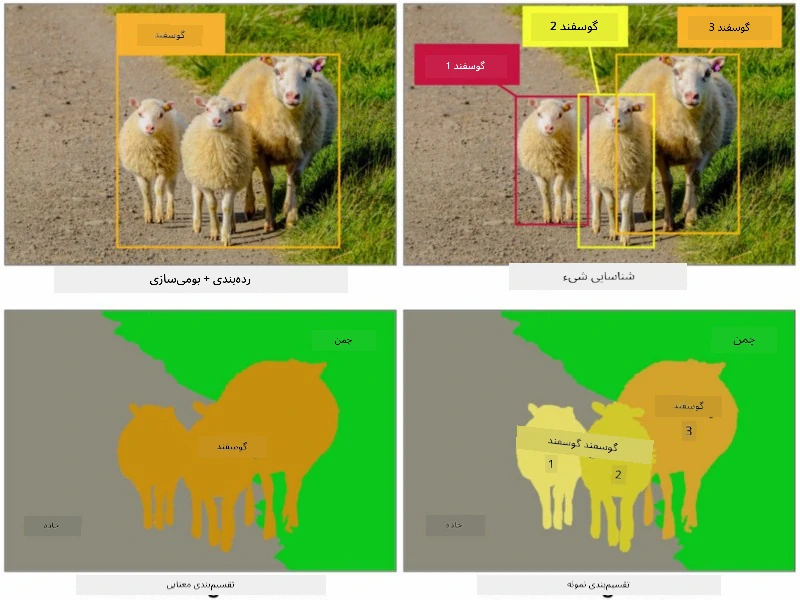
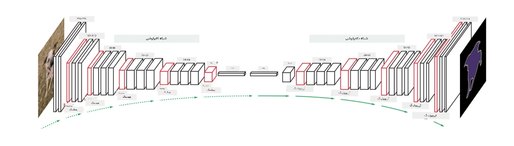
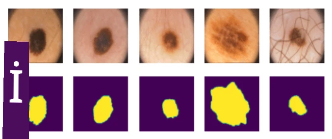

# بخش‌بندی

ما قبلاً درباره تشخیص اشیا یاد گرفتیم، که به ما امکان می‌دهد اشیا را در تصویر با پیش‌بینی *جعبه‌های محدودکننده* مکان‌یابی کنیم. با این حال، برای برخی وظایف، نه تنها به جعبه‌های محدودکننده نیاز داریم، بلکه به مکان‌یابی دقیق‌تر اشیا نیز احتیاج داریم. این وظیفه **بخش‌بندی** نامیده می‌شود.

## [پیش‌زمینه آزمون](https://ff-quizzes.netlify.app/en/ai/quiz/23)

بخش‌بندی را می‌توان به عنوان **طبقه‌بندی پیکسل‌ها** در نظر گرفت، به این صورت که برای **هر** پیکسل تصویر باید کلاس آن را پیش‌بینی کنیم (*پس‌زمینه* یکی از کلاس‌ها است). دو الگوریتم اصلی برای بخش‌بندی وجود دارد:

* **بخش‌بندی معنایی** فقط کلاس پیکسل را مشخص می‌کند و بین اشیای مختلف از یک کلاس تفاوتی قائل نمی‌شود.
* **بخش‌بندی نمونه‌ای** کلاس‌ها را به نمونه‌های مختلف تقسیم می‌کند.

برای بخش‌بندی نمونه‌ای، این گوسفندها اشیای مختلفی هستند، اما برای بخش‌بندی معنایی همه گوسفندها به عنوان یک کلاس نمایش داده می‌شوند.

> تصویر از [این پست وبلاگ](https://nirmalamurali.medium.com/image-classification-vs-semantic-segmentation-vs-instance-segmentation-625c33a08d50)

معماری‌های عصبی مختلفی برای بخش‌بندی وجود دارد، اما همه آن‌ها ساختار مشابهی دارند. به نوعی، این معماری‌ها شبیه به خودرمزگذارهایی هستند که قبلاً درباره آن‌ها یاد گرفتید، اما به جای بازسازی تصویر اصلی، هدف ما بازسازی یک **ماسک** است. بنابراین، یک شبکه بخش‌بندی شامل بخش‌های زیر است:

* **رمزگذار** ویژگی‌ها را از تصویر ورودی استخراج می‌کند.
* **رمزگشا** این ویژگی‌ها را به تصویر **ماسک** تبدیل می‌کند، با همان اندازه و تعداد کانال‌ها که به تعداد کلاس‌ها مربوط می‌شود.

> تصویر از [این مقاله](https://arxiv.org/pdf/2001.05566.pdf)

باید به طور ویژه به تابع زیان مورد استفاده برای بخش‌بندی اشاره کنیم. هنگام استفاده از خودرمزگذارهای کلاسیک، باید شباهت بین دو تصویر را اندازه‌گیری کنیم و می‌توانیم از میانگین مربعات خطا (MSE) برای این کار استفاده کنیم. در بخش‌بندی، هر پیکسل در تصویر ماسک هدف نشان‌دهنده شماره کلاس است (به صورت یک‌کدگذاری در بعد سوم)، بنابراین باید از توابع زیان خاص برای طبقه‌بندی استفاده کنیم - زیان آنتروپی متقاطع، که میانگین آن بر روی تمام پیکسل‌ها گرفته می‌شود. اگر ماسک دودویی باشد، از **زیان آنتروپی متقاطع دودویی** (BCE) استفاده می‌شود.

> ✅ یک‌کدگذاری روشی برای کدگذاری برچسب کلاس به یک بردار با طول برابر با تعداد کلاس‌ها است. به [این مقاله](https://datagy.io/sklearn-one-hot-encode/) درباره این تکنیک نگاهی بیندازید.

## بخش‌بندی در تصویربرداری پزشکی

در این درس، بخش‌بندی را در عمل مشاهده خواهیم کرد، با آموزش شبکه برای شناسایی خال‌های انسانی (که به عنوان مول نیز شناخته می‌شوند) در تصاویر پزشکی. ما از <a href="https://www.fc.up.pt/addi/ph2%20database.html">پایگاه داده PH2</a> تصاویر درموسکوپی به عنوان منبع تصاویر استفاده خواهیم کرد. این مجموعه داده شامل 200 تصویر از سه کلاس است: خال معمولی، خال غیرمعمولی، و ملانوما. همه تصاویر همچنین شامل یک **ماسک** هستند که خال را مشخص می‌کند.

> ✅ این تکنیک به طور خاص برای این نوع تصویربرداری پزشکی مناسب است، اما چه کاربردهای واقعی دیگری را می‌توانید تصور کنید؟

> تصویر از پایگاه داده PH2

ما مدلی را آموزش خواهیم داد تا هر خال را از پس‌زمینه آن بخش‌بندی کند.

## ✍️ تمرین‌ها: بخش‌بندی معنایی

دفترچه‌های زیر را باز کنید تا درباره معماری‌های مختلف بخش‌بندی معنایی بیشتر بیاموزید، با آن‌ها کار کنید و آن‌ها را در عمل مشاهده کنید.

* [بخش‌بندی معنایی با Pytorch](SemanticSegmentationPytorch.ipynb)
* [بخش‌بندی معنایی با TensorFlow](SemanticSegmentationTF.ipynb)

## [آزمون پس از درس](https://ff-quizzes.netlify.app/en/ai/quiz/24)

## نتیجه‌گیری

بخش‌بندی یک تکنیک بسیار قدرتمند برای طبقه‌بندی تصاویر است که از جعبه‌های محدودکننده فراتر رفته و به طبقه‌بندی در سطح پیکسل می‌پردازد. این تکنیک در تصویربرداری پزشکی و سایر کاربردها استفاده می‌شود.

## 🚀 چالش

بخش‌بندی بدن فقط یکی از وظایف رایج است که می‌توانیم با تصاویر افراد انجام دهیم. وظایف مهم دیگر شامل **تشخیص اسکلت** و **تشخیص حالت** است. کتابخانه [OpenPose](https://github.com/CMU-Perceptual-Computing-Lab/openpose) را امتحان کنید تا ببینید چگونه می‌توان از تشخیص حالت استفاده کرد.

## مرور و مطالعه خودآموز

این [مقاله ویکی‌پدیا](https://wikipedia.org/wiki/Image_segmentation) نمای کلی خوبی از کاربردهای مختلف این تکنیک ارائه می‌دهد. درباره زیرشاخه‌های بخش‌بندی نمونه‌ای و بخش‌بندی پانورامیک در این حوزه تحقیق کنید.

## [تکلیف](lab/README.md)

در این آزمایشگاه، **بخش‌بندی بدن انسان** را با استفاده از [مجموعه داده بخش‌بندی کامل بدن MADS](https://www.kaggle.com/datasets/tapakah68/segmentation-full-body-mads-dataset) از Kaggle امتحان کنید.

---

