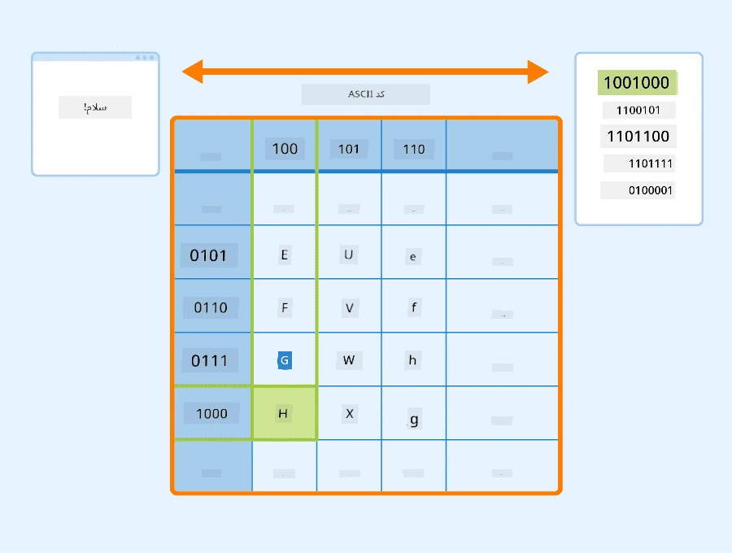
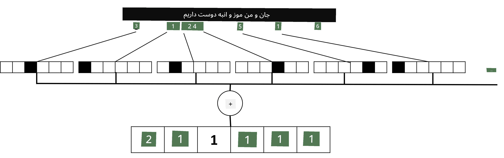

# نمایش متن به صورت تنسورها

## [پیش‌ آزمون](https://ff-quizzes.netlify.app/en/ai/quiz/25)

## طبقه‌بندی متن

در بخش اول این قسمت، بر روی وظیفه **طبقه‌بندی متن** تمرکز خواهیم کرد. ما از مجموعه داده [AG News](https://www.kaggle.com/amananandrai/ag-news-classification-dataset) استفاده خواهیم کرد که شامل مقالات خبری مانند موارد زیر است:

* دسته‌بندی: علمی/فناوری  
* عنوان: شرکت Ky. برنده کمک‌هزینه برای مطالعه پپتیدها شد (AP)  
* متن: AP - یک شرکت که توسط یک محقق شیمی در دانشگاه لوییویل تأسیس شده است، کمک‌هزینه‌ای برای توسعه دریافت کرد...

هدف ما این خواهد بود که خبر را بر اساس متن به یکی از دسته‌بندی‌ها طبقه‌بندی کنیم.

## نمایش متن

اگر بخواهیم وظایف پردازش زبان طبیعی (NLP) را با شبکه‌های عصبی حل کنیم، باید راهی برای نمایش متن به صورت تنسورها داشته باشیم. کامپیوترها از قبل کاراکترهای متنی را به صورت اعداد نمایش می‌دهند که با استفاده از کدگذاری‌هایی مانند ASCII یا UTF-8 به فونت‌های روی صفحه شما نگاشت می‌شوند.

> [منبع تصویر](https://www.seobility.net/en/wiki/ASCII)

ما به عنوان انسان می‌دانیم هر حرف **نمایانگر** چیست و چگونه همه کاراکترها کنار هم قرار می‌گیرند تا کلمات یک جمله را تشکیل دهند. اما کامپیوترها به خودی خود چنین درکی ندارند و شبکه عصبی باید این معنا را در طول آموزش یاد بگیرد.

بنابراین، می‌توانیم از روش‌های مختلفی برای نمایش متن استفاده کنیم:

* **نمایش سطح کاراکتر**، که در آن متن را با در نظر گرفتن هر کاراکتر به عنوان یک عدد نمایش می‌دهیم. با فرض اینکه *C* کاراکتر مختلف در مجموعه متن ما وجود دارد، کلمه *Hello* به صورت یک تنسور 5x*C* نمایش داده می‌شود. هر حرف به یک ستون تنسور در کدگذاری یک‌داغ (one-hot encoding) تبدیل می‌شود.
* **نمایش سطح کلمه**، که در آن یک **واژگان** از تمام کلمات موجود در متن ایجاد می‌کنیم و سپس کلمات را با استفاده از کدگذاری یک‌داغ نمایش می‌دهیم. این روش تا حدی بهتر است، زیرا هر حرف به تنهایی معنای زیادی ندارد و با استفاده از مفاهیم معنایی سطح بالاتر - کلمات - وظیفه را برای شبکه عصبی ساده‌تر می‌کنیم. با این حال، با توجه به اندازه بزرگ واژگان، باید با تنسورهای پراکنده با ابعاد بالا کار کنیم.

صرف نظر از نوع نمایش، ابتدا باید متن را به یک دنباله از **توکن‌ها** تبدیل کنیم، که هر توکن می‌تواند یک کاراکتر، یک کلمه یا حتی بخشی از یک کلمه باشد. سپس، توکن را به یک عدد تبدیل می‌کنیم، معمولاً با استفاده از **واژگان**، و این عدد می‌تواند با استفاده از کدگذاری یک‌داغ به شبکه عصبی داده شود.

## N-Grams

در زبان طبیعی، معنای دقیق کلمات تنها در متن مشخص می‌شود. برای مثال، معانی *شبکه عصبی* و *شبکه ماهیگیری* کاملاً متفاوت هستند. یکی از روش‌های در نظر گرفتن این موضوع این است که مدل خود را بر اساس جفت‌های کلمات بسازیم و جفت‌های کلمات را به عنوان توکن‌های جداگانه واژگان در نظر بگیریم. به این ترتیب، جمله *من دوست دارم ماهیگیری کنم* به دنباله‌ای از توکن‌ها به صورت زیر نمایش داده می‌شود: *من دوست دارم*، *دوست دارم*، *دارم بروم*، *بروم ماهیگیری*. مشکل این روش این است که اندازه واژگان به طور قابل توجهی افزایش می‌یابد و ترکیباتی مانند *بروم ماهیگیری* و *بروم خرید* با توکن‌های متفاوتی نمایش داده می‌شوند که هیچ شباهت معنایی مشترکی ندارند، با وجود اینکه فعل یکسان است.

در برخی موارد، ممکن است استفاده از سه‌گرام‌ها -- ترکیبات سه کلمه‌ای -- نیز در نظر گرفته شود. بنابراین این روش اغلب **n-grams** نامیده می‌شود. همچنین، استفاده از n-grams با نمایش سطح کاراکتر منطقی است، که در این صورت n-grams تقریباً به هجاهای مختلف متناظر خواهد بود.

## کیسه کلمات و TF/IDF

هنگام حل وظایفی مانند طبقه‌بندی متن، باید بتوانیم متن را به یک بردار با اندازه ثابت نمایش دهیم که به عنوان ورودی به طبقه‌بند نهایی متراکم استفاده شود. یکی از ساده‌ترین روش‌ها برای انجام این کار، ترکیب تمام نمایش‌های کلمات جداگانه است، به عنوان مثال با جمع کردن آنها. اگر کدگذاری‌های یک‌داغ هر کلمه را جمع کنیم، به یک بردار فرکانس‌ها می‌رسیم که نشان می‌دهد هر کلمه چند بار در متن ظاهر شده است. چنین نمایش متنی **کیسه کلمات** (BoW) نامیده می‌شود.

> تصویر توسط نویسنده

یک BoW اساساً نشان می‌دهد که کدام کلمات در متن ظاهر می‌شوند و به چه تعداد، که می‌تواند نشانگر خوبی از موضوع متن باشد. برای مثال، مقاله خبری درباره سیاست احتمالاً شامل کلماتی مانند *رئیس‌جمهور* و *کشور* خواهد بود، در حالی که یک مقاله علمی ممکن است شامل کلماتی مانند *برخورددهنده*، *کشف شده* و غیره باشد. بنابراین، فرکانس کلمات در بسیاری از موارد می‌تواند نشانگر خوبی از محتوای متن باشد.

مشکل BoW این است که برخی کلمات رایج، مانند *و*، *است* و غیره، در اکثر متون ظاهر می‌شوند و بالاترین فرکانس‌ها را دارند، که کلمات واقعاً مهم را تحت‌الشعاع قرار می‌دهند. ممکن است اهمیت این کلمات را با در نظر گرفتن فرکانس وقوع آنها در کل مجموعه اسناد کاهش دهیم. این ایده اصلی پشت روش TF/IDF است که در جزوه‌های ضمیمه این درس به تفصیل پوشش داده شده است.

با این حال، هیچ‌یک از این روش‌ها نمی‌توانند به طور کامل **معناشناسی** متن را در نظر بگیرند. برای این کار به مدل‌های قدرتمندتر شبکه‌های عصبی نیاز داریم که در ادامه این بخش مورد بحث قرار خواهند گرفت.

## ✍️ تمرین‌ها: نمایش متن

یادگیری خود را در جزوه‌های زیر ادامه دهید:

* [نمایش متن با PyTorch](TextRepresentationPyTorch.ipynb)  
* [نمایش متن با TensorFlow](TextRepresentationTF.ipynb)  

## نتیجه‌گیری

تا اینجا، تکنیک‌هایی را مطالعه کرده‌ایم که می‌توانند وزن فرکانس را به کلمات مختلف اضافه کنند. با این حال، این تکنیک‌ها قادر به نمایش معنا یا ترتیب نیستند. همانطور که زبان‌شناس معروف J. R. Firth در سال 1935 گفت: "معنای کامل یک کلمه همیشه وابسته به متن است و هیچ مطالعه‌ای از معنا جدا از متن نمی‌تواند جدی گرفته شود." در ادامه دوره یاد خواهیم گرفت که چگونه اطلاعات متنی را از متن با استفاده از مدل‌سازی زبان استخراج کنیم.

## 🚀 چالش

برخی تمرین‌های دیگر را با استفاده از کیسه کلمات و مدل‌های داده مختلف امتحان کنید. ممکن است از این [رقابت در Kaggle](https://www.kaggle.com/competitions/word2vec-nlp-tutorial/overview/part-1-for-beginners-bag-of-words) الهام بگیرید.

## [پس‌آزمون](https://ff-quizzes.netlify.app/en/ai/quiz/26)

## مرور و مطالعه خودآموز

مهارت‌های خود را با تکنیک‌های تعبیه متن و کیسه کلمات در [Microsoft Learn](https://docs.microsoft.com/learn/modules/intro-natural-language-processing-pytorch/?WT.mc_id=academic-77998-cacaste) تمرین کنید.

## [تکلیف: جزوه‌ها](assignment.md)

---

