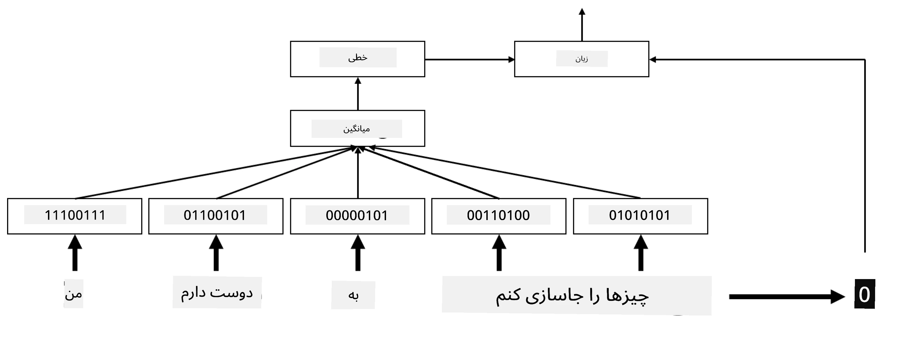
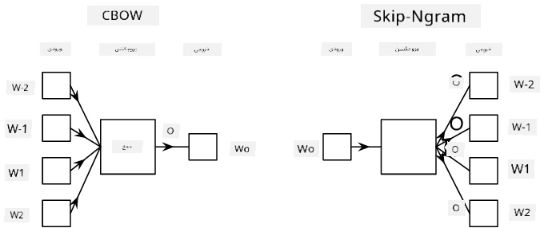

# تعبیه‌ها

## [پیش‌آزمون](https://ff-quizzes.netlify.app/en/ai/quiz/27)

هنگام آموزش دسته‌بندها بر اساس BoW یا TF/IDF، ما با بردارهای کیسه کلمات با ابعاد بالا که طول آن‌ها `vocab_size` بود کار می‌کردیم و به‌طور صریح از بردارهای نمایشی موقعیتی با ابعاد پایین به نمایش‌های پراکنده یک‌داغ تبدیل می‌کردیم. با این حال، این نمایش یک‌داغ از نظر حافظه کارآمد نیست. علاوه بر این، هر کلمه به‌طور مستقل از دیگر کلمات در نظر گرفته می‌شود، یعنی بردارهای کدگذاری‌شده یک‌داغ هیچ شباهت معنایی بین کلمات را بیان نمی‌کنند.

ایده **تعبیه** این است که کلمات را با بردارهای متراکم با ابعاد پایین‌تر نمایش دهیم که به نوعی معنای معنایی یک کلمه را منعکس کنند. بعداً درباره نحوه ساخت تعبیه‌های معنایی کلمات بحث خواهیم کرد، اما فعلاً فقط به تعبیه‌ها به‌عنوان روشی برای کاهش ابعاد بردار کلمه فکر کنید.

بنابراین، لایه تعبیه یک کلمه را به‌عنوان ورودی می‌گیرد و یک بردار خروجی با اندازه مشخص `embedding_size` تولید می‌کند. به نوعی، این لایه بسیار شبیه به یک لایه `Linear` است، اما به‌جای گرفتن یک بردار کدگذاری‌شده یک‌داغ، می‌تواند شماره کلمه را به‌عنوان ورودی بگیرد و به ما اجازه دهد از ایجاد بردارهای بزرگ کدگذاری‌شده یک‌داغ اجتناب کنیم.

با استفاده از یک لایه تعبیه به‌عنوان اولین لایه در شبکه دسته‌بند خود، می‌توانیم از مدل کیسه کلمات به مدل **کیسه تعبیه‌ها** تغییر دهیم، جایی که ابتدا هر کلمه در متن خود را به تعبیه مربوطه تبدیل می‌کنیم و سپس یک تابع تجمعی مانند `sum`، `average` یا `max` را بر روی تمام این تعبیه‌ها محاسبه می‌کنیم.

> تصویر توسط نویسنده

## ✍️ تمرین‌ها: تعبیه‌ها

یادگیری خود را در نوت‌بوک‌های زیر ادامه دهید:
* [تعبیه‌ها با PyTorch](EmbeddingsPyTorch.ipynb)
* [تعبیه‌ها با TensorFlow](EmbeddingsTF.ipynb)

## تعبیه‌های معنایی: Word2Vec

در حالی که لایه تعبیه یاد گرفت که کلمات را به نمایش برداری نگاشت کند، این نمایش لزوماً معنای معنایی زیادی نداشت. خوب است که یک نمایش برداری یاد بگیریم که کلمات مشابه یا مترادف‌ها به بردارهایی تبدیل شوند که از نظر فاصله برداری (مثلاً فاصله اقلیدسی) به یکدیگر نزدیک باشند.

برای انجام این کار، باید مدل تعبیه خود را به‌طور پیش‌فرض بر روی مجموعه بزرگی از متن به روش خاصی آموزش دهیم. یکی از روش‌های آموزش تعبیه‌های معنایی [Word2Vec](https://en.wikipedia.org/wiki/Word2vec) نام دارد. این روش بر اساس دو معماری اصلی است که برای تولید نمایش توزیع‌شده کلمات استفاده می‌شوند:

- **کیسه کلمات پیوسته** (CBoW) — در این معماری، مدل را آموزش می‌دهیم تا یک کلمه را از متن اطراف پیش‌بینی کند. با توجه به ngram $(W_{-2},W_{-1},W_0,W_1,W_2)$، هدف مدل پیش‌بینی $W_0$ از $(W_{-2},W_{-1},W_1,W_2)$ است.
- **اسکیپ‌گرام پیوسته** برخلاف CBoW عمل می‌کند. مدل از پنجره‌ای از کلمات متن اطراف برای پیش‌بینی کلمه فعلی استفاده می‌کند.

CBoW سریع‌تر است، در حالی که اسکیپ‌گرام کندتر است اما در نمایش کلمات نادر بهتر عمل می‌کند.

> تصویر از [این مقاله](https://arxiv.org/pdf/1301.3781.pdf)

تعبیه‌های پیش‌آموزش‌شده Word2Vec (و همچنین مدل‌های مشابه دیگر مانند GloVe) می‌توانند به‌جای لایه تعبیه در شبکه‌های عصبی استفاده شوند. با این حال، باید با واژگان‌ها کار کنیم، زیرا واژگان استفاده‌شده برای پیش‌آموزش Word2Vec/GloVe احتمالاً با واژگان موجود در مجموعه متن ما متفاوت است. به نوت‌بوک‌های بالا نگاهی بیندازید تا ببینید چگونه این مشکل حل می‌شود.

## تعبیه‌های متنی

یکی از محدودیت‌های کلیدی نمایش‌های تعبیه پیش‌آموزش‌شده سنتی مانند Word2Vec مشکل رفع ابهام معنای کلمات است. در حالی که تعبیه‌های پیش‌آموزش‌شده می‌توانند بخشی از معنای کلمات در متن را به تصویر بکشند، هر معنای ممکن یک کلمه در همان تعبیه کدگذاری می‌شود. این می‌تواند در مدل‌های پایین‌دستی مشکلاتی ایجاد کند، زیرا بسیاری از کلمات مانند کلمه "play" بسته به متنی که در آن استفاده می‌شوند معانی متفاوتی دارند.

برای مثال، کلمه "play" در این دو جمله معانی کاملاً متفاوتی دارد:

- من به یک **نمایش** در تئاتر رفتم.
- جان می‌خواهد با دوستانش **بازی** کند.

تعبیه‌های پیش‌آموزش‌شده بالا هر دو معنای کلمه "play" را در همان تعبیه نمایش می‌دهند. برای غلبه بر این محدودیت، باید تعبیه‌هایی بر اساس **مدل زبان** بسازیم که بر روی مجموعه بزرگی از متن آموزش داده شده و *می‌داند* چگونه کلمات می‌توانند در متن‌های مختلف کنار هم قرار گیرند. بحث درباره تعبیه‌های متنی خارج از محدوده این آموزش است، اما وقتی درباره مدل‌های زبان در ادامه دوره صحبت کنیم به آن‌ها بازخواهیم گشت.

## نتیجه‌گیری

در این درس، شما یاد گرفتید که چگونه لایه‌های تعبیه را در TensorFlow و PyTorch بسازید و استفاده کنید تا معنای معنایی کلمات بهتر منعکس شود.

## 🚀 چالش

Word2Vec برای برخی کاربردهای جالب مانند تولید شعر و ترانه استفاده شده است. به [این مقاله](https://www.politetype.com/blog/word2vec-color-poems) نگاهی بیندازید که توضیح می‌دهد چگونه نویسنده از Word2Vec برای تولید شعر استفاده کرده است. همچنین [این ویدیو از Dan Shiffmann](https://www.youtube.com/watch?v=LSS_bos_TPI&ab_channel=TheCodingTrain) را ببینید تا توضیح دیگری از این تکنیک را کشف کنید. سپس سعی کنید این تکنیک‌ها را بر روی مجموعه متن خود، شاید از Kaggle، اعمال کنید.

## [پس‌آزمون](https://ff-quizzes.netlify.app/en/ai/quiz/28)

## مرور و مطالعه خودآموز

این مقاله درباره Word2Vec را بخوانید: [Efficient Estimation of Word Representations in Vector Space](https://arxiv.org/pdf/1301.3781.pdf)

## [تکلیف: نوت‌بوک‌ها](assignment.md)

---

