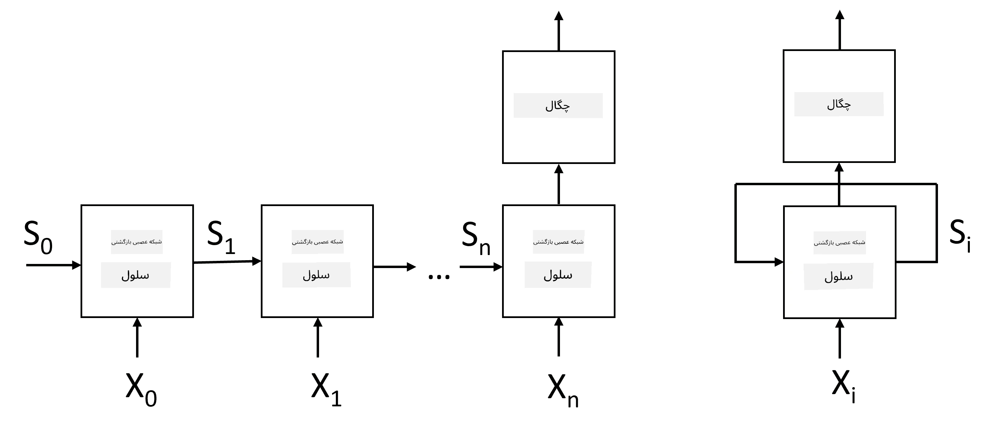
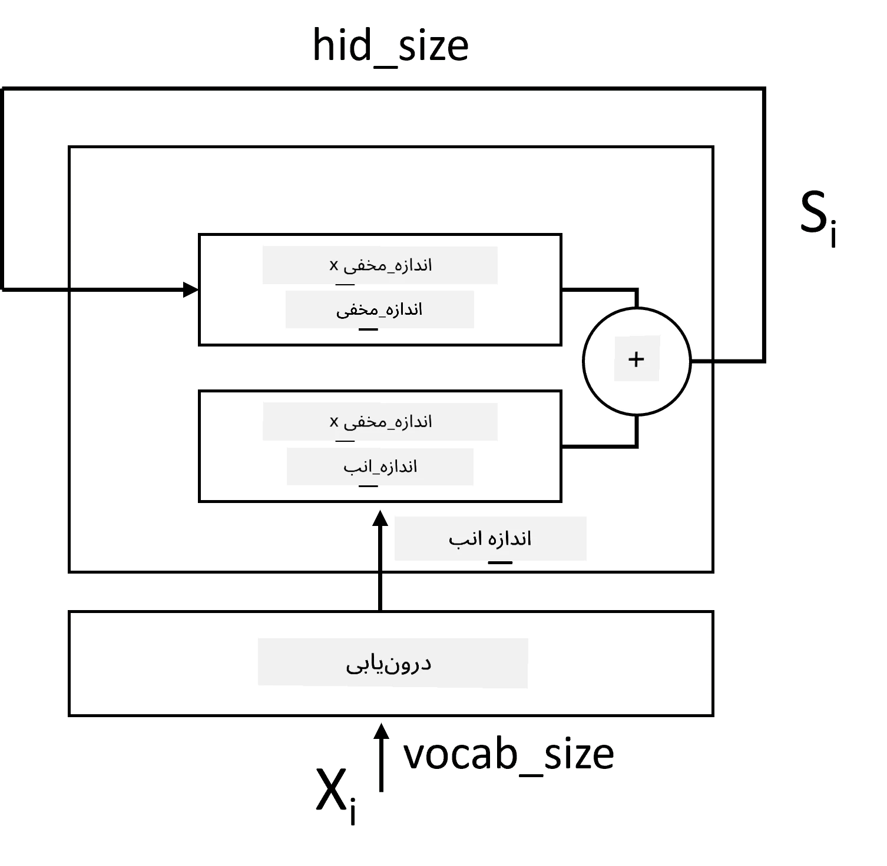
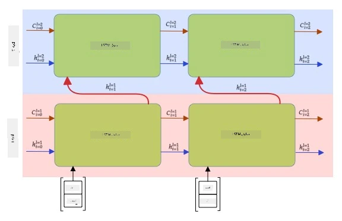

# شبکه‌های عصبی بازگشتی

## [آزمون پیش از درس](https://ff-quizzes.netlify.app/en/ai/quiz/31)

در بخش‌های قبلی، ما از نمایش‌های معنایی غنی متن و یک طبقه‌بند خطی ساده بر روی تعبیه‌ها استفاده کردیم. این معماری معنای کلی کلمات در یک جمله را استخراج می‌کند، اما ترتیب کلمات را در نظر نمی‌گیرد، زیرا عملیات تجمیع بر روی تعبیه‌ها این اطلاعات را از متن اصلی حذف می‌کند. به دلیل اینکه این مدل‌ها قادر به مدل‌سازی ترتیب کلمات نیستند، نمی‌توانند وظایف پیچیده‌تر یا مبهم‌تری مانند تولید متن یا پاسخ به سوالات را حل کنند.

برای درک معنای دنباله‌های متنی، نیاز به استفاده از معماری دیگری از شبکه‌های عصبی داریم که به آن **شبکه عصبی بازگشتی** یا RNN گفته می‌شود. در RNN، جمله را به صورت نماد به نماد از طریق شبکه عبور می‌دهیم و شبکه یک **وضعیت** تولید می‌کند که سپس با نماد بعدی به شبکه بازگردانده می‌شود.

> تصویر از نویسنده

با توجه به دنباله ورودی توکن‌ها X0,...,Xn، RNN یک دنباله از بلوک‌های شبکه عصبی ایجاد می‌کند و این دنباله را به صورت انتها به انتها با استفاده از پس‌انتشار آموزش می‌دهد. هر بلوک شبکه یک جفت (Xi,Si) را به عنوان ورودی می‌گیرد و Si+1 را به عنوان نتیجه تولید می‌کند. وضعیت نهایی Sn یا (خروجی Yn) به یک طبقه‌بند خطی ارسال می‌شود تا نتیجه تولید شود. تمام بلوک‌های شبکه وزن‌های یکسانی دارند و با یک پاس پس‌انتشار به صورت انتها به انتها آموزش داده می‌شوند.

به دلیل اینکه بردارهای وضعیت S0,...,Sn از طریق شبکه عبور می‌کنند، شبکه قادر است وابستگی‌های ترتیبی بین کلمات را یاد بگیرد. برای مثال، وقتی کلمه *not* در جایی از دنباله ظاهر می‌شود، شبکه می‌تواند یاد بگیرد که برخی از عناصر درون بردار وضعیت را نفی کند و در نتیجه نفی را اعمال کند.

> ✅ از آنجا که وزن‌های تمام بلوک‌های RNN در تصویر بالا مشترک هستند، می‌توان همان تصویر را به صورت یک بلوک (در سمت راست) با یک حلقه بازگشتی نمایش داد که خروجی وضعیت شبکه را به ورودی بازمی‌گرداند.

## ساختار یک سلول RNN

بیایید ببینیم یک سلول ساده RNN چگونه سازماندهی شده است. این سلول وضعیت قبلی Si-1 و نماد فعلی Xi را به عنوان ورودی می‌گیرد و باید وضعیت خروجی Si (و گاهی اوقات خروجی دیگری Yi، مانند شبکه‌های مولد) را تولید کند.

یک سلول ساده RNN دارای دو ماتریس وزن داخلی است: یکی نماد ورودی را تبدیل می‌کند (آن را W می‌نامیم) و دیگری وضعیت ورودی را تبدیل می‌کند (H). در این حالت، خروجی شبکه به صورت &sigma;(W&times;Xi+H&times;Si-1+b) محاسبه می‌شود، که در آن &sigma; تابع فعال‌سازی و b بایاس اضافی است.

> تصویر از نویسنده

در بسیاری از موارد، توکن‌های ورودی قبل از ورود به RNN از لایه تعبیه عبور می‌کنند تا ابعاد کاهش یابد. در این حالت، اگر بعد بردارهای ورودی *emb_size* و بردار وضعیت *hid_size* باشد، اندازه W برابر با *emb_size*&times;*hid_size* و اندازه H برابر با *hid_size*&times;*hid_size* خواهد بود.

## حافظه طولانی-کوتاه مدت (LSTM)

یکی از مشکلات اصلی RNNهای کلاسیک مشکل **گرادیان‌های ناپدیدشونده** است. به دلیل اینکه RNNها به صورت انتها به انتها در یک پاس پس‌انتشار آموزش داده می‌شوند، انتقال خطا به لایه‌های ابتدایی شبکه دشوار است و بنابراین شبکه نمی‌تواند روابط بین توکن‌های دور را یاد بگیرد. یکی از راه‌های اجتناب از این مشکل معرفی **مدیریت صریح وضعیت** با استفاده از **دروازه‌ها** است. دو معماری معروف از این نوع عبارتند از: **حافظه طولانی-کوتاه مدت** (LSTM) و **واحد بازپخش دروازه‌دار** (GRU).

> منبع تصویر TBD

شبکه LSTM به شکلی مشابه RNN سازماندهی شده است، اما دو وضعیت از لایه‌ای به لایه دیگر منتقل می‌شوند: وضعیت واقعی C و بردار پنهان H. در هر واحد، بردار پنهان Hi با ورودی Xi ترکیب می‌شود و آنها کنترل می‌کنند که چه اتفاقی برای وضعیت C از طریق **دروازه‌ها** بیفتد. هر دروازه یک شبکه عصبی با فعال‌سازی سیگموئید (خروجی در بازه [0,1]) است که می‌توان آن را به عنوان یک ماسک بیتی در نظر گرفت که وقتی در بردار وضعیت ضرب می‌شود، اعمال می‌شود. دروازه‌های زیر وجود دارند (از چپ به راست در تصویر بالا):

* **دروازه فراموشی** بردار پنهان را می‌گیرد و تعیین می‌کند که کدام اجزای بردار C باید فراموش شوند و کدام باید عبور کنند.
* **دروازه ورودی** مقداری اطلاعات از ورودی و بردارهای پنهان می‌گیرد و آن را به وضعیت وارد می‌کند.
* **دروازه خروجی** وضعیت را از طریق یک لایه خطی با فعال‌سازی *tanh* تبدیل می‌کند، سپس برخی از اجزای آن را با استفاده از بردار پنهان Hi انتخاب می‌کند تا وضعیت جدید Ci+1 را تولید کند.

اجزای وضعیت C را می‌توان به عنوان پرچم‌هایی در نظر گرفت که می‌توان آنها را روشن و خاموش کرد. برای مثال، وقتی نام *Alice* را در دنباله می‌بینیم، ممکن است فرض کنیم که به یک شخصیت زن اشاره دارد و پرچمی را در وضعیت بالا ببریم که نشان دهد یک اسم مؤنث در جمله داریم. وقتی بعداً عبارت *and Tom* را می‌بینیم، پرچمی را بالا می‌بریم که نشان دهد یک اسم جمع داریم. بنابراین با دستکاری وضعیت می‌توانیم ویژگی‌های دستوری بخش‌های جمله را پیگیری کنیم.

> ✅ یک منبع عالی برای درک جزئیات داخلی LSTM این مقاله فوق‌العاده [Understanding LSTM Networks](https://colah.github.io/posts/2015-08-Understanding-LSTMs/) نوشته کریستوفر اولا است.

## RNNهای دوطرفه و چندلایه

ما شبکه‌های بازگشتی را که در یک جهت عمل می‌کنند، از ابتدای دنباله تا انتها، مورد بحث قرار دادیم. این روش طبیعی به نظر می‌رسد، زیرا شبیه به نحوه خواندن و گوش دادن به گفتار است. با این حال، از آنجا که در بسیاری از موارد عملی ما به دنباله ورودی دسترسی تصادفی داریم، ممکن است منطقی باشد که محاسبات بازگشتی را در هر دو جهت اجرا کنیم. چنین شبکه‌هایی **RNNهای دوطرفه** نامیده می‌شوند. هنگام کار با شبکه دوطرفه، به دو بردار وضعیت پنهان نیاز داریم، یکی برای هر جهت.

یک شبکه بازگشتی، چه یک‌طرفه و چه دوطرفه، الگوهای خاصی را در یک دنباله ضبط می‌کند و می‌تواند آنها را در یک بردار وضعیت ذخیره کند یا به خروجی منتقل کند. همانند شبکه‌های کانولوشنی، می‌توانیم یک لایه بازگشتی دیگر بر روی لایه اول بسازیم تا الگوهای سطح بالاتری را ضبط کنیم و از الگوهای سطح پایین استخراج‌شده توسط لایه اول بسازیم. این ما را به مفهوم **RNN چندلایه** می‌رساند که شامل دو یا چند شبکه بازگشتی است، جایی که خروجی لایه قبلی به عنوان ورودی به لایه بعدی منتقل می‌شود.

*تصویر از [این پست فوق‌العاده](https://towardsdatascience.com/from-a-lstm-cell-to-a-multilayer-lstm-network-with-pytorch-2899eb5696f3) نوشته فرناندو لوپز*

## ✍️ تمرین‌ها: تعبیه‌ها

یادگیری خود را در نوت‌بوک‌های زیر ادامه دهید:

* [RNNها با PyTorch](RNNPyTorch.ipynb)
* [RNNها با TensorFlow](RNNTF.ipynb)

## نتیجه‌گیری

در این واحد، دیدیم که RNNها می‌توانند برای طبقه‌بندی دنباله‌ها استفاده شوند، اما در واقع، آنها می‌توانند بسیاری از وظایف دیگر مانند تولید متن، ترجمه ماشینی و موارد دیگر را نیز انجام دهند. ما این وظایف را در واحد بعدی بررسی خواهیم کرد.

## 🚀 چالش

برخی از مقالات درباره LSTMها را بخوانید و کاربردهای آنها را بررسی کنید:

- [Grid Long Short-Term Memory](https://arxiv.org/pdf/1507.01526v1.pdf)
- [Show, Attend and Tell: Neural Image Caption
Generation with Visual Attention](https://arxiv.org/pdf/1502.03044v2.pdf)

## [آزمون پس از درس](https://ff-quizzes.netlify.app/en/ai/quiz/32)

## مرور و مطالعه شخصی

- [Understanding LSTM Networks](https://colah.github.io/posts/2015-08-Understanding-LSTMs/) نوشته کریستوفر اولا.

## [تکلیف: نوت‌بوک‌ها](assignment.md)

---

