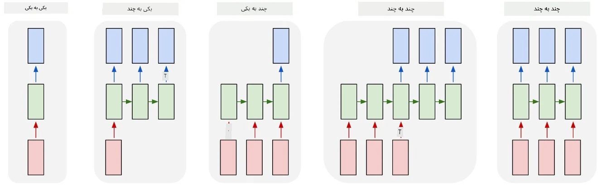

# شبکه‌های مولد

## [پیش‌زمینه‌ی درس](https://ff-quizzes.netlify.app/en/ai/quiz/33)

شبکه‌های عصبی بازگشتی (RNNs) و انواع سلول‌های دروازه‌دار آن‌ها مانند سلول‌های حافظه‌ی کوتاه‌مدت بلند (LSTMs) و واحدهای بازگشتی دروازه‌دار (GRUs) مکانیزمی برای مدل‌سازی زبان فراهم کردند که می‌توانند ترتیب کلمات را یاد بگیرند و پیش‌بینی‌هایی برای کلمه‌ی بعدی در یک دنباله ارائه دهند. این قابلیت به ما اجازه می‌دهد از RNNها برای **وظایف مولد** مانند تولید متن معمولی، ترجمه‌ی ماشینی و حتی توضیحات تصویری استفاده کنیم.

> ✅ به تمام مواقعی که از وظایف مولد مانند تکمیل متن هنگام تایپ بهره برده‌اید فکر کنید. درباره‌ی برنامه‌های مورد علاقه‌ی خود تحقیق کنید تا ببینید آیا از RNNها استفاده کرده‌اند یا خیر.

در معماری RNN که در واحد قبلی بحث کردیم، هر واحد RNN حالت مخفی بعدی را به عنوان خروجی تولید می‌کرد. با این حال، می‌توانیم خروجی دیگری به هر واحد بازگشتی اضافه کنیم که به ما اجازه می‌دهد یک **دنباله** (که طول آن برابر با دنباله‌ی اصلی است) خروجی بدهیم. علاوه بر این، می‌توانیم از واحدهای RNN استفاده کنیم که در هر مرحله ورودی دریافت نمی‌کنند و فقط یک بردار حالت اولیه می‌گیرند و سپس یک دنباله‌ی خروجی تولید می‌کنند.

این قابلیت امکان ایجاد معماری‌های عصبی مختلفی را فراهم می‌کند که در تصویر زیر نشان داده شده‌اند:



> تصویر از پست وبلاگ [Unreasonable Effectiveness of Recurrent Neural Networks](http://karpathy.github.io/2015/05/21/rnn-effectiveness/) نوشته‌ی [Andrej Karpaty](http://karpathy.github.io/)

* **یک به یک** یک شبکه‌ی عصبی سنتی با یک ورودی و یک خروجی است.
* **یک به چند** یک معماری مولد است که یک مقدار ورودی دریافت می‌کند و یک دنباله از مقادیر خروجی تولید می‌کند. به عنوان مثال، اگر بخواهیم یک شبکه‌ی **توضیحات تصویری** آموزش دهیم که توضیحات متنی یک تصویر را تولید کند، می‌توانیم یک تصویر به عنوان ورودی بدهیم، آن را از طریق یک CNN عبور دهیم تا حالت مخفی آن را به دست آوریم، و سپس یک زنجیره‌ی بازگشتی کلمه به کلمه توضیحات را تولید کند.
* **چند به یک** مربوط به معماری‌های RNN است که در واحد قبلی توضیح دادیم، مانند طبقه‌بندی متن.
* **چند به چند** یا **دنباله به دنباله** مربوط به وظایفی مانند **ترجمه‌ی ماشینی** است، جایی که ابتدا RNN تمام اطلاعات دنباله‌ی ورودی را به حالت مخفی جمع‌آوری می‌کند و سپس یک زنجیره‌ی RNN دیگر این حالت را به دنباله‌ی خروجی باز می‌کند.

در این واحد، ما بر مدل‌های مولد ساده‌ای تمرکز خواهیم کرد که به ما کمک می‌کنند متن تولید کنیم. برای سادگی، از توکن‌سازی در سطح کاراکتر استفاده خواهیم کرد.

ما این RNN را آموزش خواهیم داد تا متن را مرحله به مرحله تولید کند. در هر مرحله، یک دنباله از کاراکترها با طول `nchars` می‌گیریم و از شبکه می‌خواهیم کاراکتر خروجی بعدی را برای هر کاراکتر ورودی تولید کند:


هنگام تولید متن (در زمان استنتاج)، با یک **پیش‌زمینه** شروع می‌کنیم که از طریق سلول‌های RNN عبور داده می‌شود تا حالت میانی آن تولید شود، و سپس از این حالت تولید آغاز می‌شود. ما یک کاراکتر در هر زمان تولید می‌کنیم و حالت و کاراکتر تولید شده را به یک سلول RNN دیگر می‌دهیم تا کاراکتر بعدی را تولید کند، تا زمانی که تعداد کافی کاراکتر تولید کنیم.


> تصویر توسط نویسنده

## ✍️ تمرین‌ها: شبکه‌های مولد

یادگیری خود را در نوت‌بوک‌های زیر ادامه دهید:

* [شبکه‌های مولد با PyTorch](GenerativePyTorch.ipynb)
* [شبکه‌های مولد با TensorFlow](GenerativeTF.ipynb)

## تولید متن نرم و دما

خروجی هر سلول RNN یک توزیع احتمالی از کاراکترها است. اگر همیشه کاراکتری را که بالاترین احتمال را دارد به عنوان کاراکتر بعدی در متن تولید شده انتخاب کنیم، متن اغلب ممکن است بین دنباله‌های کاراکتری مشابه بارها و بارها "چرخش" کند، مانند این مثال:

```
today of the second the company and a second the company ...
```

با این حال، اگر به توزیع احتمالی برای کاراکتر بعدی نگاه کنیم، ممکن است تفاوت بین چند احتمال بالاتر زیاد نباشد، به عنوان مثال یک کاراکتر ممکن است احتمال 0.2 داشته باشد و دیگری 0.19 و غیره. برای مثال، هنگام جستجوی کاراکتر بعدی در دنباله‌ی '*play*'، کاراکتر بعدی می‌تواند به همان اندازه فضای خالی باشد یا **e** (مانند کلمه‌ی *player*).

این ما را به این نتیجه می‌رساند که همیشه "منصفانه" نیست که کاراکتری با احتمال بالاتر را انتخاب کنیم، زیرا انتخاب دومین احتمال بالاتر همچنان ممکن است به متن معنادار منجر شود. عاقلانه‌تر است که **نمونه‌گیری** کاراکترها را از توزیع احتمالی داده شده توسط خروجی شبکه انجام دهیم. همچنین می‌توانیم از یک پارامتر به نام **دما** استفاده کنیم که توزیع احتمالی را صاف‌تر کند، در صورتی که بخواهیم تصادفی بیشتری اضافه کنیم، یا آن را شیب‌دارتر کنیم، اگر بخواهیم بیشتر به کاراکترهای با احتمال بالاتر پایبند باشیم.

بررسی کنید که چگونه این تولید متن نرم در نوت‌بوک‌های لینک شده در بالا پیاده‌سازی شده است.

## نتیجه‌گیری

در حالی که تولید متن ممکن است به خودی خود مفید باشد، مزایای اصلی از توانایی تولید متن با استفاده از RNNها از یک بردار ویژگی اولیه ناشی می‌شود. به عنوان مثال، تولید متن به عنوان بخشی از ترجمه‌ی ماشینی استفاده می‌شود (دنباله به دنباله، در این حالت بردار حالت از *رمزگذار* برای تولید یا *رمزگشایی* پیام ترجمه شده استفاده می‌شود)، یا تولید توضیحات متنی یک تصویر (در این حالت بردار ویژگی از استخراج‌کننده‌ی CNN می‌آید).

## 🚀 چالش

برخی درس‌ها را در Microsoft Learn در این موضوع بگذرانید:

* تولید متن با [PyTorch](https://docs.microsoft.com/learn/modules/intro-natural-language-processing-pytorch/6-generative-networks/?WT.mc_id=academic-77998-cacaste)/[TensorFlow](https://docs.microsoft.com/learn/modules/intro-natural-language-processing-tensorflow/5-generative-networks/?WT.mc_id=academic-77998-cacaste)

## [پرسش‌نامه‌ی پس از درس](https://ff-quizzes.netlify.app/en/ai/quiz/34)

## مرور و مطالعه‌ی خودآموز

در اینجا برخی مقالات برای گسترش دانش شما آورده شده است:

* رویکردهای مختلف برای تولید متن با زنجیره‌ی مارکوف، LSTM و GPT-2: [پست وبلاگ](https://towardsdatascience.com/text-generation-gpt-2-lstm-markov-chain-9ea371820e1e)
* نمونه‌ی تولید متن در [مستندات Keras](https://keras.io/examples/generative/lstm_character_level_text_generation/)

## [تکلیف](lab/README.md)

ما دیده‌ایم که چگونه متن را کاراکتر به کاراکتر تولید کنیم. در آزمایشگاه، تولید متن در سطح کلمه را بررسی خواهید کرد.

---

