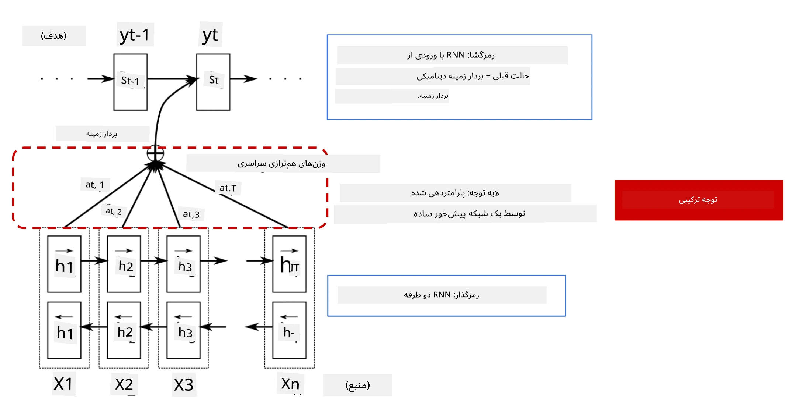
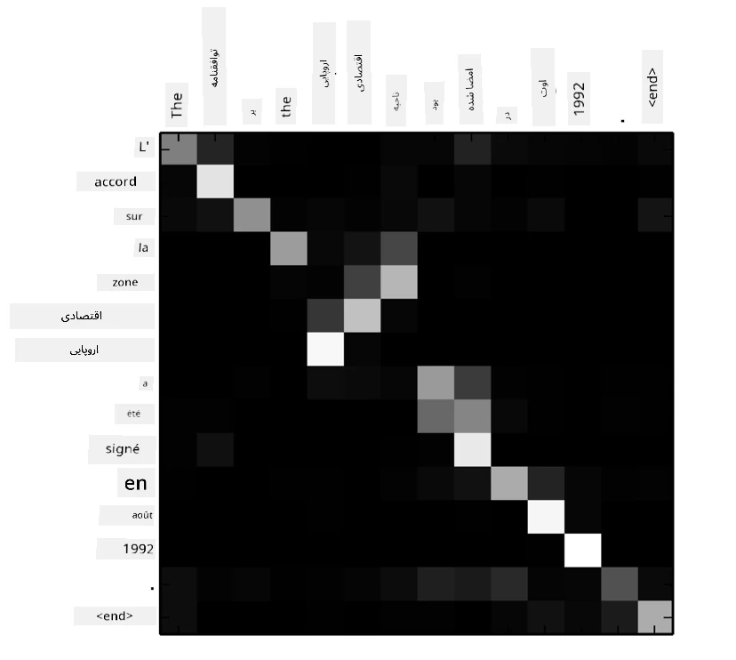
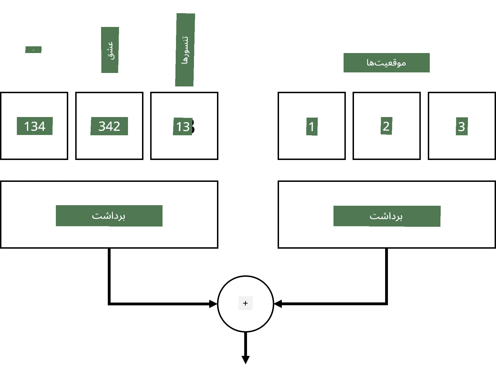
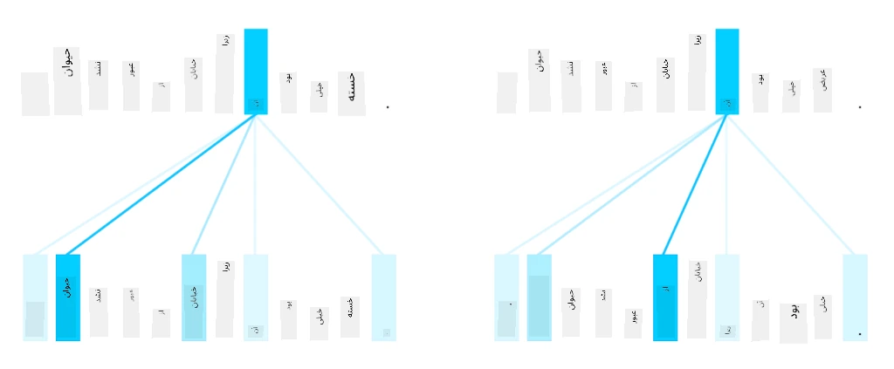
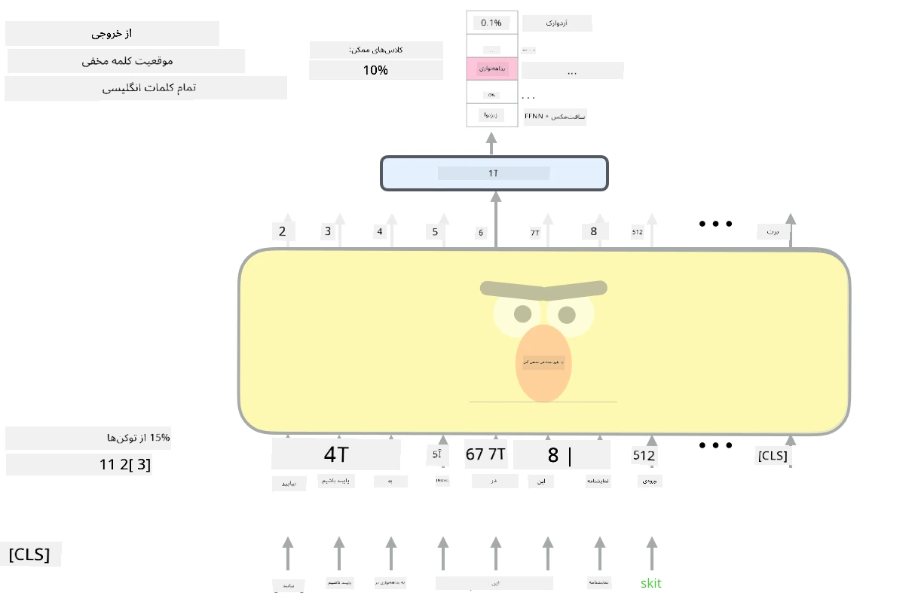

# مکانیزم‌های توجه و مدل‌های ترانسفورمر

## [پیش‌آزمون](https://ff-quizzes.netlify.app/en/ai/quiz/35)

یکی از مهم‌ترین مسائل در حوزه پردازش زبان طبیعی (NLP) **ترجمه ماشینی** است، که یک وظیفه اساسی در ابزارهایی مانند Google Translate محسوب می‌شود. در این بخش، ما بر ترجمه ماشینی تمرکز خواهیم کرد، یا به طور کلی‌تر، بر هر وظیفه‌ای که به صورت *توالی به توالی* (که همچنین به آن **تبدیل جمله** گفته می‌شود) انجام می‌شود.

در شبکه‌های عصبی بازگشتی (RNNs)، وظیفه توالی به توالی توسط دو شبکه بازگشتی پیاده‌سازی می‌شود، که یکی از آن‌ها، **رمزگذار**، یک توالی ورودی را به یک حالت مخفی تبدیل می‌کند، در حالی که شبکه دیگر، **رمزگشا**، این حالت مخفی را به یک نتیجه ترجمه‌شده باز می‌گرداند. این روش با چند مشکل مواجه است:

* حالت نهایی شبکه رمزگذار به سختی می‌تواند ابتدای جمله را به خاطر بسپارد، که باعث کاهش کیفیت مدل برای جملات طولانی می‌شود.
* همه کلمات در یک توالی تأثیر یکسانی بر نتیجه دارند. در واقعیت، برخی کلمات در توالی ورودی تأثیر بیشتری بر خروجی‌های متوالی دارند.

**مکانیزم‌های توجه** راهی برای وزن‌دهی تأثیر متنی هر بردار ورودی بر هر پیش‌بینی خروجی RNN فراهم می‌کنند. این روش با ایجاد میانبرهایی بین حالت‌های میانی RNN ورودی و RNN خروجی پیاده‌سازی می‌شود. به این ترتیب، هنگام تولید نماد خروجی yt، تمام حالت‌های مخفی ورودی hi را با ضرایب وزنی مختلف &alpha;t,i در نظر می‌گیریم.

> مدل رمزگذار-رمزگشا با مکانیزم توجه جمعی در [Bahdanau et al., 2015](https://arxiv.org/pdf/1409.0473.pdf)، نقل شده از [این پست وبلاگ](https://lilianweng.github.io/lil-log/2018/06/24/attention-attention.html)

ماتریس توجه {&alpha;i,j} نشان‌دهنده درجه‌ای است که کلمات خاص ورودی در تولید یک کلمه خاص در توالی خروجی نقش دارند. در زیر نمونه‌ای از چنین ماتریسی آورده شده است:

> تصویر از [Bahdanau et al., 2015](https://arxiv.org/pdf/1409.0473.pdf) (شکل 3)

مکانیزم‌های توجه مسئول بسیاری از وضعیت‌های فعلی یا نزدیک به وضعیت فعلی در NLP هستند. افزودن توجه به مدل‌ها تعداد پارامترهای مدل را به شدت افزایش می‌دهد که منجر به مشکلات مقیاس‌پذیری در RNNها شد. یکی از محدودیت‌های کلیدی در مقیاس‌پذیری RNNها این است که ماهیت بازگشتی مدل‌ها باعث می‌شود آموزش دسته‌ای و موازی‌سازی چالش‌برانگیز باشد. در RNN هر عنصر از یک توالی باید به ترتیب پردازش شود، که به این معنی است که نمی‌توان آن را به راحتی موازی‌سازی کرد.

> تصویر از [وبلاگ گوگل](https://research.googleblog.com/2016/09/a-neural-network-for-machine.html)

پذیرش مکانیزم‌های توجه همراه با این محدودیت منجر به ایجاد مدل‌های ترانسفورمر شد که اکنون به عنوان وضعیت فعلی در NLP شناخته می‌شوند، مانند BERT و Open-GPT3.

## مدل‌های ترانسفورمر

یکی از ایده‌های اصلی پشت ترانسفورمرها این است که از ماهیت ترتیبی RNNها اجتناب شود و مدلی ایجاد شود که در طول آموزش قابل موازی‌سازی باشد. این هدف با پیاده‌سازی دو ایده محقق می‌شود:

* کدگذاری موقعیتی
* استفاده از مکانیزم توجه به خود برای شناسایی الگوها به جای RNNها (یا CNNها) (به همین دلیل مقاله‌ای که ترانسفورمرها را معرفی می‌کند *[Attention is all you need](https://arxiv.org/abs/1706.03762)* نام دارد)

### کدگذاری/تعبیه موقعیتی

ایده کدگذاری موقعیتی به شرح زیر است:
1. هنگام استفاده از RNNها، موقعیت نسبی توکن‌ها با تعداد مراحل نشان داده می‌شود و بنابراین نیازی به نمایش صریح ندارد.
2. اما وقتی به توجه می‌پردازیم، باید موقعیت نسبی توکن‌ها در یک توالی را بدانیم.
3. برای دریافت کدگذاری موقعیتی، توالی توکن‌ها را با یک توالی از موقعیت‌های توکن در توالی (یعنی یک توالی از اعداد 0، 1، ...) تقویت می‌کنیم.
4. سپس موقعیت توکن را با بردار تعبیه توکن ترکیب می‌کنیم. برای تبدیل موقعیت (عدد صحیح) به یک بردار، می‌توانیم از روش‌های مختلفی استفاده کنیم:

* تعبیه قابل آموزش، مشابه تعبیه توکن. این روش را در اینجا در نظر می‌گیریم. لایه‌های تعبیه را بر روی توکن‌ها و موقعیت‌های آن‌ها اعمال می‌کنیم، که منجر به بردارهای تعبیه با ابعاد یکسان می‌شود، و سپس آن‌ها را با هم جمع می‌کنیم.
* تابع کدگذاری موقعیت ثابت، همانطور که در مقاله اصلی پیشنهاد شده است.

> تصویر توسط نویسنده

نتیجه‌ای که با تعبیه موقعیتی به دست می‌آوریم، هم توکن اصلی و هم موقعیت آن در یک توالی را تعبیه می‌کند.

### توجه به خود چندسری

سپس، باید برخی الگوها را در توالی خود شناسایی کنیم. برای این کار، ترانسفورمرها از مکانیزم **توجه به خود** استفاده می‌کنند، که اساساً توجهی است که به همان توالی به عنوان ورودی و خروجی اعمال می‌شود. اعمال توجه به خود به ما اجازه می‌دهد **زمینه** را در جمله در نظر بگیریم و ببینیم کدام کلمات به هم مرتبط هستند. به عنوان مثال، این امکان را فراهم می‌کند که ببینیم کدام کلمات توسط ارجاعات مانند *آن* اشاره شده‌اند و همچنین زمینه را در نظر بگیریم:

> تصویر از [وبلاگ گوگل](https://research.googleblog.com/2017/08/transformer-novel-neural-network.html)

در ترانسفورمرها، از **توجه چندسری** استفاده می‌کنیم تا به شبکه قدرت شناسایی انواع مختلف وابستگی‌ها را بدهیم، مانند روابط کلمات بلندمدت در مقابل کوتاه‌مدت، ارجاع مشترک در مقابل چیز دیگری، و غیره.

[دفترچه TensorFlow](TransformersTF.ipynb) جزئیات بیشتری در مورد پیاده‌سازی لایه‌های ترانسفورمر ارائه می‌دهد.

### توجه رمزگذار-رمزگشا

در ترانسفورمرها، توجه در دو مکان استفاده می‌شود:

* برای شناسایی الگوها در متن ورودی با استفاده از توجه به خود
* برای انجام ترجمه توالی - این لایه توجه بین رمزگذار و رمزگشا است.

توجه رمزگذار-رمزگشا بسیار مشابه مکانیزم توجه استفاده‌شده در RNNها است، همانطور که در ابتدای این بخش توضیح داده شد. این نمودار متحرک نقش توجه رمزگذار-رمزگشا را توضیح می‌دهد.

از آنجا که هر موقعیت ورودی به طور مستقل به هر موقعیت خروجی نگاشت می‌شود، ترانسفورمرها بهتر از RNNها موازی‌سازی می‌شوند، که امکان مدل‌های زبان بسیار بزرگ‌تر و بیانگرتر را فراهم می‌کند. هر سر توجه می‌تواند برای یادگیری روابط مختلف بین کلمات استفاده شود که وظایف پردازش زبان طبیعی را بهبود می‌بخشد.

## BERT

**BERT** (نمایش‌های رمزگذار دوطرفه از ترانسفورمرها) یک شبکه ترانسفورمر چندلایه بسیار بزرگ است که دارای 12 لایه برای *BERT-base* و 24 لایه برای *BERT-large* است. این مدل ابتدا بر روی یک مجموعه داده بزرگ متنی (ویکی‌پدیا + کتاب‌ها) با استفاده از آموزش بدون نظارت (پیش‌بینی کلمات ماسک‌شده در یک جمله) پیش‌آموزش داده می‌شود. در طول پیش‌آموزش، مدل سطوح قابل توجهی از درک زبان را جذب می‌کند که سپس می‌توان با مجموعه داده‌های دیگر از طریق تنظیم دقیق استفاده کرد. این فرآیند **یادگیری انتقالی** نامیده می‌شود.

> تصویر [منبع](http://jalammar.github.io/illustrated-bert/)

## ✍️ تمرین‌ها: ترانسفورمرها

یادگیری خود را در دفترچه‌های زیر ادامه دهید:

* [ترانسفورمرها در PyTorch](TransformersPyTorch.ipynb)
* [ترانسفورمرها در TensorFlow](TransformersTF.ipynb)

## نتیجه‌گیری

در این درس شما درباره ترانسفورمرها و مکانیزم‌های توجه، که ابزارهای ضروری در جعبه‌ابزار NLP هستند، یاد گرفتید. انواع مختلفی از معماری‌های ترانسفورمر وجود دارد، از جمله BERT، DistilBERT، BigBird، OpenGPT3 و موارد دیگر که می‌توان آن‌ها را تنظیم دقیق کرد. بسته [HuggingFace](https://github.com/huggingface/) مخزنی برای آموزش بسیاری از این معماری‌ها با استفاده از PyTorch و TensorFlow فراهم می‌کند.

## 🚀 چالش

## [پس‌آزمون](https://ff-quizzes.netlify.app/en/ai/quiz/36)

## مرور و مطالعه خودآموز

* [پست وبلاگ](https://mchromiak.github.io/articles/2017/Sep/12/Transformer-Attention-is-all-you-need/)، توضیح مقاله کلاسیک [Attention is all you need](https://arxiv.org/abs/1706.03762) درباره ترانسفورمرها.
* [مجموعه‌ای از پست‌های وبلاگ](https://towardsdatascience.com/transformers-explained-visually-part-1-overview-of-functionality-95a6dd460452) درباره ترانسفورمرها، توضیح معماری به صورت جزئی.

## [تکلیف](assignment.md)

---

