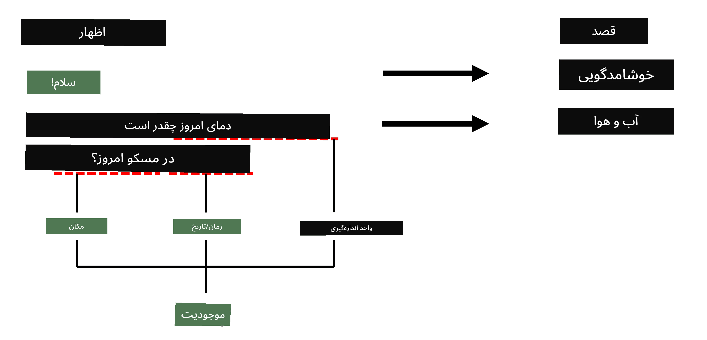

# شناسایی موجودیت‌های نام‌گذاری‌شده

تا به حال، بیشتر بر روی یک وظیفه پردازش زبان طبیعی (NLP) - طبقه‌بندی - تمرکز کرده‌ایم. با این حال، وظایف دیگری نیز در NLP وجود دارند که می‌توان با استفاده از شبکه‌های عصبی انجام داد. یکی از این وظایف **[شناسایی موجودیت‌های نام‌گذاری‌شده](https://wikipedia.org/wiki/Named-entity_recognition)** (NER) است که به شناسایی موجودیت‌های خاص در متن، مانند مکان‌ها، نام افراد، بازه‌های زمانی، فرمول‌های شیمیایی و موارد دیگر می‌پردازد.

## [پیش‌زمینه درس](https://ff-quizzes.netlify.app/en/ai/quiz/37)

## مثال استفاده از NER

فرض کنید می‌خواهید یک چت‌بات زبان طبیعی توسعه دهید، مشابه Amazon Alexa یا Google Assistant. چت‌بات‌های هوشمند به این صورت کار می‌کنند که با انجام طبقه‌بندی متن بر روی جمله ورودی، *درک* کنند که کاربر چه می‌خواهد. نتیجه این طبقه‌بندی چیزی است که به آن **قصد** گفته می‌شود و مشخص می‌کند چت‌بات باید چه کاری انجام دهد.

> تصویر توسط نویسنده

با این حال، ممکن است کاربر برخی پارامترها را به عنوان بخشی از عبارت ارائه دهد. به عنوان مثال، هنگام درخواست وضعیت آب‌وهوا، ممکن است مکان یا تاریخ را مشخص کند. چت‌بات باید بتواند این موجودیت‌ها را درک کند و قبل از انجام عمل، جایگاه پارامترها را پر کند. این دقیقاً جایی است که NER وارد عمل می‌شود.

> ✅ مثال دیگر می‌تواند [تحلیل مقالات علمی پزشکی](https://soshnikov.com/science/analyzing-medical-papers-with-azure-and-text-analytics-for-health/) باشد. یکی از موارد اصلی که باید به دنبال آن باشیم، اصطلاحات پزشکی خاص مانند بیماری‌ها و مواد پزشکی است. در حالی که تعداد کمی از بیماری‌ها احتمالاً با جستجوی زیررشته قابل استخراج هستند، موجودیت‌های پیچیده‌تر مانند ترکیبات شیمیایی و نام داروها به رویکرد پیچیده‌تری نیاز دارند.

## NER به عنوان طبقه‌بندی توکن

مدل‌های NER اساساً **مدل‌های طبقه‌بندی توکن** هستند، زیرا برای هر یک از توکن‌های ورودی باید تصمیم بگیریم که آیا به یک موجودیت تعلق دارد یا خیر، و اگر تعلق دارد - به کدام کلاس موجودیت.

به عنوان مثال، عنوان مقاله زیر را در نظر بگیرید:

**بازگشت خون از دریچه سه‌لتی** و **کربنات لیتیوم** **سمیت** در یک نوزاد.

موجودیت‌ها در اینجا عبارتند از:

* بازگشت خون از دریچه سه‌لتی یک بیماری است (`DIS`)
* کربنات لیتیوم یک ماده شیمیایی است (`CHEM`)
* سمیت نیز یک بیماری است (`DIS`)

توجه داشته باشید که یک موجودیت می‌تواند شامل چندین توکن باشد. و همان‌طور که در این مورد مشاهده می‌شود، باید بین دو موجودیت متوالی تمایز قائل شویم. بنابراین، معمول است که از دو کلاس برای هر موجودیت استفاده کنیم - یکی برای مشخص کردن اولین توکن موجودیت (اغلب از پیشوند `B-` برای **شروع** استفاده می‌شود)، و دیگری - ادامه موجودیت (`I-`، برای توکن **داخلی**). همچنین از `O` به عنوان کلاس برای نشان دادن تمام توکن‌های **دیگر** استفاده می‌کنیم. این نوع برچسب‌گذاری توکن [برچسب‌گذاری BIO](https://en.wikipedia.org/wiki/Inside%E2%80%93outside%E2%80%93beginning_(tagging)) (یا IOB) نامیده می‌شود. وقتی برچسب‌گذاری شود، عنوان ما به این صورت خواهد بود:

توکن | برچسب
------|-----
بازگشت | B-DIS
خون | I-DIS
از | I-DIS
و | O
کربنات | B-CHEM
لیتیوم | I-CHEM
سمیت | B-DIS
در | O
یک | O
نوزاد | O
. | O

از آنجا که باید یک تطابق یک‌به‌یک بین توکن‌ها و کلاس‌ها ایجاد کنیم، می‌توانیم یک مدل شبکه عصبی **چند-به-چند** از تصویر زیر آموزش دهیم:

> *تصویر از [این پست وبلاگ](http://karpathy.github.io/2015/05/21/rnn-effectiveness/) توسط [آندری کارپاتی](http://karpathy.github.io/). مدل‌های طبقه‌بندی توکن NER با معماری شبکه سمت راست در این تصویر مطابقت دارند.*

## آموزش مدل‌های NER

از آنجا که یک مدل NER اساساً یک مدل طبقه‌بندی توکن است، می‌توانیم از RNNهایی که قبلاً با آن‌ها آشنا شده‌ایم برای این وظیفه استفاده کنیم. در این حالت، هر بلوک شبکه بازگشتی شناسه توکن را بازمی‌گرداند. نوت‌بوک زیر نشان می‌دهد که چگونه می‌توان LSTM را برای طبقه‌بندی توکن آموزش داد.

## ✍️ نوت‌بوک‌های مثال: NER

یادگیری خود را در نوت‌بوک زیر ادامه دهید:

* [NER با TensorFlow](NER-TF.ipynb)

## نتیجه‌گیری

یک مدل NER یک **مدل طبقه‌بندی توکن** است، به این معنی که می‌توان از آن برای انجام طبقه‌بندی توکن استفاده کرد. این یک وظیفه بسیار رایج در NLP است که به شناسایی موجودیت‌های خاص در متن از جمله مکان‌ها، نام‌ها، تاریخ‌ها و موارد دیگر کمک می‌کند.

## 🚀 چالش

وظیفه مرتبط زیر را کامل کنید تا یک مدل شناسایی موجودیت‌های نام‌گذاری‌شده برای اصطلاحات پزشکی آموزش دهید، سپس آن را بر روی یک مجموعه داده متفاوت امتحان کنید.

## [پرسشنامه پس از درس](https://ff-quizzes.netlify.app/en/ai/quiz/38)

## مرور و مطالعه خودآموز

وبلاگ [اثربخشی غیرمنطقی شبکه‌های عصبی بازگشتی](http://karpathy.github.io/2015/05/21/rnn-effectiveness/) را مطالعه کنید و بخش مطالعه بیشتر در آن مقاله را دنبال کنید تا دانش خود را عمیق‌تر کنید.

## [وظیفه](lab/README.md)

در وظیفه این درس، باید یک مدل شناسایی موجودیت‌های پزشکی آموزش دهید. می‌توانید با آموزش یک مدل LSTM همان‌طور که در این درس توضیح داده شده شروع کنید و سپس از مدل ترانسفورمر BERT استفاده کنید. [دستورالعمل‌ها](lab/README.md) را بخوانید تا تمام جزئیات را دریافت کنید.

---

