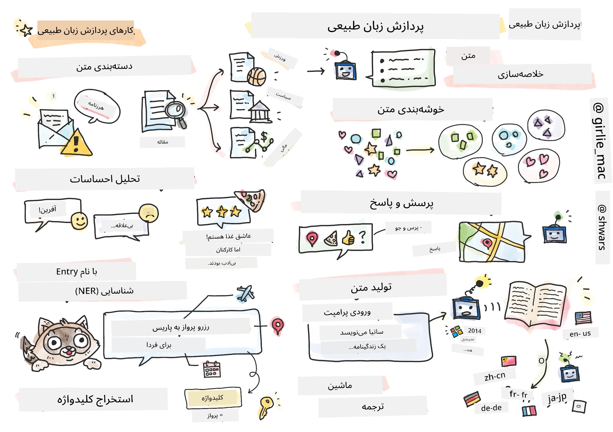

# پردازش زبان طبیعی



در این بخش، تمرکز ما بر استفاده از شبکه‌های عصبی برای انجام وظایف مرتبط با **پردازش زبان طبیعی (NLP)** خواهد بود. مشکلات زیادی در NLP وجود دارند که می‌خواهیم کامپیوترها قادر به حل آن‌ها باشند:

* **دسته‌بندی متن** یک مسئله دسته‌بندی معمولی مربوط به دنباله‌های متنی است. مثال‌ها شامل دسته‌بندی ایمیل‌ها به اسپم یا غیر اسپم، یا دسته‌بندی مقالات به دسته‌های ورزشی، کسب‌وکار، سیاست و غیره است. همچنین، هنگام توسعه چت‌بات‌ها، اغلب نیاز داریم بفهمیم کاربر چه منظوری داشته است -- در این حالت با **دسته‌بندی هدف** (intent classification) مواجه هستیم. اغلب در دسته‌بندی هدف با تعداد زیادی دسته سر و کار داریم.
* **تحلیل احساسات** یک مسئله رگرسیون معمولی است، جایی که باید عددی (احساس) معادل با مثبت یا منفی بودن معنای جمله را نسبت دهیم. نسخه پیشرفته‌تر تحلیل احساسات، **تحلیل احساسات مبتنی بر جنبه** (ABSA) است، که در آن احساس را نه به کل جمله، بلکه به بخش‌های مختلف آن (جنبه‌ها) نسبت می‌دهیم، مثلاً *در این رستوران، من از غذا خوشم آمد، اما جو آن افتضاح بود*.
* **شناسایی موجودیت‌های اسمی** (NER) به مسئله استخراج موجودیت‌های خاص از متن اشاره دارد. به طور مثال، ممکن است نیاز داشته باشیم بفهمیم در عبارت *من باید فردا به پاریس پرواز کنم* کلمه *فردا* به تاریخ اشاره دارد و *پاریس* یک مکان است.  
* **استخراج کلمات کلیدی** مشابه NER است، اما باید به‌طور خودکار کلمات مهم در معنی جمله را بدون آموزش قبلی برای نوع خاص موجودیت استخراج کنیم.
* **خوشه‌بندی متن** می‌تواند زمانی مفید باشد که بخواهیم جملات مشابه را گروه‌بندی کنیم، مثلاً درخواست‌های مشابه در گفتگوهای پشتیبانی فنی.
* **پاسخگویی به سوالات** به توانایی مدل در پاسخ دادن به یک سوال خاص اشاره دارد. مدل یک قطعه متن و یک سوال به عنوان ورودی دریافت می‌کند و باید جایی در متن که پاسخ سوال در آن وجود دارد را مشخص کند (یا گاهی پاسخ را تولید کند).
* **تولید متن** توانایی مدل برای تولید متن جدید است. این می‌تواند به عنوان یک مسئله دسته‌بندی در نظر گرفته شود که حرف یا کلمه بعدی را بر اساس یک *ورودی متنی* پیش‌بینی می‌کند. مدل‌های پیشرفته تولید متن مانند GPT-3 قادرند سایر وظایف NLP مثل دسته‌بندی را با استفاده از تکنیکی به نام [برنامه‌نویسی ورودی](https://towardsdatascience.com/software-3-0-how-prompting-will-change-the-rules-of-the-game-a982fbfe1e0) یا [مهندسی ورودی](https://medium.com/swlh/openai-gpt-3-and-prompt-engineering-dcdc2c5fcd29) انجام دهند.
* **خلاصه‌سازی متن** روشی است که در آن می‌خواهیم کامپیوتر متن طولانی را "بخواند" و در چند جمله خلاصه کند.
* **ترجمه ماشینی** می‌تواند ترکیبی از درک متن به یک زبان و تولید متن به زبان دیگر باشد.

در ابتدا، بیشتر وظایف NLP با روش‌های سنتی مانند گرامرها حل می‌شدند. مثلاً در ترجمه ماشینی از تجزیه‌کننده‌ها برای تبدیل جمله اولیه به درخت نحوی استفاده می‌شد، سپس ساختارهای معنایی سطح بالاتر استخراج می‌شدند تا معنای جمله را نشان دهند، و بر اساس این معنا و دستور زبان زبان مقصد، نتیجه تولید می‌شد. امروزه بسیاری از وظایف NLP به طور مؤثرتری با استفاده از شبکه‌های عصبی حل می‌شوند.

> بسیاری از روش‌های کلاسیک NLP در کتابخانه پایتون [Natural Language Processing Toolkit (NLTK)](https://www.nltk.org) پیاده‌سازی شده‌اند. کتاب بسیار خوبی به نام [کتاب NLTK](https://www.nltk.org/book/) به صورت آنلاین موجود است که نحوه حل وظایف مختلف NLP با استفاده از NLTK را پوشش می‌دهد.

در دوره ما، عمدتاً بر استفاده از شبکه‌های عصبی برای NLP تمرکز خواهیم کرد و در صورت نیاز از NLTK استفاده خواهیم کرد.

قبلاً درباره استفاده از شبکه‌های عصبی برای داده‌های جدولی و تصاویر آموخته‌ایم. تفاوت اصلی بین این نوع داده‌ها و متن این است که متن یک دنباله با طول متغیر است، در حالی که اندازه ورودی در مورد تصاویر از پیش مشخص است. در حالی که شبکه‌های کانولوشنال می‌توانند الگوهایی را از داده‌های ورودی استخراج کنند، الگوها در متن پیچیده‌ترند. مثلاً، نفی ممکن است از موضوع جمله با کلمات زیادی جدا باشد (مثلاً *من پرتقال را دوست ندارم* در مقابل *من آن پرتقال‌های بزرگ رنگی خوشمزه را دوست ندارم ندارم*) و این باید همچنان به عنوان یک الگو تفسیر شود. بنابراین، برای پردازش زبان نیاز به معرفی انواع جدیدی از شبکه‌های عصبی مانند *شبکه‌های بازگشتی* و *ترنسفورمرها* داریم.

## نصب کتابخانه‌ها

اگر از نصب محلی پایتون برای اجرای این دوره استفاده می‌کنید، ممکن است نیاز به نصب تمام کتابخانه‌های مورد نیاز برای NLP با استفاده از دستورات زیر داشته باشید:

**برای PyTorch**
```bash
pip install -r requirements-pytorch.txt
```
**برای TensorFlow**
```bash
pip install -r requirements-tf.txt
```

> می‌توانید NLP را با TensorFlow در [Microsoft Learn](https://docs.microsoft.com/learn/modules/intro-natural-language-processing-tensorflow/?WT.mc_id=academic-77998-cacaste) امتحان کنید

## هشدار GPU

در این بخش، در برخی از نمونه‌ها مدل‌های نسبتاً بزرگی آموزش داده می‌شوند.
* **استفاده از کامپیوتر دارای GPU**: توصیه می‌شود نت‌بوک‌های خود را روی کامپیوتری با GPU اجرا کنید تا زمان انتظار در کار با مدل‌های بزرگ کاهش یابد.
* **محدودیت حافظه GPU**: اجرای مدل روی GPU ممکن است به موقعیت‌هایی منجر شود که حافظه GPU پر شود، مخصوصاً هنگام آموزش مدل‌های بزرگ.
* **مصرف حافظه GPU**: میزان مصرف حافظه GPU در حین آموزش به عوامل مختلفی بستگی دارد، از جمله اندازه مینی‌بچ.
* **کاهش اندازه مینی‌بچ**: اگر با مشکلات حافظه GPU مواجه شدید، کاهش اندازه مینی‌بچ در کد خود را به عنوان راه‌حلی در نظر بگیرید.
* **آزادسازی حافظه GPU در TensorFlow**: نسخه‌های قدیمی‌تر TensorFlow ممکن است حافظه GPU را به‌درستی هنگام آموزش چند مدل در یک کرنل پایتون آزاد نکنند. برای مدیریت بهینه استفاده از حافظه GPU می‌توانید TensorFlow را طوری تنظیم کنید که حافظه GPU فقط در صورت نیاز تخصیص داده شود.
* **گنجاندن کد**: برای تنظیم TensorFlow به گونه‌ای که حافظه GPU فقط زمانی بیشتر تخصیص داده شود که نیاز است، کد زیر را در نت‌بوک‌های خود بگنجانید:

```python
physical_devices = tf.config.list_physical_devices('GPU') 
if len(physical_devices)>0:
    tf.config.experimental.set_memory_growth(physical_devices[0], True) 
```

اگر علاقه‌مند به یادگیری NLP از دیدگاه کلاسیک یادگیری ماشین هستید، به [این مجموعه درس‌ها](https://github.com/microsoft/ML-For-Beginners/tree/main/6-NLP) مراجعه کنید

## در این بخش
در این بخش درباره موارد زیر خواهیم آموخت:

* [نمایش متن به صورت تنسورها](13-TextRep/README.md)
* [توکارگذاری کلمات](14-Embeddings/README.md)
* [مدلسازی زبان](15-LanguageModeling/README.md)
* [شبکه‌های عصبی بازگشتی](16-RNN/README.md)
* [شبکه‌های مولد](17-GenerativeNetworks/README.md)
* [ترنسفورمرها](18-Transformers/README.md)

---

<!-- CO-OP TRANSLATOR DISCLAIMER START -->
**سلب مسئولیت**:
این سند با استفاده از سرویس ترجمه هوش مصنوعی [Co-op Translator](https://github.com/Azure/co-op-translator) ترجمه شده است. در حالی که ما در تلاش برای دقت هستیم، لطفاً توجه داشته باشید که ترجمه‌های خودکار ممکن است شامل خطاها یا نادرستی‌هایی باشند. سند اصلی به زبان مادری خود باید به عنوان منبع معتبر در نظر گرفته شود. برای اطلاعات حیاتی، ترجمه حرفه‌ای انسانی توصیه می‌شود. ما در قبال هرگونه سوء تفاهم یا برداشت نادرست ناشی از استفاده از این ترجمه مسئولیتی نداریم.
<!-- CO-OP TRANSLATOR DISCLAIMER END -->