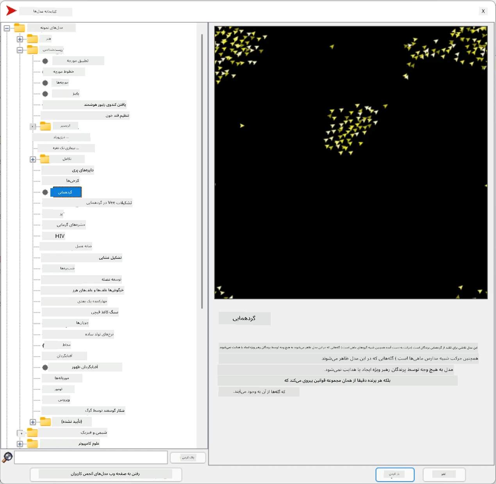
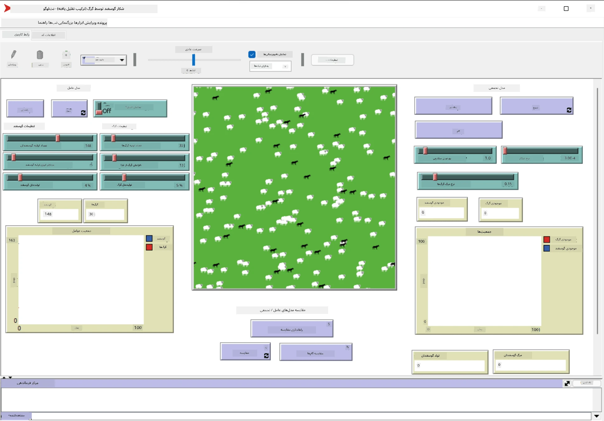

# سیستم‌های چندعاملی

یکی از روش‌های ممکن برای دستیابی به هوش، رویکردی است که به آن **پدیدارگرا** (یا **هم‌افزایی**) گفته می‌شود. این رویکرد بر این اصل استوار است که رفتار ترکیبی تعداد زیادی عامل نسبتاً ساده می‌تواند منجر به رفتار کلی پیچیده‌تر (یا هوشمندانه‌تر) سیستم به‌عنوان یک کل شود. از نظر تئوری، این رویکرد بر اصول [هوش جمعی](https://en.wikipedia.org/wiki/Collective_intelligence)، [پدیدارگرایی](https://en.wikipedia.org/wiki/Global_brain) و [سایبرنتیک تکاملی](https://en.wikipedia.org/wiki/Global_brain) استوار است که بیان می‌کنند سیستم‌های سطح بالاتر زمانی که به‌درستی از سیستم‌های سطح پایین‌تر ترکیب شوند، نوعی ارزش افزوده به دست می‌آورند (اصلی که به آن *اصل گذار به فرامجموعه* گفته می‌شود).

## [آزمون پیش از درس](https://ff-quizzes.netlify.app/en/ai/quiz/45)

حوزه **سیستم‌های چندعاملی** در دهه ۱۹۹۰ به‌عنوان پاسخی به رشد اینترنت و سیستم‌های توزیع‌شده در هوش مصنوعی ظهور کرد. یکی از کتاب‌های درسی کلاسیک هوش مصنوعی، [Artificial Intelligence: A Modern Approach](https://en.wikipedia.org/wiki/Artificial_Intelligence:_A_Modern_Approach)، به بررسی هوش مصنوعی کلاسیک از دیدگاه سیستم‌های چندعاملی می‌پردازد.

مفهوم اصلی در رویکرد چندعاملی، **عامل** است - موجودیتی که در یک **محیط** زندگی می‌کند، محیط را درک می‌کند و بر آن تأثیر می‌گذارد. این تعریف بسیار گسترده است و انواع و طبقه‌بندی‌های مختلفی از عامل‌ها وجود دارد:

* بر اساس توانایی استدلال:
   - عامل‌های **واکنشی** معمولاً رفتار ساده‌ای از نوع درخواست-پاسخ دارند.
   - عامل‌های **تفکری** از نوعی استدلال منطقی و/یا قابلیت‌های برنامه‌ریزی استفاده می‌کنند.
* بر اساس محل اجرای کد عامل:
   - عامل‌های **ایستا** در یک گره شبکه اختصاصی کار می‌کنند.
   - عامل‌های **متحرک** می‌توانند کد خود را بین گره‌های شبکه جابه‌جا کنند.
* بر اساس رفتار:
   - عامل‌های **منفعل** اهداف خاصی ندارند. این عامل‌ها می‌توانند به محرک‌های خارجی واکنش نشان دهند، اما خودشان اقدامی را آغاز نمی‌کنند.
   - عامل‌های **فعال** اهدافی دارند که آن‌ها را دنبال می‌کنند.
   - عامل‌های **شناختی** شامل برنامه‌ریزی و استدلال پیچیده هستند.

سیستم‌های چندعاملی امروزه در بسیاری از کاربردها استفاده می‌شوند:

* در بازی‌ها، بسیاری از شخصیت‌های غیرقابل‌بازی (NPC) از نوعی هوش مصنوعی استفاده می‌کنند و می‌توان آن‌ها را عامل‌های هوشمند در نظر گرفت.
* در تولید ویدئو، رندر کردن صحنه‌های پیچیده سه‌بعدی که شامل جمعیت است، معمولاً با استفاده از شبیه‌سازی چندعاملی انجام می‌شود.
* در مدل‌سازی سیستم‌ها، رویکرد چندعاملی برای شبیه‌سازی رفتار یک مدل پیچیده استفاده می‌شود. به‌عنوان مثال، رویکرد چندعاملی با موفقیت برای پیش‌بینی گسترش بیماری COVID-19 در سراسر جهان استفاده شده است. رویکرد مشابهی می‌تواند برای مدل‌سازی ترافیک شهری و بررسی واکنش آن به تغییرات قوانین ترافیکی استفاده شود.
* در سیستم‌های اتوماسیون پیچیده، هر دستگاه می‌تواند به‌عنوان یک عامل مستقل عمل کند، که این امر سیستم کلی را کمتر یکپارچه و مقاوم‌تر می‌کند.

ما زمان زیادی را صرف بررسی عمیق سیستم‌های چندعاملی نخواهیم کرد، اما یک مثال از **مدل‌سازی چندعاملی** را بررسی می‌کنیم.

## NetLogo

[NetLogo](https://ccl.northwestern.edu/netlogo/) یک محیط مدل‌سازی چندعاملی است که بر اساس نسخه‌ای اصلاح‌شده از زبان برنامه‌نویسی [Logo](https://en.wikipedia.org/wiki/Logo_(programming_language)) ساخته شده است. این زبان برای آموزش مفاهیم برنامه‌نویسی به کودکان توسعه یافته و به شما اجازه می‌دهد عاملی به نام **لاک‌پشت** را کنترل کنید که می‌تواند حرکت کند و ردی از خود به‌جا بگذارد. این ویژگی امکان ایجاد اشکال هندسی پیچیده را فراهم می‌کند که روشی بسیار بصری برای درک رفتار یک عامل است.

در NetLogo، می‌توانیم با استفاده از دستور `create-turtles` تعداد زیادی لاک‌پشت ایجاد کنیم. سپس می‌توانیم به همه لاک‌پشت‌ها فرمان دهیم که کاری انجام دهند (در مثال زیر - ۱۰ واحد به جلو حرکت کنند):

```
create-turtles 10
ask turtles [
  forward 10
]
```


البته، وقتی همه لاک‌پشت‌ها یک کار مشابه انجام دهند، جالب نیست. بنابراین می‌توانیم به گروه‌هایی از لاک‌پشت‌ها دستور دهیم، مثلاً آن‌هایی که در نزدیکی یک نقطه خاص هستند. همچنین می‌توانیم لاک‌پشت‌هایی از نژادهای مختلف ایجاد کنیم با استفاده از دستور `breed [cats cat]`. در اینجا `cat` نام یک نژاد است و باید هم کلمه مفرد و هم جمع را مشخص کنیم، زیرا دستورات مختلف از اشکال مختلف برای وضوح استفاده می‌کنند.

> ✅ ما به یادگیری زبان NetLogo نمی‌پردازیم - اگر علاقه‌مند به یادگیری بیشتر هستید، می‌توانید به منبع عالی [فرهنگ لغت تعاملی مبتدیان NetLogo](https://ccl.northwestern.edu/netlogo/bind/) مراجعه کنید.

می‌توانید [NetLogo را دانلود کنید](https://ccl.northwestern.edu/netlogo/download.shtml) و آن را نصب کنید تا آن را امتحان کنید.

### کتابخانه مدل‌ها

یکی از ویژگی‌های عالی NetLogo این است که شامل کتابخانه‌ای از مدل‌های آماده است که می‌توانید آن‌ها را امتحان کنید. به **File &rightarrow; Models Library** بروید و دسته‌بندی‌های مختلفی از مدل‌ها را انتخاب کنید.



> تصویری از کتابخانه مدل‌ها توسط دیمیتری سوشنیکوف

می‌توانید یکی از مدل‌ها را باز کنید، مثلاً **Biology &rightarrow; Flocking**.

### اصول اصلی

پس از باز کردن مدل، به صفحه اصلی NetLogo منتقل می‌شوید. در اینجا یک مدل نمونه که جمعیت گرگ‌ها و گوسفندها را با منابع محدود (چمن) توصیف می‌کند، آورده شده است.



> تصویر توسط دیمیتری سوشنیکوف

در این صفحه می‌توانید ببینید:

* بخش **رابط کاربری** که شامل:
  - میدان اصلی که همه عامل‌ها در آن زندگی می‌کنند
  - کنترل‌های مختلف: دکمه‌ها، لغزنده‌ها و غیره
  - نمودارهایی که می‌توانید برای نمایش پارامترهای شبیه‌سازی استفاده کنید
* زبانه **کد** که شامل ویرایشگر است، جایی که می‌توانید برنامه NetLogo را تایپ کنید

در بیشتر موارد، رابط کاربری دارای دکمه **Setup** است که وضعیت شبیه‌سازی را مقداردهی اولیه می‌کند و دکمه **Go** که اجرای شبیه‌سازی را شروع می‌کند. این دکمه‌ها توسط هندلرهای مربوطه در کد مدیریت می‌شوند که به این شکل هستند:

```
to go [
...
]
```


دنیای NetLogo از اشیای زیر تشکیل شده است:

* **عامل‌ها** (لاک‌پشت‌ها) که می‌توانند در میدان حرکت کنند و کاری انجام دهند. شما با استفاده از دستور `ask turtles [...]` به عامل‌ها فرمان می‌دهید و کدی که در براکت‌ها قرار دارد، توسط همه عامل‌ها در حالت *لاک‌پشت* اجرا می‌شود.
* **پچ‌ها** مناطق مربعی میدان هستند که عامل‌ها روی آن‌ها زندگی می‌کنند. می‌توانید به همه عامل‌ها در یک پچ ارجاع دهید یا رنگ پچ‌ها و برخی ویژگی‌های دیگر را تغییر دهید. همچنین می‌توانید از پچ‌ها بخواهید کاری انجام دهند.
* **ناظر** یک عامل منحصربه‌فرد است که دنیای شبیه‌سازی را کنترل می‌کند. همه هندلرهای دکمه‌ها در حالت *ناظر* اجرا می‌شوند.

> ✅ زیبایی یک محیط چندعاملی این است که کدی که در حالت لاک‌پشت یا پچ اجرا می‌شود، به‌طور همزمان توسط همه عامل‌ها به‌صورت موازی اجرا می‌شود. بنابراین، با نوشتن کد کم و برنامه‌ریزی رفتار یک عامل فردی، می‌توانید رفتار پیچیده‌ای برای کل سیستم شبیه‌سازی ایجاد کنید.

### حرکت گروهی

به‌عنوان مثالی از رفتار چندعاملی، بیایید **[حرکت گروهی](https://en.wikipedia.org/wiki/Flocking_(behavior))** را بررسی کنیم. حرکت گروهی الگویی پیچیده است که بسیار شبیه به نحوه پرواز گروهی پرندگان است. با مشاهده پرواز آن‌ها ممکن است فکر کنید که آن‌ها از نوعی الگوریتم جمعی پیروی می‌کنند یا نوعی *هوش جمعی* دارند. با این حال، این رفتار پیچیده زمانی به وجود می‌آید که هر عامل فردی (در اینجا، یک *پرنده*) فقط برخی از عامل‌های دیگر را در فاصله کوتاهی از خود مشاهده کند و از سه قانون ساده پیروی کند:

* **هم‌راستایی** - به سمت میانگین جهت‌گیری عامل‌های همسایه حرکت می‌کند.
* **انسجام** - سعی می‌کند به سمت میانگین موقعیت همسایه‌ها حرکت کند (*جذب بلندمدت*).
* **جدایی** - وقتی بیش از حد به پرندگان دیگر نزدیک می‌شود، سعی می‌کند دور شود (*دفع کوتاه‌مدت*).

می‌توانید مثال حرکت گروهی را اجرا کنید و رفتار آن را مشاهده کنید. همچنین می‌توانید پارامترهایی مانند *درجه جدایی* یا *محدوده دید* را تنظیم کنید که مشخص می‌کند هر پرنده تا چه فاصله‌ای می‌تواند ببیند. توجه داشته باشید که اگر محدوده دید را به ۰ کاهش دهید، همه پرندگان کور می‌شوند و حرکت گروهی متوقف می‌شود. اگر جدایی را به ۰ کاهش دهید، همه پرندگان در یک خط مستقیم جمع می‌شوند.

> ✅ به زبانه **کد** بروید و ببینید که سه قانون حرکت گروهی (هم‌راستایی، انسجام و جدایی) چگونه در کد پیاده‌سازی شده‌اند. توجه کنید که چگونه فقط به عامل‌هایی ارجاع داده می‌شود که در دید هستند.

### مدل‌های دیگر برای مشاهده

چند مدل جالب دیگر وجود دارد که می‌توانید با آن‌ها آزمایش کنید:

* **Art &rightarrow; Fireworks** نشان می‌دهد که چگونه یک آتش‌بازی می‌تواند به‌عنوان رفتار جمعی جریان‌های آتش در نظر گرفته شود.
* **Social Science &rightarrow; Traffic Basic** و **Social Science &rightarrow; Traffic Grid** مدل ترافیک شهری را در شبکه‌های ۱ بعدی و ۲ بعدی با یا بدون چراغ راهنمایی نشان می‌دهند. هر خودرو در شبیه‌سازی از قوانین زیر پیروی می‌کند:
   - اگر فضای جلوی آن خالی باشد - شتاب بگیرد (تا حداکثر سرعت مشخصی)
   - اگر مانعی در جلو ببیند - ترمز کند (و می‌توانید تنظیم کنید که راننده تا چه فاصله‌ای می‌تواند ببیند)
* **Social Science &rightarrow; Party** نشان می‌دهد که چگونه افراد در یک مهمانی کوکتل به گروه‌هایی تقسیم می‌شوند. می‌توانید ترکیب پارامترهایی را پیدا کنید که منجر به سریع‌ترین افزایش خوشحالی گروه شود.

همان‌طور که از این مثال‌ها می‌بینید، شبیه‌سازی‌های چندعاملی می‌توانند راهی بسیار مفید برای درک رفتار یک سیستم پیچیده متشکل از افراد باشند که از منطق مشابه یا یکسانی پیروی می‌کنند. همچنین می‌توان از آن برای کنترل عامل‌های مجازی، مانند [NPCها](https://en.wikipedia.org/wiki/NPC) در بازی‌های رایانه‌ای یا عامل‌ها در دنیاهای انیمیشنی سه‌بعدی استفاده کرد.

## عامل‌های تفکری

عامل‌هایی که در بالا توضیح داده شدند بسیار ساده هستند و به تغییرات محیط با استفاده از نوعی الگوریتم واکنش نشان می‌دهند. به همین دلیل آن‌ها **عامل‌های واکنشی** هستند. با این حال، گاهی اوقات عامل‌ها می‌توانند استدلال کنند و اقدامات خود را برنامه‌ریزی کنند، که در این صورت به آن‌ها **عامل‌های تفکری** گفته می‌شود.

یک مثال معمول می‌تواند یک عامل شخصی باشد که از یک انسان دستور می‌گیرد تا یک تور تعطیلات رزرو کند. فرض کنید عامل‌های زیادی در اینترنت وجود دارند که می‌توانند به آن کمک کنند. این عامل باید با عامل‌های دیگر تماس بگیرد تا ببیند چه پروازهایی موجود است، قیمت هتل‌ها برای تاریخ‌های مختلف چقدر است و سعی کند بهترین قیمت را مذاکره کند. وقتی برنامه تعطیلات کامل شد و توسط مالک تأیید شد، می‌تواند رزرو را انجام دهد.

برای انجام این کار، عامل‌ها باید **ارتباط برقرار کنند**. برای ارتباط موفق، آن‌ها نیاز دارند:

* برخی **زبان‌های استاندارد برای تبادل دانش**، مانند [Knowledge Interchange Format](https://en.wikipedia.org/wiki/Knowledge_Interchange_Format) (KIF) و [Knowledge Query and Manipulation Language](https://en.wikipedia.org/wiki/Knowledge_Query_and_Manipulation_Language) (KQML). این زبان‌ها بر اساس [نظریه اعمال گفتاری](https://en.wikipedia.org/wiki/Speech_act) طراحی شده‌اند.
* این زبان‌ها باید شامل برخی **پروتکل‌های مذاکره** نیز باشند که بر اساس انواع مختلف **حراج** طراحی شده‌اند.
* یک **هستی‌شناسی مشترک** برای استفاده، به‌طوری که آن‌ها به مفاهیم یکسانی ارجاع دهند و معنای آن‌ها را بدانند.
* روشی برای **کشف** اینکه عامل‌های مختلف چه کاری می‌توانند انجام دهند، که این نیز بر اساس نوعی هستی‌شناسی است.

عامل‌های تفکری بسیار پیچیده‌تر از عامل‌های واکنشی هستند، زیرا آن‌ها نه تنها به تغییرات محیط واکنش نشان می‌دهند، بلکه باید بتوانند اقدامات را نیز *آغاز کنند*. یکی از معماری‌های پیشنهادی برای عامل‌های تفکری، عامل **باور-تمایل-نیت (BDI)** است:

* **باورها** مجموعه‌ای از دانش درباره محیط عامل را تشکیل می‌دهند. این دانش می‌تواند به‌صورت یک پایگاه دانش یا مجموعه‌ای از قوانین ساختار یافته باشد که عامل می‌تواند در یک موقعیت خاص در محیط اعمال کند.
* **تمایلات** اهدافی را تعریف می‌کنند که عامل می‌خواهد به آن‌ها برسد. به‌عنوان مثال، هدف عامل دستیار شخصی بالا رزرو یک تور است و هدف عامل هتل حداکثر کردن سود است.
* **نیات** اقدامات خاصی هستند که عامل برای دستیابی به اهداف خود برنامه‌ریزی می‌کند. اقدامات معمولاً محیط را تغییر می‌دهند و باعث ارتباط با عامل‌های دیگر می‌شوند.

برخی از پلتفرم‌ها برای ساخت سیستم‌های چندعاملی در دسترس هستند، مانند [JADE](https://jade.tilab.com/). [این مقاله](https://arxiv.org/ftp/arxiv/papers/2007/2007.08961.pdf) شامل مروری بر پلتفرم‌های چندعاملی، همراه با تاریخچه مختصری از سیستم‌های چندعاملی و سناریوهای مختلف استفاده از آن‌ها است.

## نتیجه‌گیری

سیستم‌های چندعاملی می‌توانند اشکال بسیار متفاوتی داشته باشند و در بسیاری از کاربردهای مختلف استفاده شوند. 
آن‌ها تمایل دارند بر رفتار ساده یک عامل فردی تمرکز کنند و رفتار پیچیده‌تری را برای کل سیستم به دلیل **اثر هم‌افزایی** به دست آورند.

## 🚀 چالش

این درس را به دنیای واقعی ببرید و سعی کنید یک سیستم چندعاملی را برای حل یک مشکل مفهومی‌سازی کنید. به‌عنوان مثال، یک سیستم چندعاملی برای بهینه‌سازی مسیر اتوبوس مدرسه چه کاری باید انجام دهد؟ چگونه می‌تواند در یک نانوایی کار کند؟

## [آزمون پس از درس](https://ff-quizzes.netlify.app/en/ai/quiz/46)

## مرور و مطالعه شخصی

استفاده از این نوع سیستم را در صنعت مرور کنید. یک حوزه مانند تولید یا صنعت بازی‌های ویدئویی را انتخاب کنید و کشف کنید که چگونه سیستم‌های چندعاملی می‌توانند برای حل مشکلات منحصربه‌فرد استفاده شوند.

## [تکلیف NetLogo](assignment.md)

---

