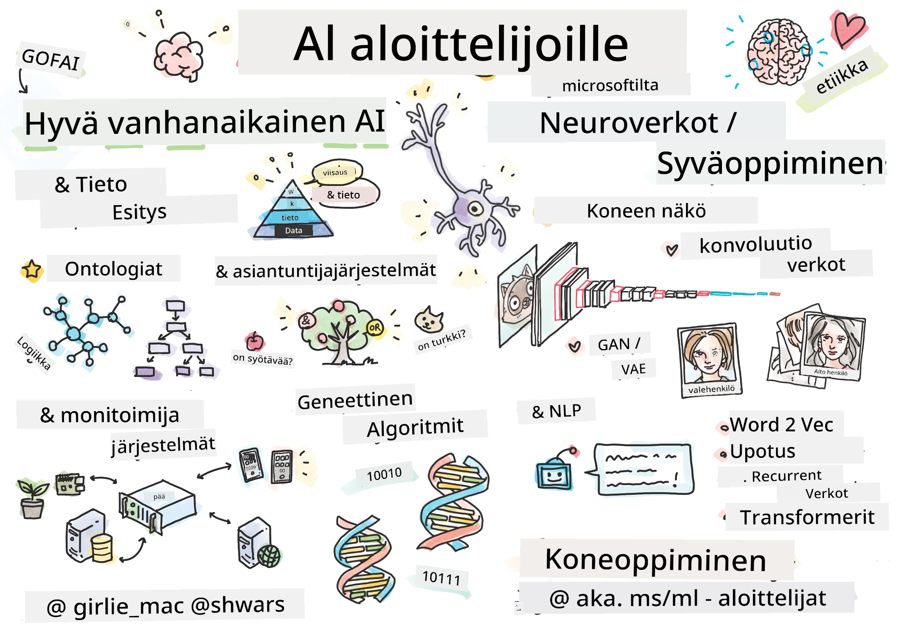

[](https://github.com/microsoft/AI-For-Beginners/blob/main/LICENSE)
[](https://GitHub.com/microsoft/AI-For-Beginners/graphs/contributors/)
[](https://GitHub.com/microsoft/AI-For-Beginners/issues/)
[](https://GitHub.com/microsoft/AI-For-Beginners/pulls/)
[](http://makeapullrequest.com)

[](https://GitHub.com/microsoft/AI-For-Beginners/watchers/)
[](https://GitHub.com/microsoft/AI-For-Beginners/network/)
[](https://GitHub.com/microsoft/AI-For-Beginners/stargazers/)
[](https://mybinder.org/v2/gh/microsoft/ai-for-beginners/HEAD)
[](https://gitter.im/Microsoft/ai-for-beginners?utm_source=badge&utm_medium=badge&utm_campaign=pr-badge)

[](https://discord.gg/nTYy5BXMWG)

# Tekoäly Aloittelijoille - Opintokokonaisuus

||
|:---:|
| AI Aloittelijoille - _Sketchnote kirjoittanut [@girlie_mac](https://twitter.com/girlie_mac)_ |

Tutustu **Tekoälyn** (AI) maailmaan 12 viikon ja 24 oppitunnin kurssikokonaisuudellamme! Se sisältää käytännön oppitunteja, tietovisat ja laboratoriotöitä. Kurssi on aloittelijaystävällinen ja kattaa työkaluja kuten TensorFlow ja PyTorch sekä tekoälyn eettiset kysymykset.


### 🌐 Monikielinen tuki

#### Tuettu GitHub Actionin kautta (Automaattinen & aina ajan tasalla)

<!-- CO-OP TRANSLATOR LANGUAGES TABLE START -->
[Arabia](../ar/README.md) | [Bengali](../bn/README.md) | [Bulgaria](../bg/README.md) | [Burma (Myanmar)](../my/README.md) | [Kiina (yksinkertaistettu)](../zh-CN/README.md) | [Kiina (perinteinen, Hong Kong)](../zh-HK/README.md) | [Kiina (perinteinen, Macau)](../zh-MO/README.md) | [Kiina (perinteinen, Taiwan)](../zh-TW/README.md) | [Kroatia](../hr/README.md) | [Tšekki](../cs/README.md) | [Tanska](../da/README.md) | [Hollanti](../nl/README.md) | [Viro](../et/README.md) | [Suomi](./README.md) | [Ranska](../fr/README.md) | [Saksa](../de/README.md) | [Kreikka](../el/README.md) | [Heprea](../he/README.md) | [Hindi](../hi/README.md) | [Unkari](../hu/README.md) | [Indonesia](../id/README.md) | [Italia](../it/README.md) | [Japani](../ja/README.md) | [Kannada](../kn/README.md) | [Korea](../ko/README.md) | [Liettua](../lt/README.md) | [Malaiji](../ms/README.md) | [Malajalam](../ml/README.md) | [Marathi](../mr/README.md) | [Nepali](../ne/README.md) | [Nigerian Pidgin](../pcm/README.md) | [Norja](../no/README.md) | [Persia (Farsi)](../fa/README.md) | [Puola](../pl/README.md) | [Portugali (Brasilia)](../pt-BR/README.md) | [Portugali (Portugali)](../pt-PT/README.md) | [Punjabi (Gurmukhi)](../pa/README.md) | [Romania](../ro/README.md) | [Venäjä](../ru/README.md) | [Serbia (kyrillinen)](../sr/README.md) | [Slovakki](../sk/README.md) | [Sloveeni](../sl/README.md) | [Espanja](../es/README.md) | [Swahili](../sw/README.md) | [Ruotsi](../sv/README.md) | [Tagalog (Filipino)](../tl/README.md) | [Tamil](../ta/README.md) | [Telugu](../te/README.md) | [Thai](../th/README.md) | [Turkki](../tr/README.md) | [Ukraina](../uk/README.md) | [Urdu](../ur/README.md) | [Vietnam](../vi/README.md)

> **Haluatko kloonata paikallisesti?**

> Tämä arkisto sisältää 50+ käännöskieltä, mikä lisää merkittävästi latauskokoa. Kloonaa ilman käännöksiä käyttämällä sparse checkout -ominaisuutta:
> ```bash
> git clone --filter=blob:none --sparse https://github.com/microsoft/AI-For-Beginners.git
> cd AI-For-Beginners
> git sparse-checkout set --no-cone '/*' '!translations' '!translated_images'
> ```
> Tämä tarjoaa kaiken tarvittavan kurssin suorittamiseen huomattavasti nopeammalla latauksella.
<!-- CO-OP TRANSLATOR LANGUAGES TABLE END -->

**Jos haluat lisää tuettuja käännöskieliä, ne on listattu [tässä](https://github.com/Azure/co-op-translator/blob/main/getting_started/supported-languages.md)**

## Liity yhteisöön
[](https://discord.gg/nTYy5BXMWG)

## Mitä opit

**[Kurssin miellekartta](http://soshnikov.com/courses/ai-for-beginners/mindmap.html)**

Tässä opintokokonaisuudessa opit:

* Eri lähestymistapoja tekoälyyn, mukaan lukien "hyvä vanha" symbolinen lähestymistapa, joka käyttää **Tietojen esitystä** ja päättelyä ([GOFAI](https://en.wikipedia.org/wiki/Symbolic_artificial_intelligence)).
* **Neuroverkot** ja **Syväoppiminen**, jotka ovat nykyaikaisen tekoälyn ydintä. Käytämme kahta suosittua kehystä - [TensorFlow](http://Tensorflow.org) ja [PyTorch](http://pytorch.org) - havainnollistamaan näihin aiheisiin liittyviä käsitteitä koodin avulla.
* **Neuroarkkitehtuurit** kuvan- ja tekstinkäsittelyyn. Käymme läpi viimeisimpiä malleja, vaikka ne eivät aina edusta aivan uusinta teknologiaa.
* Vähemmän tunnettuja tekoälyn lähestymistapoja, kuten **Geneettisiä algoritmeja** ja **Moni-agenttijärjestelmiä**.

Mitä emme käsittele tässä opintokokonaisuudessa:

> [Löydä kaikki tämän kurssin lisämateriaalit Microsoft Learn -kokoelmastamme](https://learn.microsoft.com/en-us/collections/7w28iy2xrqzdj0?WT.mc_id=academic-77998-bethanycheum)

* Liiketoimintatapauksia **tekoälyn käytöstä liiketoiminnassa**. Suosittelemme ottamaan [Johdanto tekoälyyn liiketoiminnan käyttäjille](https://docs.microsoft.com/learn/paths/introduction-ai-for-business-users/?WT.mc_id=academic-77998-bethanycheum) -oppimispolun Microsoft Learnissa tai [AI Business School](https://www.microsoft.com/ai/ai-business-school/?WT.mc_id=academic-77998-bethanycheum), joka on kehitetty yhteistyössä [INSEADin](https://www.insead.edu/) kanssa.
* **Klassista koneoppimista**, jota käsitellään hyvin [Koneoppiminen aloittelijoille](http://github.com/Microsoft/ML-for-Beginners) -opintokokonaisuudessamme.
* Käytännön tekoälysovelluksia, jotka on rakennettu käyttäen **[Cognitive Services](https://azure.microsoft.com/services/cognitive-services/?WT.mc_id=academic-77998-bethanycheum)** -palveluita. Tässä suosittelemme aloittamaan Microsoft Learn -moduuleista [näköaistille](https://docs.microsoft.com/learn/paths/create-computer-vision-solutions-azure-cognitive-services/?WT.mc_id=academic-77998-bethanycheum), [luonnollisen kielen käsittelyyn](https://docs.microsoft.com/learn/paths/explore-natural-language-processing/?WT.mc_id=academic-77998-bethanycheum), **[Generatiiviseen tekoälyyn Azure OpenAI -palvelulla](https://learn.microsoft.com/en-us/training/paths/develop-ai-solutions-azure-openai/?WT.mc_id=academic-77998-bethanycheum)** ja muihin.
* Erityisiä ML **pilvikehyksiä**, kuten [Azure Machine Learning](https://azure.microsoft.com/services/machine-learning/?WT.mc_id=academic-77998-bethanycheum), [Microsoft Fabric](https://learn.microsoft.com/en-us/training/paths/get-started-fabric/?WT.mc_id=academic-77998-bethanycheum) tai [Azure Databricks](https://docs.microsoft.com/learn/paths/data-engineer-azure-databricks?WT.mc_id=academic-77998-bethanycheum). Harkitse käyttäväsi oppimispolkuja [Machine Learning -ratkaisujen rakentaminen ja käyttöönotto Azure Machine Learningillä](https://docs.microsoft.com/learn/paths/build-ai-solutions-with-azure-ml-service/?WT.mc_id=academic-77998-bethanycheum) ja [Machine Learning -ratkaisujen rakentaminen ja toimintakuntoon Azure Databricksillä](https://docs.microsoft.com/learn/paths/build-operate-machine-learning-solutions-azure-databricks/?WT.mc_id=academic-77998-bethanycheum).
* **Keskusteluperusteinen tekoäly** ja **Chataobotit**. Niihin on oma [Luo keskusteluperusteisia tekoälyratkaisuja](https://docs.microsoft.com/learn/paths/create-conversational-ai-solutions/?WT.mc_id=academic-77998-bethanycheum) -oppimispolkunsa, ja lisätietoa löydät myös [tästä blogikirjoituksesta](https://soshnikov.com/azure/hello-bot-conversational-ai-on-microsoft-platform/).
* **Syvällinen matematiikka** syväoppimisen takana. Tässä suosittelemme teosta [Deep Learning](https://www.amazon.com/Deep-Learning-Adaptive-Computation-Machine/dp/0262035618) kirjoittanut Ian Goodfellow, Yoshua Bengio ja Aaron Courville, joka on saatavilla myös netissä osoitteessa [https://www.deeplearningbook.org/](https://www.deeplearningbook.org/).

Hellävaraisemman johdannon _tekoälystä pilvessä_ aiheisiin saa ottamalla [Aloita tekoälyn kanssa Azurella](https://docs.microsoft.com/learn/paths/get-started-with-artificial-intelligence-on-azure/?WT.mc_id=academic-77998-bethanycheum) -oppimispolun.

# Sisältö

|     |                                                                 Oppitunnin linkki                                                                 |                                           PyTorch/Keras/TensorFlow                                          | Labra                                                         |
| :-: | :------------------------------------------------------------------------------------------------------------------------------------------: | :---------------------------------------------------------------------------------------------: | ------------------------------------------------------------------------------ |
| 0  |                                 [Kurssin aloitus](./lessons/0-course-setup/setup.md)                                 |                      [Kehitysympäristön asennus](./lessons/0-course-setup/how-to-run.md)                       |   |
| I  |               [**Johdatus tekoälyyn**](./lessons/1-Intro/README.md)      | | |
| 01  |       [Johdanto ja tekoälyn historia](./lessons/1-Intro/README.md)       |           -                            | -  |
| II |              **Symbolinen tekoäly**              |
| 02  |       [Tietojen esitys ja asiantuntijajärjestelmät](./lessons/2-Symbolic/README.md)       |            [Asiantuntijajärjestelmät](./lessons/2-Symbolic/Animals.ipynb) /  [Ontologia](./lessons/2-Symbolic/FamilyOntology.ipynb) /[Käsitteiden verkko](./lessons/2-Symbolic/MSConceptGraph.ipynb)                             |  |
| III |                        [**Johdatus neuroverkkoihin**](./lessons/3-NeuralNetworks/README.md) |||
| 03  |                [Perceptroni](./lessons/3-NeuralNetworks/03-Perceptron/README.md)                 |                       [Muistikirja](./lessons/3-NeuralNetworks/03-Perceptron/Perceptron.ipynb)                      | [Labra](./lessons/3-NeuralNetworks/03-Perceptron/lab/README.md) |
| 04  |                   [Monikerroksinen perceptroni ja oman kehyskirjaston luominen](./lessons/3-NeuralNetworks/04-OwnFramework/README.md)                   |        [Muistikirja](./lessons/3-NeuralNetworks/04-OwnFramework/OwnFramework.ipynb)        | [Labra](./lessons/3-NeuralNetworks/04-OwnFramework/lab/README.md) |
| 05  |            [Johdatus kehyksiin (PyTorch/TensorFlow) ja ylisovittaminen](./lessons/3-NeuralNetworks/05-Frameworks/README.md)             |           [PyTorch](./lessons/3-NeuralNetworks/05-Frameworks/IntroPyTorch.ipynb) / [Keras](./lessons/3-NeuralNetworks/05-Frameworks/IntroKeras.ipynb) / [TensorFlow](./lessons/3-NeuralNetworks/05-Frameworks/IntroKerasTF.ipynb)             | [Labra](./lessons/3-NeuralNetworks/05-Frameworks/lab/README.md) |
| IV  |            [**Tietokonenäkö**](./lessons/4-ComputerVision/README.md)             | [PyTorch](https://docs.microsoft.com/learn/modules/intro-computer-vision-pytorch/?WT.mc_id=academic-77998-cacaste) / [TensorFlow](https://docs.microsoft.com/learn/modules/intro-computer-vision-TensorFlow/?WT.mc_id=academic-77998-cacaste)| [Tutustu tietokonenäköön Microsoft Azuren avulla](https://learn.microsoft.com/en-us/collections/7w28iy2xrqzdj0?WT.mc_id=academic-77998-bethanycheum) |
| 06  |            [Johdatus tietokonenäköön. OpenCV](./lessons/4-ComputerVision/06-IntroCV/README.md)             |           [Muistikirja](./lessons/4-ComputerVision/06-IntroCV/OpenCV.ipynb)         | [Labra](./lessons/4-ComputerVision/06-IntroCV/lab/README.md) |
| 07  |            [Konvoluutiohermoverkot](./lessons/4-ComputerVision/07-ConvNets/README.md) &  [CNN-arkkitehtuurit](./lessons/4-ComputerVision/07-ConvNets/CNN_Architectures.md)             |           [PyTorch](./lessons/4-ComputerVision/07-ConvNets/ConvNetsPyTorch.ipynb) /[TensorFlow](./lessons/4-ComputerVision/07-ConvNets/ConvNetsTF.ipynb)             | [Labra](./lessons/4-ComputerVision/07-ConvNets/lab/README.md) |
| 08  |            [Esikoulutetut verkot ja siirtovaikuttaminen](./lessons/4-ComputerVision/08-TransferLearning/README.md) ja [Koulutusvinkit](./lessons/4-ComputerVision/08-TransferLearning/TrainingTricks.md)             |           [PyTorch](./lessons/4-ComputerVision/08-TransferLearning/TransferLearningPyTorch.ipynb) / [TensorFlow](./lessons/3-NeuralNetworks/05-Frameworks/IntroKerasTF.ipynb)             | [Labra](./lessons/4-ComputerVision/08-TransferLearning/lab/README.md) |
| 09  |            [Autoenkooderit ja VAE:t](./lessons/4-ComputerVision/09-Autoencoders/README.md)             |           [PyTorch](./lessons/4-ComputerVision/09-Autoencoders/AutoEncodersPyTorch.ipynb) / [TensorFlow](./lessons/4-ComputerVision/09-Autoencoders/AutoencodersTF.ipynb)             |  |
| 10  |            [Generatiiviset vihollisverkot & taiteen tyylinsiirto](./lessons/4-ComputerVision/10-GANs/README.md)             |           [PyTorch](./lessons/4-ComputerVision/10-GANs/GANPyTorch.ipynb) / [TensorFlow](./lessons/4-ComputerVision/10-GANs/GANTF.ipynb)             |  |
| 11  |            [Kohteiden tunnistus](./lessons/4-ComputerVision/11-ObjectDetection/README.md)             |         [TensorFlow](./lessons/4-ComputerVision/11-ObjectDetection/ObjectDetection.ipynb)             | [Labra](./lessons/4-ComputerVision/11-ObjectDetection/lab/README.md) |
| 12  |            [Semanttinen segmentointi. U-Net](./lessons/4-ComputerVision/12-Segmentation/README.md)             |           [PyTorch](./lessons/4-ComputerVision/12-Segmentation/SemanticSegmentationPytorch.ipynb) / [TensorFlow](./lessons/4-ComputerVision/12-Segmentation/SemanticSegmentationTF.ipynb)             |  |
| V  |            [**Luonnollisen kielen käsittely**](./lessons/5-NLP/README.md)             | [PyTorch](https://docs.microsoft.com/learn/modules/intro-natural-language-processing-pytorch/?WT.mc_id=academic-77998-cacaste) /[TensorFlow](https://docs.microsoft.com/learn/modules/intro-natural-language-processing-TensorFlow/?WT.mc_id=academic-77998-cacaste) | [Tutustu luonnollisen kielen käsittelyyn Microsoft Azuren avulla](https://learn.microsoft.com/en-us/collections/7w28iy2xrqzdj0?WT.mc_id=academic-77998-bethanycheum)|
| 13  |            [Tekstin esitys. Bow/TF-IDF](./lessons/5-NLP/13-TextRep/README.md)             |           [PyTorch](https://github.com/microsoft/AI-For-Beginners/blob/main/lessons/5-NLP/13-TextRep/TextRepresentationPyTorch.ipynb) / [TensorFlow](https://github.com/microsoft/AI-For-Beginners/blob/main/lessons/5-NLP/13-TextRep/TextRepresentationTF.ipynb)             | |
| 14  |            [Semanttiset sanansaadot. Word2Vec ja GloVe](./lessons/5-NLP/14-Embeddings/README.md)             |           [PyTorch](https://github.com/microsoft/AI-For-Beginners/blob/main/lessons/5-NLP/14-Embeddings/EmbeddingsPyTorch.ipynb) / [TensorFlow](https://github.com/microsoft/AI-For-Beginners/blob/main/lessons/5-NLP/14-Embeddings/EmbeddingsTF.ipynb)             |  |
| 15  |            [Kielimallinnus. Omien upotusten harjoittaminen](./lessons/5-NLP/15-LanguageModeling/README.md)             |           [PyTorch](https://github.com/microsoft/AI-For-Beginners/blob/main/lessons/5-NLP/15-LanguageModeling/CBoW-PyTorch.ipynb) / [TensorFlow](https://github.com/microsoft/AI-For-Beginners/blob/main/lessons/5-NLP/15-LanguageModeling/CBoW-TF.ipynb)             | [Labra](./lessons/5-NLP/15-LanguageModeling/lab/README.md) |
| 16  |            [Takaisinkytketyt neuroverkot](./lessons/5-NLP/16-RNN/README.md)             |           [PyTorch](https://github.com/microsoft/AI-For-Beginners/blob/main/lessons/5-NLP/16-RNN/RNNPyTorch.ipynb) / [TensorFlow](https://github.com/microsoft/AI-For-Beginners/blob/main/lessons/5-NLP/16-RNN/RNNTF.ipynb)             |  |
| 17  |            [Generatiiviset takaisinkytketyt verkot](./lessons/5-NLP/17-GenerativeNetworks/README.md)             |           [PyTorch](https://github.com/microsoft/AI-For-Beginners/blob/main/lessons/5-NLP/17-GenerativeNetworks/GenerativePyTorch.ipynb) / [TensorFlow](https://github.com/microsoft/AI-For-Beginners/blob/main/lessons/5-NLP/17-GenerativeNetworks/GenerativeTF.ipynb)             | [Labra](./lessons/5-NLP/17-GenerativeNetworks/lab/README.md) |
| 18  |            [Transformaattorit. BERT.](./lessons/5-NLP/18-Transformers/README.md)             |           [PyTorch](https://github.com/microsoft/AI-For-Beginners/blob/main/lessons/5-NLP/18-Transformers/TransformersPyTorch.ipynb) /[TensorFlow](https://github.com/microsoft/AI-For-Beginners/blob/main/lessons/5-NLP/18-Transformers/TransformersTF.ipynb)             |  |
| 19  |            [Nimettyjen entiteettien tunnistus](./lessons/5-NLP/19-NER/README.md)             |           [TensorFlow](https://microsoft.github.io/AI-For-Beginners/lessons/5-NLP/19-NER/NER-TF.ipynb)             | [Labra](./lessons/5-NLP/19-NER/lab/README.md) |
| 20  |            [Suuret kielimallit, kehotusohjelmointi ja vähän.esimerkkitehtäviä](./lessons/5-NLP/20-LangModels/README.md)             |           [PyTorch](https://microsoft.github.io/AI-For-Beginners/lessons/5-NLP/20-LangModels/GPT-PyTorch.ipynb) | |
| VI |            **Muut tekoälytekniikat** || |
| 21  |            [Geneettiset algoritmit](./lessons/6-Other/21-GeneticAlgorithms/README.md)             |           [Muistikirja](./lessons/6-Other/21-GeneticAlgorithms/Genetic.ipynb) | |
| 22  |            [Syvä vahvistusoppiminen](./lessons/6-Other/22-DeepRL/README.md)             |           [PyTorch](./lessons/6-Other/22-DeepRL/CartPole-RL-PyTorch.ipynb) /[TensorFlow](./lessons/6-Other/22-DeepRL/CartPole-RL-TF.ipynb)             | [Labra](./lessons/6-Other/22-DeepRL/lab/README.md) |
| 23  |            [Moniagenttijärjestelmät](./lessons/6-Other/23-MultiagentSystems/README.md)             |  | |
| VII |            **Tekoälyn etiikka** | | |
| 24  |            [Tekoälyn etiikka ja vastuullinen tekoäly](./lessons/7-Ethics/README.md)             |           [Microsoft Learn: Vastuullisen tekoälyn periaatteet](https://docs.microsoft.com/learn/paths/responsible-ai-business-principles/?WT.mc_id=academic-77998-cacaste) | |
| IX  |            **Lisäaineistot** | | |
| 25  |            [Monimodaaliset verkot, CLIP ja VQGAN](./lessons/X-Extras/X1-MultiModal/README.md)             |           [Muistikirja](./lessons/X-Extras/X1-MultiModal/Clip.ipynb)    | |

## Jokainen oppitunti sisältää

* Ennakko-lukemateriaalia
* Suoritettavia Jupyter-muistikirjoja, jotka ovat usein spesifisiä kehykselle (**PyTorch** tai **TensorFlow**). Suoritettava muistikirja sisältää myös paljon teoreettista aineistoa, joten aiheen ymmärtämiseksi sinun tulee käydä läpi ainakin jokin muistikirjan versioista (joko PyTorch tai TensorFlow).
* **Labroja** joihinkin aiheisiin, jotka antavat sinulle mahdollisuuden kokeilla oppimaasi käytännössä tietyn ongelman ratkaisemiseksi.
* Joihinkin osioihin sisältyy linkkejä [**MS Learn**](https://learn.microsoft.com/en-us/collections/7w28iy2xrqzdj0?WT.mc_id=academic-77998-bethanycheum) moduuleihin, jotka käsittelevät aiheeseen liittyviä teemoja.

## Alkuun pääseminen

### 🎯 Uusi tekoälyn parissa? Aloita tästä!

Jos olet täysin uusi tekoälyn parissa ja haluat nopeita, käytännön esimerkkejä, tutustu [**aloittelijaystävällisiin esimerkkeihimme**](./examples/README.md)! Niihin sisältyy:

- 🌟 **Hei tekoälymaailma** - Ensimmäinen tekoälyohjelmasi (kuviotunnistus)
- 🧠 **Yksinkertainen neuroverkko** - Rakenna neuroverkko alusta asti  

- 🖼️ **Kuvien luokittelija** - Luokittele kuvia yksityiskohtaisilla kommenteilla  
- 💬 **Tekstin tunnelma** - Analysoi tekstin positiivisuus/negatiivisuus  

Nämä esimerkit on suunniteltu auttamaan sinua ymmärtämään tekoälyn käsitteitä ennen varsinaisen oppimateriaalin pariin sukeltamista.

### 📚 Koko oppimateriaalin asennus

- Olemme luoneet [asennustunnin](./lessons/0-course-setup/setup.md) auttamaan sinua kehitysympäristön asennuksessa. - Opettajille olemme luoneet myös [oppimateriaalin asennustunnin](./lessons/0-course-setup/for-teachers.md)!  
- Kuinka [suorittaa koodi VSCode- tai Codespace-ympäristössä](./lessons/0-course-setup/how-to-run.md)

Noudata näitä vaiheita:

Forkkaa repositorio: Klikkaa sivun oikeasta yläkulmasta "Fork"-painiketta.

Kloonaa repositorio: `git clone https://github.com/microsoft/AI-For-Beginners.git`

Älä unohda tähdittää (🌟) tätä repo:ta, jotta löydät sen helpommin myöhemmin.

## Tapaa muut oppijat

Liity [viralliselle AI Discord -palvelimellemme](https://aka.ms/genai-discord?WT.mc_id=academic-105485-bethanycheum) tavata ja verkostoitua muiden kurssin kävijöiden kanssa sekä saada tukea.

Jos sinulla on palautetta tuotteesta tai kysymyksiä rakennuksen aikana, käy [Azure AI Foundry Developer Forumissa](https://aka.ms/foundry/forum)

## Testit

> **Muistutus testeistä**: Kaikki testit löytyvät Quiz-app-kansiosta sijainnissa etc\quiz-app tai [verkkoversio täällä](https://ff-quizzes.netlify.app/) Testit on linkitetty oppitunneilta; quiz-sovellusta voi ajaa paikallisesti tai ottaa käyttöön Azureen; seuraa `quiz-app`-kansion ohjeita. Testit on vähitellen lokalisoitu.

## Apua kaivataan

Onko sinulla ehdotuksia tai oletko löytänyt kirjoitus- tai koodivirheitä? Tee issue tai tee pull request.

## Erityiskiitos

* **✍️ Pääkirjoittaja:** [Dmitry Soshnikov](http://soshnikov.com), FT  
* **🔥 Toimittaja:** [Jen Looper](https://twitter.com/jenlooper), FT  
* **🎨 Sketchnote-kuvittaja:** [Tomomi Imura](https://twitter.com/girlie_mac)  
* **✅ Testin tekijä:** [Lateefah Bello](https://github.com/CinnamonXI), [MLSA](https://studentambassadors.microsoft.com/)  
* **🙏 Ydintekijät:** [Evgenii Pishchik](https://github.com/Pe4enIks)  

## Muut oppimateriaalit

Tiimimme tuottaa myös muita oppimateriaaleja! Tutustu:

<!-- CO-OP TRANSLATOR OTHER COURSES START -->
### LangChain  
[](https://aka.ms/langchain4j-for-beginners)  
[](https://aka.ms/langchainjs-for-beginners?WT.mc_id=m365-94501-dwahlin)  

---

### Azure / Edge / MCP / Agentit  
[](https://github.com/microsoft/AZD-for-beginners?WT.mc_id=academic-105485-koreyst)  
[](https://github.com/microsoft/edgeai-for-beginners?WT.mc_id=academic-105485-koreyst)  
[](https://github.com/microsoft/mcp-for-beginners?WT.mc_id=academic-105485-koreyst)  
[](https://github.com/microsoft/ai-agents-for-beginners?WT.mc_id=academic-105485-koreyst)  

---

### Generatiivinen AI -sarja  
[](https://github.com/microsoft/generative-ai-for-beginners?WT.mc_id=academic-105485-koreyst)  
[-9333EA?style=for-the-badge&labelColor=E5E7EB&color=9333EA)](https://github.com/microsoft/Generative-AI-for-beginners-dotnet?WT.mc_id=academic-105485-koreyst)  
[-C084FC?style=for-the-badge&labelColor=E5E7EB&color=C084FC)](https://github.com/microsoft/generative-ai-for-beginners-java?WT.mc_id=academic-105485-koreyst)  
[-E879F9?style=for-the-badge&labelColor=E5E7EB&color=E879F9)](https://github.com/microsoft/generative-ai-with-javascript?WT.mc_id=academic-105485-koreyst)  

---

### Keskeinen oppiminen  
[](https://aka.ms/ml-beginners?WT.mc_id=academic-105485-koreyst)  
[](https://aka.ms/datascience-beginners?WT.mc_id=academic-105485-koreyst)  
[](https://aka.ms/ai-beginners?WT.mc_id=academic-105485-koreyst)  
[](https://github.com/microsoft/Security-101?WT.mc_id=academic-96948-sayoung)  
[](https://aka.ms/webdev-beginners?WT.mc_id=academic-105485-koreyst)  
[](https://aka.ms/iot-beginners?WT.mc_id=academic-105485-koreyst)  
[](https://github.com/microsoft/xr-development-for-beginners?WT.mc_id=academic-105485-koreyst)  

---

### Copilot-sarja  
[](https://aka.ms/GitHubCopilotAI?WT.mc_id=academic-105485-koreyst)  
[](https://github.com/microsoft/mastering-github-copilot-for-dotnet-csharp-developers?WT.mc_id=academic-105485-koreyst)  
[](https://github.com/microsoft/CopilotAdventures?WT.mc_id=academic-105485-koreyst)  
<!-- CO-OP TRANSLATOR OTHER COURSES END -->

## Apua saatavilla

Jos jumitut tai sinulla on kysyttävää tekoälysovellusten rakentamisesta, liity muiden oppijoiden ja kokeneiden kehittäjien keskusteluihin MCP:stä. Se on kannustava yhteisö, jossa kysymykset ovat tervetulleita ja tietoa jaetaan vapaasti.

[](https://discord.gg/nTYy5BXMWG)

Jos sinulla on tuotepalaute tai virheitä rakennusvaiheessa, käy:

[](https://aka.ms/foundry/forum)

---

<!-- CO-OP TRANSLATOR DISCLAIMER START -->
**Vastuuvapauslauseke**:  
Tämä asiakirja on käännetty tekoälypohjaisella käännöspalvelulla [Co-op Translator](https://github.com/Azure/co-op-translator). Pyrimme tarkkuuteen, mutta automaattiset käännökset saattavat sisältää virheitä tai epätarkkuuksia. Alkuperäinen asiakirja omalla kielellään on virallinen lähde. Tärkeissä asioissa suositellaan ammattilaisen tekemää ihmiskäännöstä. Emme ole vastuussa tästä käännöksestä johtuvista väärinymmärryksistä tai tulkinnoista.
<!-- CO-OP TRANSLATOR DISCLAIMER END -->