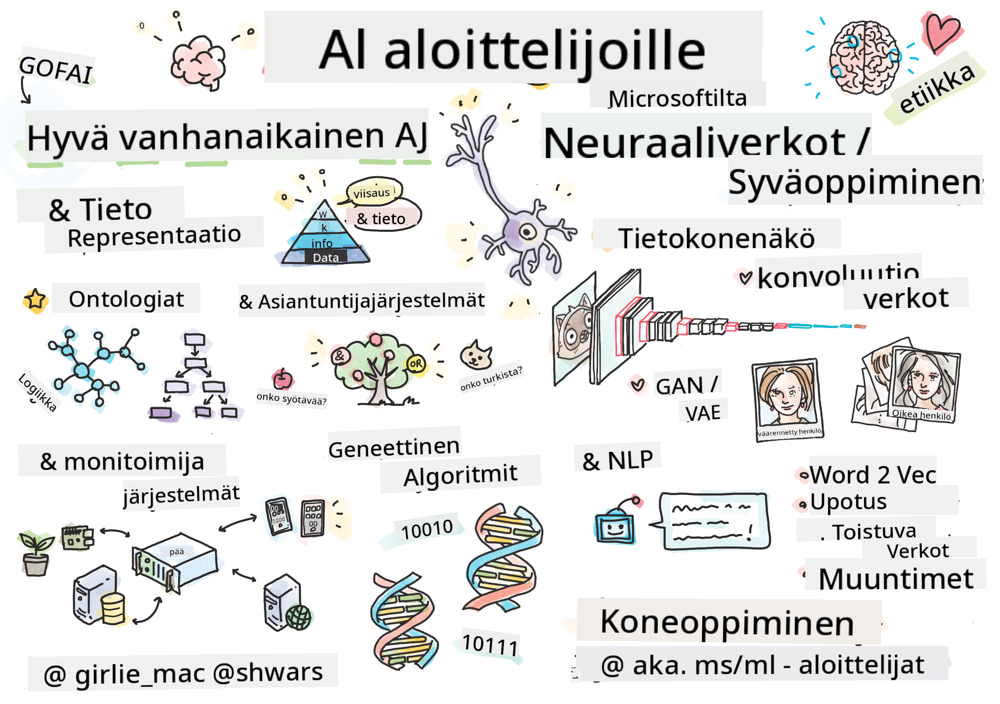

<!--
CO_OP_TRANSLATOR_METADATA:
{
  "original_hash": "14816e97d79b296c87811724f7785923",
  "translation_date": "2026-01-01T12:13:35+00:00",
  "source_file": "README.md",
  "language_code": "fi"
}
-->

# Johdatus tekoälyyn – opetussuunnitelma

||
|:---:|
| AI For Beginners - _Sketchnote by [@girlie_mac](https://twitter.com/girlie_mac)_ |

Tutustu **tekoälyn** (AI) maailmaan 12 viikon ja 24 oppitunnin opetussuunnitelmamme avulla! Se sisältää käytännönläheisiä oppitunteja, tietokilpailuja ja laboratorioita. Opetussuunnitelma on aloittelijaystävällinen ja kattaa työkaluja kuten TensorFlow ja PyTorch sekä tekoälyn etiikan.

### 🌐 Monikielinen tuki

#### Tuettu GitHub Actionin kautta (automaattinen & aina ajan tasalla)

<!-- CO-OP TRANSLATOR LANGUAGES TABLE START -->
[Arabic](../ar/README.md) | [Bengali](../bn/README.md) | [Bulgarian](../bg/README.md) | [Burmese (Myanmar)](../my/README.md) | [Chinese (Simplified)](../zh/README.md) | [Chinese (Traditional, Hong Kong)](../hk/README.md) | [Chinese (Traditional, Macau)](../mo/README.md) | [Chinese (Traditional, Taiwan)](../tw/README.md) | [Croatian](../hr/README.md) | [Czech](../cs/README.md) | [Danish](../da/README.md) | [Dutch](../nl/README.md) | [Estonian](../et/README.md) | [Finnish](./README.md) | [French](../fr/README.md) | [German](../de/README.md) | [Greek](../el/README.md) | [Hebrew](../he/README.md) | [Hindi](../hi/README.md) | [Hungarian](../hu/README.md) | [Indonesian](../id/README.md) | [Italian](../it/README.md) | [Japanese](../ja/README.md) | [Kannada](../kn/README.md) | [Korean](../ko/README.md) | [Lithuanian](../lt/README.md) | [Malay](../ms/README.md) | [Malayalam](../ml/README.md) | [Marathi](../mr/README.md) | [Nepali](../ne/README.md) | [Nigerian Pidgin](../pcm/README.md) | [Norwegian](../no/README.md) | [Persian (Farsi)](../fa/README.md) | [Polish](../pl/README.md) | [Portuguese (Brazil)](../br/README.md) | [Portuguese (Portugal)](../pt/README.md) | [Punjabi (Gurmukhi)](../pa/README.md) | [Romanian](../ro/README.md) | [Russian](../ru/README.md) | [Serbian (Cyrillic)](../sr/README.md) | [Slovak](../sk/README.md) | [Slovenian](../sl/README.md) | [Spanish](../es/README.md) | [Swahili](../sw/README.md) | [Swedish](../sv/README.md) | [Tagalog (Filipino)](../tl/README.md) | [Tamil](../ta/README.md) | [Telugu](../te/README.md) | [Thai](../th/README.md) | [Turkish](../tr/README.md) | [Ukrainian](../uk/README.md) | [Urdu](../ur/README.md) | [Vietnamese](../vi/README.md)
<!-- CO-OP TRANSLATOR LANGUAGES TABLE END -->

**Jos haluat lisätä käännöksiä, tuetut kielet on lueteltu [tässä](https://github.com/Azure/co-op-translator/blob/main/getting_started/supported-languages.md)**

## Liity yhteisöön

## Mitä opit

**[Kurssin miellekartta](http://soshnikov.com/courses/ai-for-beginners/mindmap.html)**

Tässä opetussuunnitelmassa opit:

* Eri lähestymistapoja tekoälyyn, mukaan lukien "hyvin vanha" symbolinen lähestymistapa **tietämyksen esityksen** ja päättelyn kanssa ([GOFAI](https://en.wikipedia.org/wiki/Symbolic_artificial_intelligence)).
* **Neuroverkot** ja **syväoppiminen**, jotka ovat modernin tekoälyn ytimessä. Havainnollistamme näitä tärkeitä aiheita koodilla kahdessa suosituimmista kehyksistä - [TensorFlow](http://Tensorflow.org) ja [PyTorch](http://pytorch.org).
* **Neuraaliset arkkitehtuurit** kuvien ja tekstin käsittelyyn. Käymme läpi viimeaikaisia malleja, vaikka emme aina pysy täysin huippuluokan kehityksessä mukana.
* Vähemmän tunnettuja tekoälyn lähestymistapoja, kuten **geneettiset algoritmit** ja **moniagenttijärjestelmät**.

Mitä emme käsittele tässä opetussuunnitelmassa:

> [Löydät kaikki lisäresurssit tälle kurssille Microsoft Learn -kokoelmastamme](https://learn.microsoft.com/en-us/collections/7w28iy2xrqzdj0?WT.mc_id=academic-77998-bethanycheum)

* Liiketoimintatapauksia **tekoälyn käytöstä liiketoiminnassa**. Harkitse [Introduction to AI for business users](https://docs.microsoft.com/learn/paths/introduction-ai-for-business-users/?WT.mc_id=academic-77998-bethanycheum) -oppipolun suorittamista Microsoft Learnissa tai [AI Business School](https://www.microsoft.com/ai/ai-business-school/?WT.mc_id=academic-77998-bethanycheum), joka on kehitetty yhteistyössä [INSEADin](https://www.insead.edu/) kanssa.
* **Perinteinen koneoppiminen**, joka on hyvin kuvattu meidän [Machine Learning for Beginners Curriculum](http://github.com/Microsoft/ML-for-Beginners) -materiaalissa.
* Käytännön tekoälyratkaisut, jotka on rakennettu käyttäen **[Cognitive Services](https://azure.microsoft.com/services/cognitive-services/?WT.mc_id=academic-77998-bethanycheum)** -palveluita. Tätä varten suosittelemme aloittamaan Microsoft Learn -moduuleista [vision](https://docs.microsoft.com/learn/paths/create-computer-vision-solutions-azure-cognitive-services/?WT.mc_id=academic-77998-bethanycheum), [natural language processing](https://docs.microsoft.com/learn/paths/explore-natural-language-processing/?WT.mc_id=academic-77998-bethanycheum), **[Generative AI with Azure OpenAI Service](https://learn.microsoft.com/en-us/training/paths/develop-ai-solutions-azure-openai/?WT.mc_id=academic-77998-bethanycheum)** ja muut.
* Tietyt ML **pilvikehykset**, kuten [Azure Machine Learning](https://azure.microsoft.com/services/machine-learning/?WT.mc_id=academic-77998-bethanycheum), [Microsoft Fabric](https://learn.microsoft.com/en-us/training/paths/get-started-fabric/?WT.mc_id=academic-77998-bethanycheum) tai [Azure Databricks](https://docs.microsoft.com/learn/paths/data-engineer-azure-databricks?WT.mc_id=academic-77998-bethanycheum). Harkitse [Build and operate machine learning solutions with Azure Machine Learning](https://docs.microsoft.com/learn/paths/build-ai-solutions-with-azure-ml-service/?WT.mc_id=academic-77998-bethanycheum) ja [Build and Operate Machine Learning Solutions with Azure Databricks](https://docs.microsoft.com/learn/paths/build-operate-machine-learning-solutions-azure-databricks/?WT.mc_id=academic-77998-bethanycheum) -oppipolkuja.
* **Keskustelutoimintaa tukeva tekoäly** ja **chatbotit**. Tälle on oma [Create conversational AI solutions](https://docs.microsoft.com/learn/paths/create-conversational-ai-solutions/?WT.mc_id=academic-77998-bethanycheum) -oppipolkunsa, ja voit myös tutustua [tähän blogikirjoitukseen](https://soshnikov.com/azure/hello-bot-conversational-ai-on-microsoft-platform/) saadaksesi lisätietoja.
* **Syvällinen matematiikka** syväoppimisen taustalla. Tätä varten suosittelemme teosta [Deep Learning](https://www.amazon.com/Deep-Learning-Adaptive-Computation-Machine/dp/0262035618) kirjoittajilta Ian Goodfellow, Yoshua Bengio ja Aaron Courville, joka on myös saatavilla verkossa osoitteessa [https://www.deeplearningbook.org/](https://www.deeplearningbook.org/).

Kevyempään johdatukseen _tekoälystä pilvessä_ liittyvissä aiheissa voit suorittaa [Get started with artificial intelligence on Azure](https://docs.microsoft.com/learn/paths/get-started-with-artificial-intelligence-on-azure/?WT.mc_id=academic-77998-bethanycheum) -oppipolun.

# Sisältö

|     |                                                                 Lesson Link                                                                  |                                           PyTorch/Keras/TensorFlow                                          | Lab                                                            |
| :-: | :------------------------------------------------------------------------------------------------------------------------------------------: | :---------------------------------------------------------------------------------------------: | ------------------------------------------------------------------------------ |
| 0  |                                 [Course Setup](./lessons/0-course-setup/setup.md)                                 |                      [Setup Your Development Environment](./lessons/0-course-setup/how-to-run.md)                       |   |
| I  |               [**Introduction to AI**](./lessons/1-Intro/README.md)      | | |
| 01  |       [Introduction and History of AI](./lessons/1-Intro/README.md)       |           -                            | -  |
| II |              **Symbolic AI**              |
| 02  |       [Knowledge Representation and Expert Systems](./lessons/2-Symbolic/README.md)       |            [Expert Systems](./lessons/2-Symbolic/Animals.ipynb) /  [Ontology](./lessons/2-Symbolic/FamilyOntology.ipynb) /[Concept Graph](./lessons/2-Symbolic/MSConceptGraph.ipynb)                             |  |
| III |                        [**Introduction to Neural Networks**](./lessons/3-NeuralNetworks/README.md) |||
| 03  |                [Perceptron](./lessons/3-NeuralNetworks/03-Perceptron/README.md)                 |                       [Muistikirja](./lessons/3-NeuralNetworks/03-Perceptron/Perceptron.ipynb)                      | [Harjoitus](./lessons/3-NeuralNetworks/03-Perceptron/lab/README.md) |
| 04  |                   [Monikerroksinen Perceptron ja oman kehyskirjaston luominen](./lessons/3-NeuralNetworks/04-OwnFramework/README.md)                   |        [Muistikirja](./lessons/3-NeuralNetworks/04-OwnFramework/OwnFramework.ipynb)        | [Harjoitus](./lessons/3-NeuralNetworks/04-OwnFramework/lab/README.md) |
| 05  |            [Johdatus kehyksiin (PyTorch/TensorFlow) ja ylisovittaminen](./lessons/3-NeuralNetworks/05-Frameworks/README.md)             |           [PyTorch](./lessons/3-NeuralNetworks/05-Frameworks/IntroPyTorch.ipynb) / [Keras](./lessons/3-NeuralNetworks/05-Frameworks/IntroKeras.ipynb) / [TensorFlow](./lessons/3-NeuralNetworks/05-Frameworks/IntroKerasTF.ipynb)             | [Harjoitus](./lessons/3-NeuralNetworks/05-Frameworks/lab/README.md) |
| IV  |            [**Konenäkö**](./lessons/4-ComputerVision/README.md)             | [PyTorch](https://docs.microsoft.com/learn/modules/intro-computer-vision-pytorch/?WT.mc_id=academic-77998-cacaste) / [TensorFlow](https://docs.microsoft.com/learn/modules/intro-computer-vision-TensorFlow/?WT.mc_id=academic-77998-cacaste)| [Tutustu konenäköön Microsoft Azurella](https://learn.microsoft.com/en-us/collections/7w28iy2xrqzdj0?WT.mc_id=academic-77998-bethanycheum) |
| 06  |            [Johdatus konenäköön. OpenCV](./lessons/4-ComputerVision/06-IntroCV/README.md)             |           [Muistikirja](./lessons/4-ComputerVision/06-IntroCV/OpenCV.ipynb)         | [Harjoitus](./lessons/4-ComputerVision/06-IntroCV/lab/README.md) |
| 07  |            [Konvoluutioverkot](./lessons/4-ComputerVision/07-ConvNets/README.md) &  [CNN-arkkitehtuurit](./lessons/4-ComputerVision/07-ConvNets/CNN_Architectures.md)             |           [PyTorch](./lessons/4-ComputerVision/07-ConvNets/ConvNetsPyTorch.ipynb) /[TensorFlow](./lessons/4-ComputerVision/07-ConvNets/ConvNetsTF.ipynb)             | [Harjoitus](./lessons/4-ComputerVision/07-ConvNets/lab/README.md) |
| 08  |            [Esikoulutetut verkot ja siirto-oppiminen](./lessons/4-ComputerVision/08-TransferLearning/README.md) and [Koulutusvinkit](./lessons/4-ComputerVision/08-TransferLearning/TrainingTricks.md)             |           [PyTorch](./lessons/4-ComputerVision/08-TransferLearning/TransferLearningPyTorch.ipynb) / [TensorFlow](./lessons/3-NeuralNetworks/05-Frameworks/IntroKerasTF.ipynb)             | [Harjoitus](./lessons/4-ComputerVision/08-TransferLearning/lab/README.md) |
| 09  |            [Autokooderit ja VAE:t](./lessons/4-ComputerVision/09-Autoencoders/README.md)             |           [PyTorch](./lessons/4-ComputerVision/09-Autoencoders/AutoEncodersPyTorch.ipynb) / [TensorFlow](./lessons/4-ComputerVision/09-Autoencoders/AutoencodersTF.ipynb)             |  |
| 10  |            [Generatiiviset vastustajaverkot ja tyylinsiirto](./lessons/4-ComputerVision/10-GANs/README.md)             |           [PyTorch](./lessons/4-ComputerVision/10-GANs/GANPyTorch.ipynb) / [TensorFlow](./lessons/4-ComputerVision/10-GANs/GANTF.ipynb)             |  |
| 11  |            [Kohteiden tunnistus](./lessons/4-ComputerVision/11-ObjectDetection/README.md)             |         [TensorFlow](./lessons/4-ComputerVision/11-ObjectDetection/ObjectDetection.ipynb)             | [Harjoitus](./lessons/4-ComputerVision/11-ObjectDetection/lab/README.md) |
| 12  |            [Semanttinen segmentointi. U-Net](./lessons/4-ComputerVision/12-Segmentation/README.md)             |           [PyTorch](./lessons/4-ComputerVision/12-Segmentation/SemanticSegmentationPytorch.ipynb) / [TensorFlow](./lessons/4-ComputerVision/12-Segmentation/SemanticSegmentationTF.ipynb)             |  |
| V  |            [**Luonnollisen kielen käsittely**](./lessons/5-NLP/README.md)             | [PyTorch](https://docs.microsoft.com/learn/modules/intro-natural-language-processing-pytorch/?WT.mc_id=academic-77998-cacaste) /[TensorFlow](https://docs.microsoft.com/learn/modules/intro-natural-language-processing-TensorFlow/?WT.mc_id=academic-77998-cacaste) | [Tutustu luonnollisen kielen käsittelyyn Microsoft Azurella](https://learn.microsoft.com/en-us/collections/7w28iy2xrqzdj0?WT.mc_id=academic-77998-bethanycheum)|
| 13  |            [Tekstin esitys. Bag-of-words/TF-IDF](./lessons/5-NLP/13-TextRep/README.md)             |           [PyTorch](https://github.com/microsoft/AI-For-Beginners/blob/main/lessons/5-NLP/13-TextRep/TextRepresentationPyTorch.ipynb) / [TensorFlow](https://github.com/microsoft/AI-For-Beginners/blob/main/lessons/5-NLP/13-TextRep/TextRepresentationTF.ipynb)             | |
| 14  |            [Semanttiset sanaupotukset. Word2Vec ja GloVe](./lessons/5-NLP/14-Embeddings/README.md)             |           [PyTorch](https://github.com/microsoft/AI-For-Beginners/blob/main/lessons/5-NLP/14-Embeddings/EmbeddingsPyTorch.ipynb) / [TensorFlow](https://github.com/microsoft/AI-For-Beginners/blob/main/lessons/5-NLP/14-Embeddings/EmbeddingsTF.ipynb)             |  |
| 15  |            [Kielimallinnus. Omien upotusten kouluttaminen](./lessons/5-NLP/15-LanguageModeling/README.md)             |           [PyTorch](https://github.com/microsoft/AI-For-Beginners/blob/main/lessons/5-NLP/15-LanguageModeling/CBoW-PyTorch.ipynb) / [TensorFlow](https://github.com/microsoft/AI-For-Beginners/blob/main/lessons/5-NLP/15-LanguageModeling/CBoW-TF.ipynb)             | [Harjoitus](./lessons/5-NLP/15-LanguageModeling/lab/README.md) |
| 16  |            [Toistuvat neuroverkot](./lessons/5-NLP/16-RNN/README.md)             |           [PyTorch](https://github.com/microsoft/AI-For-Beginners/blob/main/lessons/5-NLP/16-RNN/RNNPyTorch.ipynb) / [TensorFlow](https://github.com/microsoft/AI-For-Beginners/blob/main/lessons/5-NLP/16-RNN/RNNTF.ipynb)             |  |
| 17  |            [Generatiiviset toistuvat verkot](./lessons/5-NLP/17-GenerativeNetworks/README.md)             |           [PyTorch](https://github.com/microsoft/AI-For-Beginners/blob/main/lessons/5-NLP/17-GenerativeNetworks/GenerativePyTorch.ipynb) / [TensorFlow](https://github.com/microsoft/AI-For-Beginners/blob/main/lessons/5-NLP/17-GenerativeNetworks/GenerativeTF.ipynb)             | [Harjoitus](./lessons/5-NLP/17-GenerativeNetworks/lab/README.md) |
| 18  |            [Transformerit. BERT.](./lessons/5-NLP/18-Transformers/README.md)             |           [PyTorch](https://github.com/microsoft/AI-For-Beginners/blob/main/lessons/5-NLP/18-Transformers/TransformersPyTorch.ipynb) /[TensorFlow](https://github.com/microsoft/AI-For-Beginners/blob/main/lessons/5-NLP/18-Transformers/TransformersTF.ipynb)             |  |
| 19  |            [Nimitettyjen entiteettien tunnistus](./lessons/5-NLP/19-NER/README.md)             |           [TensorFlow](https://microsoft.github.io/AI-For-Beginners/lessons/5-NLP/19-NER/NER-TF.ipynb)             | [Harjoitus](./lessons/5-NLP/19-NER/lab/README.md) |
| 20  |            [Suuret kielimallit, kehotteiden ohjelmointi ja muutaman esimerkin tehtävät](./lessons/5-NLP/20-LangModels/README.md)             |           [PyTorch](https://microsoft.github.io/AI-For-Beginners/lessons/5-NLP/20-LangModels/GPT-PyTorch.ipynb) | |
| VI |            **Muut tekoälytekniikat** || |
| 21  |            [Geneettiset algoritmit](./lessons/6-Other/21-GeneticAlgorithms/README.md)             |           [Muistikirja](./lessons/6-Other/21-GeneticAlgorithms/Genetic.ipynb) | |
| 22  |            [Syvä vahvistusoppiminen](./lessons/6-Other/22-DeepRL/README.md)             |           [PyTorch](./lessons/6-Other/22-DeepRL/CartPole-RL-PyTorch.ipynb) /[TensorFlow](./lessons/6-Other/22-DeepRL/CartPole-RL-TF.ipynb)             | [Harjoitus](./lessons/6-Other/22-DeepRL/lab/README.md) |
| 23  |            [Moniagenttijärjestelmät](./lessons/6-Other/23-MultiagentSystems/README.md)             |  | |
| VII |            **Tekoälyn etiikka** | | |
| 24  |            [Tekoälyn etiikka ja vastuullinen tekoäly](./lessons/7-Ethics/README.md)             |           [Microsoft Learn: Vastuullisen tekoälyn periaatteet](https://docs.microsoft.com/learn/paths/responsible-ai-business-principles/?WT.mc_id=academic-77998-cacaste) | |
| IX  |            **Lisät** | | |
| 25  |            [Monimodaaliset verkot, CLIP ja VQGAN](./lessons/X-Extras/X1-MultiModal/README.md)             |           [Muistikirja](./lessons/X-Extras/X1-MultiModal/Clip.ipynb)    | |

## Jokainen oppitunti sisältää

* Esilukemateriaalia
* Suoritettavia Jupyter-muistikirjoja, jotka ovat usein kehykseen sidottuja (**PyTorch** tai **TensorFlow**). Suoritettava muistikirja sisältää myös paljon teoreettista materiaalia, joten aiheen ymmärtämiseksi sinun kannattaa käydä läpi vähintään yksi versio muistikirjasta ( joko PyTorch tai TensorFlow ).
* **Harjoituksia** joidenkin aiheiden kohdalla, jotka antavat mahdollisuuden soveltaa oppimaasi tietoa tiettyyn ongelmaan.
* Joissain osioissa on linkkejä [**MS Learn**](https://learn.microsoft.com/en-us/collections/7w28iy2xrqzdj0?WT.mc_id=academic-77998-bethanycheum) -moduuleihin, jotka käsittelevät aiheeseen liittyvää sisältöä.

## Aloittaminen

### 🎯 Uusi tekoälyn parissa? Aloita tästä!

Jos olet täysin uusi tekoälyn parissa ja haluat nopeita, käytännönläheisiä esimerkkejä, tutustu [**Aloittelijaystävällisiin esimerkkeihin**](./examples/README.md)! Näihin sisältyy:

- 🌟 **Hello AI World** - Ensimmäinen tekoälyohjelmasi (kuvioiden tunnistus)
- 🧠 **Yksinkertainen neuroverkko** - Rakenna neuroverkko alusta alkaen  
- 🖼️ **Kuvien luokittelija** - Luokittele kuvia yksityiskohtaisin kommentein
- 💬 **Tekstin sentimentti** - Analysoi positiivista/negatiivista tekstiä

Nämä esimerkit on suunniteltu auttamaan sinua ymmärtämään tekoälykäsitteitä ennen kuin sukellat koko opetussuunnitelmaan.

### 📚 Koko opetussuunnitelman käyttöönotto

- Olemme luoneet [asennusoppitunnin](./lessons/0-course-setup/setup.md) auttamaan kehitysympäristösi käyttöönotossa. - Opettajille olemme luoneet myös [opetussuunnitelman asennusoppitunnin](./lessons/0-course-setup/for-teachers.md)!
- Kuinka [suorittaa koodi VSCode:ssa tai Codepace:ssa](./lessons/0-course-setup/how-to-run.md)

Seuraa näitä vaiheita:

Fork the Repository: Click on the "Fork" button at the top-right corner of this page.

Clone the Repository: `git clone https://github.com/microsoft/AI-For-Beginners.git`

Don't forget to star (🌟) this repo to find it easier later.

## Tutustu muihin oppijoihin

Liity [viralliselle AI Discord -palvelimellemme](https://aka.ms/genai-discord?WT.mc_id=academic-105485-bethanycheum) tapaamaan ja verkostoitumaan muiden tämän kurssin kävijöiden kanssa sekä saadaksesi tukea.

Jos sinulla on tuotepalautetta tai kysymyksiä rakentamisen aikana, käy [Azure AI Foundry -kehittäjäfoorumillamme](https://aka.ms/foundry/forum)

## Quizzit 

> **Huomautus tietovisoista**: Kaikki tietovisat ovat Quiz-app-kansiossa polussa etc\quiz-app, tai [verkkossa täällä](https://ff-quizzes.netlify.app/) Ne on linkitetty oppituntien sisällä; quiz-sovellusta voi ajaa paikallisesti tai ottaa käyttöön Azureen; seuraa ohjeita `quiz-app`-kansiossa. Ne ovat asteittain lokalisoitumassa.

## Apua kaivataan

Onko sinulla ehdotuksia tai löysitkö kirjoitus- tai koodivirheitä? Avaa issue tai tee pull request.

## Erityiskiitokset

* **✍️ Pääkirjoittaja:** [Dmitry Soshnikov](http://soshnikov.com), PhD
* **🔥 Toimittaja:** [Jen Looper](https://twitter.com/jenlooper), PhD
* **🎨 Sketchnote-kuvittaja:** [Tomomi Imura](https://twitter.com/girlie_mac)
* **✅ Tietovisan tekijä:** [Lateefah Bello](https://github.com/CinnamonXI), [MLSA](https://studentambassadors.microsoft.com/)
* **🙏 Keskeiset avustajat:** [Evgenii Pishchik](https://github.com/Pe4enIks)

## Muut opetussuunnitelmat

Tiimimme tuottaa myös muita opetussuunnitelmia! Tutustu:

<!-- CO-OP TRANSLATOR OTHER COURSES START -->
### LangChain

---

### Azure / Edge / MCP / Agents

---
 
### Generatiivinen tekoäly -sarja

[-9333EA?style=for-the-badge&labelColor=E5E7EB&color=9333EA)](https://github.com/microsoft/Generative-AI-for-beginners-dotnet?WT.mc_id=academic-105485-koreyst)
[-C084FC?style=for-the-badge&labelColor=E5E7EB&color=C084FC)](https://github.com/microsoft/generative-ai-for-beginners-java?WT.mc_id=academic-105485-koreyst)
[-E879F9?style=for-the-badge&labelColor=E5E7EB&color=E879F9)](https://github.com/microsoft/generative-ai-with-javascript?WT.mc_id=academic-105485-koreyst)

---
 
### Perusopetus

---
 
### Copilot-sarja

<!-- CO-OP TRANSLATOR OTHER COURSES END -->

## Hanki apua

Jos jäät jumiin tai sinulla on kysyttävää tekoälysovellusten rakentamisesta, liity muiden oppijoiden ja kokeneiden kehittäjien keskusteluihin MCP:stä. Se on kannustava yhteisö, jossa kysymyksiä voi esittää ja tietoa jaetaan vapaasti.

Jos sinulla on tuotepalautetta tai rakennuksen aikana ilmenee virheitä, käy:

---

<!-- CO-OP TRANSLATOR DISCLAIMER START -->
Vastuuvapauslauseke:
Tämä asiakirja on käännetty tekoälypohjaisella käännöspalvelulla Co-op Translator (https://github.com/Azure/co-op-translator). Vaikka pyrimme tarkkuuteen, huomioithan, että automatisoidut käännökset voivat sisältää virheitä tai epätarkkuuksia. Alkuperäistä asiakirjaa sen alkuperäisellä kielellä tulee pitää ensisijaisena lähteenä. Tärkeissä tai kriittisissä asioissa suositellaan ammattimaisen ihmiskääntäjän käyttöä. Emme ole vastuussa mahdollisista väärinymmärryksistä tai virhetulkinnoista, jotka johtuvat tämän käännöksen käytöstä.
<!-- CO-OP TRANSLATOR DISCLAIMER END -->