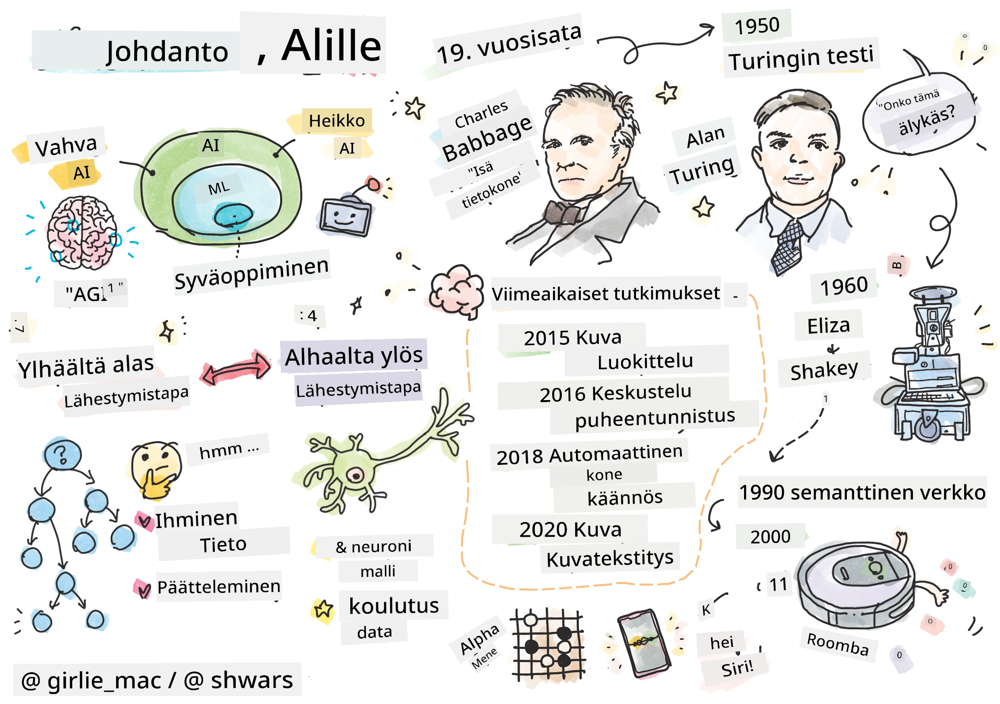
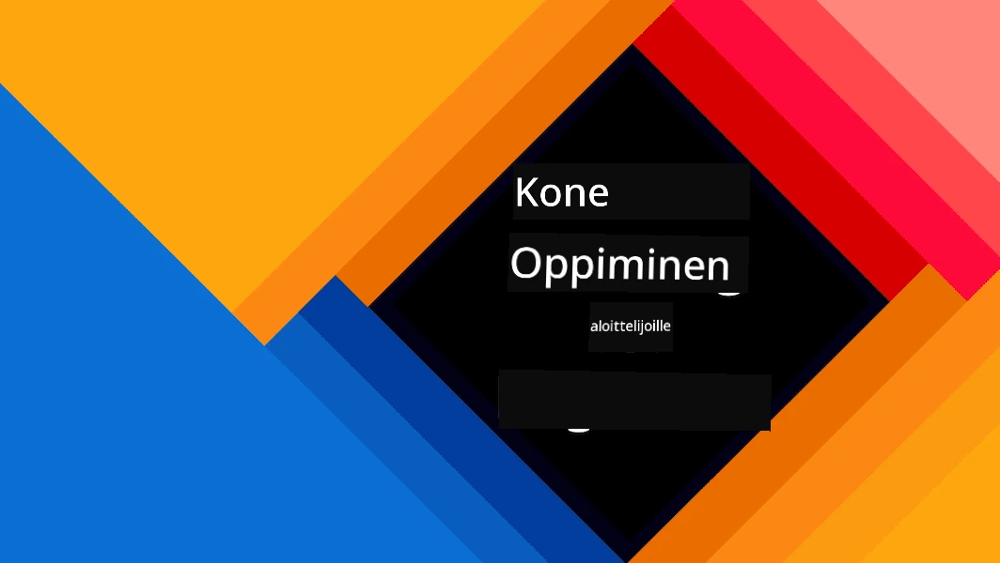
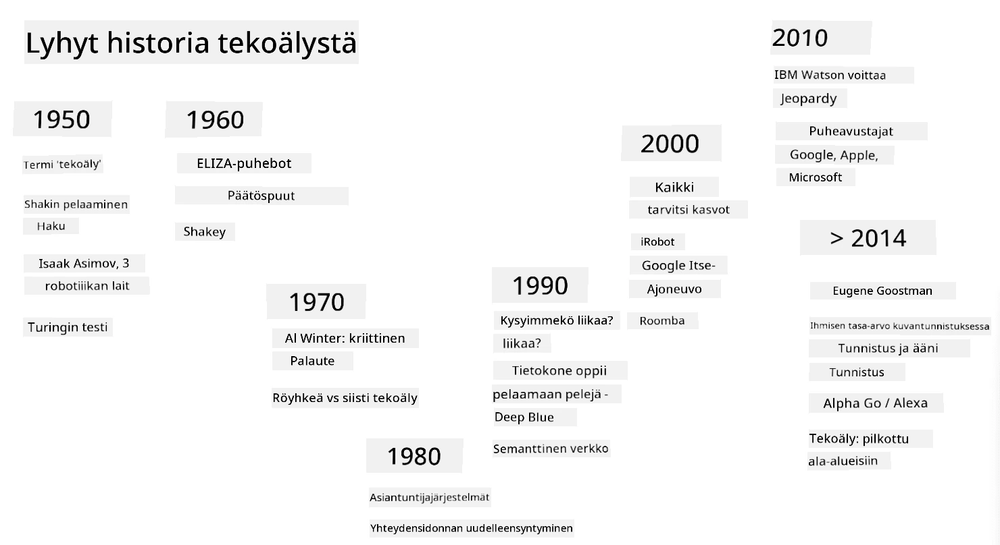
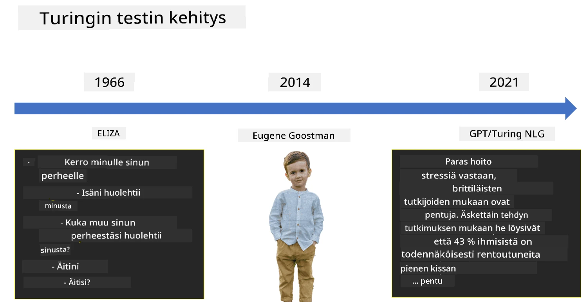

# Johdanto tekoälyyn

> Piirros: [Tomomi Imura](https://twitter.com/girlie_mac)

## [Esiluentovisa](https://ff-quizzes.netlify.app/en/ai/quiz/1)

**Tekoäly** on jännittävä tieteenala, joka tutkii, kuinka voimme saada tietokoneet osoittamaan älykästä käyttäytymistä, esimerkiksi tekemään asioita, joissa ihmiset ovat hyviä.

Alun perin tietokoneet keksittiin [Charles Babbagen](https://en.wikipedia.org/wiki/Charles_Babbage) toimesta käsittelemään numeroita ennalta määritellyn menettelyn - algoritmin - mukaisesti. Vaikka modernit tietokoneet ovat huomattavasti kehittyneempiä kuin 1800-luvulla ehdotettu alkuperäinen malli, ne noudattavat yhä samaa ohjattujen laskentojen periaatetta. Näin ollen tietokone voidaan ohjelmoida tekemään jotain, jos tiedämme tarkalleen, mitä vaiheita tavoitteen saavuttamiseksi tarvitaan.

> Kuva: [Vickie Soshnikova](http://twitter.com/vickievalerie)

> ✅ Henkilön iän määrittäminen valokuvasta on tehtävä, jota ei voida ohjelmoida suoraan, koska emme tiedä, miten päädymme päähämme tulevaan lukuun, kun teemme sen.

---

On kuitenkin tehtäviä, joita emme osaa ratkaista suoraan. Mietitäänpä henkilön iän määrittämistä valokuvasta. Opimme tekemään sen, koska olemme nähneet monia esimerkkejä eri-ikäisistä ihmisistä, mutta emme osaa selittää tarkasti, miten teemme sen, emmekä voi ohjelmoida tietokonetta tekemään sitä. Juuri tällaiset tehtävät kiinnostavat **tekoälyä** (lyhennettynä AI).

✅ Mieti joitakin tehtäviä, jotka voisit siirtää tietokoneen hoidettavaksi tekoälyn avulla. Pohdi esimerkiksi rahoituksen, lääketieteen ja taiteen aloja – miten nämä alat hyötyvät tekoälystä nykyään?

## Heikko tekoäly vs. vahva tekoäly

Heikko tekoäly | Vahva tekoäly
---------------------------------------|-------------------------------------
Heikko tekoäly viittaa tekoälyjärjestelmiin, jotka on suunniteltu ja koulutettu tiettyyn tehtävään tai kapeaan tehtäväjoukkoon. | Vahva tekoäly, eli yleinen tekoäly (AGI), viittaa tekoälyjärjestelmiin, joilla on ihmisen tasoinen älykkyys ja ymmärrys.
Nämä tekoälyjärjestelmät eivät ole yleisesti älykkäitä; ne ovat erinomaisia suorittamaan ennalta määritellyn tehtävän, mutta niiltä puuttuu todellinen ymmärrys tai tietoisuus. | Nämä tekoälyjärjestelmät pystyvät suorittamaan mitä tahansa älyllistä tehtävää, jonka ihminen voi tehdä, sopeutumaan eri aloille ja omaavat jonkinlaisen tietoisuuden tai itsetietoisuuden.
Esimerkkejä heikosta tekoälystä ovat virtuaaliassistentit, kuten Siri tai Alexa, suoratoistopalveluiden suositusalgoritmit ja asiakaspalveluun suunnitellut chatbotit. | Vahvan tekoälyn saavuttaminen on tekoälytutkimuksen pitkän aikavälin tavoite ja vaatisi tekoälyjärjestelmien kehittämistä, jotka voivat järkeillä, oppia, ymmärtää ja sopeutua laajasti erilaisiin tehtäviin ja konteksteihin.
Heikko tekoäly on erittäin erikoistunut eikä omaa ihmisen kaltaisia kognitiivisia kykyjä tai yleisiä ongelmanratkaisukykyjä kapean alansa ulkopuolella. | Vahva tekoäly on tällä hetkellä teoreettinen käsite, eikä mikään tekoälyjärjestelmä ole saavuttanut tätä yleisen älykkyyden tasoa.

Lisätietoja löytyy **[Artificial General Intelligence](https://en.wikipedia.org/wiki/Artificial_general_intelligence)** (AGI) -artikkelista.

## Älykkyyden määritelmä ja Turingin testi

Yksi ongelma käsiteltäessä termiä **[älykkyys](https://en.wikipedia.org/wiki/Intelligence)** on, ettei sille ole selkeää määritelmää. Voidaan väittää, että älykkyys liittyy **abstraktiin ajatteluun** tai **itsetietoisuuteen**, mutta emme pysty määrittelemään sitä kunnolla.

> [Kuva](https://unsplash.com/photos/75715CVEJhI) [Amber Kipp](https://unsplash.com/@sadmax) Unsplashista

Havainnollistaaksesi termin *älykkyys* epäselvyyttä, yritä vastata kysymykseen: "Onko kissa älykäs?". Eri ihmiset antavat tähän kysymykseen erilaisia vastauksia, koska ei ole yleisesti hyväksyttyä testiä, joka todistaisi väitteen todeksi tai epätodeksi. Ja jos luulet, että sellainen on – kokeilepa laittaa kissasi älykkyystestiin...

✅ Mieti hetki, miten määrittelet älykkyyden. Onko varis, joka osaa ratkaista labyrintin saadakseen ruokaa, älykäs? Onko lapsi älykäs?

---

Puhuessamme AGI:sta tarvitsemme jonkin tavan todeta, olemmeko luoneet aidosti älykkään järjestelmän. [Alan Turing](https://en.wikipedia.org/wiki/Alan_Turing) ehdotti menetelmää nimeltä **[Turingin testi](https://en.wikipedia.org/wiki/Turing_test)**, joka toimii myös älykkyyden määritelmänä. Testissä verrataan annettua järjestelmää johonkin luontaisesti älykkääseen – oikeaan ihmiseen, ja koska mikä tahansa automaattinen vertailu voidaan ohittaa tietokoneohjelmalla, käytämme ihmistuomaria. Jos ihminen ei pysty erottamaan oikeaa henkilöä ja tietokonejärjestelmää tekstipohjaisessa keskustelussa, järjestelmää pidetään älykkäänä.

> Pietarissa kehitetty chatbot [Eugene Goostman](https://en.wikipedia.org/wiki/Eugene_Goostman) pääsi lähelle Turingin testin läpäisemistä vuonna 2014 käyttämällä ovelaa persoonallisuustemppua. Se ilmoitti heti alussa olevansa 13-vuotias ukrainalainen poika, mikä selitti tiedon puutteet ja tekstin epäjohdonmukaisuudet. Bottia pidettiin ihmisenä 30 % tuomareista viiden minuutin keskustelun jälkeen, mikä oli Turingin mukaan koneen saavutettavissa vuoteen 2000 mennessä. On kuitenkin ymmärrettävä, ettei tämä tarkoita, että olisimme luoneet älykkään järjestelmän tai että tietokonejärjestelmä olisi huijannut ihmistuomaria – järjestelmä ei huijannut ihmisiä, vaan bottien luojat tekivät sen!

✅ Oletko koskaan tullut huijatuksi chatbotin toimesta luulemaan, että puhut ihmisen kanssa? Miten se vakuutti sinut?

## Eri lähestymistavat tekoälyyn

Jos haluamme tietokoneen käyttäytyvän kuin ihminen, meidän on jollain tavalla mallinnettava tietokoneeseen oma ajattelutapamme. Siksi meidän on yritettävä ymmärtää, mikä tekee ihmisestä älykkään.

> Jotta voisimme ohjelmoida älykkyyden koneeseen, meidän on ymmärrettävä, miten omat päätöksentekoprosessimme toimivat. Jos teet hieman itsetutkiskelua, huomaat, että jotkin prosessit tapahtuvat alitajuisesti – esimerkiksi erotamme kissan koirasta ajattelematta sitä – kun taas toiset vaativat järkeilyä.

Tähän ongelmaan on kaksi mahdollista lähestymistapaa:

Ylhäältä alas -lähestymistapa (symbolinen järkeily) | Alhaalta ylös -lähestymistapa (neuroverkot)
---------------------------------------|-------------------------------------
Ylhäältä alas -lähestymistapa mallintaa, miten ihminen järkeilee ratkaistakseen ongelman. Se sisältää **tiedon** keräämisen ihmiseltä ja sen esittämisen tietokoneen ymmärtämässä muodossa. Lisäksi meidän on kehitettävä tapa mallintaa **järkeily** tietokoneessa. | Alhaalta ylös -lähestymistapa mallintaa ihmisaivojen rakennetta, joka koostuu suuresta määrästä yksinkertaisia yksiköitä, joita kutsutaan **neuroneiksi**. Jokainen neuroni toimii painotettuna keskiarvona syötteistään, ja voimme kouluttaa neuroniverkkoa ratkaisemaan hyödyllisiä ongelmia tarjoamalla sille **koulutusdataa**.

On myös muita mahdollisia lähestymistapoja älykkyyteen:

* **Emergentti**, **synergeettinen** tai **moniagenttinen lähestymistapa** perustuu siihen, että monimutkainen älykäs käyttäytyminen voi syntyä suuren määrän yksinkertaisten agenttien vuorovaikutuksesta. [Evoluutiokybernetiikan](https://en.wikipedia.org/wiki/Global_brain#Evolutionary_cybernetics) mukaan älykkyys voi *syntyä* yksinkertaisemmasta, reaktiivisesta käyttäytymisestä *metasysteemitransition* prosessissa.

* **Evolutiivinen lähestymistapa** tai **geneettinen algoritmi** on optimointiprosessi, joka perustuu evoluution periaatteisiin.

Käsittelemme näitä lähestymistapoja myöhemmin kurssilla, mutta keskitymme nyt kahteen pääsuuntaan: ylhäältä alas ja alhaalta ylös.

### Ylhäältä alas -lähestymistapa

**Ylhäältä alas -lähestymistavassa** yritämme mallintaa järkeilyämme. Koska voimme seurata ajatuksiamme järkeillessämme, voimme yrittää formalisoida tämän prosessin ja ohjelmoida sen tietokoneeseen. Tätä kutsutaan **symboliseksi järkeilyksi**.

Ihmisillä on taipumus käyttää päässään sääntöjä, jotka ohjaavat heidän päätöksentekoprosessejaan. Esimerkiksi lääkäri diagnosoi potilasta ja saattaa huomata, että henkilöllä on kuumetta, mikä viittaa tulehdukseen kehossa. Soveltamalla laajaa sääntökokoelmaa tiettyyn ongelmaan lääkäri voi päätyä lopulliseen diagnoosiin.

Tämä lähestymistapa nojaa vahvasti **tiedon esittämiseen** ja **järkeilyyn**. Tiedon kerääminen ihmisen asiantuntijalta voi olla vaikein osa, koska lääkäri ei monissa tapauksissa tiedä tarkalleen, miksi hän päätyy tiettyyn diagnoosiin. Joskus ratkaisu vain ilmestyy hänen mieleensä ilman tietoista ajattelua. Joitakin tehtäviä, kuten henkilön iän määrittämistä valokuvasta, ei voida lainkaan pelkistää tiedon käsittelyyn.

### Alhaalta ylös -lähestymistapa

Vaihtoehtoisesti voimme yrittää mallintaa aivojemme yksinkertaisimpia elementtejä – neuronia. Voimme rakentaa tietokoneeseen niin sanotun **keinotekoisen neuroverkon** ja yrittää opettaa sitä ratkaisemaan ongelmia antamalla sille esimerkkejä. Tämä prosessi on samanlainen kuin vastasyntyneen lapsen oppiminen ympäristöstään tekemällä havaintoja.

✅ Tee hieman tutkimusta siitä, miten vauvat oppivat. Mitkä ovat vauvan aivojen peruselementit?

> | Entä koneoppiminen?         |      |
> |--------------|-----------|
> | Tekoälyn osa-alue, jossa tietokone oppii ratkaisemaan ongelman jonkin datan perusteella, kutsutaan **koneoppimiseksi**. Emme käsittele perinteistä koneoppimista tässä kurssissa – suosittelemme erillistä [Koneoppiminen aloittelijoille](http://aka.ms/ml-beginners) -opetussuunnitelmaa. |       |

## Lyhyt katsaus tekoälyn historiaan

Tekoäly syntyi tieteenalana 1900-luvun puolivälissä. Aluksi symbolinen järkeily oli vallitseva lähestymistapa, ja se johti useisiin merkittäviin saavutuksiin, kuten asiantuntijajärjestelmiin – tietokoneohjelmiin, jotka pystyivät toimimaan asiantuntijana tietyillä rajatuilla ongelma-alueilla. Pian kuitenkin huomattiin, että tällainen lähestymistapa ei skaalaudu hyvin. Tiedon kerääminen asiantuntijalta, sen esittäminen tietokoneessa ja tietokannan pitäminen ajan tasalla osoittautui erittäin monimutkaiseksi ja liian kalliiksi monissa tapauksissa. Tämä johti niin sanottuun [tekoälytalveen](https://en.wikipedia.org/wiki/AI_winter) 1970-luvulla.

> Kuva: [Dmitry Soshnikov](http://soshnikov.com)

Ajan myötä laskentaresurssit halpenivat ja dataa tuli enemmän saataville, joten neuroverkkoihin perustuvat lähestymistavat alkoivat osoittaa suurta suorituskykyä kilpaillessaan ihmisten kanssa monilla alueilla, kuten tietokonenäössä tai puheen ymmärtämisessä. Viime vuosikymmenen aikana termiä tekoäly on enimmäkseen käytetty synonyyminä neuroverkoille, koska suurin osa tekoälyn menestyksistä, joista kuulemme, perustuu niihin.

Voimme havaita, kuinka lähestymistavat ovat muuttuneet esimerkiksi shakkia pelaavan tietokoneohjelman luomisessa:

* Varhaiset shakkiohjelmat perustuivat hakuun – ohjelma yritti eksplisiittisesti arvioida vastustajan mahdollisia siirtoja tietyn määrän seuraavia siirtoja varten ja valitsi optimaalisen siirron perustuen optimaaliseen asemaan, joka voidaan saavuttaa muutamassa siirrossa. Tämä johti niin sanotun [alfa-beeta-karsinnan](https://en.wikipedia.org/wiki/Alpha%E2%80%93beta_pruning) hakualgoritmin kehittämiseen.
* Hakustrategiat toimivat hyvin pelin loppuvaiheessa, jossa hakutila on rajattu pieneen määrään mahdollisia siirtoja. Pelin alussa hakutila on kuitenkin valtava, ja algoritmia voidaan parantaa oppimalla olemassa olevista ihmispelaajien välisistä peleistä. Myöhemmät kokeilut hyödynsivät niin sanottua [tapauspohjaista järkeilyä](https://en.wikipedia.org/wiki/Case-based_reasoning), jossa ohjelma etsi tietokannasta tapauksia, jotka ovat hyvin samanlaisia kuin pelin nykyinen asema.
* Modernit ohjelmat, jotka voittavat ihmispelaajat, perustuvat neuroverkkoihin ja [vahvistusoppimiseen](https://en.wikipedia.org/wiki/Reinforcement_learning), jossa ohjelmat oppivat pelaamaan yksinomaan pelaamalla pitkään itseään vastaan ja oppimalla omista virheistään – aivan kuten ihmiset oppivat pelatessaan shakkia. Tietokoneohjelma voi kuitenkin pelata paljon enemmän pelejä paljon lyhyemmässä ajassa ja siten oppia paljon nopeammin.

✅ Tee hieman tutkimusta muista peleistä, joita tekoäly on pelannut.

Samoin voimme nähdä, kuinka lähestymistapa "puhuvien ohjelmien" (jotka saattavat läpäistä Turingin testin) luomiseen on muuttunut:

* Tämän tyyppiset varhaiset ohjelmat, kuten [Eliza](https://en.wikipedia.org/wiki/ELIZA), perustuivat hyvin yksinkertaisiin kielioppisääntöihin ja syötteen lauseen uudelleenmuotoiluun kysymykseksi.
* Modernit avustajat, kuten Cortana, Siri tai Google Assistant, ovat kaikki hybridijärjestelmiä, jotka käyttävät neuroverkkoja muuntamaan puheen tekstiksi ja tunnistamaan tarkoituksemme, ja sitten hyödyntävät järkeilyä tai eksplisiittisiä algoritmeja suorittaakseen tarvittavat toiminnot.
* Tulevaisuudessa voimme odottaa täysin neuroverkkoihin perustuvaa mallia, joka käsittelee dialogia itsenäisesti. Viimeaikaiset GPT- ja [Turing-NLG](https://www.microsoft.com/research/blog/turing-nlg-a-17-billion-parameter-language-model-by-microsoft) -neuroverkkojen perheet osoittavat suurta menestystä tässä.

> Kuva: Dmitry Soshnikov, [valokuva](https://unsplash.com/photos/r8LmVbUKgns) [Marina Abrosimova](https://unsplash.com/@abrosimova_marina_foto), Unsplash

## Viimeaikainen tekoälytutkimus

Neuroverkkojen tutkimuksen valtava kasvu alkoi noin vuonna 2010, kun suuret julkiset tietoaineistot alkoivat tulla saataville. Suuri kokoelma kuvia nimeltä [ImageNet](https://en.wikipedia.org/wiki/ImageNet), joka sisältää noin 14 miljoonaa merkittyä kuvaa, synnytti [ImageNet Large Scale Visual Recognition Challenge](https://image-net.org/challenges/LSVRC/).

> Kuva: [Dmitry Soshnikov](http://soshnikov.com)

Vuonna 2012 [konvoluutioneuroverkkoja](../4-ComputerVision/07-ConvNets/README.md) käytettiin ensimmäistä kertaa kuvien luokittelussa, mikä johti merkittävään virheiden vähenemiseen (lähes 30 prosentista 16,4 prosenttiin). Vuonna 2015 Microsoft Researchin ResNet-arkkitehtuuri [saavutti ihmistasoisen tarkkuuden](https://doi.org/10.1109/ICCV.2015.123).

Sen jälkeen neuroverkot ovat osoittaneet erittäin menestyksekästä toimintaa monissa tehtävissä:

---

Vuosi | Ihmistaso saavutettu
-----|--------
2015 | [Kuvien luokittelu](https://doi.org/10.1109/ICCV.2015.123)
2016 | [Puheentunnistus keskusteluissa](https://arxiv.org/abs/1610.05256)
2018 | [Automaattinen konekäännös](https://arxiv.org/abs/1803.05567) (kiinasta englantiin)
2020 | [Kuvatekstitys](https://arxiv.org/abs/2009.13682)

Viime vuosina olemme nähneet suuria menestyksiä suurten kielimallien, kuten BERT ja GPT-3, kanssa. Tämä on tapahtunut pääasiassa siksi, että saatavilla on paljon yleistä tekstidataa, jonka avulla voimme kouluttaa malleja ymmärtämään tekstien rakennetta ja merkitystä, esikouluttaa niitä yleisillä tekstikokoelmilla ja sitten erikoistaa näitä malleja tarkempiin tehtäviin. Opimme lisää [luonnollisen kielen käsittelystä](../5-NLP/README.md) myöhemmin tässä kurssissa.

## 🚀 Haaste

Tee kierros internetissä ja selvitä, missä mielestäsi tekoälyä käytetään tehokkaimmin. Onko se karttasovelluksessa, puheesta tekstiksi -palvelussa vai videopelissä? Tutki, miten järjestelmä on rakennettu.

## [Luentojälkeinen tietovisa](https://ff-quizzes.netlify.app/en/ai/quiz/2)

## Kertaus ja itseopiskelu

Käy läpi tekoälyn ja koneoppimisen historia lukemalla [tämä oppitunti](https://github.com/microsoft/ML-For-Beginners/tree/main/1-Introduction/2-history-of-ML). Valitse jokin elementti tämän tai kyseisen oppitunnin luonnosmuistiosta ja tutki sitä syvällisemmin ymmärtääksesi sen kehitykseen vaikuttanutta kulttuurista kontekstia.

**Tehtävä**: [Game Jam](assignment.md)

---

<!-- CO-OP TRANSLATOR DISCLAIMER START -->
**Vastuuvapauslauseke**:  
Tämä asiakirja on käännetty käyttämällä tekoälypohjaista käännöspalvelua [Co-op Translator](https://github.com/Azure/co-op-translator). Vaikka pyrimme tarkkuuteen, huomioithan, että automaattiset käännökset voivat sisältää virheitä tai epätarkkuuksia. Alkuperäinen asiakirja sen alkuperäisellä kielellä tulisi pitää ensisijaisena lähteenä. Kriittisen tiedon osalta suositellaan ammattimaista ihmiskäännöstä. Emme ole vastuussa väärinkäsityksistä tai virhetulkinnoista, jotka johtuvat tämän käännöksen käytöstä.
<!-- CO-OP TRANSLATOR DISCLAIMER END -->