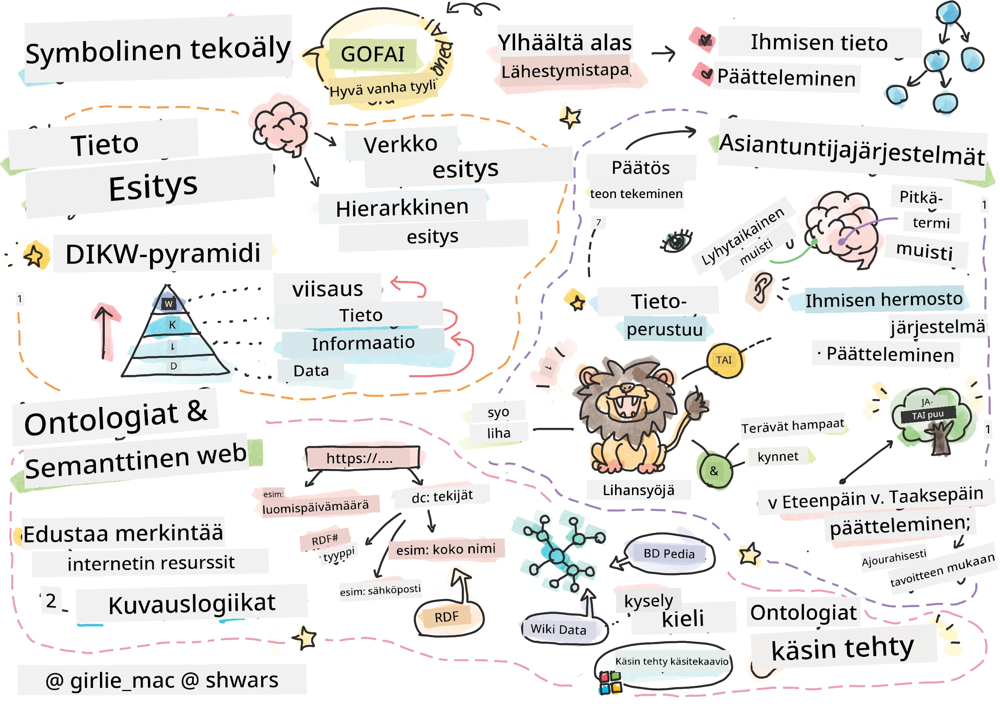
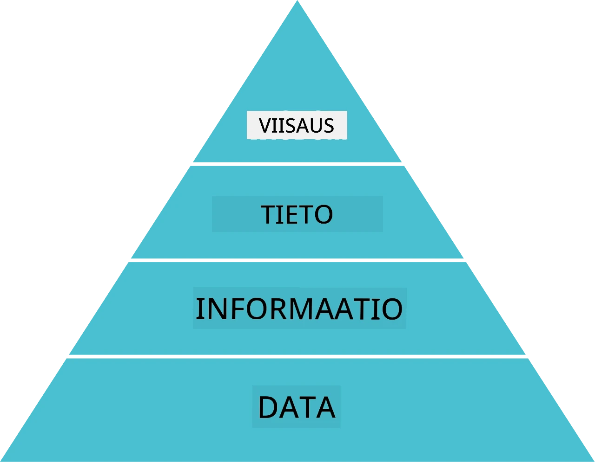
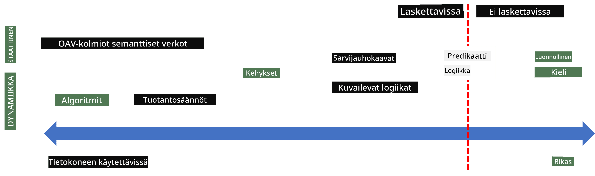
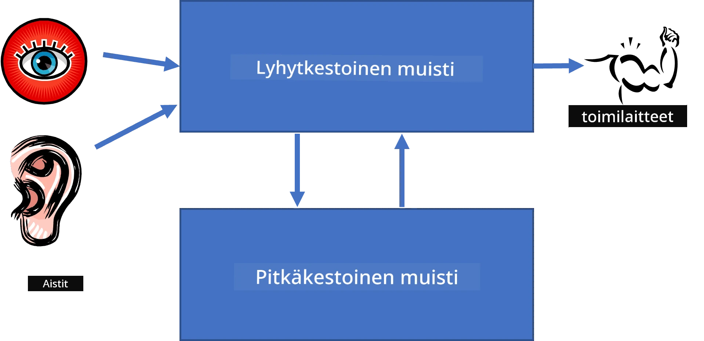
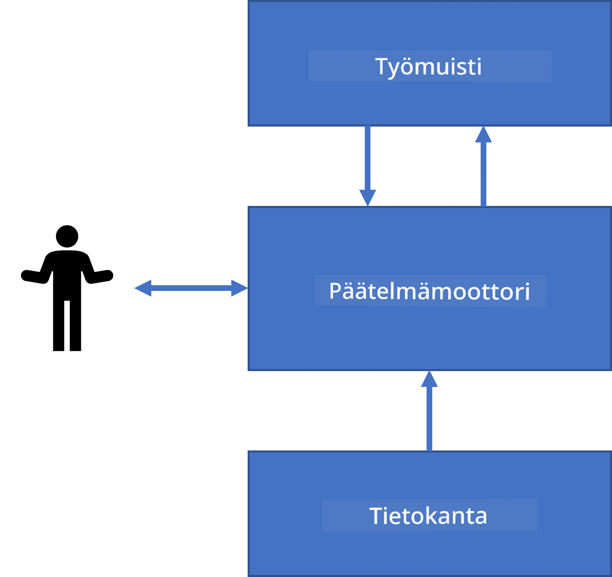
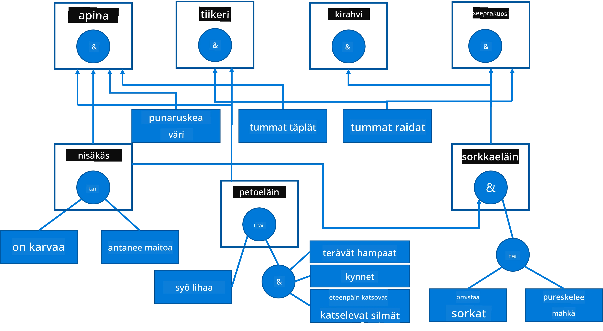
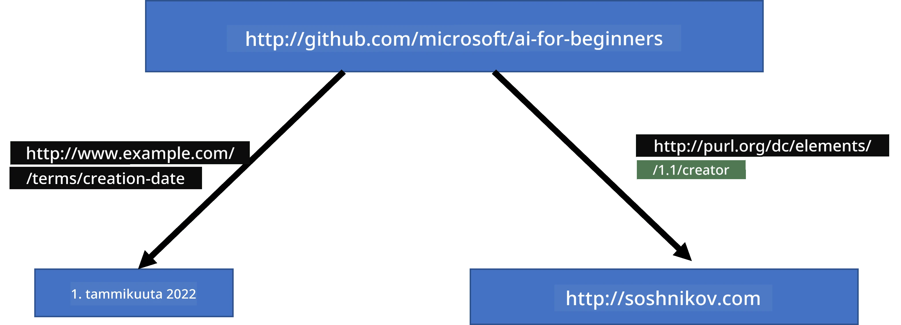
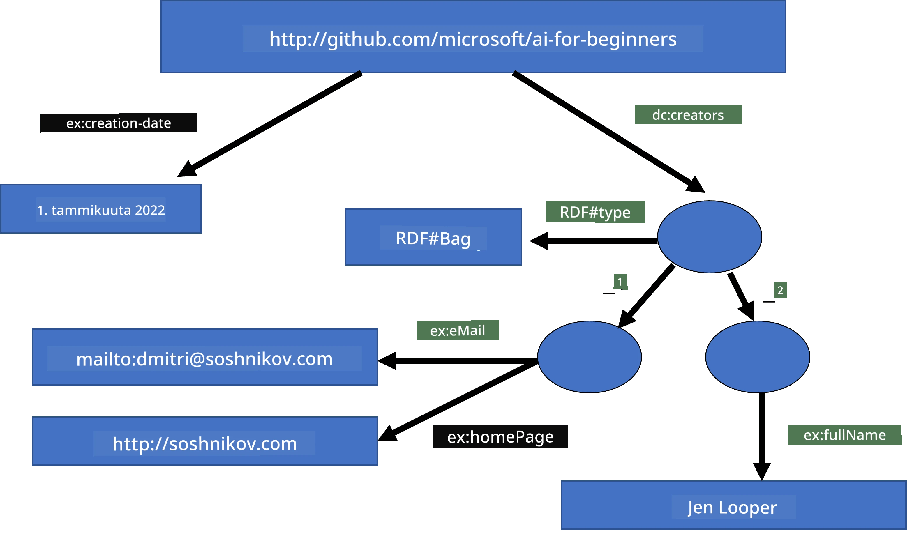
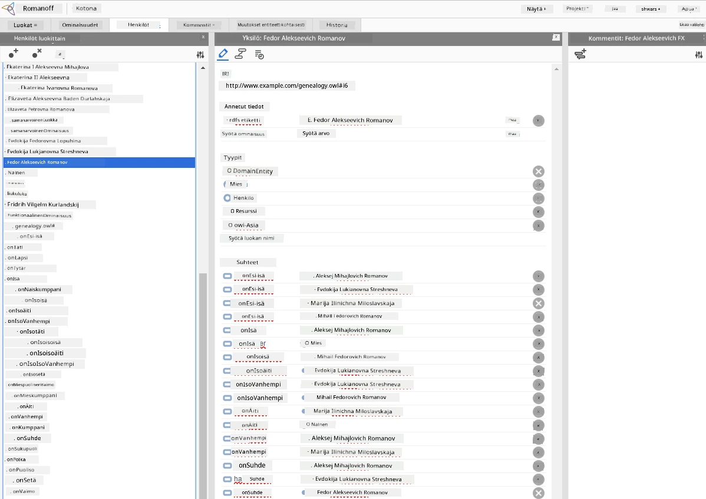

# Tiedon esittäminen ja asiantuntijajärjestelmät



> Luonnos [Tomomi Imura](https://twitter.com/girlie_mac)

Tekoälyn tavoittelu perustuu tiedon etsimiseen, jotta maailmaa voitaisiin ymmärtää samalla tavalla kuin ihmiset. Mutta miten tähän voisi ryhtyä?

## [Esiluentokysely](https://ff-quizzes.netlify.app/en/ai/quiz/3)

Tekoälyn alkuaikoina yleinen lähestymistapa älykkäiden järjestelmien luomiseksi (joka käsiteltiin edellisessä oppitunnissa) oli ylhäältä alas -menetelmä. Ajatus oli poimia tieto ihmisiltä koneen lukemassa muodossa ja käyttää sitä ongelmien automaattiseen ratkaisuun. Tämä lähestymistapa perustui kahteen suureen ideaan:

* Tiedon esittäminen
* Päättely

## Tiedon esittäminen

Symbolisen tekoälyn tärkeimpiin käsitteisiin kuuluu **tieto**. On tärkeää erottaa tieto *tiedosta* tai *datasta*. Esimerkiksi voi sanoa, että kirjat sisältävät tietoa, koska kirjoja lukemalla voi tulla asiantuntijaksi. Todellisuudessa kirjat sisältävät *dataa*, ja lukemalla ja integroimalla tätä dataa maailmankuvaamme muutamme datan tiedoksi.

> ✅ **Tieto** on jotain, mikä on meidän päässämme ja edustaa ymmärrystämme maailmasta. Se saadaan aktiivisella **oppimisprosessilla**, joka integroi saamamme tiedon osat aktiiviseen maailmankuvaamme.

Useimmiten emme määrittele tietoa tarkasti, vaan sovitamme sen muihin siihen liittyviin käsitteisiin käyttäen [DIKW-pyramidia](https://en.wikipedia.org/wiki/DIKW_pyramid). Se sisältää seuraavat käsitteet:

* **Data** on jotain, joka on esitetty fyysisessä muodossa, kuten kirjoitettuna tekstinä tai puhuttuina sanoina. Data on olemassa ihmisten ulkopuolella ja voi siirtyä ihmiseltä toiselle.
* **Informaatio** on tapa, jolla tulkitsemme dataa päässämme. Esimerkiksi kuullessamme sanan *tietokone*, ymmärrämme jonkin verran, mitä se tarkoittaa.
* **Tieto** on informaation integroimista maailmankuvaamme. Esimerkiksi kun opimme, mikä tietokone on, alamme saada käsityksiä siitä, miten se toimii, kuinka paljon se maksaa ja mihin sitä voi käyttää. Tämä verkosto keskenään liittyviä käsitteitä muodostaa tietomme.
* **Viisaus** on vielä korkeampi taso ymmärryksestämme maailmasta ja se edustaa *metatietoa*, esim. käsityksen siitä, miten ja milloin tietoa tulisi käyttää.



*Kuva [Wikipediasta](https://commons.wikimedia.org/w/index.php?curid=37705247), tekijä Longlivetheux - oma työ, CC BY-SA 4.0*

Näin ollen **tiedon esittämisen** ongelmana on löytää jokin tehokas tapa edustaa tietoa tietokoneen sisällä datamuodossa, jotta se olisi automaattisesti hyödynnettävissä. Tätä voidaan tarkastella spektrinä:



> Kuva: [Dmitry Soshnikov](http://soshnikov.com)

* Vasemmalla on hyvin yksinkertaisia tiedon esityksen tyyppejä, joita tietokoneet voivat tehokkaasti käyttää. Yksinkertaisin on algoritminen, jossa tieto esitetään tietokoneohjelmana. Tämä ei kuitenkaan ole paras tapa esittää tietoa, koska se ei ole joustava. Tieto päässämme on usein ei-algoritmista.
* Oikealla ovat esitykset kuten luonnollinen teksti. Se on voimakkain, mutta ei sovellu automaattiseen päättelyyn.

> ✅ Mieti hetki, miten esität tietoa päässäsi ja miten muutat sen muistiinpanoiksi. Onko sinulle jokin tietty muoto, joka tukee hyvin muistamista?

## Tietokoneen tiedon esittämisen luokittelu

Voimme luokitella eri tietokoneen tiedon esitystavat seuraaviin kategorioihin:

* **Verkkopohjaiset esitykset** perustuvat siihen, että meillä on päässämme verkosto keskenään liittyviä käsitteitä. Voimme yrittää rekonstruoida saman verkoston graafina tietokoneessa - ns. **semanttinen verkosto**.

1. **Objekti-Attribuutti-Arvo -kolmikot** tai **attribuutti-arvoparit**. Koska graafi voidaan esittää tietokoneessa listana solmuista ja kaarista, voimme esittää semanttisen verkoston kolmikolistana, joka sisältää objektit, attribuutit ja arvot. Esimerkiksi rakennamme seuraavat kolmikot ohjelmointikielistä:

Objekti | Attribuutti | Arvo
--------|-------------|-----
Python  | on          | Typetön-kieli
Python  | kehittänyt  | Guido van Rossum
Python  | lohko-syntaksi | sisennys
Typetön-kieli | ei sisällä | tyyppimääritelmiä

> ✅ Mieti, miten kolmikot voidaan käyttää muiden tiedontyyppien esittämiseen.

2. **Hierarkkiset esitykset** korostavat sitä, että usein luomme päässämme hierarkian objekteista. Esimerkiksi tiedämme, että kanaria on lintu, ja kaikilla linnuilla on siivet. Meillä on myös käsitys siitä, minkä värinen kanarian yleensä on ja mikä on sen lentonopeus.

   - **Kehysesitys** perustuu siihen, että jokainen kohde tai kohdeluokka esitetään **kehyksenä**, joka sisältää **paikat**. Paikoilla voi olla oletusarvot, arvorajoitukset tai tallennettuja käsittelyohjeita, joita voidaan kutsua paikan arvon saamiseksi. Kaikki kehykset muodostavat hierarkian, joka muistuttaa olio-ohjelmointikielten olin hierarkiaa.
   - **Skenaariot** ovat erityislaatuinen kehyksen laji, joka esittää monimutkaisia tilanteita, jotka voivat avautua ajan myötä.

**Python**

Paikka | Arvo | Oletusarvo | Väli |
-------|-------|------------|-------|
Nimi   | Python | | |
On    | Typetön-kieli | | |
Muuttujan kirjoitusasu | | CamelCase | |
Ohjelman pituus | | | 5-5000 riviä |
Lohko-syntaksi | Sisennys | | |

3. **Menettelylliset esitykset** perustuvat tiedon esittämiseen toimintojen listana, joita voidaan suorittaa, kun tietty ehto täyttyy.
   - Tuotantosäännöt ovat jos-niin -lauseita, jotka mahdollistavat päätelmien teon. Esimerkiksi lääkärillä voi olla sääntö, jossa **JOS** potilaalla on korkea kuume **TAI** korkea C-reaktiivisen proteiinin arvo verikokeessa, **NIIN** hänellä on tulehdus. Kun täytämme jonkin ehdon, voimme tehdä päätelmän tulehduksesta ja käyttää tätä päättelyssä eteenpäin.
   - Algoritmit voidaan katsoa toiseksi menettelylliseksi esitykseksi, vaikka niitä käytetään melkein koskaan suoraan tietopohjaisissa järjestelmissä.

4. **Logiikka** esitettiin alun perin Aristoteleen toimesta universaalin ihmistiedon esittämiseen.
   - Predikaattilogiikka matemaattisena teoriayhtenä on liian rikas laskettavaksi, siksi yleensä käytetään jotain sen osajoukkoa, kuten Prologissa käytettyjä Hornin klausuleita.
   - Deskriptiivinen logiikka on loogisten järjestelmien perhe, jota käytetään hierarkioiden ja jakaantuneiden tiedon esitysten, kuten *semanttisen webin*, esittämiseen ja päättelyyn.

## Asiantuntijajärjestelmät

Yksi symbolisen tekoälyn varhaisista menestyksistä olivat ns. **asiantuntijajärjestelmät** – tietokonejärjestelmät, jotka oli suunniteltu toimimaan asiantuntijana rajatussa ongelma-alueessa. Ne perustuivat **tietokantaan**, joka oli kerätty yhdeltä tai useammalta ihmisasiantuntijalta, ja ne sisälsivät **päätöksentekomoottorin**, joka suoritti jonkinlaista päättelyä sen päällä.

 | 
---------------------------------------------|------------------------------------------------
Ihmisen hermojärjestelmän yksinkertaistettu rakenne | Tietopohjaisen järjestelmän arkkitehtuuri

Asiantuntijajärjestelmät rakennetaan kuten ihmisen päättelyjärjestelmä, joka sisältää **lyhytaikaisen muistin** ja **pitkäaikaisen muistin**. Samalla tavalla tietopohjaisissa järjestelmissä erotamme seuraavat komponentit:

* **Ongelman muisti**: sisältää tiedon ongelmasta, jota parhaillaan ratkaistaan, eli potilaan lämpötila tai verenpaine, onko hänellä tulehdusta vai ei jne. Tätä tietoa kutsutaan myös **staattiseksi tiedoksi**, koska se sisältää kuvan siitä, mitä ongelmasta tällä hetkellä tiedetään – ns. *ongelman tila*.
* **Tietokanta**: edustaa pitkäaikaista tietoa ongelma-alueesta. Se on manuaalisesti poimittu ihmisasiantuntijoilta eikä muutu konsultoinneista toisiin. Koska sen avulla voidaan navigoida ongelmatilasta toiseen, sitä kutsutaan myös **dynaamiseksi tiedoksi**.
* **Päätöksentekomoottori**: ohjaa koko prosessia ongelmatilatilan haussa, esittää käyttäjälle kysymyksiä tarvittaessa. Se on myös vastuussa sopivien sääntöjen löytämisestä, joita sovelletaan kuhunkin tilaan.

Esimerkkinä otetaan seuraava asiantuntijajärjestelmä eläimen tunnistamiseen sen fyysisten ominaisuuksien perusteella:



> Kuva: [Dmitry Soshnikov](http://soshnikov.com)

Tätä kaaviota kutsutaan **AND-OR -puuksi**, ja se on graafinen esitys joukosta tuotantosääntöjä. Puun piirtäminen on hyödyllistä alussa, kun tieto poimitaan asiantuntijalta. Tiedon edustamiseksi tietokoneessa on kätevämpää käyttää sääntöjä:

```
IF the animal eats meat
OR (animal has sharp teeth
    AND animal has claws
    AND animal has forward-looking eyes
) 
THEN the animal is a carnivore
```

Voit huomata, että jokainen sääntöjen vasemman puolen ehto ja toiminto ovat pohjimmiltaan objekti-attribuutti-arvo (OAV) -kolmikot. **Työmuisti** sisältää OAV-kolmikot, jotka vastaavat parhaillaan ratkaistavaa ongelmaa. **Sääntömoottori** etsii sääntöjä, joiden ehto täyttyy, ja soveltaa niitä lisäämällä uuden kolmikon työmuistiin.

> ✅ Kirjoita oma AND-OR -puusi aiheesta, josta pidät!

### Eteenpäin- vs. Taaksepäin-päättely

Edellä kuvattu prosessi on nimeltään **eteenpäin-päättely**. Se alkaa jostain ongelman alkuperäisestä tiedosta työmuistissa ja suorittaa seuraavan päättelysilmukan:

1. Jos tavoiteattribuutti on työmuistissa - lopeta ja anna tulos
2. Etsi kaikki säännöt, joiden ehto tällä hetkellä täyttyy - saadaan **konfliktijoukko** sääntöjä
3. Suorita **konfliktinratkaisu** - valitse yksi sääntö, jota sovelletaan tässä vaiheessa. Konfliktinratkaisuun voi olla erilaisia strategioita:
   - Valitse ensimmäinen soveltuva sääntö tietokannasta
   - Valitse satunnainen sääntö
   - Valitse *tarkempi* sääntö, eli sellainen, joka täyttää eniten ehtoja vasemmalla puolella (LHS)
4. Sovella valittua sääntöä ja lisää uusi tieto ongelmatilaan
5. Toista kohdasta 1

Joissakin tapauksissa saatamme haluta aloittaa ongelmasta tyhjällä tiedolla ja esittää kysymyksiä, jotka auttavat meitä pääsemään johtopäätökseen. Esimerkiksi lääketieteellisessä diagnoosissa emme yleensä tee kaikkia tutkimuksia ennakkoon, vaan teemme ne tarpeen mukaan.

Tästä voidaan mallintaa prosessi **taaksepäin-päättelyllä**. Se ohjautuu **tavoitteesta** – etsimämme attribuuttiarvosta:

1. Valitse kaikki säännöt, jotka voivat antaa tavoitteen arvon (eli joissa tavoite on oikealla puolella (RHS)) – konfliktijoukko
1. Jos tälle attribuutille ei ole sääntöjä tai on sääntö, että arvo kysytään käyttäjältä – kysy arvo käyttäjältä, muutoin:
1. Käytä konfliktinratkaisustrategiaa valitaksesi yhden säännön, jota käytämme *hypoteesina* – yritämme todistaa sen
1. Toista rekursiivisesti prosessi kaikille säännön vasemman puolen attribuuteille tavoitteina
1. Jos prosessi epäonnistuu jossain vaiheessa – käytä toista sääntöä kohdassa 3

> ✅ Millaisissa tilanteissa eteenpäin-päättely on sopivampi? Entä taaksepäin-päättely?

### Asiantuntijajärjestelmien toteutus

Asiantuntijajärjestelmät voidaan toteuttaa erilaisin työkaluin:

* Ohjelmoimalla ne suoraan jollain korkean tason ohjelmointikielellä. Tämä ei ole paras ratkaisu, koska tietopohjaisen järjestelmän tärkein etu on, että tieto on erotettu päättelystä, ja ongelma-alueen asiantuntija voisi periaatteessa kirjoittaa sääntöjä ymmärtämättä päättelyprosessin yksityiskohtia.
* Käyttämällä **asiantuntijajärjestelmäkuorta**, eli järjestelmää, joka on erityisesti suunniteltu täytettäväksi tiedolla jonkin tiedon esityskielen avulla.

## ✍️ Harjoitus: Eläimen tunnistus

Katso [Animals.ipynb](https://github.com/microsoft/AI-For-Beginners/blob/main/lessons/2-Symbolic/Animals.ipynb) esimerkki eteen- ja taaksepäin-päättelyä käyttävän asiantuntijajärjestelmän toteutuksesta.

> **Huomio**: Tämä esimerkki on melko yksinkertainen ja antaa vain käsityksen siitä, miltä asiantuntijajärjestelmä näyttää. Kun alat luoda tällaista järjestelmää, huomaat *älykkään* käyttäytymisen vasta, kun sääntöjä on käytössä noin 200+. Tällöin säännöistä tulee liian monimutkaisia muistaa kokonaisuudessaan, ja alat ihmetellä järjestelmän tekemiä päätöksiä. Tietopohjaisen järjestelmän tärkeä ominaisuus on kuitenkin se, että voit aina *selittää* tarkalleen, miten mikä tahansa päätös on tehty.

## Ontologiat ja semanttinen web

20. vuosisadan lopulla käynnistettiin aloite käyttää tiedon esittämistä merkitsemään Internet-resursseja siten, että olisi mahdollista löytää hyvin spesifeihin kyselyihin vastaavia resursseja. Tätä liikettä kutsuttiin **semanttiseksi webiksi** ja se perustui useisiin käsitteisiin:

- Erityinen tiedon esitys perustuen **[deskriptiiviseen logiikkaan](https://en.wikipedia.org/wiki/Description_logic)** (DL). Se on samankaltainen kuin kehystieto, koska rakentaa hierarkian objekteista ominaisuuksineen, mutta sillä on muodolliset loogiset semantiikat ja päättely. DL:llä on kokonainen perhe, joka tasapainottaa ilmaisukykyä ja päättelyn algoritmista monimutkaisuutta.
- Hajautettu tiedon esitys, jossa kaikki käsitteet esitetään globaalilla URI-tunnisteella, mahdollistaen internetin laajuiset tiedon hierarkiat.
- XML-pohjaisten kielten perhe tiedon kuvaamiseen: RDF (Resource Description Framework), RDFS (RDF Schema), OWL (Ontology Web Language).

Yksi keskeinen käsite semanttisessa webissä on **ontologia**. Se tarkoittaa eksplisiittistä ongelma-alueen määrittelyä jonkin muodollisen tiedon esityksen avulla. Yksinkertaisin ontologia voi olla pelkkä hierarkia ongelma-alueen objekteista, mutta monimutkaisemmissa ontologioissa on sääntöjä, joita voidaan käyttää päättelyyn.

Semanttisessa webissä kaikki esitykset perustuvat tripletteihin. Jokainen objekti ja jokainen suhde tunnistetaan yksiselitteisesti URI:n avulla. Esimerkiksi, jos haluamme ilmaista, että tämä AI Curriculum on kehittänyt Dmitry Soshnikov 1. tammikuuta 2022 – käytämme seuraavia triplettejä:



```
http://github.com/microsoft/ai-for-beginners http://www.example.com/terms/creation-date “Jan 1, 2022”
http://github.com/microsoft/ai-for-beginners http://purl.org/dc/elements/1.1/creator http://soshnikov.com
```

> ✅ Tässä `http://www.example.com/terms/creation-date` ja `http://purl.org/dc/elements/1.1/creator` ovat joitakin tunnettuja ja yleisesti hyväksyttyjä URI:ita, jotka kuvaavat käsitteitä *tekijä* ja *luontipäivä*.

Monimutkaisemmassa tapauksessa, jos haluamme määritellä listan tekijöistä, voimme käyttää RDF:ssä määriteltyjä tietorakenteita.



> Yllä olevat kaaviot: [Dmitry Soshnikov](http://soshnikov.com)

Semanttisen webin rakentamisen edistyminen hidastui jossain määrin hakukoneiden ja luonnollisen kielen käsittelytekniikoiden menestyksen myötä, jotka mahdollistavat jäsennellyn tiedon poimimisen tekstistä. Kuitenkin joillakin alueilla tehdään edelleen merkittäviä ponnistuksia ontologioiden ja tietokantojen ylläpitämiseksi. Muutamia huomionarvoisia projekteja:

* [WikiData](https://wikidata.org/) on koneellisesti luettava tietokantojen kokoelma, joka liittyy Wikipediaan. Suurin osa tiedoista on louhittu Wikipedia *InfoBoxeista*, Wikipedia-sivujen sisäisistä rakenteellisista sisällöistä. Voit [tehdä hakuja](https://query.wikidata.org/) wikidataan SPARQL-kyselykielellä, joka on semanttisen webin erikoiskieli. Tässä on esimerkkikysely, joka näyttää ihmisten yleisimmät silmien värit:

```sparql
#defaultView:BubbleChart
SELECT ?eyeColorLabel (COUNT(?human) AS ?count)
WHERE
{
  ?human wdt:P31 wd:Q5.       # human instance-of homo sapiens
  ?human wdt:P1340 ?eyeColor. # human eye-color ?eyeColor
  SERVICE wikibase:label { bd:serviceParam wikibase:language "en". }
}
GROUP BY ?eyeColorLabel
```

* [DBpedia](https://www.dbpedia.org/) on toinen WikiDataa vastaava hanke.

> ✅ Jos haluat kokeilla oman ontologian rakentamista tai olemassa olevan avaamista, on olemassa erinomainen visuaalinen ontologian muokkaustyökalu nimeltä [Protégé](https://protege.stanford.edu/). Lataa se tai käytä sitä verkossa.



*Web Protégé -editori auki Romanovien perheen ontologian kanssa. Kuvakaappaus Dmitry Soshnikov*

## ✍️ Harjoitus: Perheontologia

Katso [FamilyOntology.ipynb](https://github.com/Ezana135/AI-For-Beginners/blob/main/lessons/2-Symbolic/FamilyOntology.ipynb) esimerkki semanttisen webin tekniikoiden käytöstä perhesuhteiden päättelyssä. Otamme perheen sukupuun, joka on esitetty yleisessä GEDCOM-muodossa, ja perhesuhteiden ontologian, ja rakennamme kaavion kaikista perhesuhteista annetulle yksilöjoukolle.

## Microsoft Concept Graph

Useimmissa tapauksissa ontologiat luodaan huolellisesti käsin. On kuitenkin mahdollista myös **louhia** ontologioita rakenteettomasta datasta, esimerkiksi luonnollisen kielen teksteistä.

Tällainen yritys tehtiin Microsoft Researchin toimesta, mikä johti [Microsoft Concept Graphiin](https://blogs.microsoft.com/ai/microsoft-researchers-release-graph-that-helps-machines-conceptualize/?WT.mc_id=academic-77998-cacaste).

Se on suuri joukko käsitteitä, jotka on ryhmitelty `on-tyyppiä`-perintäsuhteen avulla. Se mahdollistaa kysymyksiin kuten "Mikä on Microsoft?" vastaamisen: vastaus voi olla esimerkiksi "yritys todennäköisyydellä 0,87 ja brändi todennäköisyydellä 0,75".

Grafi on saatavilla REST-rajapintana tai suurena ladattavana tekstinä, joka listaa kaikki käsiteparit.

## ✍️ Harjoitus: Käsitegrafi

Kokeile [MSConceptGraph.ipynb](https://github.com/microsoft/AI-For-Beginners/blob/main/lessons/2-Symbolic/MSConceptGraph.ipynb) -muistikirjaa nähdäksesi, kuinka voimme käyttää Microsoft Concept Graphia ryhmittelemään uutisartikkeleita eri kategorioihin.

## Yhteenveto

Nykyään tekoäly mielletään usein lähinnä *koneoppimisen* tai *neuroverkkojen* synonyymiksi. Ihmisellä on kuitenkin myös eksplisiittinen päättelykyky, jota neuroverkot eivät vielä käsittele. Käytännön projekteissa eksplisiittistä päättelyä käytetään edelleen tehtävissä, jotka vaativat selityksiä tai järjestelmän käyttäytymisen hallittua muuttamista.

## 🚀 Haaste

Perheontologian muistikirjassa tämän oppitunnin yhteydessä on mahdollisuus kokeilla muita perhesuhteita. Yritä löytää uusia yhteyksiä ihmisten välillä sukupuussa.

## [Luentojälkeinen tietovisa](https://ff-quizzes.netlify.app/en/ai/quiz/4)

## Kertaaminen & Itsenäinen opiskelu

Tee hieman tutkimusta internetissä ja tutustu alueisiin, joissa ihmiset ovat yrittäneet kvantifioida ja koodata tietoa. Tutustu Bloomin taksonomiaan ja palaa historiaan oppiaksesi, kuinka ihmiset ovat yrittäneet ymmärtää maailmaansa. Tutki Linnaeuksen työtä eliöiden taksonomian luomiseksi ja seuraa, miten Dmitri Mendeleev loi tavan kemiallisten alkuaineiden kuvaamiseen ja ryhmittelyyn. Mitä muita mielenkiintoisia esimerkkejä löydät?

**Tehtävä**: [Rakenna ontologia](assignment.md)

---

<!-- CO-OP TRANSLATOR DISCLAIMER START -->
**Vastuuvapauslauseke**:
Tämä asiakirja on käännetty käyttämällä tekoälypohjaista käännöspalvelua [Co-op Translator](https://github.com/Azure/co-op-translator). Vaikka pyrimme tarkkuuteen, huomioithan, että automaattisissa käännöksissä saattaa esiintyä virheitä tai epätarkkuuksia. Alkuperäistä asiakirjaa sen omalla kielellä tulee pitää virallisena lähteenä. Tärkeässä tiedossa suositellaan ammattimaista ihmiskääntäjän tekemää käännöstä. Emme ota vastuuta tämän käännöksen käytöstä mahdollisesti aiheutuvista väärinymmärryksistä tai tulkinnoista.
<!-- CO-OP TRANSLATOR DISCLAIMER END -->