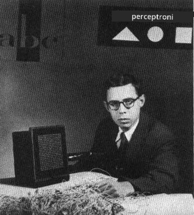

# Johdanto neuroverkkoihin: Perceptron

## [Ennakkokysely](https://ff-quizzes.netlify.app/en/ai/quiz/5)

Yksi ensimmäisistä yrityksistä toteuttaa jotain modernin neuroverkon kaltaista tehtiin Frank Rosenblattin toimesta Cornellin ilmailulaboratoriossa vuonna 1957. Kyseessä oli laitteistototeutus nimeltä "Mark-1", joka oli suunniteltu tunnistamaan yksinkertaisia geometrisia kuvioita, kuten kolmioita, neliöitä ja ympyröitä.

|      |      |
|--------------|-----------|
| | |

> Kuvat [Wikipedia](https://en.wikipedia.org/wiki/Perceptron)-sivustolta

Syötekuva esitettiin 20x20 valokennon matriisina, joten neuroverkolla oli 400 syötettä ja yksi binäärinen ulostulo. Yksinkertainen verkko sisälsi yhden neuronin, jota kutsutaan myös **kynnyslogiikkayksiköksi**. Neuroverkon painot toimivat kuin potentiometrit, joita piti säätää manuaalisesti koulutusvaiheen aikana.

> ✅ Potentiometri on laite, joka mahdollistaa piirin vastuksen säätämisen.

> The New York Times kirjoitti tuolloin perceptronista: *sähkötietokoneen alkio, jonka [laivasto] odottaa pystyvän kävelemään, puhumaan, näkemään, kirjoittamaan, lisääntymään ja olemaan tietoinen olemassaolostaan.*

## Perceptron-malli

Oletetaan, että mallissamme on N ominaisuutta, jolloin syötevektori olisi kooltaan N. Perceptron on **binääriluokittelumalli**, eli se pystyy erottamaan kahden syötedataluokan välillä. Oletamme, että jokaiselle syötevektorille x perceptronin ulostulo olisi joko +1 tai -1 riippuen luokasta. Ulostulo lasketaan kaavalla:

y(x) = f(w<sup>T</sup>x)

missä f on askelaktivointifunktio

<!-- img src="http://www.sciweavers.org/tex2img.php?eq=f%28x%29%20%3D%20%5Cbegin%7Bcases%7D%0A%20%20%20%20%20%20%20%20%20%2B1%20%26%20x%20%5Cgeq%200%20%5C%5C%0A%20%20%20%20%20%20%20%20%20-1%20%26%20x%20%3C%200%0A%20%20%20%20%20%20%20%5Cend%7Bcases%7D%20%5C%5C%0A&bc=White&fc=Black&im=jpg&fs=12&ff=arev&edit=0" align="center" border="0" alt="f(x) = \begin{cases} +1 & x \geq 0 \\ -1 & x < 0 \end{cases} \\" width="154" height="50" / -->


## Perceptronin kouluttaminen

Perceptronin kouluttamiseksi meidän täytyy löytää painovektori w, joka luokittelee suurimman osan arvoista oikein, eli tuottaa pienimmän **virheen**. Tämä virhe E määritellään **perceptron-kriteerin** avulla seuraavasti:

E(w) = -&sum;w<sup>T</sup>x<sub>i</sub>t<sub>i</sub>

missä:

* summa otetaan niistä koulutusdatapisteistä i, jotka johtavat väärään luokitteluun
* x<sub>i</sub> on syötedata, ja t<sub>i</sub> on joko -1 tai +1 negatiivisille ja positiivisille esimerkeille vastaavasti.

Tätä kriteeriä pidetään painojen w funktiona, ja meidän täytyy minimoida se. Usein käytetään menetelmää nimeltä **gradienttimenetelmä**, jossa aloitetaan jollain alkuperäisillä painoilla w<sup>(0)</sup>, ja sitten jokaisessa vaiheessa päivitetään painot kaavan mukaan:

w<sup>(t+1)</sup> = w<sup>(t)</sup> - &eta;&nabla;E(w)

Tässä &eta; on niin sanottu **oppimisnopeus**, ja &nabla;E(w) tarkoittaa E:n **gradienttia**. Kun laskemme gradientin, päädymme seuraavaan:

w<sup>(t+1)</sup> = w<sup>(t)</sup> + &sum;&eta;x<sub>i</sub>t<sub>i</sub>

Algoritmi Pythonissa näyttää tältä:

```python
def train(positive_examples, negative_examples, num_iterations = 100, eta = 1):

    weights = [0,0,0] # Initialize weights (almost randomly :)
        
    for i in range(num_iterations):
        pos = random.choice(positive_examples)
        neg = random.choice(negative_examples)

        z = np.dot(pos, weights) # compute perceptron output
        if z < 0: # positive example classified as negative
            weights = weights + eta*weights.shape

        z  = np.dot(neg, weights)
        if z >= 0: # negative example classified as positive
            weights = weights - eta*weights.shape

    return weights
```

## Yhteenveto

Tässä oppitunnissa opit perceptronista, joka on binääriluokittelumalli, ja kuinka sitä koulutetaan käyttämällä painovektoria.

## 🚀 Haaste

Jos haluat kokeilla rakentaa oman perceptronin, kokeile [tätä Microsoft Learn -laboratoriota](https://docs.microsoft.com/en-us/azure/machine-learning/component-reference/two-class-averaged-perceptron?WT.mc_id=academic-77998-cacaste), joka käyttää [Azure ML designeria](https://docs.microsoft.com/en-us/azure/machine-learning/concept-designer?WT.mc_id=academic-77998-cacaste).

## [Jälkikysely](https://ff-quizzes.netlify.app/en/ai/quiz/6)

## Kertaus ja itseopiskelu

Jos haluat nähdä, kuinka perceptronia voidaan käyttää leikkimielisen ongelman ratkaisemiseen sekä todellisiin ongelmiin, ja jatkaa oppimista - siirry [Perceptron](Perceptron.ipynb)-muistikirjaan.

Tässä on myös mielenkiintoinen [artikkeli perceptroneista](https://towardsdatascience.com/what-is-a-perceptron-basics-of-neural-networks-c4cfea20c590).

## [Tehtävä](lab/README.md)

Tässä oppitunnissa toteutimme perceptronin binääriluokittelutehtävää varten, ja käytimme sitä kahden käsinkirjoitetun numeron luokitteluun. Tässä laboratoriossa sinua pyydetään ratkaisemaan numeroluokittelun ongelma kokonaisuudessaan, eli määrittämään, mikä numero todennäköisimmin vastaa annettua kuvaa.

* [Ohjeet](lab/README.md)
* [Muistikirja](lab/PerceptronMultiClass.ipynb)

---

