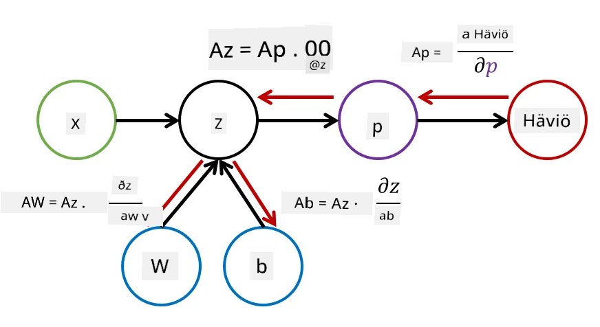

# Johdanto neuroverkkoihin. Monikerroksinen perceptron

Edellisessä osiossa opit yksinkertaisimmasta neuroverkkonmallista – yksikerroksisesta perceptronista, joka on lineaarinen kahden luokan luokittelumalli.

Tässä osiossa laajennamme tätä mallia joustavammaksi kehykseksi, joka mahdollistaa:

* suorittaa **moniluokkaluokittelua** kahden luokan luokittelun lisäksi
* ratkaista **regressio-ongelmia** luokittelun lisäksi
* erottaa luokkia, jotka eivät ole lineaarisesti erotettavissa

Kehitämme myös oman modulaarisen Python-kehyksen, jonka avulla voimme rakentaa erilaisia neuroverkkorakenteita.

## [Ennakkokysely](https://ff-quizzes.netlify.app/en/ai/quiz/7)

## Koneoppimisen formalisointi

Aloitetaan koneoppimisongelman formalisoinnista. Oletetaan, että meillä on harjoitusaineisto **X** ja sen luokat **Y**, ja meidän täytyy rakentaa malli *f*, joka tekee mahdollisimman tarkkoja ennusteita. Ennusteiden laatua mitataan **tappiofunktiolla** &lagran;. Seuraavia tappiofunktioita käytetään usein:

* Regressio-ongelmassa, kun meidän täytyy ennustaa luku, voimme käyttää **absoluuttista virhettä** &sum;i|f(x(i))-y(i)| tai **neliöllistä virhettä** &sum;i(f(x(i))-y(i))2
* Luokittelussa käytämme **0-1 tappiofunktiota** (joka on käytännössä sama kuin mallin **tarkkuus**) tai **logistista tappiofunktiota**.

Yksikerroksisessa perceptronissa funktio *f* määriteltiin lineaarisena funktiona *f(x)=wx+b* (tässä *w* on painomatriisi, *x* on syöteominaisuuksien vektori ja *b* on bias-vektori). Eri neuroverkkorakenteissa tämä funktio voi olla monimutkaisempi.

> Luokittelussa on usein toivottavaa saada todennäköisyydet vastaaville luokille verkon ulostulona. Muuttaaksemme satunnaiset luvut todennäköisyyksiksi (esim. normalisoidaksemme ulostulon), käytämme usein **softmax-funktiota** &sigma;, jolloin funktio *f* muuttuu muotoon *f(x)=&sigma;(wx+b)*.

Yllä olevassa *f*-määritelmässä *w* ja *b* kutsutaan **parametreiksi** &theta;=⟨*w,b*⟩. Kun aineisto ⟨**X**,**Y**⟩ on annettu, voimme laskea kokonaisvirheen koko aineistolle parametrien &theta; funktiona.

> ✅ **Neuroverkon koulutuksen tavoite on minimoida virhe muuttamalla parametreja &theta;**

## Gradienttimenetelmä optimointiin

On olemassa tunnettu optimointimenetelmä nimeltä **gradienttimenetelmä**. Ideana on, että voimme laskea derivaatan (moniulotteisessa tapauksessa **gradientin**) tappiofunktion suhteen parametreihin ja muuttaa parametreja siten, että virhe pienenee. Tämä voidaan formalisoida seuraavasti:

* Alusta parametrit satunnaisilla arvoilla w(0), b(0)
* Toista seuraava vaihe monta kertaa:
    - w(i+1) = w(i)-&eta;&part;&lagran;/&part;w
    - b(i+1) = b(i)-&eta;&part;&lagran;/&part;b

Koulutuksen aikana optimointivaiheet lasketaan yleensä koko aineistoa käyttäen (muista, että tappio lasketaan summana kaikkien harjoitusnäytteiden läpi). Käytännössä otamme kuitenkin pieniä osia aineistosta, joita kutsutaan **minibatcheiksi**, ja laskemme gradientit aineiston osajoukon perusteella. Koska osajoukko valitaan satunnaisesti joka kerta, menetelmää kutsutaan **stokastiseksi gradienttimenetelmäksi** (SGD).

## Monikerroksiset perceptronit ja takaisinkuljetus

Yksikerroksinen verkko, kuten olemme nähneet, pystyy luokittelemaan lineaarisesti erotettavia luokkia. Rikkaamman mallin rakentamiseksi voimme yhdistää useita verkon kerroksia. Matemaattisesti tämä tarkoittaisi, että funktio *f* olisi monimutkaisempi ja laskettaisiin useassa vaiheessa:
* z1=w1x+b1
* z2=w2&alpha;(z1)+b2
* f = &sigma;(z2)

Tässä &alpha; on **epälineaarinen aktivointifunktio**, &sigma; on softmax-funktio, ja parametrit ovat &theta;=<*w1,b1,w2,b2*>.

Gradienttimenetelmä pysyy samana, mutta gradienttien laskeminen on monimutkaisempaa. Ketjulaskusäännön avulla voimme laskea derivaatat seuraavasti:

* &part;&lagran;/&part;w2 = (&part;&lagran;/&part;&sigma;)(&part;&sigma;/&part;z2)(&part;z2/&part;w2)
* &part;&lagran;/&part;w1 = (&part;&lagran;/&part;&sigma;)(&part;&sigma;/&part;z2)(&part;z2/&part;&alpha;)(&part;&alpha;/&part;z1)(&part;z1/&part;w1)

> ✅ Ketjulaskusääntöä käytetään tappiofunktion derivaattojen laskemiseen parametrien suhteen.

Huomaa, että kaikkien näiden lausekkeiden vasemmanpuoleinen osa on sama, ja näin voimme tehokkaasti laskea derivaatat aloittaen tappiofunktiosta ja kulkemalla "taaksepäin" laskentakaavion läpi. Siksi monikerroksisen perceptronin koulutusmenetelmää kutsutaan **takaisinkuljetukseksi** tai 'backpropiksi'.

> TODO: kuvan lähde

> ✅ Käymme takaisinkuljetuksen paljon yksityiskohtaisemmin läpi esimerkkimuistikirjassamme.  

## Yhteenveto

Tässä oppitunnissa rakensimme oman neuroverkkokirjaston ja käytimme sitä yksinkertaiseen kaksiulotteiseen luokittelutehtävään.

## 🚀 Haaste

Mukana olevassa muistikirjassa toteutat oman kehyksen monikerroksisten perceptronien rakentamiseen ja kouluttamiseen. Näet yksityiskohtaisesti, miten modernit neuroverkot toimivat.

Siirry [OwnFramework](OwnFramework.ipynb) -muistikirjaan ja käy se läpi.

## [Jälkikysely](https://ff-quizzes.netlify.app/en/ai/quiz/8)

## Kertaus ja itseopiskelu

Takaisinkuljetus on yleinen algoritmi tekoälyssä ja koneoppimisessa, ja sitä kannattaa [tutkia tarkemmin](https://wikipedia.org/wiki/Backpropagation).

## [Tehtävä](lab/README.md)

Tässä laboratoriossa sinun tulee käyttää tämän oppitunnin aikana rakentamaasi kehystä MNIST-käsinkirjoitettujen numeroiden luokitteluun.

* [Ohjeet](lab/README.md)
* [Muistikirja](lab/MyFW_MNIST.ipynb)

---

