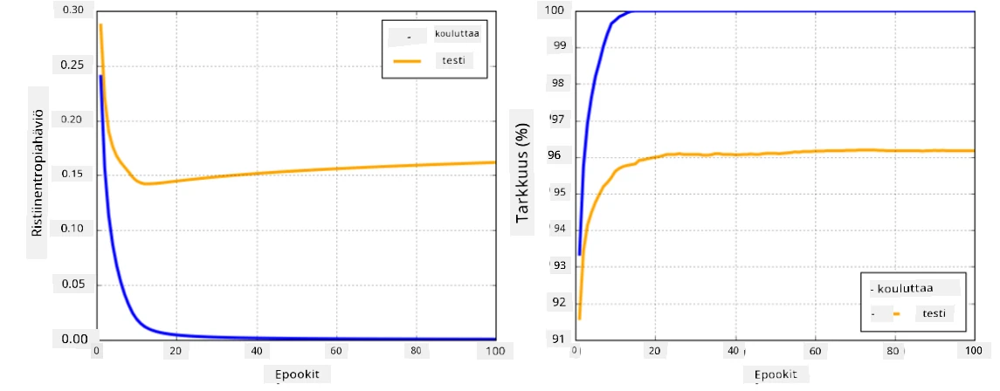

# Neuroverkkojen Kehykset

Kuten olemme jo oppineet, tehokkaan neuroverkkojen kouluttamisen kannalta meidän täytyy tehdä kaksi asiaa:

* Operoida tensoreilla, esimerkiksi kertoa, laskea yhteen ja laskea joitakin funktioita, kuten sigmoid tai softmax
* Laskea kaikkien lausekkeiden gradientit, jotta voimme suorittaa gradienttilaskeutumisoptimoinnin

## [Esiluennon kysely](https://ff-quizzes.netlify.app/en/ai/quiz/9)

Vaikka `numpy`-kirjasto pystyy suorittamaan ensimmäisen osan, tarvitsemme mekanismin gradienttien laskemiseen. [Oma kehyksemme](../04-OwnFramework/OwnFramework.ipynb), jonka kehitimme edellisessä osiossa, vaati meitä ohjelmoimaan kaikki derivaattafunktiot manuaalisesti `backward`-metodissa, joka suorittaa takaisinlevityksen. Ihanteellisesti kehys antaisi meille mahdollisuuden laskea gradientit *mille tahansa lausekkeelle*, jonka voimme määritellä.

Toinen tärkeä asia on kyky suorittaa laskelmia GPU:lla tai muilla erikoistuneilla laskentayksiköillä, kuten [TPU](https://en.wikipedia.org/wiki/Tensor_Processing_Unit). Syvien neuroverkkojen kouluttaminen vaatii *paljon* laskentaa, ja laskelmien rinnakkaistaminen GPU:lla on erittäin tärkeää.

> ✅ Termi 'rinnakkaistaminen' tarkoittaa laskelmien jakamista useille laitteille.

Tällä hetkellä kaksi suosituinta neuroverkkojen kehystä ovat: [TensorFlow](http://TensorFlow.org) ja [PyTorch](https://pytorch.org/). Molemmat tarjoavat matalan tason API:n tensoreiden käsittelyyn sekä CPU:lla että GPU:lla. Matalan tason API:n lisäksi on myös korkean tason API, nimeltään [Keras](https://keras.io/) ja [PyTorch Lightning](https://pytorchlightning.ai/) vastaavasti.

Matalan tason API | [TensorFlow](http://TensorFlow.org) | [PyTorch](https://pytorch.org/)
------------------|-------------------------------------|--------------------------------
Korkean tason API | [Keras](https://keras.io/) | [PyTorch Lightning](https://pytorchlightning.ai/)

**Matalan tason API:t** molemmissa kehyksissä mahdollistavat niin sanottujen **laskentakaavioiden** rakentamisen. Tämä kaavio määrittää, miten tulos (yleensä häviöfunktio) lasketaan annetuilla syöteparametreilla, ja sen voi siirtää laskettavaksi GPU:lle, jos se on saatavilla. Kaaviolle on olemassa funktioita, jotka laskevat sen gradientit, joita voidaan käyttää mallin parametrien optimointiin.

**Korkean tason API:t** käsittelevät neuroverkkoja pitkälti **kerrosten sarjana**, ja tekevät useimpien neuroverkkojen rakentamisesta paljon helpompaa. Mallin kouluttaminen vaatii yleensä datan valmistelua ja sitten `fit`-funktion kutsumista työn suorittamiseksi.

Korkean tason API:n avulla voit rakentaa tyypillisiä neuroverkkoja erittäin nopeasti ilman, että sinun tarvitsee huolehtia monista yksityiskohdista. Samalla matalan tason API tarjoaa paljon enemmän kontrollia koulutusprosessiin, ja siksi sitä käytetään paljon tutkimuksessa, kun käsitellään uusia neuroverkkoarkkitehtuureja.

On myös tärkeää ymmärtää, että molempia API:ita voi käyttää yhdessä, esimerkiksi voit kehittää oman verkon kerrosarkkitehtuurin matalan tason API:lla ja käyttää sitä osana suurempaa verkkoa, joka on rakennettu ja koulutettu korkean tason API:lla. Tai voit määritellä verkon korkean tason API:lla kerrosten sarjana ja käyttää omaa matalan tason koulutussilmukkaa optimointiin. Molemmat API:t perustuvat samoihin peruskäsitteisiin, ja ne on suunniteltu toimimaan hyvin yhdessä.

## Oppiminen

Tässä kurssissa tarjoamme suurimman osan sisällöstä sekä PyTorchille että TensorFlow'lle. Voit valita mieluisan kehyksen ja käydä läpi vain vastaavat muistikirjat. Jos et ole varma, minkä kehyksen valitset, lue keskusteluja internetissä aiheesta **PyTorch vs. TensorFlow**. Voit myös tutustua molempiin kehyksiin saadaksesi paremman käsityksen.

Missä mahdollista, käytämme korkean tason API:ita yksinkertaisuuden vuoksi. Uskomme kuitenkin, että on tärkeää ymmärtää, miten neuroverkot toimivat alusta alkaen, joten aluksi aloitamme työskentelyn matalan tason API:n ja tensoreiden kanssa. Jos kuitenkin haluat päästä nopeasti alkuun etkä halua käyttää paljon aikaa näiden yksityiskohtien oppimiseen, voit ohittaa ne ja siirtyä suoraan korkean tason API-muistikirjoihin.

## ✍️ Harjoitukset: Kehykset

Jatka oppimista seuraavissa muistikirjoissa:

Matalan tason API | [TensorFlow+Keras Notebook](IntroKerasTF.ipynb) | [PyTorch](IntroPyTorch.ipynb)
------------------|-------------------------------------|--------------------------------
Korkean tason API | [Keras](IntroKeras.ipynb) | *PyTorch Lightning*

Kun olet hallinnut kehykset, kerrataan ylikoulutuksen käsitettä.

# Ylikoulutus

Ylikoulutus on erittäin tärkeä käsite koneoppimisessa, ja on erittäin tärkeää ymmärtää se oikein!

Tarkastellaan seuraavaa ongelmaa, jossa pyritään approksimoimaan 5 pistettä (esitettynä `x`-merkeillä alla olevissa kaavioissa):

 | 
-------------------------|--------------------------
**Lineaarinen malli, 2 parametria** | **Ei-lineaarinen malli, 7 parametria**
Koulutusvirhe = 5.3 | Koulutusvirhe = 0
Validointivirhe = 5.1 | Validointivirhe = 20

* Vasemmalla näemme hyvän suoran approksimaation. Koska parametrien määrä on sopiva, malli ymmärtää pisteiden jakautumisen oikein.
* Oikealla malli on liian voimakas. Koska meillä on vain 5 pistettä ja mallilla on 7 parametria, se voi mukautua siten, että se kulkee kaikkien pisteiden läpi, jolloin koulutusvirhe on 0. Tämä kuitenkin estää mallia ymmärtämästä datan oikeaa kaavaa, joten validointivirhe on erittäin korkea.

On erittäin tärkeää löytää oikea tasapaino mallin monimutkaisuuden (parametrien määrä) ja koulutusnäytteiden määrän välillä.

## Miksi ylikoulutusta tapahtuu

  * Liian vähän koulutusdataa
  * Liian voimakas malli
  * Liikaa kohinaa syötedatassa

## Miten ylikoulutus havaitaan

Kuten yllä olevasta kaaviosta näkyy, ylikoulutus voidaan havaita erittäin pienestä koulutusvirheestä ja suuresta validointivirheestä. Normaalisti koulutuksen aikana näemme sekä koulutus- että validointivirheiden alkavan pienentyä, ja jossain vaiheessa validointivirhe saattaa lakata pienentymästä ja alkaa kasvaa. Tämä on merkki ylikoulutuksesta ja indikaattori siitä, että koulutus pitäisi todennäköisesti lopettaa tässä vaiheessa (tai ainakin tehdä mallista tilannekuva).

## Miten ylikoulutusta estetään

Jos huomaat, että ylikoulutusta tapahtuu, voit tehdä jonkin seuraavista:

 * Lisää koulutusdatan määrää
 * Vähennä mallin monimutkaisuutta
 * Käytä jotakin [regularisointitekniikkaa](../../4-ComputerVision/08-TransferLearning/TrainingTricks.md), kuten [Dropout](../../4-ComputerVision/08-TransferLearning/TrainingTricks.md#Dropout), jota käsittelemme myöhemmin.

## Ylikoulutus ja Bias-Variance Tradeoff

Ylikoulutus on itse asiassa tilanne, joka liittyy yleisempään tilastolliseen ongelmaan nimeltä [Bias-Variance Tradeoff](https://en.wikipedia.org/wiki/Bias%E2%80%93variance_tradeoff). Jos tarkastelemme mallimme virhelähteitä, voimme nähdä kahdenlaisia virheitä:

* **Bias-virheet** johtuvat siitä, että algoritmimme ei pysty oikein mallintamaan koulutusdatan välistä suhdetta. Tämä voi johtua siitä, että mallimme ei ole tarpeeksi voimakas (**alikoulutus**).
* **Variance-virheet**, jotka johtuvat siitä, että malli mallintaa kohinaa syötedatassa merkityksellisen suhteen sijaan (**ylikoulutus**).

Koulutuksen aikana bias-virhe pienenee (kun mallimme oppii approksimoimaan dataa), ja variance-virhe kasvaa. On tärkeää lopettaa koulutus - joko manuaalisesti (kun havaitsemme ylikoulutusta) tai automaattisesti (ottamalla käyttöön regularisointi) - ylikoulutuksen estämiseksi.

## Yhteenveto

Tässä oppitunnissa opit kahden suosituimman AI-kehyksen, TensorFlow'n ja PyTorchin, eri API:iden erot. Lisäksi opit erittäin tärkeästä aiheesta, ylikoulutuksesta.

## 🚀 Haaste

Liitetyissä muistikirjoissa löydät 'tehtäviä' lopusta; käy läpi muistikirjat ja suorita tehtävät.

## [Luennon jälkeinen kysely](https://ff-quizzes.netlify.app/en/ai/quiz/10)

## Kertaus & Itseopiskelu

Tutki seuraavia aiheita:

- TensorFlow
- PyTorch
- Ylikoulutus

Kysy itseltäsi seuraavat kysymykset:

- Mitä eroa on TensorFlow'lla ja PyTorchilla?
- Mitä eroa on ylikoulutuksella ja alikoulutuksella?

## [Tehtävä](lab/README.md)

Tässä laboratoriossa sinua pyydetään ratkaisemaan kaksi luokitteluongelmaa käyttäen yksikerroksisia ja monikerroksisia täysin kytkettyjä verkkoja PyTorchilla tai TensorFlow'lla.

* [Ohjeet](lab/README.md)
* [Muistikirja](lab/LabFrameworks.ipynb)

---

