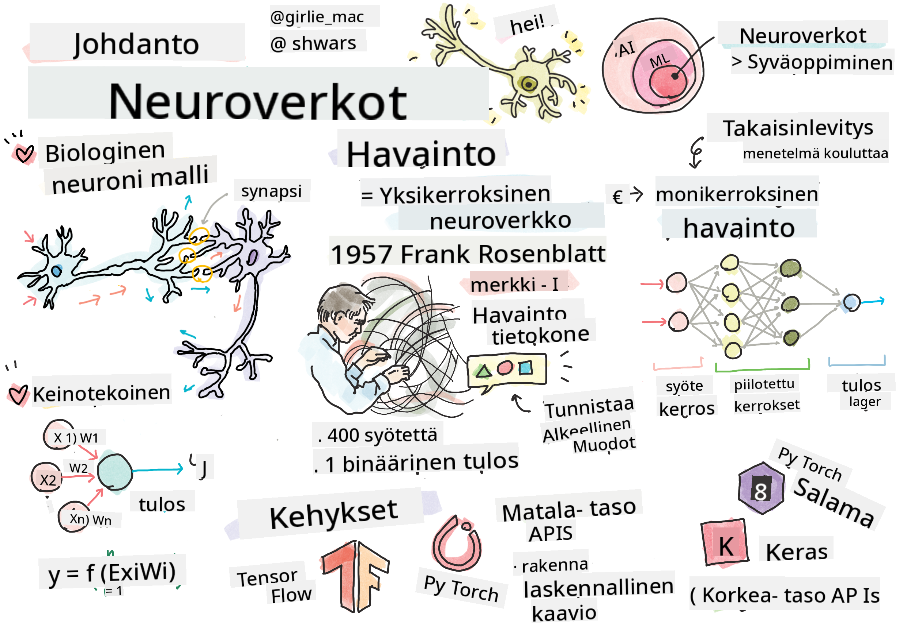

<!--
CO_OP_TRANSLATOR_METADATA:
{
  "original_hash": "f862a99d88088163df12270e2f2ad6c3",
  "translation_date": "2025-10-03T12:50:05+00:00",
  "source_file": "lessons/3-NeuralNetworks/README.md",
  "language_code": "fi"
}
-->
# Johdanto neuroverkkoihin

Kuten keskustelimme johdannossa, yksi tapa saavuttaa älykkyyttä on kouluttaa **tietokonemalli** tai **keinotekoinen aivot**. 1900-luvun puolivälistä lähtien tutkijat kokeilivat erilaisia matemaattisia malleja, kunnes viime vuosina tämä suunta osoittautui erittäin menestyksekkääksi. Näitä aivojen matemaattisia malleja kutsutaan **neuroverkoiksi**.

> Neuroverkkoja kutsutaan joskus *keinotekoisiksi neuroverkoiksi* (Artificial Neural Networks, ANNs) korostaakseen, että kyseessä ovat mallit, eivät oikeat neuroniverkot.

## Koneoppiminen

Neuroverkot ovat osa laajempaa tieteenalaa nimeltä **koneoppiminen**, jonka tavoitteena on käyttää dataa tietokonemallien kouluttamiseen ongelmien ratkaisemiseksi. Koneoppiminen muodostaa suuren osan tekoälystä, mutta emme käsittele perinteistä koneoppimista tässä oppimateriaalissa.

> Tutustu erilliseen **[Koneoppiminen aloittelijoille](http://github.com/microsoft/ml-for-beginners)** -oppimateriaaliimme oppiaksesi lisää perinteisestä koneoppimisesta.

Koneoppimisessa oletamme, että meillä on jokin esimerkkien **X** datasetti ja vastaavat tulosarvot **Y**. Esimerkit ovat usein N-ulotteisia vektoreita, jotka koostuvat **ominaisuuksista**, ja tulokset kutsutaan **luokiksi**.

Käsittelemme kahta yleisintä koneoppimisongelmaa:

* **Luokittelu**, jossa meidän täytyy luokitella syöteobjekti kahteen tai useampaan luokkaan.
* **Regressio**, jossa meidän täytyy ennustaa numeerinen arvo jokaiselle syötteen näytteelle.

> Kun syötteet ja tulokset esitetään tensoreina, syötedatasetti on M&times;N-kokoinen matriisi, jossa M on näytteiden lukumäärä ja N on ominaisuuksien lukumäärä. Tulosluokat Y ovat M-kokoinen vektori.

Tässä oppimateriaalissa keskitymme vain neuroverkkopohjaisiin malleihin.

## Neuronin malli

Biologiasta tiedämme, että aivomme koostuvat hermosoluista (neuroneista), joilla jokaisella on useita "syötteitä" (dendriittejä) ja yksi "tulos" (aksoni). Sekä dendriitit että aksonit voivat johtaa sähköisiä signaaleja, ja niiden väliset yhteydet — synapsit — voivat osoittaa vaihtelevaa johtavuutta, jota säätelevät välittäjäaineet.

 | 
----|----
Oikea neuroni *([Kuva](https://en.wikipedia.org/wiki/Synapse#/media/File:SynapseSchematic_lines.svg) Wikipediasta)* | Keinotekoinen neuroni *(Kuva tekijältä)*

Näin ollen yksinkertaisin matemaattinen malli neuronista sisältää useita syötteitä X1, ..., XN ja yhden tuloksen Y sekä joukon painoja W1, ..., WN. Tulos lasketaan seuraavasti:

missä f on jokin epälineaarinen **aktivointifunktio**.

> Varhaiset neuronimallit kuvattiin klassisessa artikkelissa [A logical calculus of the ideas immanent in nervous activity](https://www.cs.cmu.edu/~./epxing/Class/10715/reading/McCulloch.and.Pitts.pdf), jonka kirjoittivat Warren McCullock ja Walter Pitts vuonna 1943. Donald Hebb ehdotti kirjassaan "[The Organization of Behavior: A Neuropsychological Theory](https://books.google.com/books?id=VNetYrB8EBoC)" tapaa, jolla näitä verkkoja voidaan kouluttaa.

## Tässä osiossa

Tässä osiossa opimme seuraavista aiheista:
* [Perceptron](03-Perceptron/README.md), yksi varhaisimmista neuroverkkopohjaisista malleista kahden luokan luokitteluun
* [Monikerroksiset verkot](04-OwnFramework/README.md) ja niihin liittyvä muistikirja [kuinka rakentaa oma kehys](04-OwnFramework/OwnFramework.ipynb)
* [Neuroverkkokehykset](05-Frameworks/README.md), ja näihin liittyvät muistikirjat: [PyTorch](05-Frameworks/IntroPyTorch.ipynb) ja [Keras/Tensorflow](05-Frameworks/IntroKerasTF.ipynb)
* [Ylilajittelu](../../../../lessons/3-NeuralNetworks/05-Frameworks)

---

**Vastuuvapauslauseke**:  
Tämä asiakirja on käännetty käyttämällä tekoälypohjaista käännöspalvelua [Co-op Translator](https://github.com/Azure/co-op-translator). Vaikka pyrimme tarkkuuteen, huomioithan, että automaattiset käännökset voivat sisältää virheitä tai epätarkkuuksia. Alkuperäinen asiakirja sen alkuperäisellä kielellä tulisi pitää ensisijaisena lähteenä. Kriittisen tiedon osalta suositellaan ammattimaista ihmiskäännöstä. Emme ole vastuussa väärinkäsityksistä tai virhetulkinnoista, jotka johtuvat tämän käännöksen käytöstä.