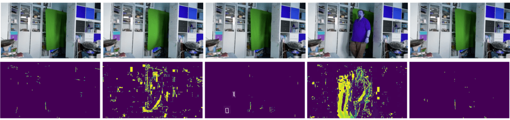

<!--
CO_OP_TRANSLATOR_METADATA:
{
  "original_hash": "4bedc8e702db17260cfe824d58b6cfd4",
  "translation_date": "2025-08-28T19:29:40+00:00",
  "source_file": "lessons/4-ComputerVision/06-IntroCV/README.md",
  "language_code": "fi"
}
-->
# Johdanto tietokonenäköön

[Tietokonenäkö](https://wikipedia.org/wiki/Computer_vision) on ala, jonka tavoitteena on mahdollistaa tietokoneiden korkeatasoinen ymmärrys digitaalisista kuvista. Tämä on melko laaja määritelmä, sillä *ymmärrys* voi tarkoittaa monia eri asioita, kuten objektin löytämistä kuvasta (**objektin tunnistus**), tapahtuman ymmärtämistä (**tapahtuman tunnistus**), kuvan kuvailemista tekstinä tai kohtauksen rekonstruointia 3D-muodossa. On myös erityisiä tehtäviä, jotka liittyvät ihmisten kuviin: iän ja tunteiden arviointi, kasvojen tunnistus ja identifiointi sekä 3D-asennon arviointi, muutamia mainitakseni.

## [Ennakkokysely](https://red-field-0a6ddfd03.1.azurestaticapps.net/quiz/106)

Yksi tietokonenäön yksinkertaisimmista tehtävistä on **kuvien luokittelu**.

Tietokonenäköä pidetään usein tekoälyn alana. Nykyään suurin osa tietokonenäön tehtävistä ratkaistaan neuroverkkojen avulla. Opimme lisää erityisestä neuroverkkotyypistä, jota käytetään tietokonenäössä, [konvoluutioneuroverkot](../07-ConvNets/README.md), tämän osion aikana.

Kuitenkin, ennen kuin kuva syötetään neuroverkkoon, monissa tapauksissa on järkevää käyttää joitakin algoritmisia tekniikoita kuvan parantamiseksi.

Pythonissa on saatavilla useita kirjastoja kuvankäsittelyyn:

* **[imageio](https://imageio.readthedocs.io/en/stable/)** voidaan käyttää erilaisten kuvatiedostomuotojen lukemiseen/kirjoittamiseen. Se tukee myös ffmpeg-ohjelmaa, joka on hyödyllinen työkalu videokehysten muuntamiseen kuviksi.
* **[Pillow](https://pillow.readthedocs.io/en/stable/index.html)** (tunnetaan myös nimellä PIL) on hieman tehokkaampi ja tukee myös joitakin kuvanmuokkaustoimintoja, kuten muokkausta, palettisäätöjä ja muuta.
* **[OpenCV](https://opencv.org/)** on tehokas kuvankäsittelykirjasto, joka on kirjoitettu C++-kielellä ja on käytännössä standardi kuvankäsittelyssä. Sillä on kätevä Python-rajapinta.
* **[dlib](http://dlib.net/)** on C++-kirjasto, joka toteuttaa monia koneoppimisalgoritmeja, mukaan lukien joitakin tietokonenäön algoritmeja. Sillä on myös Python-rajapinta, ja sitä voidaan käyttää haastaviin tehtäviin, kuten kasvojen ja kasvonpiirteiden tunnistukseen.

## OpenCV

[OpenCV](https://opencv.org/) on käytännössä standardi kuvankäsittelyssä. Se sisältää paljon hyödyllisiä algoritmeja, jotka on toteutettu C++-kielellä. OpenCV:tä voi käyttää myös Pythonista.

Hyvä paikka oppia OpenCV:tä on [tämä Learn OpenCV -kurssi](https://learnopencv.com/getting-started-with-opencv/). Meidän opetussuunnitelmassamme tavoitteena ei ole oppia OpenCV:tä, vaan näyttää joitakin esimerkkejä siitä, milloin sitä voidaan käyttää ja miten.

### Kuvien lataaminen

Pythonissa kuvat voidaan kätevästi esittää NumPy-taulukoina. Esimerkiksi harmaasävykuvat, joiden koko on 320x200 pikseliä, tallennetaan 200x320-taulukkoon, ja värikuvat samasta ulottuvuudesta olisivat muodoltaan 200x320x3 (3 värikanavaa varten). Kuvan lataamiseen voit käyttää seuraavaa koodia:

```python
import cv2
import matplotlib.pyplot as plt

im = cv2.imread('image.jpeg')
plt.imshow(im)
```

Perinteisesti OpenCV käyttää BGR (sininen-vihreä-punainen) -koodausta värikuville, kun taas muut Python-työkalut käyttävät perinteisempää RGB (punainen-vihreä-sininen) -koodausta. Jotta kuva näyttäisi oikealta, sinun täytyy muuntaa se RGB-väriavaruuteen joko vaihtamalla NumPy-taulukon ulottuvuuksia tai kutsumalla OpenCV-funktiota:

```python
im = cv2.cvtColor(im,cv2.COLOR_BGR2RGB)
```

Sama `cvtColor`-funktio voidaan käyttää muihin väriavaruusmuunnoksiin, kuten kuvan muuntamiseen harmaasävyksi tai HSV (sävy-saturaatio-arvo) -väriavaruuteen.

Voit myös käyttää OpenCV:tä videon lataamiseen kehys kerrallaan - esimerkki löytyy harjoituksesta [OpenCV Notebook](OpenCV.ipynb).

### Kuvankäsittely

Ennen kuin syötät kuvan neuroverkkoon, saatat haluta soveltaa useita esikäsittelyvaiheita. OpenCV:llä voi tehdä monia asioita, kuten:

* **Kuvan koon muuttaminen** käyttämällä `im = cv2.resize(im, (320,200),interpolation=cv2.INTER_LANCZOS)`
* **Kuvan sumentaminen** käyttämällä `im = cv2.medianBlur(im,3)` tai `im = cv2.GaussianBlur(im, (3,3), 0)`
* Kuvan **kirkkauden ja kontrastin** muuttaminen voidaan tehdä NumPy-taulukon manipulaatioilla, kuten kuvataan [tässä Stackoverflow-muistiinpanossa](https://stackoverflow.com/questions/39308030/how-do-i-increase-the-contrast-of-an-image-in-python-opencv).
* [Kynnysarvojen käyttö](https://docs.opencv.org/4.x/d7/d4d/tutorial_py_thresholding.html) kutsumalla `cv2.threshold`/`cv2.adaptiveThreshold`-funktioita, mikä on usein parempi vaihtoehto kuin kirkkauden tai kontrastin säätäminen.
* Erilaisten [muunnosten](https://docs.opencv.org/4.5.5/da/d6e/tutorial_py_geometric_transformations.html) soveltaminen kuvaan:
    - **[Affiinimuunnokset](https://docs.opencv.org/4.5.5/d4/d61/tutorial_warp_affine.html)** voivat olla hyödyllisiä, jos sinun täytyy yhdistää kuvan kierto, koon muuttaminen ja vinoutus ja tiedät kolmen pisteen lähde- ja kohdesijainnit kuvassa. Affiinimuunnokset säilyttävät yhdensuuntaiset viivat yhdensuuntaisina.
    - **[Perspektiivimuunnokset](https://medium.com/analytics-vidhya/opencv-perspective-transformation-9edffefb2143)** voivat olla hyödyllisiä, kun tiedät neljän pisteen lähde- ja kohdesijainnit kuvassa. Esimerkiksi, jos otat kuvan suorakulmaisesta asiakirjasta älypuhelimen kameralla jostain kulmasta ja haluat tehdä suorakulmaisen kuvan itse asiakirjasta.
* Liikkeen ymmärtäminen kuvassa käyttämällä **[optista virtausta](https://docs.opencv.org/4.5.5/d4/dee/tutorial_optical_flow.html)**.

## Esimerkkejä tietokonenäön käytöstä

[OpenCV Notebook](OpenCV.ipynb) -tiedostossa annamme joitakin esimerkkejä siitä, milloin tietokonenäköä voidaan käyttää tiettyjen tehtävien suorittamiseen:

* **Valokuvan esikäsittely pistekirjoituskirjasta**. Keskitymme siihen, miten voimme käyttää kynnysarvoja, ominaisuuksien tunnistusta, perspektiivimuunnosta ja NumPy-manipulaatioita erottamaan yksittäiset pistekirjoitussymbolit, jotta ne voidaan luokitella neuroverkolla.

 |  | 
----|-----|-----

> Kuva [OpenCV.ipynb](OpenCV.ipynb)

* **Liikkeen tunnistaminen videossa kehysten erotuksen avulla**. Jos kamera on kiinteä, kameran syötteen kehysten pitäisi olla melko samanlaisia keskenään. Koska kehykset esitetään taulukoina, vain vähentämällä näitä taulukoita kahdelle peräkkäiselle kehykselle saamme pikselierotuksen, jonka pitäisi olla pieni staattisille kehyksille ja kasvaa merkittävästi, kun kuvassa on huomattavaa liikettä.



> Kuva [OpenCV.ipynb](OpenCV.ipynb)

* **Liikkeen tunnistaminen optisen virtauksen avulla**. [Optinen virtaus](https://docs.opencv.org/3.4/d4/dee/tutorial_optical_flow.html) mahdollistaa sen ymmärtämisen, miten yksittäiset pikselit videokehyksissä liikkuvat. Optisesta virtauksesta on kaksi tyyppiä:

   - **Tiheä optinen virtaus** laskee vektorikentän, joka näyttää jokaiselle pikselille, mihin se liikkuu.
   - **Harva optinen virtaus** perustuu joidenkin erottuvien ominaisuuksien (esim. reunojen) ottamiseen kuvasta ja niiden liikeradan rakentamiseen kehyksestä toiseen.


> Kuva [OpenCV.ipynb](OpenCV.ipynb)

## ✍️ Esimerkkitiedostot: OpenCV [kokeile OpenCV:tä käytännössä](OpenCV.ipynb)

Tehdään joitakin kokeita OpenCV:llä tutkimalla [OpenCV Notebook](OpenCV.ipynb) -tiedostoa.

## Yhteenveto

Joskus suhteellisen monimutkaiset tehtävät, kuten liikkeen tunnistus tai sormenpään tunnistus, voidaan ratkaista pelkästään tietokonenäön avulla. Siksi on erittäin hyödyllistä tuntea tietokonenäön perusmenetelmät ja mitä kirjastot, kuten OpenCV, voivat tehdä.

## 🚀 Haaste

Katso [tämä video](https://docs.microsoft.com/shows/ai-show/ai-show--2021-opencv-ai-competition--grand-prize-winners--cortic-tigers--episode-32?WT.mc_id=academic-77998-cacaste) AI Show'sta oppiaksesi Cortic Tigers -projektista ja siitä, miten he rakensivat lohkopohjaisen ratkaisun tietokonenäön tehtävien demokratisoimiseksi robotin avulla. Tee tutkimusta muista vastaavista projekteista, jotka auttavat uusia oppijoita pääsemään mukaan alalle.

## [Jälkikysely](https://red-field-0a6ddfd03.1.azurestaticapps.net/quiz/206)

## Kertaus ja itseopiskelu

Lue lisää optisesta virtauksesta [tästä erinomaisesta opetusohjelmasta](https://learnopencv.com/optical-flow-in-opencv/).

## [Tehtävä](lab/README.md)

Tässä laboratoriossa otat videon, jossa on yksinkertaisia eleitä, ja tavoitteesi on tunnistaa ylös/alas/vasen/oikea-liikkeet optisen virtauksen avulla.


---

**Vastuuvapauslauseke**:  
Tämä asiakirja on käännetty käyttämällä tekoälypohjaista käännöspalvelua [Co-op Translator](https://github.com/Azure/co-op-translator). Vaikka pyrimme tarkkuuteen, huomioithan, että automaattiset käännökset voivat sisältää virheitä tai epätarkkuuksia. Alkuperäistä asiakirjaa sen alkuperäisellä kielellä tulisi pitää ensisijaisena lähteenä. Kriittisen tiedon osalta suositellaan ammattimaista ihmiskäännöstä. Emme ole vastuussa tämän käännöksen käytöstä johtuvista väärinkäsityksistä tai virhetulkinnoista.