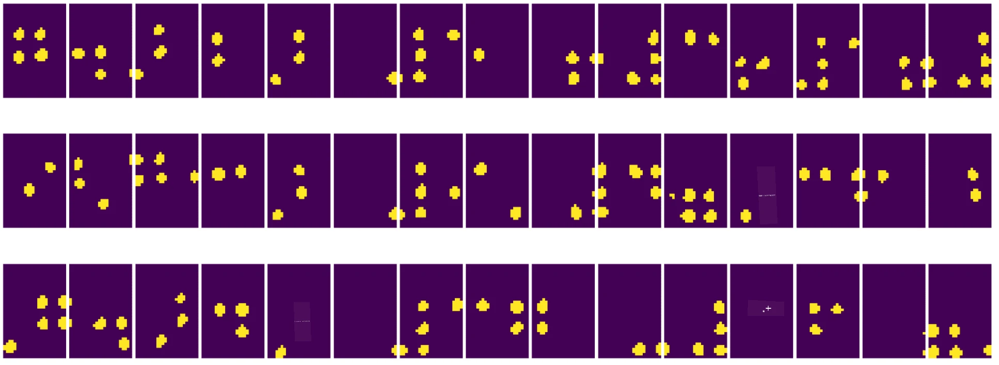
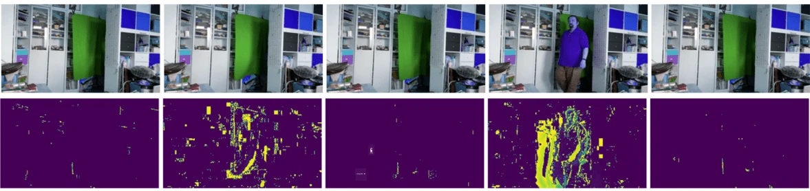

# Johdanto tietokonenäköön

[Tietokonenäkö](https://wikipedia.org/wiki/Computer_vision) on tieteenala, jonka tavoitteena on mahdollistaa tietokoneiden saavuttaa korkeatasoinen ymmärrys digitaalisista kuvista. Tämä on varsin laaja määritelmä, sillä *ymmärrys* voi tarkoittaa monia eri asioita, kuten esineen löytämistä kuvasta (**esineentunnistus**), tapahtuman ymmärtämistä (**tapahtumantunnistus**), kuvan kuvailemista tekstillä tai kohtauksen rekonstruointia 3D-muodossa. On myös erityisiä tehtäviä, jotka liittyvät ihmiskuvien käsittelyyn: iän ja tunteiden arviointi, kasvojen tunnistus ja identifiointi sekä 3D-asennon arviointi, muutamia mainitakseni.

## [Esiluentovisa](https://ff-quizzes.netlify.app/en/ai/quiz/11)

Yksi tietokonenäön yksinkertaisimmista tehtävistä on **kuvien luokittelu**.

Tietokonenäköä pidetään usein tekoälyn osa-alueena. Nykyään suurin osa tietokonenäön tehtävistä ratkaistaan neuroverkkojen avulla. Tässä osiossa opimme lisää erityisestä neuroverkkojen tyypistä, joita käytetään tietokonenäössä, eli [konvoluutioneuroverkoista](../07-ConvNets/README.md).

Ennen kuin kuva syötetään neuroverkkoon, on monissa tapauksissa järkevää käyttää joitakin algoritmisia tekniikoita kuvan parantamiseksi.

Pythonissa on saatavilla useita kirjastoja kuvankäsittelyyn:

* **[imageio](https://imageio.readthedocs.io/en/stable/)** soveltuu erilaisten kuvatiedostomuotojen lukemiseen ja kirjoittamiseen. Se tukee myös ffmpeg-ohjelmaa, joka on hyödyllinen työkalu videokehysten muuntamiseen kuviksi.
* **[Pillow](https://pillow.readthedocs.io/en/stable/index.html)** (tunnetaan myös nimellä PIL) on hieman monipuolisempi ja tukee myös joitakin kuvamanipulaatioita, kuten muodonmuutoksia, paletin säätöjä ja muuta.
* **[OpenCV](https://opencv.org/)** on tehokas kuvankäsittelykirjasto, joka on kirjoitettu C++-kielellä ja on käytännössä standardi kuvankäsittelyssä. Siinä on kätevä Python-rajapinta.
* **[dlib](http://dlib.net/)** on C++-kirjasto, joka toteuttaa monia koneoppimisalgoritmeja, mukaan lukien joitakin tietokonenäön algoritmeja. Siinä on myös Python-rajapinta, ja sitä voidaan käyttää haastaviin tehtäviin, kuten kasvojen ja kasvonpiirteiden tunnistukseen.

## OpenCV

[OpenCV](https://opencv.org/) on käytännössä standardi kuvankäsittelyssä. Se sisältää paljon hyödyllisiä algoritmeja, jotka on toteutettu C++-kielellä. OpenCV:tä voi käyttää myös Pythonista käsin.

Hyvä paikka oppia OpenCV:tä on [tämä Learn OpenCV -kurssi](https://learnopencv.com/getting-started-with-opencv/). Tämän kurssin tavoitteena ei kuitenkaan ole opettaa OpenCV:tä, vaan näyttää joitakin esimerkkejä sen käytöstä ja mahdollisuuksista.

### Kuvien lataaminen

Pythonissa kuvat voidaan kätevästi esittää NumPy-taulukoina. Esimerkiksi harmaasävykuvat, joiden koko on 320x200 pikseliä, tallennetaan 200x320-taulukkoon, ja saman kokoiset värikuvat tallennetaan muotoon 200x320x3 (kolme värikanavaa). Kuvan lataamiseen voit käyttää seuraavaa koodia:

```python
import cv2
import matplotlib.pyplot as plt

im = cv2.imread('image.jpeg')
plt.imshow(im)
```

Perinteisesti OpenCV käyttää värikuvissa BGR-koodausta (sininen-vihreä-punainen), kun taas muut Python-työkalut käyttävät yleisempää RGB-koodausta (punainen-vihreä-sininen). Jotta kuva näyttäisi oikealta, se täytyy muuntaa RGB-väriavaruuteen joko vaihtamalla NumPy-taulukon ulottuvuuksia tai kutsumalla OpenCV-funktiota:

```python
im = cv2.cvtColor(im,cv2.COLOR_BGR2RGB)
```

Samaa `cvtColor`-funktiota voidaan käyttää myös muihin värimuunnoksiin, kuten kuvan muuntamiseen harmaasävyksi tai HSV-väriavaruuteen (sävy-kylläisyys-arvo).

OpenCV:tä voi käyttää myös videon lataamiseen kehys kerrallaan – esimerkki löytyy harjoituksesta [OpenCV Notebook](OpenCV.ipynb).

### Kuvankäsittely

Ennen kuin kuva syötetään neuroverkkoon, voi olla hyödyllistä suorittaa useita esikäsittelyvaiheita. OpenCV:llä voi tehdä monia asioita, kuten:

* **Kuvan koon muuttaminen** käyttämällä `im = cv2.resize(im, (320,200),interpolation=cv2.INTER_LANCZOS)`
* Kuvan **sumennus** käyttämällä `im = cv2.medianBlur(im,3)` tai `im = cv2.GaussianBlur(im, (3,3), 0)`
* Kuvan **kirkkauden ja kontrastin muuttaminen** onnistuu NumPy-taulukon manipulaatioilla, kuten [tässä Stackoverflow-ohjeessa](https://stackoverflow.com/questions/39308030/how-do-i-increase-the-contrast-of-an-image-in-python-opencv) kuvataan.
* [Kynnysarvojen](https://docs.opencv.org/4.x/d7/d4d/tutorial_py_thresholding.html) käyttö kutsumalla `cv2.threshold`/`cv2.adaptiveThreshold`-funktioita, mikä on usein parempi vaihtoehto kuin kirkkauden tai kontrastin säätäminen.
* Erilaisten [muunnosten](https://docs.opencv.org/4.5.5/da/d6e/tutorial_py_geometric_transformations.html) soveltaminen kuvaan:
    - **[Affiinimuunnokset](https://docs.opencv.org/4.5.5/d4/d61/tutorial_warp_affine.html)** ovat hyödyllisiä, jos haluat yhdistää kuvan kiertämisen, koon muuttamisen ja vinouttamisen ja tiedät kolmen pisteen lähde- ja kohdesijainnit kuvassa. Affiinimuunnokset säilyttävät yhdensuuntaiset viivat yhdensuuntaisina.
    - **[Perspektiivimuunnokset](https://medium.com/analytics-vidhya/opencv-perspective-transformation-9edffefb2143)** ovat hyödyllisiä, kun tiedät neljän pisteen lähde- ja kohdesijainnit kuvassa. Esimerkiksi, jos otat älypuhelimella kuvan suorakulmaisesta dokumentista vinosta kulmasta ja haluat suorakulmaisen kuvan itse dokumentista.
* Liikkeen ymmärtäminen kuvassa käyttämällä **[optista virtausta](https://docs.opencv.org/4.5.5/d4/dee/tutorial_optical_flow.html)**.

## Esimerkkejä tietokonenäön käytöstä

[OpenCV Notebook](OpenCV.ipynb) -tiedostossa annamme esimerkkejä siitä, milloin tietokonenäköä voidaan käyttää tiettyjen tehtävien suorittamiseen:

* **Pistekirjakuvan esikäsittely**. Keskitymme siihen, miten voimme käyttää kynnysarvoja, piirteiden tunnistusta, perspektiivimuunnoksia ja NumPy-manipulaatioita erottamaan yksittäiset pistekirjoitussymbolit, jotta ne voidaan luokitella neuroverkolla.

 |  | 
----|-----|-----

> Kuva [OpenCV.ipynb](OpenCV.ipynb)

* **Liikkeen tunnistaminen videosta kehysten erotuksen avulla**. Jos kamera on kiinteä, kameran syötteen kehysten pitäisi olla melko samanlaisia. Koska kehykset esitetään taulukoina, kahden peräkkäisen kehyksen taulukoiden vähentämisellä saadaan pikseliero, joka on pieni staattisille kehyksille ja kasvaa merkittävästi, kun kuvassa on huomattavaa liikettä.



> Kuva [OpenCV.ipynb](OpenCV.ipynb)

* **Liikkeen tunnistaminen optisen virtauksen avulla**. [Optinen virtaus](https://docs.opencv.org/3.4/d4/dee/tutorial_optical_flow.html) auttaa ymmärtämään, miten yksittäiset pikselit liikkuvat videokehyksissä. Optista virtausta on kahta tyyppiä:

   - **Tiheä optinen virtaus** laskee vektorikentän, joka näyttää jokaisen pikselin liikkeen suunnan.
   - **Harva optinen virtaus** perustuu tiettyjen erottuvien piirteiden (esim. reunojen) valintaan kuvassa ja niiden liikeradan rakentamiseen kehyksestä toiseen.


> Kuva [OpenCV.ipynb](OpenCV.ipynb)

## ✍️ Esimerkkitiedostot: OpenCV [kokeile OpenCV:tä käytännössä](OpenCV.ipynb)

Tehdään kokeita OpenCV:llä tutkimalla [OpenCV Notebook](OpenCV.ipynb) -tiedostoa.

## Yhteenveto

Joskus suhteellisen monimutkaiset tehtävät, kuten liikkeen tunnistus tai sormenpään tunnistus, voidaan ratkaista pelkästään tietokonenäön avulla. Siksi on erittäin hyödyllistä tuntea tietokonenäön perusmenetelmät ja mitä kirjastoja, kuten OpenCV, voi tehdä.

## 🚀 Haaste

Katso [tämä video](https://docs.microsoft.com/shows/ai-show/ai-show--2021-opencv-ai-competition--grand-prize-winners--cortic-tigers--episode-32?WT.mc_id=academic-77998-cacaste) AI Show'sta oppiaksesi Cortic Tigers -projektista ja siitä, miten he rakensivat lohkopohjaisen ratkaisun tietokonenäön tehtävien demokratisoimiseksi robotin avulla. Tee tutkimusta muista vastaavista projekteista, jotka auttavat uusia oppijoita pääsemään mukaan alalle.

## [Jälkiluentovisa](https://ff-quizzes.netlify.app/en/ai/quiz/12)

## Kertaus ja itseopiskelu

Lue lisää optisesta virtauksesta [tästä erinomaisesta oppaasta](https://learnopencv.com/optical-flow-in-opencv/).

## [Tehtävä](lab/README.md)

Tässä laboratoriossa otat videon, jossa on yksinkertaisia eleitä, ja tavoitteesi on tunnistaa ylös/alas/vasen/oikea-liikkeet optisen virtauksen avulla.


---

