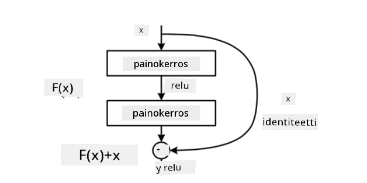
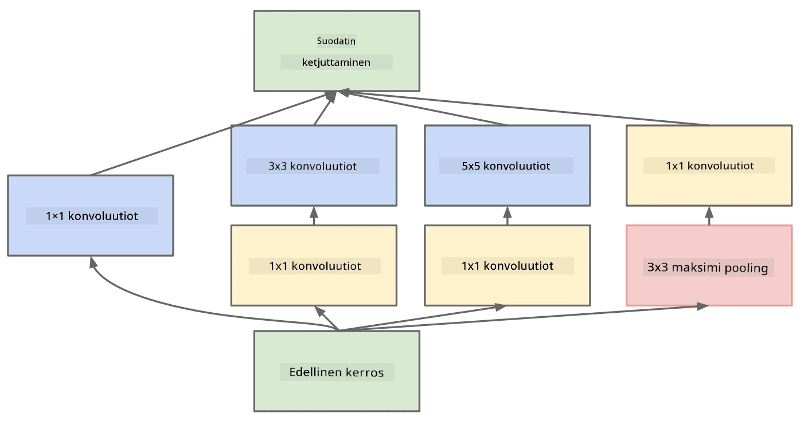

# Tunnetut CNN-arkkitehtuurit

### VGG-16

VGG-16 on verkko, joka saavutti 92,7 % tarkkuuden ImageNetin top-5-luokittelussa vuonna 2014. Sen kerrosrakenne on seuraava:

Kuten näet, VGG noudattaa perinteistä pyramidirakennetta, joka koostuu konvoluutio- ja pooling-kerrosten sarjasta.

> Kuva [Researchgate](https://www.researchgate.net/figure/Vgg16-model-structure-To-get-the-VGG-NIN-model-we-replace-the-2-nd-4-th-6-th-7-th_fig2_335194493) -sivustolta

### ResNet

ResNet on Microsoft Researchin vuonna 2015 ehdottama malliperhe. ResNetin pääidea on käyttää **residuaalilohkoja**:

> Kuva [tästä artikkelista](https://arxiv.org/pdf/1512.03385.pdf)

Identiteettisiirron käyttö mahdollistaa sen, että kerros ennustaa **erotuksen** edellisen kerroksen tuloksen ja residuaalilohkon ulostulon välillä - tästä nimi *residuaali*. Nämä lohkot ovat paljon helpompia kouluttaa, ja niiden avulla voidaan rakentaa verkkoja, joissa on satoja tällaisia lohkoja (yleisimmät variantit ovat ResNet-52, ResNet-101 ja ResNet-152).

Voit myös ajatella tätä verkkoa kykeneväksi mukauttamaan monimutkaisuutensa datan mukaan. Aluksi, kun verkkoa aletaan kouluttaa, painojen arvot ovat pieniä, ja suurin osa signaalista kulkee identiteettisiirron kautta. Koulutuksen edetessä ja painojen kasvaessa verkon parametrien merkitys kasvaa, ja verkko mukautuu tarjoamaan tarvittavan ilmaisukyvyn koulutuskuvien oikeaan luokitteluun.

### Google Inception

Google Inception -arkkitehtuuri vie tämän idean askeleen pidemmälle ja rakentaa jokaisen verkon kerroksen useiden eri polkujen yhdistelmänä:

> Kuva [Researchgate](https://www.researchgate.net/figure/Inception-module-with-dimension-reductions-left-and-schema-for-Inception-ResNet-v1_fig2_355547454) -sivustolta

Tässä on tärkeää korostaa 1x1-konvoluutioiden roolia, sillä aluksi ne eivät tunnu järkeviltä. Miksi tarvitsisimme 1x1-suodattimen kuvan läpikäymiseen? On kuitenkin muistettava, että konvoluutiosuodattimet toimivat myös useiden syvyyskanavien kanssa (alun perin - RGB-värit, myöhemmissä kerroksissa - eri suodattimien kanavat), ja 1x1-konvoluutioita käytetään näiden syöttökanavien yhdistämiseen eri koulutettavilla painoilla. Sitä voidaan myös pitää kanavadimension alinäytteistyksenä (pooling).

Tässä on [hyvä blogikirjoitus](https://medium.com/analytics-vidhya/talented-mr-1x1-comprehensive-look-at-1x1-convolution-in-deep-learning-f6b355825578) aiheesta ja [alkuperäinen artikkeli](https://arxiv.org/pdf/1312.4400.pdf).

### MobileNet

MobileNet on malliperhe, jonka koko on pienennetty, ja se sopii mobiililaitteille. Käytä niitä, jos resurssit ovat rajalliset ja voit tinkiä hieman tarkkuudesta. Niiden pääidea on niin sanottu **syvyyssuuntaan erottuva konvoluutio**, joka mahdollistaa konvoluutiosuodattimien esittämisen tilakonvoluutioiden ja syvyyskanavien 1x1-konvoluution yhdistelmänä. Tämä vähentää merkittävästi parametrien määrää, mikä tekee verkosta pienemmän ja helpomman kouluttaa vähemmällä datalla.

Tässä on [hyvä blogikirjoitus MobileNetistä](https://medium.com/analytics-vidhya/image-classification-with-mobilenet-cc6fbb2cd470).

## Yhteenveto

Tässä osiossa olet oppinut tietokonenäköön liittyvien neuroverkkojen pääkonseptin - konvoluutioverkot. Todelliset arkkitehtuurit, jotka mahdollistavat kuvien luokittelun, objektien tunnistamisen ja jopa kuvien generoinnin, perustuvat kaikki CNN:iin, mutta niissä on enemmän kerroksia ja joitakin lisäkoulutustekniikoita.

## 🚀 Haaste

Liitetyissä muistikirjoissa on alareunassa muistiinpanoja siitä, miten saavuttaa parempi tarkkuus. Tee kokeita nähdäksesi, voitko saavuttaa korkeampaa tarkkuutta.

## [Luennon jälkeinen kysely](https://ff-quizzes.netlify.app/en/ai/quiz/14)

## Kertaus ja itseopiskelu

Vaikka CNN:itä käytetään useimmiten tietokonenäkötehtävissä, ne soveltuvat yleisesti kiinteän kokoisten kuvioiden tunnistamiseen. Esimerkiksi, jos käsittelemme ääniä, voimme myös käyttää CNN:itä etsimään tiettyjä kuvioita äänisignaalista - tässä tapauksessa suodattimet olisivat 1-ulotteisia (ja tätä CNN:ää kutsuttaisiin 1D-CNN:ksi). Lisäksi joskus käytetään 3D-CNN:ää piirteiden tunnistamiseen moniulotteisessa tilassa, kuten tiettyjen tapahtumien havaitsemiseen videolla - CNN voi tunnistaa tiettyjä kuvioita piirteiden muutoksessa ajan kuluessa. Tee kertaus ja itseopiskelu muista tehtävistä, joita CNN:illä voidaan tehdä.

## [Tehtävä](lab/README.md)

Tässä laboratoriossa tehtävänäsi on luokitella eri kissan- ja koirarotuja. Nämä kuvat ovat monimutkaisempia kuin MNIST-datasetti, niiden dimensio on suurempi, ja luokkia on yli 10.

---

