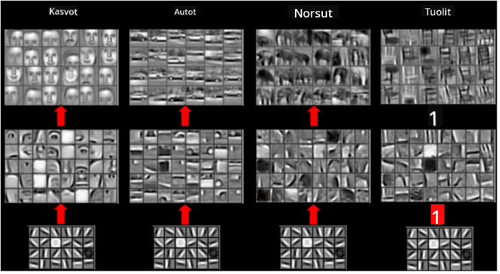

<!--
CO_OP_TRANSLATOR_METADATA:
{
  "original_hash": "088837b42b7d99198bf62db8a42411e0",
  "translation_date": "2025-08-28T19:23:38+00:00",
  "source_file": "lessons/4-ComputerVision/07-ConvNets/README.md",
  "language_code": "fi"
}
-->
# Konvoluutionaaliset Neuroverkot

Olemme aiemmin nähneet, että neuroverkot ovat varsin hyviä käsittelemään kuvia, ja jopa yksikerroksinen perceptron pystyy tunnistamaan käsinkirjoitettuja numeroita MNIST-datasta kohtuullisella tarkkuudella. MNIST-datasetti on kuitenkin hyvin erityinen, sillä kaikki numerot on keskitetty kuvan sisälle, mikä tekee tehtävästä yksinkertaisemman.

## [Esiluentavisa](https://red-field-0a6ddfd03.1.azurestaticapps.net/quiz/107)

Todellisessa elämässä haluamme pystyä tunnistamaan esineitä kuvasta niiden tarkasta sijainnista riippumatta. Tietokonenäkö eroaa yleisestä luokittelusta, koska kun yritämme löytää tiettyä esinettä kuvasta, skannaamme kuvaa etsiessämme tiettyjä **kuvioita** ja niiden yhdistelmiä. Esimerkiksi, kun etsimme kissaa, voimme ensin etsiä vaakasuoria viivoja, jotka voivat muodostaa viikset, ja sitten tietty viiksien yhdistelmä voi kertoa meille, että kyseessä on kuva kissasta. Tiettyjen kuvioiden suhteellinen sijainti ja läsnäolo ovat tärkeitä, eivät niiden tarkka sijainti kuvassa.

Kuvioiden tunnistamiseen käytämme **konvoluutiokernoja**. Kuten tiedät, kuva esitetään 2D-matriisina tai 3D-tensorina värisyvyyden kanssa. Suodattimen soveltaminen tarkoittaa, että otamme suhteellisen pienen **suodatinytimen** matriisin, ja laskemme alkuperäisen kuvan jokaiselle pikselille painotetun keskiarvon naapuripisteiden kanssa. Voimme ajatella tämän olevan kuin pieni ikkuna, joka liukuu koko kuvan yli ja tasoittaa kaikki pikselit suodatinytimen matriisin painojen mukaan.

 | 
----|----

> Kuva: Dmitry Soshnikov

Esimerkiksi, jos sovellamme 3x3 pystysuuntaista ja vaakasuuntaista reunasuodatinta MNIST-numeroihin, voimme korostaa (esim. saada korkeita arvoja) kohtia, joissa alkuperäisessä kuvassa on pystysuuntaisia ja vaakasuuntaisia reunoja. Näin ollen näitä kahta suodatinta voidaan käyttää "etsimään" reunoja. Samalla tavalla voimme suunnitella erilaisia suodattimia etsimään muita matalan tason kuvioita:

> Kuva [Leung-Malik-suodatinpankista](https://www.robots.ox.ac.uk/~vgg/research/texclass/filters.html)

Vaikka voimme suunnitella suodattimia manuaalisesti tiettyjen kuvioiden tunnistamiseen, voimme myös suunnitella verkon siten, että se oppii kuviot automaattisesti. Tämä on yksi CNN:n keskeisistä ideoista.

## CNN:n pääideat

CNN:ien toiminta perustuu seuraaviin tärkeisiin ideoihin:

* Konvoluutiokernot voivat tunnistaa kuvioita
* Voimme suunnitella verkon siten, että suodattimet koulutetaan automaattisesti
* Voimme käyttää samaa lähestymistapaa löytääksemme kuvioita korkeamman tason ominaisuuksista, ei vain alkuperäisestä kuvasta. Näin CNN:n ominaisuuksien tunnistus toimii hierarkiana, alkaen matalan tason pikseliyhdistelmistä ja päätyen korkeamman tason kuvien osien yhdistelmiin.

> Kuva [Hislop-Lynchin artikkelista](https://www.semanticscholar.org/paper/Computer-vision-based-pedestrian-trajectory-Hislop-Lynch/26e6f74853fc9bbb7487b06dc2cf095d36c9021d), perustuen [heidän tutkimukseensa](https://dl.acm.org/doi/abs/10.1145/1553374.1553453)

## ✍️ Harjoitukset: Konvoluutionaaliset Neuroverkot

Jatketaan tutkimista, miten konvoluutionaaliset neuroverkot toimivat ja miten voimme saavuttaa koulutettavat suodattimet, työstämällä vastaavia muistikirjoja:

* [Konvoluutionaaliset Neuroverkot - PyTorch](ConvNetsPyTorch.ipynb)
* [Konvoluutionaaliset Neuroverkot - TensorFlow](ConvNetsTF.ipynb)

## Pyramidirakenne

Useimmat kuvankäsittelyyn käytettävät CNN:t noudattavat niin kutsuttua pyramidirakennetta. Ensimmäinen alkuperäisiin kuviin sovellettu konvoluutiokerros sisältää tyypillisesti suhteellisen vähän suodattimia (8-16), jotka vastaavat erilaisia pikseliyhdistelmiä, kuten vaakasuoria/pystysuoria viivoja tai vetoja. Seuraavalla tasolla pienennämme verkon spatiaalista ulottuvuutta ja lisäämme suodattimien määrää, mikä vastaa yksinkertaisten ominaisuuksien monimutkaisempia yhdistelmiä. Jokaisella kerroksella, kun siirrymme kohti lopullista luokittelijaa, kuvan spatiaalinen ulottuvuus pienenee ja suodattimien määrä kasvaa.

Esimerkiksi tarkastellaan VGG-16-arkkitehtuuria, verkkoa, joka saavutti 92,7 % tarkkuuden ImageNetin top-5-luokittelussa vuonna 2014:

> Kuva [Researchgatesta](https://www.researchgate.net/figure/Vgg16-model-structure-To-get-the-VGG-NIN-model-we-replace-the-2-nd-4-th-6-th-7-th_fig2_335194493)

## Tunnetuimmat CNN-arkkitehtuurit

[Jatka opiskelua tunnetuimmista CNN-arkkitehtuureista](CNN_Architectures.md)

---

**Vastuuvapauslauseke**:  
Tämä asiakirja on käännetty käyttämällä tekoälypohjaista käännöspalvelua [Co-op Translator](https://github.com/Azure/co-op-translator). Vaikka pyrimme tarkkuuteen, huomioithan, että automaattiset käännökset voivat sisältää virheitä tai epätarkkuuksia. Alkuperäistä asiakirjaa sen alkuperäisellä kielellä tulisi pitää ensisijaisena lähteenä. Kriittisen tiedon osalta suositellaan ammattimaista ihmiskäännöstä. Emme ole vastuussa väärinkäsityksistä tai virhetulkinnoista, jotka johtuvat tämän käännöksen käytöstä.