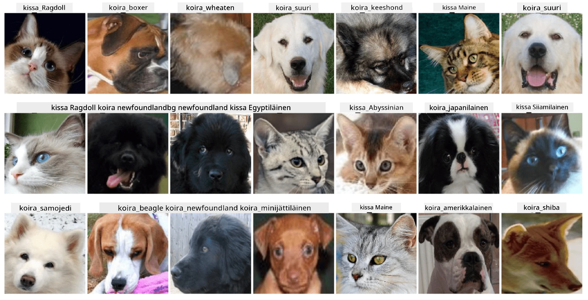

# Lemmikkien kasvojen luokittelu

Lab-tehtävä [AI for Beginners Curriculum](https://github.com/microsoft/ai-for-beginners) -materiaalista.

## Tehtävä

Kuvittele, että sinun täytyy kehittää sovellus lemmikkien hoitolalle kaikkien lemmikkien luetteloimiseen. Yksi tällaisen sovelluksen hienoista ominaisuuksista olisi rodun automaattinen tunnistaminen valokuvasta. Tämä voidaan onnistuneesti toteuttaa käyttämällä neuroverkkoja.

Sinun tulee kouluttaa konvoluutio-neuroverkko luokittelemaan eri kissojen ja koirien rodut käyttäen **Pet Faces** -datakokonaisuutta.

## Datakokonaisuus

Käytämme [Oxford-IIIT Pet Dataset](https://www.robots.ox.ac.uk/~vgg/data/pets/) -datakokonaisuutta, joka sisältää kuvia 37 eri koira- ja kissarodusta.



Ladataksesi datakokonaisuuden, käytä tätä koodinpätkää:

```python
!wget https://thor.robots.ox.ac.uk/~vgg/data/pets/images.tar.gz
!tar xfz images.tar.gz
!rm images.tar.gz
```

**Huom:** Oxford-IIIT Pet Dataset -kuvat on järjestetty tiedostonimen mukaan (esim. `Abyssinian_1.jpg`, `Bengal_2.jpg`). Notebook sisältää koodin, joka järjestää nämä kuvat rotukohtaisiin alikansioihin helpottamaan luokittelua.

## Aloitus Notebook

Aloita lab-tehtävä avaamalla [PetFaces.ipynb](PetFaces.ipynb)

## Oppimiskokemus

Olet ratkaissut suhteellisen monimutkaisen kuvaluokittelutehtävän alusta alkaen! Luokkia oli melko paljon, ja silti pystyit saavuttamaan kohtuullisen tarkkuuden! On myös järkevää mitata top-k-tarkkuutta, koska joidenkin luokkien erottaminen voi olla vaikeaa jopa ihmisille, jos erot eivät ole selkeitä.

---

**Vastuuvapauslauseke**:  
Tämä asiakirja on käännetty käyttämällä tekoälypohjaista käännöspalvelua [Co-op Translator](https://github.com/Azure/co-op-translator). Vaikka pyrimme tarkkuuteen, huomioithan, että automaattiset käännökset voivat sisältää virheitä tai epätarkkuuksia. Alkuperäistä asiakirjaa sen alkuperäisellä kielellä tulisi pitää ensisijaisena lähteenä. Kriittisen tiedon osalta suositellaan ammattimaista ihmiskäännöstä. Emme ole vastuussa väärinkäsityksistä tai virhetulkinnoista, jotka johtuvat tämän käännöksen käytöstä.