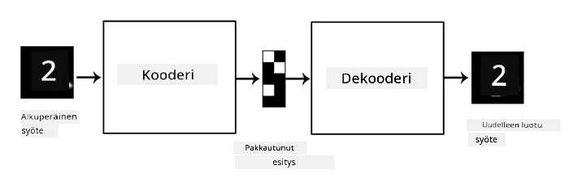
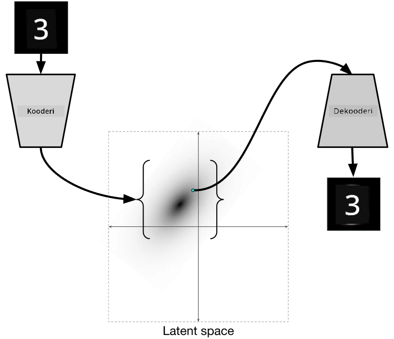

# Autokooderit

Kun koulutetaan CNN-verkkoja, yksi ongelmista on, että tarvitsemme paljon merkittyä dataa. Kuvien luokittelussa meidän täytyy jakaa kuvat eri luokkiin, mikä vaatii manuaalista työtä.

## [Ennakkokysely](https://ff-quizzes.netlify.app/en/ai/quiz/17)

Voimme kuitenkin haluta käyttää raakadataa (merkitsemätöntä) CNN-ominaisuuksien oppimiseen, mikä tunnetaan nimellä **itseohjautuva oppiminen**. Sen sijaan, että käyttäisimme luokkia, käytämme koulutuskuvia sekä verkon syötteenä että ulostulona. **Autokooderin** pääidea on, että meillä on **kooderiverkko**, joka muuntaa syötekuvan johonkin **latenttitilaan** (yleensä pienemmän kokoiseen vektoriin), ja sitten **dekooderiverkko**, jonka tehtävänä on rekonstruoida alkuperäinen kuva.

> ✅ [Autokooderi](https://wikipedia.org/wiki/Autoencoder) on "eräänlainen tekoälyverkko, jota käytetään oppimaan tehokkaita koodauksia merkitsemättömästä datasta."

Koska koulutamme autokooderia tallentamaan mahdollisimman paljon alkuperäisen kuvan informaatiota tarkkaa rekonstruointia varten, verkko pyrkii löytämään parhaan **upotuksen** syötekuville merkityksen tallentamiseksi.

> Kuva [Keras-blogista](https://blog.keras.io/building-autoencoders-in-keras.html)

## Autokooderien käyttöskenaariot

Vaikka alkuperäisten kuvien rekonstruointi ei itsessään vaikuta hyödylliseltä, on olemassa muutamia skenaarioita, joissa autokooderit ovat erityisen hyödyllisiä:

* **Kuvien dimensioiden pienentäminen visualisointia varten** tai **kuva-upotusten kouluttaminen**. Yleensä autokooderit antavat parempia tuloksia kuin PCA, koska ne ottavat huomioon kuvien spatiaalisen luonteen ja hierarkkiset ominaisuudet.
* **Kohinan poisto**, eli kohinan poistaminen kuvasta. Koska kohina sisältää paljon turhaa informaatiota, autokooderi ei pysty tallentamaan kaikkea suhteellisen pieneen latenttitilaan, ja näin se tallentaa vain kuvan tärkeät osat. Kohinanpoistajaa koulutettaessa käytämme alkuperäisiä kuvia ja syötämme autokooderille kuvia, joihin on lisätty keinotekoisesti kohinaa.
* **Superresoluutio**, eli kuvan resoluution parantaminen. Aloitamme korkearesoluutioisilla kuvilla ja käytämme matalamman resoluution kuvaa autokooderin syötteenä.
* **Generatiiviset mallit**. Kun autokooderi on koulutettu, dekooderiosaa voidaan käyttää uusien objektien luomiseen satunnaisista latenttivektoreista.

## Variatiiviset autokooderit (VAE)

Perinteiset autokooderit pienentävät syötteen datan dimensioita jollain tavalla, tunnistaen syötekuvien tärkeät ominaisuudet. Latenttivektorit eivät kuitenkaan usein ole kovin merkityksellisiä. Esimerkiksi MNIST-datasetin tapauksessa ei ole helppoa selvittää, mitkä numerot vastaavat eri latenttivektoreita, koska lähekkäiset latenttivektorit eivät välttämättä vastaa samoja numeroita.

Generatiivisten mallien kouluttamisessa on kuitenkin hyödyllistä ymmärtää latenttitilaa. Tämä idea johtaa meidät **variatiiviseen autokooderiin** (VAE).

VAE on autokooderi, joka oppii ennustamaan latenttiparametrien *tilastollisen jakauman*, niin kutsutun **latenttijakauman**. Esimerkiksi voimme haluta, että latenttivektorit jakautuvat normaalisti jonkin keskiarvon zmean ja keskihajonnan zsigma mukaan (sekä keskiarvo että keskihajonta ovat vektoreita, joiden dimensio on d). VAE:n kooderi oppii ennustamaan nämä parametrit, ja dekooderi ottaa satunnaisen vektorin tästä jakaumasta rekonstruoidakseen objektin.

Yhteenveto:

 * Syötevektorista ennustamme `z_mean` ja `z_log_sigma` (sen sijaan, että ennustaisimme keskihajonnan suoraan, ennustamme sen logaritmin)
 * Otamme näytteen `sample` jakaumasta N(zmean,exp(zlog\_sigma))
 * Dekooderi yrittää dekoodata alkuperäisen kuvan käyttäen `sample`-vektoria syötteenä

 

> Kuva [tästä blogikirjoituksesta](https://ijdykeman.github.io/ml/2016/12/21/cvae.html) kirjoittanut Isaak Dykeman

Variatiiviset autokooderit käyttävät monimutkaista häviöfunktiota, joka koostuu kahdesta osasta:

* **Rekonstruktiotappio** on häviöfunktio, joka osoittaa, kuinka lähellä rekonstruoitu kuva on kohdetta (se voi olla esimerkiksi Mean Squared Error eli MSE). Se on sama häviöfunktio kuin tavallisissa autokoodereissa.
* **KL-tappio**, joka varmistaa, että latenttimuuttujien jakauma pysyy lähellä normaalia jakaumaa. Se perustuu [Kullback-Leiblerin divergenssiin](https://www.countbayesie.com/blog/2017/5/9/kullback-leibler-divergence-explained) - metriikkaan, joka arvioi, kuinka samanlaisia kaksi tilastollista jakaumaa ovat.

Yksi tärkeä etu VAE:ssa on, että niiden avulla voidaan luoda uusia kuvia suhteellisen helposti, koska tiedämme, mistä jakaumasta voimme ottaa näytteitä latenttivektoreille. Esimerkiksi, jos koulutamme VAE:n 2D-latenttivektorilla MNIST-datasetilla, voimme sitten muuttaa latenttivektorin komponentteja saadaksemme eri numeroita:

> Kuva [Dmitry Soshnikovilta](http://soshnikov.com)

Huomaa, kuinka kuvat sulautuvat toisiinsa, kun alamme saada latenttivektoreita eri osista latenttiparametritilaa. Voimme myös visualisoida tämän tilan 2D-muodossa:

 

> Kuva [Dmitry Soshnikovilta](http://soshnikov.com)

## ✍️ Harjoitukset: Autokooderit

Tutustu autokoodereihin näissä vastaavissa muistikirjoissa:

* [Autokooderit TensorFlow:ssa](AutoencodersTF.ipynb)
* [Autokooderit PyTorch:ssa](AutoEncodersPyTorch.ipynb)

## Autokooderien ominaisuudet

* **Dataan sidottu** - ne toimivat hyvin vain sen tyyppisten kuvien kanssa, joilla ne on koulutettu. Esimerkiksi, jos koulutamme superresoluutiomallin kukilla, se ei toimi hyvin muotokuvilla. Tämä johtuu siitä, että verkko voi tuottaa korkearesoluutioisen kuvan ottamalla hienoja yksityiskohtia ominaisuuksista, jotka on opittu koulutusdatasta.
* **Häviöllinen** - rekonstruoitu kuva ei ole sama kuin alkuperäinen kuva. Häviön luonne määritellään koulutuksessa käytetyn *häviöfunktion* mukaan.
* Toimii **merkitsemättömällä datalla**

## [Jälkikysely](https://ff-quizzes.netlify.app/en/ai/quiz/18)

## Yhteenveto

Tässä oppitunnissa opit erilaisista autokooderityypeistä, joita tekoälytutkija voi käyttää. Opit, kuinka niitä rakennetaan ja kuinka niitä käytetään kuvien rekonstruointiin. Opit myös VAE:sta ja sen käytöstä uusien kuvien luomiseen.

## 🚀 Haaste

Tässä oppitunnissa opit käyttämään autokoodereita kuvien kanssa. Mutta niitä voidaan käyttää myös musiikin kanssa! Tutustu Magenta-projektin [MusicVAE](https://magenta.tensorflow.org/music-vae) -projektiin, joka käyttää autokoodereita musiikin rekonstruointiin. Tee joitakin [kokeiluja](https://colab.research.google.com/github/magenta/magenta-demos/blob/master/colab-notebooks/Multitrack_MusicVAE.ipynb) tämän kirjaston kanssa ja katso, mitä voit luoda.

## [Jälkikysely](https://ff-quizzes.netlify.app/en/ai/quiz/16)

## Kertaus ja itseopiskelu

Lisätietoja autokoodereista löydät näistä lähteistä:

* [Autokooderien rakentaminen Kerasilla](https://blog.keras.io/building-autoencoders-in-keras.html)
* [Blogikirjoitus NeuroHivessa](https://neurohive.io/ru/osnovy-data-science/variacionnyj-avtojenkoder-vae/)
* [Variatiiviset autokooderit selitettynä](https://kvfrans.com/variational-autoencoders-explained/)
* [Ehdolliset variatiiviset autokooderit](https://ijdykeman.github.io/ml/2016/12/21/cvae.html)

## Tehtävä

[TensorFlow-muistikirjan](AutoencodersTF.ipynb) lopussa löydät "tehtävän" - käytä tätä tehtävänäsi.

---

