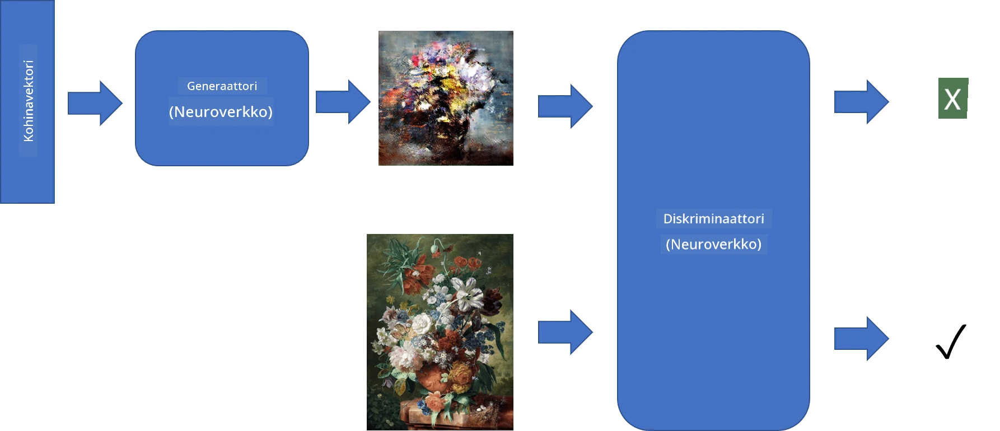
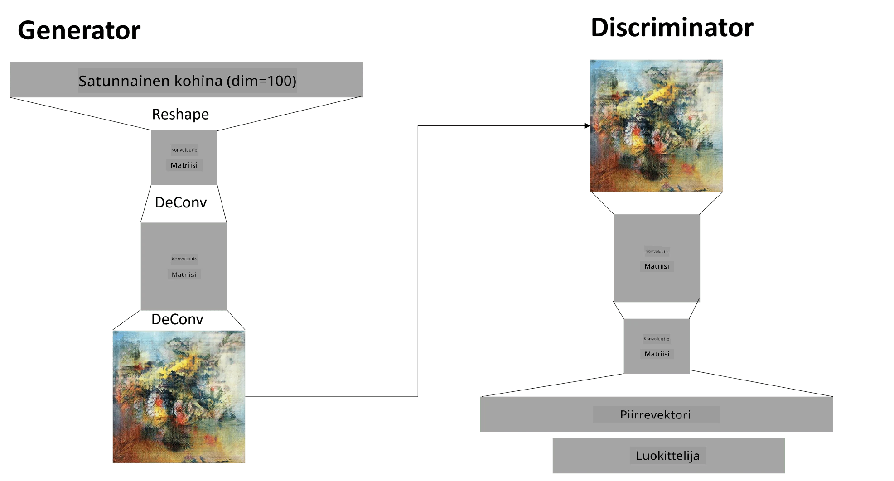

# Generatiiviset vastakkaiset verkot

Edellisessä osiossa opimme **generatiivisista malleista**: malleista, jotka voivat luoda uusia kuvia, jotka muistuttavat koulutusdatan kuvia. VAE oli hyvä esimerkki generatiivisesta mallista.

## [Ennakkokysely](https://ff-quizzes.netlify.app/en/ai/quiz/19)

Kuitenkin, jos yritämme luoda jotain todella merkityksellistä, kuten maalauksen kohtuullisella resoluutiolla, VAE:lla huomaamme, että koulutus ei etene hyvin. Tätä käyttötarkoitusta varten meidän tulisi oppia toinen arkkitehtuuri, joka on erityisesti suunnattu generatiivisiin malleihin - **Generatiiviset vastakkaiset verkot**, eli GANit.

GANin pääidea on käyttää kahta neuroverkkoa, jotka koulutetaan toisiaan vastaan:

> Kuva: [Dmitry Soshnikov](http://soshnikov.com)

> ✅ Pieni sanasto:
> * **Generaattori** on verkko, joka ottaa satunnaisen vektorin ja tuottaa kuvan tuloksena.
> * **Diskriminaattori** on verkko, joka ottaa kuvan ja pyrkii määrittämään, onko se oikea kuva (koulutusdatasta) vai generaattorin tuottama. Se on pohjimmiltaan kuvien luokittelija.

### Diskriminaattori

Diskriminaattorin arkkitehtuuri ei eroa tavallisesta kuvien luokitteluun tarkoitetusta verkosta. Yksinkertaisimmillaan se voi olla täysin yhdistetty luokittelija, mutta todennäköisimmin se on [konvoluutioverkko](../07-ConvNets/README.md).

> ✅ GAN, joka perustuu konvoluutioverkkoihin, kutsutaan nimellä [DCGAN](https://arxiv.org/pdf/1511.06434.pdf)

CNN-diskriminaattori koostuu seuraavista kerroksista: useita konvoluutioita+poolauksia (joilla pienennetään spatiaalista kokoa) ja yksi tai useampi täysin yhdistetty kerros, joka tuottaa "piirrevektorin", lopuksi binääriluokittelija.

> ✅ 'Poolaus' tässä yhteydessä tarkoittaa tekniikkaa, joka pienentää kuvan kokoa. "Poolauskerrokset pienentävät datan dimensioita yhdistämällä yhden kerroksen neuroniryhmien tulokset yhdeksi neuroniksi seuraavassa kerroksessa." - [lähde](https://wikipedia.org/wiki/Convolutional_neural_network#Pooling_layers)

### Generaattori

Generaattori on hieman monimutkaisempi. Voit ajatella sen olevan käänteinen diskriminaattori. Aloittaen latenttivektorista (piirrevektorin sijaan), siinä on täysin yhdistetty kerros, joka muuntaa sen vaadittuun kokoon/muotoon, jota seuraa dekonvoluutio+skaalaus. Tämä on samanlainen kuin [autokooderin](../09-Autoencoders/README.md) *dekooderi*-osa.

> ✅ Koska konvoluutiokerros toteutetaan lineaarisena suodattimena, joka kulkee kuvan läpi, dekonvoluutio on pohjimmiltaan samanlainen kuin konvoluutio ja voidaan toteuttaa samalla kerroslogiikalla.

> Kuva: [Dmitry Soshnikov](http://soshnikov.com)

### GANin koulutus

GANeja kutsutaan **vastakkaisiksi**, koska generaattorin ja diskriminaattorin välillä on jatkuva kilpailu. Tämän kilpailun aikana sekä generaattori että diskriminaattori parantavat suoritustaan, jolloin verkko oppii tuottamaan yhä parempia kuvia.

Koulutus tapahtuu kahdessa vaiheessa:

* **Diskriminaattorin koulutus**. Tämä tehtävä on melko suoraviivainen: generaattori tuottaa erän kuvia, jotka merkitään 0:ksi (väärennetty kuva), ja otetaan erä kuvia syöttödatasta (merkittynä 1:ksi, oikea kuva). Saamme jonkin *diskriminaattorihäviön* ja suoritamme takaisinkulun.
* **Generaattorin koulutus**. Tämä on hieman monimutkaisempaa, koska emme tiedä generaattorin odotettua tulosta suoraan. Otamme koko GAN-verkon, joka koostuu generaattorista ja diskriminaattorista, syötämme siihen satunnaisia vektoreita ja odotamme tuloksen olevan 1 (vastaa oikeita kuvia). Sitten jäädytämme diskriminaattorin parametrit (emme halua sen kouluttavan tässä vaiheessa) ja suoritamme takaisinkulun.

Tämän prosessin aikana sekä generaattorin että diskriminaattorin häviöt eivät laske merkittävästi. Ihannetilanteessa niiden tulisi värähdellä, mikä vastaa molempien verkkojen suorituskyvyn paranemista.

## ✍️ Harjoitukset: GANit

* [GAN-muistikirja TensorFlow/Kerasilla](GANTF.ipynb)
* [GAN-muistikirja PyTorchilla](GANPyTorch.ipynb)

### GANin koulutuksen ongelmat

GANit ovat tunnetusti erityisen vaikeita kouluttaa. Tässä muutamia ongelmia:

* **Mode Collapse**. Tällä termillä tarkoitetaan, että generaattori oppii tuottamaan yhden onnistuneen kuvan, joka huijaa diskriminaattoria, mutta ei monipuolista valikoimaa erilaisia kuvia.
* **Herkkä hyperparametreille**. Usein voi nähdä, että GAN ei konvergoi ollenkaan, ja sitten oppimisnopeuden äkillinen lasku johtaa konvergenssiin.
* **Tasapainon ylläpitäminen** generaattorin ja diskriminaattorin välillä. Monissa tapauksissa diskriminaattorin häviö voi pudota nollaan suhteellisen nopeasti, mikä johtaa siihen, että generaattori ei pysty enää kouluttautumaan. Tämän voittamiseksi voimme yrittää asettaa eri oppimisnopeudet generaattorille ja diskriminaattorille tai ohittaa diskriminaattorin koulutuksen, jos häviö on jo liian alhainen.
* Korkean resoluution **koulutus**. Sama ongelma kuin autokoodereilla, tämä ongelma syntyy, koska liian monen konvoluutiokerroksen rekonstruointi johtaa artefakteihin. Tämä ongelma ratkaistaan tyypillisesti niin sanotulla **progressiivisella kasvulla**, jossa ensin muutama kerros koulutetaan matalaresoluutioisilla kuvilla, ja sitten kerrokset "avataan" tai lisätään. Toinen ratkaisu olisi lisätä ylimääräisiä yhteyksiä kerrosten välillä ja kouluttaa useita resoluutioita samanaikaisesti - katso tämä [Multi-Scale Gradient GANs -paperi](https://arxiv.org/abs/1903.06048) saadaksesi lisätietoja.

## Tyylinsiirto

GANit ovat erinomainen tapa luoda taiteellisia kuvia. Toinen mielenkiintoinen tekniikka on niin sanottu **tyylinsiirto**, joka ottaa yhden **sisältökuvan** ja piirtää sen uudelleen eri tyylillä, soveltaen suodattimia **tyylikuvasta**.

Näin se toimii:
* Aloitamme satunnaisesta kohinakuvaasta (tai sisältökuvasta, mutta ymmärtämisen vuoksi on helpompi aloittaa satunnaisesta kohinasta).
* Tavoitteenamme on luoda sellainen kuva, joka olisi lähellä sekä sisältökuvaa että tyylikuvaa. Tämä määritetään kahdella häviöfunktiolla:
   - **Sisältöhäviö** lasketaan CNN:n tietyillä kerroksilla nykyisestä kuvasta ja sisältökuvasta saatujen piirteiden perusteella.
   - **Tyylihäviö** lasketaan nykyisen kuvan ja tyylikuvan välillä älykkäällä tavalla käyttämällä Gram-matriiseja (lisätietoja [esimerkkimuistikirjassa](StyleTransfer.ipynb)).
* Jotta kuva olisi tasaisempi ja poistaisi kohinaa, lisäämme myös **Variation loss** -häviön, joka laskee keskimääräisen etäisyyden vierekkäisten pikselien välillä.
* Pääoptimointisilmukka säätää nykyistä kuvaa käyttämällä gradienttilaskentaa (tai jotain muuta optimointialgoritmia) minimoidakseen kokonaishäviön, joka on kaikkien kolmen häviön painotettu summa.

## ✍️ Esimerkki: [Tyylinsiirto](StyleTransfer.ipynb)

## [Jälkikysely](https://ff-quizzes.netlify.app/en/ai/quiz/20)

## Yhteenveto

Tässä oppitunnissa opit GANeista ja niiden kouluttamisesta. Opit myös erityisistä haasteista, joita tämä neuroverkkojen tyyppi voi kohdata, sekä strategioista niiden voittamiseksi.

## 🚀 Haaste

Käy läpi [Tyylinsiirto-muistikirja](StyleTransfer.ipynb) käyttäen omia kuviasi.

## Kertaus ja itseopiskelu

Lisätietoja GANeista löydät näistä lähteistä:

* Marco Pasini, [10 Lessons I Learned Training GANs for one Year](https://towardsdatascience.com/10-lessons-i-learned-training-generative-adversarial-networks-gans-for-a-year-c9071159628)
* [StyleGAN](https://en.wikipedia.org/wiki/StyleGAN), *de facto* GAN-arkkitehtuuri harkittavaksi
* [Creating Generative Art using GANs on Azure ML](https://soshnikov.com/scienceart/creating-generative-art-using-gan-on-azureml/)

## Tehtävä

Palaa johonkin tämän oppitunnin kahdesta muistikirjasta ja kouluta GAN omilla kuvillasi. Mitä voit luoda?

---

