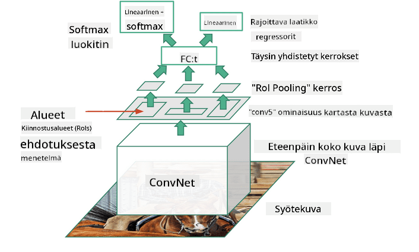
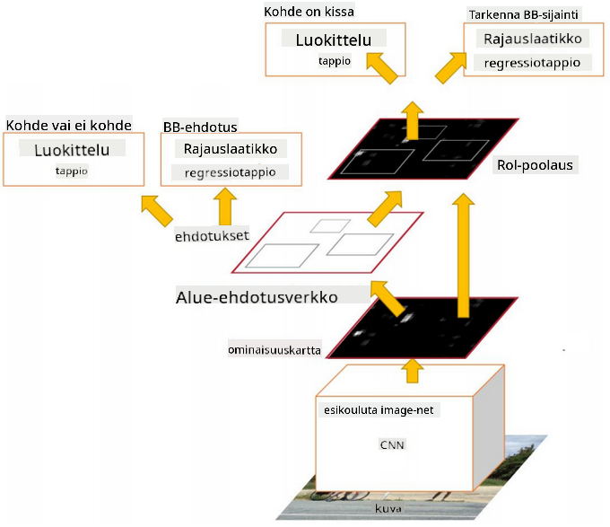

<!--
CO_OP_TRANSLATOR_METADATA:
{
  "original_hash": "d85c8b08f6d1b48fd7f35b99f93c1138",
  "translation_date": "2025-08-28T19:31:39+00:00",
  "source_file": "lessons/4-ComputerVision/11-ObjectDetection/README.md",
  "language_code": "fi"
}
-->
# Kohteiden Tunnistus

Kuvien luokittelumallit, joita olemme tähän mennessä käsitelleet, ottavat kuvan ja tuottavat kategorisen tuloksen, kuten luokan 'numero' MNIST-ongelmassa. Monissa tapauksissa emme kuitenkaan halua vain tietää, että kuva esittää kohteita – haluamme pystyä määrittämään niiden tarkka sijainti. Juuri tähän **kohteiden tunnistus** keskittyy.

## [Pre-lecture quiz](https://red-field-0a6ddfd03.1.azurestaticapps.net/quiz/111)

> Kuva [YOLO v2 -verkkosivustolta](https://pjreddie.com/darknet/yolov2/)

## Naiivi Lähestymistapa Kohteiden Tunnistukseen

Oletetaan, että haluaisimme löytää kissan kuvasta. Hyvin yksinkertainen lähestymistapa kohteiden tunnistukseen voisi olla seuraava:

1. Pilko kuva useisiin ruutuihin.
2. Suorita kuvien luokittelu jokaisessa ruudussa.
3. Ruutuja, jotka tuottavat riittävän korkean aktivoinnin, voidaan pitää sisältävän halutun kohteen.

> *Kuva [Harjoitusmuistikirjasta](ObjectDetection-TF.ipynb)*

Tämä lähestymistapa on kuitenkin kaukana ihanteellisesta, koska se sallii algoritmin paikantaa kohteen rajauslaatikon hyvin epätarkasti. Tarkempaa sijaintia varten meidän täytyy suorittaa jonkinlainen **regressio** ennustamaan rajauslaatikoiden koordinaatit – ja tätä varten tarvitsemme erityisiä tietoaineistoja.

## Regressio Kohteiden Tunnistukseen

[Tämä blogikirjoitus](https://towardsdatascience.com/object-detection-with-neural-networks-a4e2c46b4491) tarjoaa hyvän johdannon muotojen tunnistamiseen.

## Kohteiden Tunnistuksen Tietoaineistot

Tässä tehtävässä saatat törmätä seuraaviin tietoaineistoihin:

* [PASCAL VOC](http://host.robots.ox.ac.uk/pascal/VOC/) – 20 luokkaa
* [COCO](http://cocodataset.org/#home) – Common Objects in Context. 80 luokkaa, rajauslaatikot ja segmentointimaskit

## Kohteiden Tunnistuksen Mittarit

### Intersection over Union

Kuvien luokittelussa algoritmin suorituskyvyn mittaaminen on helppoa, mutta kohteiden tunnistuksessa meidän täytyy mitata sekä luokan oikeellisuus että ennustetun rajauslaatikon sijainnin tarkkuus. Jälkimmäistä varten käytämme niin kutsuttua **Intersection over Union** (IoU) -mittaria, joka mittaa, kuinka hyvin kaksi laatikkoa (tai kaksi mielivaltaista aluetta) menevät päällekkäin.

> *Kuva 2 [tästä erinomaisesta IoU-blogikirjoituksesta](https://pyimagesearch.com/2016/11/07/intersection-over-union-iou-for-object-detection/)*

Idea on yksinkertainen – jaamme kahden kuvion leikkausalueen niiden yhdistymisalueella. Kahdelle identtiselle alueelle IoU olisi 1, kun taas täysin erillisille alueille se olisi 0. Muuten se vaihtelee välillä 0–1. Yleensä otamme huomioon vain ne rajauslaatikot, joiden IoU ylittää tietyn arvon.

### Keskiarvoinen Tarkkuus

Oletetaan, että haluamme mitata, kuinka hyvin tietty kohdeluokka $C$ tunnistetaan. Tätä varten käytämme **Keskiarvoinen Tarkkuus** -mittaria, joka lasketaan seuraavasti:

1. Tarkastellaan Precision-Recall-käyrää, joka näyttää tarkkuuden havaintokynnyksen arvon (0–1) mukaan.
2. Kynnyksen mukaan saamme enemmän tai vähemmän havaittuja kohteita kuvassa sekä erilaisia tarkkuuden ja palautteen arvoja.
3. Käyrä näyttää tältä:

> *Kuva [NeuroWorkshopista](http://github.com/shwars/NeuroWorkshop)*

Keskiarvoinen tarkkuus tietylle luokalle $C$ on tämän käyrän alla oleva alue. Tarkemmin sanottuna Recall-akseli jaetaan yleensä 10 osaan, ja tarkkuus keskiarvoistetaan kaikissa näissä pisteissä:

$$
AP = {1\over11}\sum_{i=0}^{10}\mbox{Precision}(\mbox{Recall}={i\over10})
$$

### AP ja IoU

Otamme huomioon vain ne havainnot, joiden IoU ylittää tietyn arvon. Esimerkiksi PASCAL VOC -tietoaineistossa yleensä $\mbox{IoU Threshold} = 0.5$, kun taas COCO:ssa AP mitataan eri $\mbox{IoU Threshold}$-arvoille.

> *Kuva [NeuroWorkshopista](http://github.com/shwars/NeuroWorkshop)*

### Keskiarvoinen Tarkkuus Kaikkien Luokkien Yli – mAP

Kohteiden tunnistuksen päämittari on **Keskiarvoinen Tarkkuus Kaikkien Luokkien Yli**, eli **mAP**. Se on keskiarvoinen tarkkuus, keskiarvoistettuna kaikkien kohdeluokkien yli, ja joskus myös $\mbox{IoU Threshold}$-arvojen yli. Tarkempi kuvaus **mAP**-laskentaprosessista löytyy
[tästä blogikirjoituksesta](https://medium.com/@timothycarlen/understanding-the-map-evaluation-metric-for-object-detection-a07fe6962cf3)) sekä [täältä koodiesimerkkien kanssa](https://gist.github.com/tarlen5/008809c3decf19313de216b9208f3734).

## Erilaiset Kohteiden Tunnistusmenetelmät

Kohteiden tunnistusalgoritmit voidaan jakaa kahteen pääluokkaan:

* **Alue-ehdotusverkot** (R-CNN, Fast R-CNN, Faster R-CNN). Pääidea on luoda **kiinnostusalueita** (ROI) ja ajaa CNN niiden läpi etsimällä maksimiaktivointia. Tämä on hieman samanlainen kuin naiivi lähestymistapa, mutta ROI:t luodaan älykkäämmin. Yksi suurimmista haittapuolista tällaisissa menetelmissä on niiden hitaus, koska CNN-luokittelijaa täytyy ajaa kuvan läpi monta kertaa.
* **Yhden passin** (YOLO, SSD, RetinaNet) menetelmät. Näissä arkkitehtuureissa verkko suunnitellaan ennustamaan sekä luokat että ROI:t yhdellä passilla.

### R-CNN: Aluepohjainen CNN

[R-CNN](http://islab.ulsan.ac.kr/files/announcement/513/rcnn_pami.pdf) käyttää [Selective Search](http://www.huppelen.nl/publications/selectiveSearchDraft.pdf) -menetelmää luodakseen hierarkkisen rakenteen ROI-alueista, jotka sitten kulkevat CNN-ominaisuuksien erottelijoiden ja SVM-luokittelijoiden läpi määrittämään kohdeluokan sekä lineaarisen regression määrittämään *rajauslaatikon* koordinaatit. [Virallinen artikkeli](https://arxiv.org/pdf/1506.01497v1.pdf)

> *Kuva van de Sande et al. ICCV’11*

> *Kuvat [tästä blogista](https://towardsdatascience.com/r-cnn-fast-r-cnn-faster-r-cnn-yolo-object-detection-algorithms-36d53571365e)*

### F-RCNN – Fast R-CNN

Tämä lähestymistapa on samanlainen kuin R-CNN, mutta alueet määritellään vasta konvoluutiokerrosten soveltamisen jälkeen.

> Kuva [virallisesta artikkelista](https://www.cv-foundation.org/openaccess/content_iccv_2015/papers/Girshick_Fast_R-CNN_ICCV_2015_paper.pdf), [arXiv](https://arxiv.org/pdf/1504.08083.pdf), 2015

### Faster R-CNN

Tämän lähestymistavan pääidea on käyttää neuroverkkoa ennustamaan ROI:t – niin kutsuttu *Region Proposal Network*. [Artikkeli](https://arxiv.org/pdf/1506.01497.pdf), 2016

> Kuva [virallisesta artikkelista](https://arxiv.org/pdf/1506.01497.pdf)

### R-FCN: Aluepohjainen Täysin Konvoluutioverkko

Tämä algoritmi on jopa nopeampi kuin Faster R-CNN. Pääidea on seuraava:

1. Ominaisuudet erotellaan ResNet-101:llä.
2. Ominaisuudet käsitellään **Position-Sensitive Score Map** -kartalla. Jokainen kohde luokasta $C$ jaetaan $k\times k$ alueisiin, ja verkkoa koulutetaan ennustamaan kohteiden osia.
3. Jokaiselle osalle $k\times k$ alueista kaikki verkot äänestävät kohdeluokista, ja kohdeluokka, jolla on eniten ääniä, valitaan.

> Kuva [virallisesta artikkelista](https://arxiv.org/abs/1605.06409)

### YOLO – You Only Look Once

YOLO on reaaliaikainen yhden passin algoritmi. Pääidea on seuraava:

 * Kuva jaetaan $S\times S$ alueisiin.
 * Jokaiselle alueelle **CNN** ennustaa $n$ mahdollista kohdetta, *rajauslaatikon* koordinaatit ja *luottamus*=*todennäköisyys* * IoU.

 

> Kuva [virallisesta artikkelista](https://arxiv.org/abs/1506.02640)

### Muut Algoritmit

* RetinaNet: [virallinen artikkeli](https://arxiv.org/abs/1708.02002)
   - [PyTorch-toteutus Torchvisionissa](https://pytorch.org/vision/stable/_modules/torchvision/models/detection/retinanet.html)
   - [Keras-toteutus](https://github.com/fizyr/keras-retinanet)
   - [Kohteiden tunnistus RetinaNetillä](https://keras.io/examples/vision/retinanet/) Keras-esimerkeissä
* SSD (Single Shot Detector): [virallinen artikkeli](https://arxiv.org/abs/1512.02325)

## ✍️ Harjoitukset: Kohteiden Tunnistus

Jatka oppimista seuraavassa muistikirjassa:

[ObjectDetection.ipynb](ObjectDetection.ipynb)

## Yhteenveto

Tässä oppitunnissa tutustuit moniin eri tapoihin, joilla kohteiden tunnistus voidaan toteuttaa!

## 🚀 Haaste

Lue nämä artikkelit ja muistikirjat YOLO:sta ja kokeile niitä itse:

* [Hyvä blogikirjoitus](https://www.analyticsvidhya.com/blog/2018/12/practical-guide-object-detection-yolo-framewor-python/) YOLO:sta
 * [Virallinen sivusto](https://pjreddie.com/darknet/yolo/)
 * Yolo: [Keras-toteutus](https://github.com/experiencor/keras-yolo2), [askel-askeleelta muistikirja](https://github.com/experiencor/basic-yolo-keras/blob/master/Yolo%20Step-by-Step.ipynb)
 * Yolo v2: [Keras-toteutus](https://github.com/experiencor/keras-yolo2), [askel-askeleelta muistikirja](https://github.com/experiencor/keras-yolo2/blob/master/Yolo%20Step-by-Step.ipynb)

## [Post-lecture quiz](https://red-field-0a6ddfd03.1.azurestaticapps.net/quiz/211)

## Kertaus & Itseopiskelu

* [Kohteiden Tunnistus](https://tjmachinelearning.com/lectures/1718/obj/) kirjoittanut Nikhil Sardana
* [Hyvä vertailu kohteiden tunnistusalgoritmeista](https://lilianweng.github.io/lil-log/2018/12/27/object-detection-part-4.html)
* [Katsaus syväoppimisalgoritmeihin kohteiden tunnistuksessa](https://medium.com/comet-app/review-of-deep-learning-algorithms-for-object-detection-c1f3d437b852)
* [Perusteellinen johdanto kohteiden tunnistusalgoritmeihin](https://www.analyticsvidhya.com/blog/2018/10/a-step-by-step-introduction-to-the-basic-object-detection-algorithms-part-1/)
* [Faster R-CNN:n toteutus Pythonilla kohteiden tunnistukseen](https://www.analyticsvidhya.com/blog/2018/11/implementation-faster-r-cnn-python-object-detection/)

## [Tehtävä: Kohteiden Tunnistus](lab/README.md)

---

**Vastuuvapauslauseke**:  
Tämä asiakirja on käännetty käyttämällä tekoälypohjaista käännöspalvelua [Co-op Translator](https://github.com/Azure/co-op-translator). Vaikka pyrimme tarkkuuteen, huomioithan, että automaattiset käännökset voivat sisältää virheitä tai epätarkkuuksia. Alkuperäinen asiakirja sen alkuperäisellä kielellä tulisi pitää ensisijaisena lähteenä. Kriittisen tiedon osalta suositellaan ammattimaista ihmiskäännöstä. Emme ole vastuussa väärinkäsityksistä tai virhetulkinnoista, jotka johtuvat tämän käännöksen käytöstä.