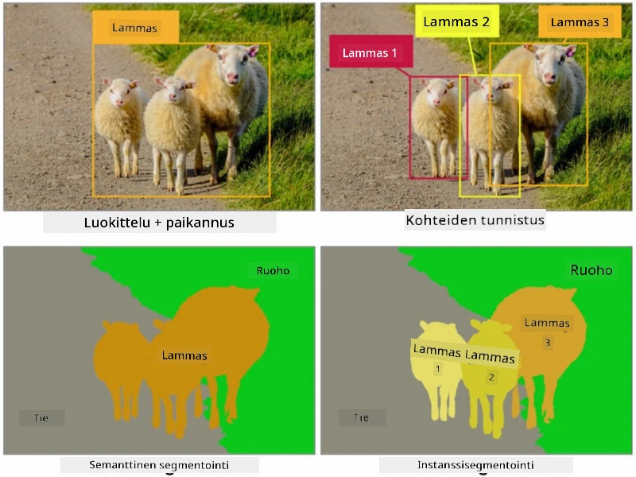

# Segmentointi

Olemme aiemmin oppineet objektien tunnistamisesta, joka mahdollistaa objektien paikantamisen kuvassa ennustamalla niiden *rajauslaatikot*. Joissakin tehtävissä emme kuitenkaan tarvitse pelkästään rajauslaatikoita, vaan myös tarkempaa objektien paikantamista. Tätä tehtävää kutsutaan **segmentoinniksi**.

## [Esiluentavisa](https://ff-quizzes.netlify.app/en/ai/quiz/23)

Segmentointi voidaan nähdä **pikseliluokitteluna**, jossa jokaiselle kuvan pikselille on ennustettava sen luokka (*tausta* on yksi luokista). Segmentointialgoritmit voidaan jakaa kahteen päätyyppiin:

* **Semanttinen segmentointi** kertoo vain pikselin luokan, mutta ei erottele saman luokan eri objekteja.
* **Instanssisegmentointi** jakaa luokat eri instansseihin.

Esimerkiksi instanssisegmentoinnissa nämä lampaat ovat eri objekteja, mutta semanttisessa segmentoinnissa kaikki lampaat kuuluvat yhteen luokkaan.

> Kuva [tästä blogikirjoituksesta](https://nirmalamurali.medium.com/image-classification-vs-semantic-segmentation-vs-instance-segmentation-625c33a08d50)

Segmentointiin on olemassa erilaisia neuroverkkoarkkitehtuureja, mutta niillä kaikilla on sama rakenne. Tietyllä tavalla se muistuttaa aiemmin oppimaasi autoenkooderia, mutta alkuperäisen kuvan purkamisen sijaan tavoitteena on purkaa **maski**. Segmentointiverkolla on seuraavat osat:

* **Kooderi** (Encoder) poimii piirteitä syötekuvasta.
* **Dekooderi** (Decoder) muuntaa nämä piirteet **maskikuvaksi**, jonka koko ja kanavien määrä vastaavat luokkien määrää.

> Kuva [tästä julkaisusta](https://arxiv.org/pdf/2001.05566.pdf)

Erityisesti on mainittava segmentoinnissa käytettävä häviöfunktio. Klassisia autoenkoodereita käytettäessä meidän on mitattava kahden kuvan samankaltaisuutta, ja tähän voidaan käyttää keskineliövirhettä (MSE). Segmentoinnissa kohdemaskikuvan jokainen pikseli edustaa luokkanumeroa (yksi-kuuma-koodattuna kolmannessa ulottuvuudessa), joten meidän on käytettävä luokitteluun tarkoitettuja häviöfunktioita - ristientropiahäviötä, joka on keskiarvoistettu kaikkien pikselien yli. Jos maski on binäärinen, käytetään **binääristä ristientropiahäviötä** (BCE).

> ✅ Yksi-kuuma-koodaus on tapa koodata luokkamerkki vektoriksi, jonka pituus vastaa luokkien määrää. Tutustu [tähän artikkeliin](https://datagy.io/sklearn-one-hot-encode/) saadaksesi lisätietoa tästä tekniikasta.

## Segmentointi lääketieteellisessä kuvantamisessa

Tässä oppitunnissa näemme segmentoinnin käytännössä kouluttamalla verkkoa tunnistamaan ihmisen luomia (tunnetaan myös nimellä "moolit") lääketieteellisistä kuvista. Käytämme <a href="https://www.fc.up.pt/addi/ph2%20database.html">PH2-tietokantaa</a>, joka sisältää dermoskopiakuvia. Tämä tietokanta sisältää 200 kuvaa kolmesta luokasta: tyypillinen luomi, epätyypillinen luomi ja melanooma. Kaikilla kuvilla on myös vastaava **maski**, joka rajaa luomen.

> ✅ Tämä tekniikka sopii erityisen hyvin tämän tyyppiseen lääketieteelliseen kuvantamiseen, mutta mitä muita tosielämän sovelluksia voisit kuvitella?

> Kuva PH2-tietokannasta

Koulutamme mallin segmentoimaan minkä tahansa luomen sen taustasta.

## ✍️ Harjoitukset: Semanttinen segmentointi

Avaa alla olevat muistikirjat oppiaksesi lisää erilaisista semanttisen segmentoinnin arkkitehtuureista, harjoittele niiden käyttöä ja näe ne toiminnassa.

* [Semanttinen segmentointi Pytorchilla](SemanticSegmentationPytorch.ipynb)
* [Semanttinen segmentointi TensorFlow'lla](SemanticSegmentationTF.ipynb)

## [Jälkiluentavisa](https://ff-quizzes.netlify.app/en/ai/quiz/24)

## Yhteenveto

Segmentointi on erittäin tehokas tekniikka kuvien luokittelussa, sillä se menee rajauslaatikoita pidemmälle ja mahdollistaa pikselitason luokittelun. Sitä käytetään lääketieteellisessä kuvantamisessa ja monissa muissa sovelluksissa.

## 🚀 Haaste

Kehon segmentointi on vain yksi yleisistä tehtävistä, joita voimme tehdä ihmisten kuvilla. Muita tärkeitä tehtäviä ovat **luurangon tunnistus** ja **asennon tunnistus**. Kokeile [OpenPose](https://github.com/CMU-Perceptual-Computing-Lab/openpose)-kirjastoa nähdäksesi, miten asennon tunnistusta voidaan käyttää.

## Kertaus ja itseopiskelu

Tämä [Wikipedia-artikkeli](https://wikipedia.org/wiki/Image_segmentation) tarjoaa hyvän yleiskatsauksen tämän tekniikan eri sovelluksista. Opi lisää itsenäisesti instanssisegmentoinnin ja panoptisen segmentoinnin alalajeista tässä tutkimuskentässä.

## [Tehtävä](lab/README.md)

Tässä laboratoriossa kokeile **ihmiskehon segmentointia** käyttäen [Segmentation Full Body MADS Dataset](https://www.kaggle.com/datasets/tapakah68/segmentation-full-body-mads-dataset) -aineistoa Kagglesta.

---

