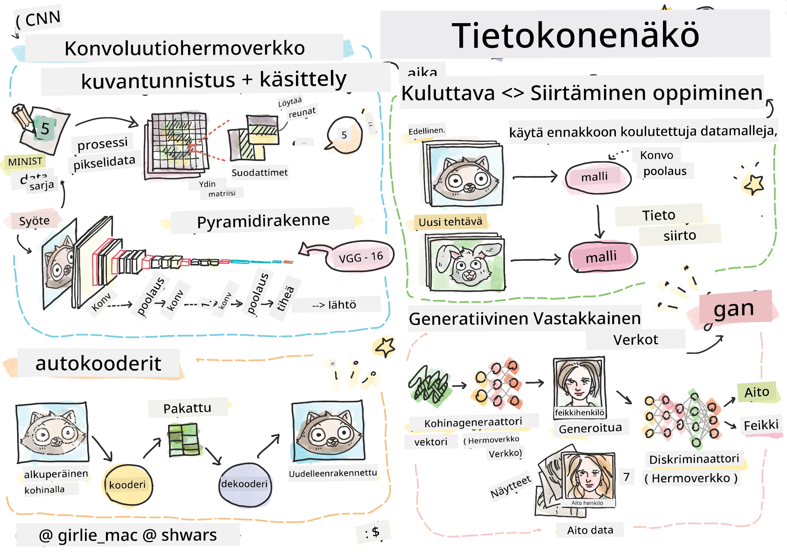

# Tietokonenäkö

Tässä osiossa opimme seuraavista aiheista:

* [Johdatus tietokonenäköön ja OpenCV:hen](06-IntroCV/README.md)
* [Konvoluutioverkot](07-ConvNets/README.md)
* [Esikoulutetut verkot ja siirto-oppiminen](08-TransferLearning/README.md) 
* [Autokooderit](09-Autoencoders/README.md)
* [Generatiiviset vastakkaisverkot](10-GANs/README.md)
* [Objektien tunnistus](11-ObjectDetection/README.md)
* [Semanttinen segmentointi](12-Segmentation/README.md)

---

**Vastuuvapauslauseke**:  
Tämä asiakirja on käännetty käyttämällä tekoälypohjaista käännöspalvelua [Co-op Translator](https://github.com/Azure/co-op-translator). Vaikka pyrimme tarkkuuteen, huomioithan, että automaattiset käännökset voivat sisältää virheitä tai epätarkkuuksia. Alkuperäistä asiakirjaa sen alkuperäisellä kielellä tulisi pitää ensisijaisena lähteenä. Kriittisen tiedon osalta suositellaan ammattimaista ihmiskäännöstä. Emme ole vastuussa tämän käännöksen käytöstä johtuvista väärinkäsityksistä tai virhetulkinnoista.