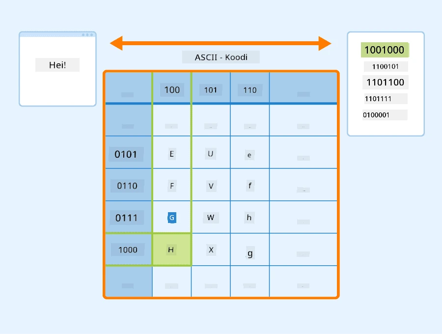
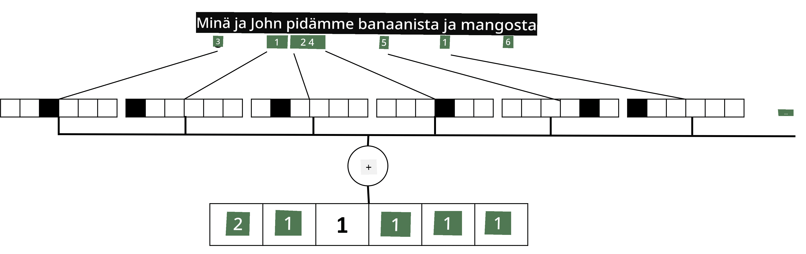

# Tekstin esittäminen tensoreina

## [Ennakkokysely](https://ff-quizzes.netlify.app/en/ai/quiz/25)

## Tekstin luokittelu

Tämän osion ensimmäisessä osassa keskitymme **tekstin luokittelutehtävään**. Käytämme [AG News](https://www.kaggle.com/amananandrai/ag-news-classification-dataset) -datakokonaisuutta, joka sisältää uutisartikkeleita, kuten seuraavan:

* Kategoria: Tiede/Teknologia
* Otsikko: Ky. Yhtiö voittaa apurahan peptidien tutkimiseen (AP)
* Teksti: AP - Kemian tutkijan perustama yritys Louisvillen yliopistossa voitti apurahan kehittääkseen...

Tavoitteenamme on luokitella uutinen yhteen kategorioista tekstin perusteella.

## Tekstin esittäminen

Jos haluamme ratkaista luonnollisen kielen käsittelyn (NLP) tehtäviä neuroverkoilla, meidän täytyy löytää tapa esittää teksti tensoreina. Tietokoneet esittävät tekstimerkit jo numeroina, jotka vastaavat näytöllä näkyviä fontteja, käyttäen esimerkiksi ASCII- tai UTF-8-koodauksia.

> [Kuvan lähde](https://www.seobility.net/en/wiki/ASCII)

Ihmisenä ymmärrämme, mitä kukin kirjain **edustaa**, ja miten kaikki merkit muodostavat lauseen sanat. Tietokoneet eivät kuitenkaan itsessään ymmärrä tätä, ja neuroverkon täytyy oppia merkitys koulutuksen aikana.

Siksi voimme käyttää erilaisia lähestymistapoja tekstin esittämiseen:

* **Merkki-tason esitys**, jossa teksti esitetään käsittelemällä jokaista merkkiä numerona. Jos tekstikorpuksessamme on *C* erilaista merkkiä, sana *Hello* esitetään 5x*C* tensorina. Jokainen kirjain vastaa tensorin saraketta one-hot-koodauksessa.
* **Sana-tason esitys**, jossa luomme **sanaston** kaikista tekstimme sanoista ja esittelemme sanat one-hot-koodauksella. Tämä lähestymistapa on jossain määrin parempi, koska yksittäisellä kirjaimella ei ole paljon merkitystä, ja käyttämällä korkeampia semanttisia käsitteitä - sanoja - yksinkertaistamme tehtävää neuroverkolle. Kuitenkin suuren sanaston koon vuoksi meidän täytyy käsitellä korkeadimensionaalisia harvoja tensoreita.

Riippumatta esitystavasta, meidän täytyy ensin muuntaa teksti **tokenien** sarjaksi, jossa yksi token voi olla merkki, sana tai joskus jopa osa sanaa. Sitten token muunnetaan numeroksi, yleensä **sanaston** avulla, ja tämä numero voidaan syöttää neuroverkkoon one-hot-koodauksen avulla.

## N-grammit

Luonnollisessa kielessä sanojen tarkka merkitys voidaan määrittää vain kontekstissa. Esimerkiksi *neuroverkko* ja *kalastusverkko* tarkoittavat täysin eri asioita. Yksi tapa ottaa tämä huomioon on rakentaa mallimme sanaparien perusteella ja käsitellä sanaparit erillisinä sanaston tokeneina. Tällä tavalla lause *I like to go fishing* esitetään seuraavilla tokeneilla: *I like*, *like to*, *to go*, *go fishing*. Tämän lähestymistavan ongelma on, että sanaston koko kasvaa merkittävästi, ja yhdistelmät kuten *go fishing* ja *go shopping* esitetään eri tokeneilla, jotka eivät jaa semanttista samankaltaisuutta, vaikka niissä on sama verbi.

Joissakin tapauksissa voimme harkita tri-grammien - kolmen sanan yhdistelmien - käyttöä. Näin ollen lähestymistapaa kutsutaan usein **n-grammeiksi**. Lisäksi n-grammeja voi olla järkevää käyttää merkki-tason esityksessä, jolloin n-grammit vastaavat suunnilleen eri tavujen yhdistelmiä.

## Bag-of-Words ja TF/IDF

Kun ratkaistaan tehtäviä, kuten tekstin luokittelua, meidän täytyy pystyä esittämään teksti yhdellä kiinteän kokoisella vektorilla, jota käytämme syötteenä lopulliselle tiheälle luokittelijalle. Yksi yksinkertaisimmista tavoista tehdä tämä on yhdistää kaikki yksittäiset sanan esitykset, esimerkiksi lisäämällä ne yhteen. Jos lisäämme jokaisen sanan one-hot-koodaukset, päädymme frekvenssivektoriin, joka näyttää, kuinka monta kertaa kukin sana esiintyy tekstissä. Tällainen tekstin esitys kutsutaan **bag-of-words** (BoW).

> Kuva: kirjoittaja

BoW esittää, mitkä sanat esiintyvät tekstissä ja missä määrin, mikä voi olla hyvä indikaattori tekstin sisällöstä. Esimerkiksi poliittinen uutisartikkeli sisältää todennäköisesti sanoja kuten *presidentti* ja *maa*, kun taas tieteellinen julkaisu saattaa sisältää sanoja kuten *törmäytin*, *löydetty*, jne. Näin ollen sanan frekvenssit voivat monissa tapauksissa olla hyvä indikaattori tekstin sisällöstä.

BoW:n ongelma on, että tietyt yleiset sanat, kuten *ja*, *on*, jne., esiintyvät useimmissa teksteissä ja niillä on korkeimmat frekvenssit, mikä peittää alleen todella tärkeät sanat. Voimme vähentää näiden sanojen merkitystä ottamalla huomioon, kuinka usein sanat esiintyvät koko dokumenttikokoelmassa. Tämä on TF/IDF-lähestymistavan pääidea, joka käsitellään tarkemmin tämän oppitunnin liitetyissä muistikirjoissa.

Kuitenkaan mikään näistä lähestymistavoista ei täysin huomioi tekstin **semantiikkaa**. Tarvitsemme tehokkaampia neuroverkkopohjaisia malleja tähän, joita käsittelemme myöhemmin tässä osiossa.

## ✍️ Harjoitukset: Tekstin esittäminen

Jatka oppimista seuraavissa muistikirjoissa:

* [Tekstin esittäminen PyTorchilla](TextRepresentationPyTorch.ipynb)
* [Tekstin esittäminen TensorFlow'lla](TextRepresentationTF.ipynb)

## Yhteenveto

Tähän mennessä olemme tutkineet tekniikoita, jotka voivat lisätä frekvenssipainotusta eri sanoille. Ne eivät kuitenkaan pysty esittämään merkitystä tai järjestystä. Kuten kuuluisa kielitieteilijä J. R. Firth sanoi vuonna 1935: "Sanan täydellinen merkitys on aina kontekstuaalinen, eikä merkityksen tutkimista ilman kontekstia voida ottaa vakavasti." Opimme myöhemmin kurssilla, kuinka tekstistä voidaan saada kontekstuaalista tietoa kielimallinnuksen avulla.

## 🚀 Haaste

Kokeile muita harjoituksia käyttäen bag-of-words-menetelmää ja erilaisia datamalleja. Voit saada inspiraatiota tästä [Kaggle-kilpailusta](https://www.kaggle.com/competitions/word2vec-nlp-tutorial/overview/part-1-for-beginners-bag-of-words)

## [Jälkikysely](https://ff-quizzes.netlify.app/en/ai/quiz/26)

## Kertaus ja itseopiskelu

Harjoittele taitojasi tekstin upotuksilla ja bag-of-words-tekniikoilla [Microsoft Learnissa](https://docs.microsoft.com/learn/modules/intro-natural-language-processing-pytorch/?WT.mc_id=academic-77998-cacaste)

## [Tehtävä: Muistikirjat](assignment.md)

---

