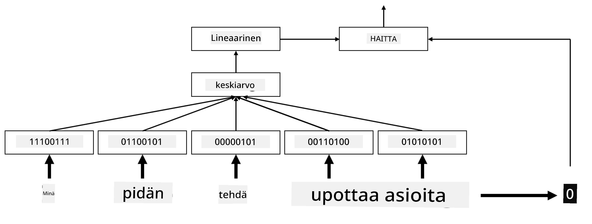

# Upotukset

## [Ennakkokysely](https://ff-quizzes.netlify.app/en/ai/quiz/27)

Kun koulutimme luokittelijoita BoW- tai TF/IDF-menetelmillä, käytimme korkean ulottuvuuden bag-of-words-vektoreita, joiden pituus oli `vocab_size`, ja muunsimme eksplisiittisesti matalan ulottuvuuden paikkavektorit harvoiksi yksiulotteisiksi vektoreiksi. Tämä yksiulotteinen esitys ei kuitenkaan ole muistin kannalta tehokas. Lisäksi jokainen sana käsitellään toisistaan riippumattomana, eli yksiulotteiset vektorit eivät ilmaise sanojen semanttista samankaltaisuutta.

**Upotuksen** idea on edustaa sanoja matalamman ulottuvuuden tiheillä vektoreilla, jotka jollain tavalla heijastavat sanan semanttista merkitystä. Myöhemmin käsittelemme, miten rakentaa merkityksellisiä sanaupotuksia, mutta toistaiseksi voimme ajatella upotuksia tapana pienentää sanavektorin ulottuvuutta.

Upotuskerros ottaa sanan syötteenä ja tuottaa ulostulovektorin, jonka pituus on määritelty `embedding_size`. Tietyssä mielessä se on hyvin samanlainen kuin `Linear`-kerros, mutta sen sijaan, että se ottaisi yksiulotteisen vektorin, se voi ottaa sanan numeron syötteenä, jolloin vältämme suurten yksiulotteisten vektorien luomisen.

Käyttämällä upotuskerrosta luokittelijaverkkomme ensimmäisenä kerroksena voimme siirtyä bag-of-words-mallista **embedding bag** -malliin, jossa ensin muutamme tekstimme jokaisen sanan vastaavaksi upotukseksi ja laskemme sitten jonkin aggregaattifunktion näiden upotusten yli, kuten `sum`, `average` tai `max`.

> Kuva tekijältä

## ✍️ Harjoitukset: Upotukset

Jatka oppimista seuraavissa muistikirjoissa:
* [Upotukset PyTorchilla](EmbeddingsPyTorch.ipynb)
* [Upotukset TensorFlowlla](EmbeddingsTF.ipynb)

## Semanttiset upotukset: Word2Vec

Vaikka upotuskerros oppi kartoittamaan sanat vektoriedustukseen, tämä edustus ei välttämättä sisältänyt paljon semanttista merkitystä. Olisi hyödyllistä oppia vektoriedustus, jossa samankaltaiset sanat tai synonyymit vastaavat vektoreita, jotka ovat lähellä toisiaan jonkin vektorietäisyyden (esim. euklidisen etäisyyden) suhteen.

Tämän saavuttamiseksi meidän täytyy esikouluttaa upotusmallimme suurella tekstikokoelmalla erityisellä tavalla. Yksi tapa kouluttaa semanttisia upotuksia on nimeltään [Word2Vec](https://en.wikipedia.org/wiki/Word2vec). Se perustuu kahteen pääarkkitehtuuriin, joita käytetään sanojen hajautetun edustuksen tuottamiseen:

- **Jatkuva bag-of-words** (CBoW) — tässä arkkitehtuurissa koulutamme mallin ennustamaan sanan ympäröivästä kontekstista. Annetulla ngramilla $(W_{-2},W_{-1},W_0,W_1,W_2)$ mallin tavoitteena on ennustaa $W_0$ käyttäen $(W_{-2},W_{-1},W_1,W_2)$.
- **Jatkuva skip-gram** on CBoW:n vastakohta. Malli käyttää ympäröivää kontekstisanan ikkunaa ennustaakseen nykyisen sanan.

CBoW on nopeampi, kun taas skip-gram on hitaampi, mutta se edustaa harvinaisia sanoja paremmin.

> Kuva [tästä artikkelista](https://arxiv.org/pdf/1301.3781.pdf)

Word2Vec-esikoulutettuja upotuksia (sekä muita vastaavia malleja, kuten GloVe) voidaan käyttää myös upotuskerroksen sijasta neuroverkoissa. Meidän täytyy kuitenkin käsitellä sanastoja, koska Word2Vec/GloVe:n esikoulutuksessa käytetty sanasto eroaa todennäköisesti tekstikorpuksemme sanastosta. Katso yllä olevia muistikirjoja nähdäksesi, miten tämä ongelma voidaan ratkaista.

## Kontekstuaaliset upotukset

Yksi perinteisten esikoulutettujen upotusten, kuten Word2Vecin, keskeinen rajoitus on sanan merkityksen erottelun ongelma. Vaikka esikoulutetut upotukset voivat vangita osan sanojen merkityksestä kontekstissa, kaikki mahdolliset sanan merkitykset koodataan samaan upotukseen. Tämä voi aiheuttaa ongelmia jatkomalleissa, koska monet sanat, kuten sana 'play', voivat tarkoittaa eri asioita riippuen kontekstista, jossa niitä käytetään.

Esimerkiksi sana 'play' näissä kahdessa eri lauseessa tarkoittaa hyvin eri asioita:

- Kävin katsomassa **näytelmää** teatterissa.
- John haluaa **leikkiä** ystäviensä kanssa.

Yllä olevat esikoulutetut upotukset edustavat molempia näytelmän merkityksiä samassa upotuksessa. Tämän rajoituksen voittamiseksi meidän täytyy rakentaa upotuksia **kielimallin** perusteella, joka on koulutettu suurella tekstikorpuksella ja *tietää*, miten sanoja voidaan yhdistää eri konteksteissa. Kontekstuaalisten upotusten käsittely on tämän oppaan ulkopuolella, mutta palaamme niihin myöhemmin kurssilla, kun käsittelemme kielimalleja.

## Yhteenveto

Tässä oppitunnissa opit rakentamaan ja käyttämään upotuskerroksia TensorFlowssa ja PyTorchissa, jotta sanojen semanttiset merkitykset heijastuisivat paremmin.

## 🚀 Haaste

Word2Veciä on käytetty mielenkiintoisiin sovelluksiin, kuten laululyriikan ja runouden luomiseen. Tutustu [tähän artikkeliin](https://www.politetype.com/blog/word2vec-color-poems), jossa käydään läpi, miten kirjoittaja käytti Word2Veciä runouden luomiseen. Katso myös [tämä Dan Shiffmannin video](https://www.youtube.com/watch?v=LSS_bos_TPI&ab_channel=TheCodingTrain), jossa selitetään tätä tekniikkaa eri tavalla. Kokeile sitten soveltaa näitä tekniikoita omaan tekstikorpukseesi, ehkä Kagglesta hankittuun.

## [Jälkikysely](https://ff-quizzes.netlify.app/en/ai/quiz/28)

## Kertaus ja itseopiskelu

Lue tämä Word2Vec-artikkeli: [Efficient Estimation of Word Representations in Vector Space](https://arxiv.org/pdf/1301.3781.pdf)

## [Tehtävä: Muistikirjat](assignment.md)

---

