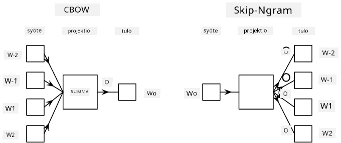

# Kielen mallintaminen

Semanttiset upotukset, kuten Word2Vec ja GloVe, ovat itse asiassa ensimmäinen askel kohti **kielen mallintamista** - mallien luomista, jotka jollain tavalla *ymmärtävät* (tai *edustavat*) kielen luonnetta.

## [Ennakkokysely](https://ff-quizzes.netlify.app/en/ai/quiz/29)

Kielen mallintamisen pääidea on niiden kouluttaminen merkitsemättömillä aineistoilla valvomattomalla tavalla. Tämä on tärkeää, koska meillä on valtavia määriä merkitsemätöntä tekstiä saatavilla, kun taas merkittyä tekstiä on aina rajallisesti sen mukaan, kuinka paljon aikaa voimme käyttää sen merkitsemiseen. Useimmiten voimme rakentaa kielimalleja, jotka voivat **ennustaa puuttuvia sanoja** tekstissä, koska on helppoa peittää satunnainen sana tekstissä ja käyttää sitä harjoitusnäytteenä.

## Upotusten kouluttaminen

Aiemmissa esimerkeissämme käytimme valmiiksi koulutettuja semanttisia upotuksia, mutta on mielenkiintoista nähdä, miten näitä upotuksia voidaan kouluttaa. On olemassa useita mahdollisia ideoita, joita voidaan käyttää:

* **N-Gram**-kielen mallintaminen, jossa ennustamme sanan katsomalla N edellistä sanaa (N-grammi).
* **Continuous Bag-of-Words** (CBoW), jossa ennustamme keskimmäisen sanan $W_0$ sanajonossa $W_{-N}$, ..., $W_N$.
* **Skip-gram**, jossa ennustamme joukon naapurisanoja {$W_{-N},\dots, W_{-1}, W_1,\dots, W_N$} keskimmäisestä sanasta $W_0$.

> Kuva [tästä paperista](https://arxiv.org/pdf/1301.3781.pdf)

## ✍️ Esimerkkivihkot: CBoW-mallin kouluttaminen

Jatka oppimista seuraavien vihkojen avulla:

* [CBoW Word2Vecin kouluttaminen TensorFlow'lla](CBoW-TF.ipynb)
* [CBoW Word2Vecin kouluttaminen PyTorchilla](CBoW-PyTorch.ipynb)

## Yhteenveto

Edellisessä oppitunnissa näimme, että sanaupotukset toimivat kuin taikuus! Nyt tiedämme, että sanaupotusten kouluttaminen ei ole kovin monimutkainen tehtävä, ja meidän pitäisi pystyä kouluttamaan omia sanaupotuksia erityisalojen teksteille tarvittaessa.

## [Jälkikysely](https://ff-quizzes.netlify.app/en/ai/quiz/30)

## Kertaus ja itseopiskelu

* [Virallinen PyTorch-opas kielen mallintamisesta](https://pytorch.org/tutorials/beginner/nlp/word_embeddings_tutorial.html).
* [Virallinen TensorFlow-opas Word2Vec-mallin kouluttamisesta](https://www.TensorFlow.org/tutorials/text/word2vec).
* **gensim**-kehystä käyttämällä yleisimpien upotusten kouluttaminen muutamalla koodirivillä on kuvattu [tässä dokumentaatiossa](https://pytorch.org/tutorials/beginner/nlp/word_embeddings_tutorial.html).

## 🚀 [Tehtävä: Skip-Gram-mallin kouluttaminen](lab/README.md)

Laboratoriossa haastamme sinut muokkaamaan tämän oppitunnin koodia Skip-Gram-mallin kouluttamiseksi CBoW:n sijaan. [Lue yksityiskohdat](lab/README.md)

---

