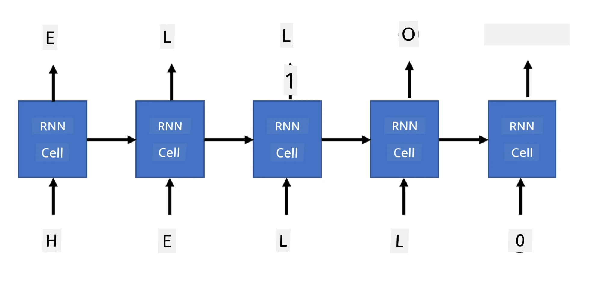

# Generatiiviset verkot

## [Ennakkokysely](https://ff-quizzes.netlify.app/en/ai/quiz/33)

Toistuvat neuroverkot (RNN:t) ja niiden portitetut solumuunnelmat, kuten Long Short Term Memory Cells (LSTM:t) ja Gated Recurrent Units (GRU:t), tarjoavat mekanismin kielen mallintamiseen, koska ne voivat oppia sanojen järjestyksen ja ennustaa seuraavan sanan sekvenssissä. Tämä mahdollistaa RNN:ien käytön **generatiivisissa tehtävissä**, kuten tavallisessa tekstin generoinnissa, konekäännöksessä ja jopa kuvatekstien luomisessa.

> ✅ Mieti kaikkia niitä kertoja, kun olet hyötynyt generatiivisista tehtävistä, kuten tekstin täydennyksestä kirjoittaessasi. Tutki suosikkisovelluksiasi ja selvitä, ovatko ne hyödyntäneet RNN:ejä.

RNN-arkkitehtuurissa, jota käsittelimme edellisessä osiossa, jokainen RNN-yksikkö tuotti seuraavan piilotetun tilan ulostulona. Voimme kuitenkin lisätä jokaiselle toistuvalle yksikölle toisen ulostulon, joka mahdollistaa **sekvenssin** tuottamisen (joka on yhtä pitkä kuin alkuperäinen sekvenssi). Lisäksi voimme käyttää RNN-yksiköitä, jotka eivät ota syötettä jokaisessa vaiheessa, vaan ottavat vain alkuperäisen tilavektorin ja tuottavat sekvenssin ulostuloja.

Tämä mahdollistaa erilaiset neuroarkkitehtuurit, jotka näkyvät alla olevassa kuvassa:


> Kuva blogikirjoituksesta [Unreasonable Effectiveness of Recurrent Neural Networks](http://karpathy.github.io/2015/05/21/rnn-effectiveness/) kirjoittanut [Andrej Karpaty](http://karpathy.github.io/)

* **Yksi-yhteen** on perinteinen neuroverkko, jossa on yksi syöte ja yksi ulostulo
* **Yksi-moneen** on generatiivinen arkkitehtuuri, joka ottaa yhden syötearvon ja tuottaa sekvenssin ulostuloarvoja. Esimerkiksi, jos haluamme kouluttaa **kuvatekstien luontiverkon**, joka tuottaa tekstuaalisen kuvauksen kuvasta, voimme syöttää kuvan, käsitellä sen CNN:n kautta saadaksemme piilotetun tilan ja sitten käyttää toistuvaa ketjua tuottamaan kuvatekstin sana sanalta.
* **Monta-yhteen** vastaa RNN-arkkitehtuureja, joita kuvailimme edellisessä osiossa, kuten tekstiluokittelua.
* **Monta-moneen**, tai **sekvenssi-sekvenssi**, vastaa tehtäviä, kuten **konekäännös**, jossa ensimmäinen RNN kerää kaiken tiedon syötesekvenssistä piilotettuun tilaan, ja toinen RNN-ketju purkaa tämän tilan ulostulosekvenssiksi.

Tässä osiossa keskitymme yksinkertaisiin generatiivisiin malleihin, jotka auttavat meitä tuottamaan tekstiä. Yksinkertaisuuden vuoksi käytämme merkkitasoista tokenointia.

Koulutamme tämän RNN:n tuottamaan tekstiä askel askeleelta. Jokaisessa vaiheessa otamme `nchars`-pituisen merkkisekvenssin ja pyydämme verkkoa tuottamaan seuraavan ulostulomerkin jokaiselle syötemerkille:



Kun tuotamme tekstiä (inferenssin aikana), aloitamme jollain **aloitustekstillä**, joka syötetään RNN-soluihin tuottamaan sen välimuistin, ja sitten tästä tilasta alkaa generointi. Tuotamme yhden merkin kerrallaan ja syötämme tilan ja tuotetun merkin seuraavaan RNN-soluun tuottamaan seuraavan, kunnes olemme tuottaneet tarpeeksi merkkejä.


> Kuva kirjoittajalta

## ✍️ Harjoitukset: Generatiiviset verkot

Jatka oppimista seuraavissa muistikirjoissa:

* [Generatiiviset verkot PyTorchilla](GenerativePyTorch.ipynb)
* [Generatiiviset verkot TensorFlow'lla](GenerativeTF.ipynb)

## Pehmeä tekstin generointi ja lämpötila

Jokaisen RNN-solun ulostulo on merkkien todennäköisyysjakauma. Jos valitsemme aina merkin, jolla on korkein todennäköisyys seuraavaksi merkiksi tuotetussa tekstissä, teksti voi usein "kiertää" samoja merkkisekvenssejä uudelleen ja uudelleen, kuten tässä esimerkissä:

```
today of the second the company and a second the company ...
```

Jos kuitenkin tarkastelemme seuraavan merkin todennäköisyysjakaumaa, voi olla, että muutaman korkeimman todennäköisyyden ero ei ole suuri, esimerkiksi yksi merkki voi olla todennäköisyydellä 0.2, toinen 0.19 jne. Esimerkiksi, kun etsimme seuraavaa merkkiä sekvenssissä '*play*', seuraava merkki voi yhtä hyvin olla joko välilyönti tai **e** (kuten sanassa *player*).

Tämä johtaa siihen johtopäätökseen, että ei ole aina "reilua" valita merkkiä, jolla on korkeampi todennäköisyys, koska toisen korkein voi silti johtaa merkitykselliseen tekstiin. On viisaampaa **näytteistää** merkkejä verkon ulostulon antamasta todennäköisyysjakaumasta. Voimme myös käyttää parametria, **lämpötila**, joka tasoittaa todennäköisyysjakaumaa, jos haluamme lisätä satunnaisuutta, tai tehdä siitä jyrkemmän, jos haluamme pysyä enemmän korkeimman todennäköisyyden merkkien parissa.

Tutki, miten tämä pehmeä tekstin generointi on toteutettu yllä linkitetyissä muistikirjoissa.

## Yhteenveto

Vaikka tekstin generointi voi olla hyödyllistä itsessään, suurimmat hyödyt tulevat kyvystä tuottaa tekstiä RNN:ien avulla jostain alkuperäisestä ominaisvektorista. Esimerkiksi tekstin generointia käytetään osana konekäännöstä (sekvenssi-sekvenssi, tässä tapauksessa *enkooderin* tilavektoria käytetään tuottamaan tai *dekoodaamaan* käännetty viesti) tai kuvan tekstuaalisen kuvauksen tuottamisessa (tässä tapauksessa ominaisvektori tulee CNN-uutosta).

## 🚀 Haaste

Ota oppitunteja Microsoft Learnista tästä aiheesta

* Tekstin generointi [PyTorchilla](https://docs.microsoft.com/learn/modules/intro-natural-language-processing-pytorch/6-generative-networks/?WT.mc_id=academic-77998-cacaste)/[TensorFlow'lla](https://docs.microsoft.com/learn/modules/intro-natural-language-processing-tensorflow/5-generative-networks/?WT.mc_id=academic-77998-cacaste)

## [Jälkikysely](https://ff-quizzes.netlify.app/en/ai/quiz/34)

## Kertaus ja itseopiskelu

Tässä joitakin artikkeleita tietämyksen laajentamiseksi

* Eri lähestymistavat tekstin generointiin Markov-ketjulla, LSTM:llä ja GPT-2:lla: [blogikirjoitus](https://towardsdatascience.com/text-generation-gpt-2-lstm-markov-chain-9ea371820e1e)
* Tekstin generoinnin esimerkki [Keras-dokumentaatiossa](https://keras.io/examples/generative/lstm_character_level_text_generation/)

## [Tehtävä](lab/README.md)

Olemme nähneet, miten tekstiä voidaan tuottaa merkki kerrallaan. Laboratoriossa tutkit sanatasoista tekstin generointia.

---

